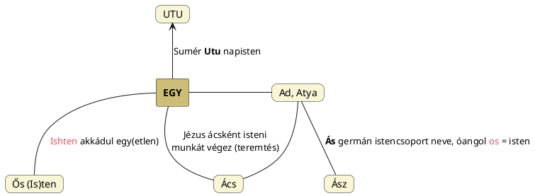

---
{"dg-publish":true,"permalink":"/A/Ad/","title":"Ad","created":"2024-11-23T04:59","updated":"2024-12-20T10:17"}
---

# Ad

Az Ad ige az [[A/AT\|AT]] (Ata, Atya) lágyult formája. Az Ad, mint hímségi princípium (a férfi illetve a Nap ad), [[A/Adapa\|Adapa]] és [[A/Ádám\|Ádám]] nevében is előfordul, illetve még Fáy Elek A magyarok őshona című könyvének 25. oldaláról származó adata szerint az (alant Magyar Adorján által is érintett) [[A/Adita\|aditák]] mitológiai ősatyjának neve is **Ad**.  

Mellékelve lásd Dr. Gyárfás Ágnes A képjelekről – Tenger – Szabir ország c. könyvéből Labat jelét.  
  
Gyárfás Ágnes A szakrális nyelv elemei c. az Ősi Gyökér 2008/1. sz. megjelent cikkében is megoszt Labat féle jelet és értetlenkedik a jel és a hozzá kapcsolt hímségi jelentés láttán, mondván, hogy a batyu vagy jel anyaméh jelkép kell legyen.  
  
- [[A/ATA\|ATA]] címhez is bekerült; ott (és [[A/Acsa\|acsa]] címnél) volt szó arról, hogy nőiség is lehet.

#### Péterfai János írja:

> Hadad istent is akkádnak minősítik, holott a név magyar eredetű. A Had-Ad két szó magyar nyelvű. A Hadak Atyja a háború istene. Mezopotámiában és Föníciában is tisztelték, Föníciában a Háborúk istene. A magyar "Te Hadad jó Had" mondatban is megkapjuk Hadad nevét, de nem erről van szó. Sémiül a Hadad Éles lenne, ami óriási tévedés. A Had a seregek neve, amelyek katonákból állnak, a székelyeknél a Hadak valójában törzsek. A Had egy vezér utáni harcos sereg, a Had szónak sok rokona van. Az alapszó a Ha, amiből ered a Hat, Hát, Ház, Has, Haus, és egyebek, mind Ház értelemmel.  
> Az Ad alapvetően magyar ige, az Atya, Ada fogalom alapja. Mindig az Ad, Ada ad, és az Anya kap, ez Isten Atya rendelése. Az Ad a szumir nyelvben is Ad, Ada, Adda formában van jelen, mindig Atya jelentéssel. Az At, Ata, Atta zöngétlen változat is mindig Atya értelmű. De az Ad olykor Nap értelmű, a Da változata. A Megfordítások tudománya rendkívül nehéz tudomány, magam nem is merészelem belevetni ennek a nagy tudománynak a vizsgálatába. Táncsics Mihály bezzeg megtette. A Da Nap, mint a Szer-Da nevünkben, vagy az angol `Day` névben, de az Ad mégis mindig férfi, ellenben a Da női minőség, a Földanya neve. Adam, Ádám az emberiség egyik ősatyja, férfi, tehát az Ad ige képződménye. A magyar Ada város férfitől eredő név, a zsidó Ada név női név. Had-Ad egyértelműen tehát a magyar nyelv szerint a Hadak Atyja, és nem nője. Régebbi megfelelője a magyar mitológiában fennmaradt Tűzkovács Király, akinek nevéből állítólag keletkezett Hadúr isten neve. A Had Úr bizonyára régebbi, mint Had Ad neve, de mind a két név a hadak isteni urainak a nevét jelentik számunkra.  

Itt még csak egy észrevételt tennék, hogy ad megfeleltethető [[E/Egy\|egy]] szóalakjával is. [[F/Flexió\|Flexió]] címnél is szerepelt az alábbi diagram:  

## Árja megfordítás

#### Magyar Adorján Ősműveltség...  

...című művében írja:  
> Ad, adni igénknek pontosan megfelel annak árja, de megfordított da, darc alakja, csakhogy az egytagú szavak megfordítása a mi nyelvünk sajátsága lévén, ebből az következik, hogy ad igénk e megfordított da alakja a mi ősnyelvünkben is megvolt, és az árja nyelvekbe éppen emez alakja ment át. Egyébként is az adás, aktív, pozitív, tehát hímségi dolog lévén (a nőiségi tűrés, fogadás ellentéte), eszerint e szó az atya, török `ata`, szumer `adda` = atya szóval is természetes összefüggésben van, amely szó eredetileg még hím férfi jelentéssel is bírt, amit tanúsit \[az [[A/Ádám\|Ádám]] címnél is említett, de nyilván arab eredetű\] török `adam` = ember, férfi, valamint a bibliai [[A/Ádám\|Ádám]] név is.  
> \[...\]  
> A mondák szerint a dél-arábiai egykor nagy és hatalmas adita asszad nép regebeli ősapja Ad király az Eufrát vidékéről, tehát Mezopotámiából, vagyis a szumerek földéről jött volt ősidőkben Dél-Arábia földére. Hogy Dél-Arábia nyugati sarka tengerparti részeiben valamikor mily magas műveltség kellett létezzen, bizonyítják az ottani nagyszerű városromok, amelyek között valóságos felhőkarcolószerű óriási építmények ma is állanak még. Tény az is, hogy bár ma a pusztai eredetű arab, azaz tehát sémita nyelvű beduin nép által mindinkább elnyomva, de éppen Dél-Arábia e sarkában ma is él még egy nem sémi, hanem az oromo és a szomál nyelvhez hasonló nyelvet beszélő nép maradvány; az pedig ismeretes, hogy az oromok és szomálok hagyományai szerint ők a Vörös-Tengeren át jöttek Afrikába. Miután pedig az oromo és szomál nyelv inkább a magyarra, mint a törökre hasonlít, ebből az is következik, hogy tehát az aditák, vagyis az oromok és szomálok ősei Mezopotámiából még az ottani szumerek vagy más, a szumerekkel rokon népek nyelvi eltörökösödése előtti ősidőkben költöztek Nyugatra, azaz Dél-Arábiába, majd Kelet-Afrikába a Vörös-Tengeren át. Dél-Arábia e sarkában áll ma is Aden városa, amelynek neve tehát az ad nép nevét tartja fönn, amely a rómaiak idejében is még nagy és fontos kikötőváros volt, és az Adan nevet viselte. A regebeli Ad király e neve pedig nem más, mint a bibliabeli Ádám, illetve a szumer `adda` = atya szó.  { #6wwhql}

> Művében Fáy Elek az Adon, Adonisz istenség nevét is ad szavunkkal magyarázza. Ez istenség ugyanis Bibloszban főleg gabonát és gyümölcsöt adó nyári és őszi Napistenként tiszteltetett, amely minőségében tehát a mi [[M/Magyar\|Magyar]] vagy [[M/Magor\|Magor]] Napistenünkkel azonosul. Miután azonban neve hehezetesen [[H/Hadad\|Hadad]] alakban is előfordul, így még [[H/Hunor\|Hunor]]ral, azaz a had, har szavakkal és a had, harc és rombolás elvével is kapcsolatba kerül, ami azután amellett látszik tanúskodni, hogy e monda, illetve hitrege (mythosz) még azon ősidőkből ered, amelyekben a Napisten még nem volt két személlyé, vagyis az alkotás és rombolás elvét megszemélyesítő ikertestvérpárrá kettéválasztva.  
- Magyar Adorján szerint a [[H/Hunor és Magor\|Hunor és Magor]] monda eredetileg egy napistenes volt, de erről nem vagyok meggyőződve. Információját Fáy Elektől vehette.

> Másrészt pedig az ad szavunk a szumer `adda` = atya szó, az ad népnév ([[A/Adita\|aditák]]) és az Ádám, Aden, Adan és Adon (görögösen [[A/Adonisz\|Adonisz]]) nevek egymássali azonossága eléggé felötlő. Tudjuk, hogy a hitregében Adoniszt szépséges arcúnak és termetűnek képzelték, ami pedig egyezik azzal, hogy a mi őseink is Napistenüket szépséges istenségnek képzelték, és őt a "Gyönyörű"-nek is nevezték. Erdélyben általános szólás ma is, sajnos már csak káromkodásokban: "Hogy a Szép Isten..." De éppen ez szól amellett, hogy e szólás nem keresztény eredetű, annál kevésbé, hogy a kereszténységben már soha sincsen szó Szép, hanem csak Jó Istenről.  
> 
> A szóvégi -a hang az Éva vagy Héva névben szerintem pedig csupán a mi régi névutónk, amelynek mai névelőnkével volt azonos szerepe. Szerintem a bibliai "Havila" vagy másként "Evilát földe" sem más, mint maga Éva, azaz a Föld megszemélyesítése, éppen úgy, mint ahogy Ádám is azonos Ad, Adon Napistennel. Ami szerint tehát Éva tulajdonképpen a Földanya, vagyis a Földistennő, s így tehát ő azonos a mi Tündér Ilonánkkal, vagyis Magyar Ilonánkkal, Magyar Napistenünk kedvesével, az emberiség ősanyjával is.  

Ahogy CzF az abr elvont gyöknél (mely az abrosz, abroncs gyöke) írja:  
> Átvetve bar azonos a födést, takarást jelentő bor, bur gyökkel a borít, borúl, burok stb. szókban. Származékai: borincs vagy boroncs, betűáttétellel: obrincs vagy abrincs, továbbá abrosz, mint asztalborító szövet. Hasonló áttétel unszol vagy onszol = noszol, idv = dív, da vagy dá gyök az árja (szanszkrit, görög, latin, persa stb) nyelvekben, a magyarban ad vagy ád, apró = porú stb.  

### Olasz dai és orosz davaj

E két szó rokonnak tűnik. Mintha a szláv szó előbbi széthúzása lenne.  

Valóban, van egy érdekes kapcsolat az orosz `давай` (davaj) és az olasz felszólító módú `dai` között:  
1. **Orosz "давай" (davaj)**:
   - **Jelentés**: Oroszul a "давай" kettős célt szolgál:
     1. A **"давать"** (davat') **felszólító módú** alakja, ami azt jelenti, hogy **"adj!"**. Például:
        - "Давай пойдём!" (davaj pojdёm!) azt jelenti, hogy **"Menjünk!"**.
        - "Давай покурим!" (davaj pokurim!) azt jelenti, hogy **"Gyújtsunk rá!"**.
     2. Emellett **buzdító partikulaként** is működik, hasonlóan az angol **"come on!"** vagy **"go on, then"** kifejezésekhez. Például:
        - "Давай, садись!" (davaj, sadis'!) azt jelenti, hogy **"Gyere, ülj le!"**
        - "Давай побыстрее, уже поздно!" (davaj pobystree, uže pozdno) azt jelenti, hogy **"Gyere, siess, már késő van!"**

2. **Olasz "dai"**:
   - **Jelentés**: Olaszul a **"dai"** a **"dare"** (adni) felszólító módú alakja. Hasonlóan használják a cselekvésre való buzdításra:
     - "Dai!" azt jelenti, hogy **"Gyere!"** vagy **"Hajrá!"**—egy ösztönzés a folytatásra.
     - Tehát az orosz és az olasz is osztozik ebben a buzdító szellemben a "davaj" és a "dai" megfelelő alakjaival.

3. **Eredet és hatás**:
   - Bár a pontos eredet nem biztos, lehetséges, hogy a hasonlóság **latin gyökerekből** ered. Az **"adni"** szónak egy ősi indoeurópai **"da/do"** gyökere van, amely megtalálható a latinban, a görögben, a szlávban, a baltiban, a szanszkritban és a hindiben.  

### Kivételek

Nem mindig kerül megfordításra a két hang: lásd [[A/Addendum\|addendum]] és [[A/Add\|add]].  

## Amikor a nő ad

Ugyebár biológiai és mítoszi értelemben is a férfi az adó. Ugyanakkor Gyárfás Ágnes Három óriás és az öreg király – a nyári égbolt híres férfi-csillagképei című Ősi Gyökér 2006/2. sz. megjelent cikkének májusfaállításról szóló adata (lásd [[P/Pünkösd\|Pünkösd]]) is tartalmaz olyan adatot, melyet már Hervay Tamás egyik cikkében is láttunk. Virágot nő adott férfinak a régi felfogás szerint. Gyárfás Ágnes írja:  
> Molnár V. József is pontosan tudja, hogy a virágot, ősi szellemben a lány adja a fiúnak és nem fordítva. Ez a szokás, amely szerint a férfi viszi a virágot a hölgynek, a Dámának, a Sárkány a Dáma legyőzetésétől számított sötét idők terméke. Gesztus a legyőzöttnek.  

Nem ez az egyetlen dolog, amit nő ad a férfinak. Ő adja az [[A/Alma\|almá]]t (szüzességét) is a választottjának.  

A [[T/Tűz\|tűz]] fogalma kapcsán volt szó arról, hogy nemcsak hímségi lehet.  

## Átad

Úgy tűnik, [[A/Át\|át]] szavunk, ad szóhoz hasonlóan az At = Atya szóból ered. Ezek szerint átad pleonazmus, hibás használat. 