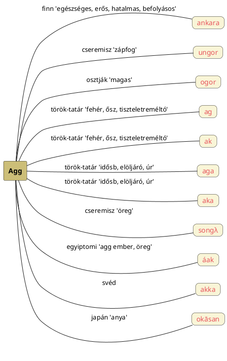

---
{"dg-publish":true,"permalink":"/A/Agg/","title":"Agg","created":"2023-10-13T12:40","updated":"2025-06-07T18:46"}
---

# Agg

#### Péterfai János írja:

> Az [[A/AG\|Ag]] névnek Magas értelme van. Ez az Ag a koponya tekintetében az Agy neve, ami a fej felső része. Az Ag kimondottan Fejtető, az Agy neve, és az Ág neve a fákon. Ha az Ag már magasba került, \[[[Ég\|[Ég]]\] Isten közelébe, akkor a neve Agg. Az Ag, Agg, Ág sok nevet fejlesztett ki később.  
- [[A/Aggastyán\|Aggastyán]] címnél is így értelmeztük.

Götz László Keleten kél a Nap című könyvének 487. oldalától tallózik olyan [[B/Budenz József\|Budenz József]] által finnugornak meghatározott szavakból, melyeket [[V/Vámbéry Ármin\|Vámbéry Ármin]] elemzett, majd a TeSz féle származtatásokat is megadja (az osztják szó több helyre betéve):  
> Agg: fi. `ankara` "egészséges, erős, hatalmas, befolyásos"; cser. `ungor` "zápfog"; oszt. `ogor` "magas".  
> V.: tör.-tat. `ag`, `ak` "fehér, ősz, tiszteletreméltó"; `aga`, `aka` "idősb, elöljáró, úr".  
> TeSz: finnugor eredetű; vö. cser. `songλ` "öreg". A szó más finnugor egyeztetése téves.  
- A tatár szavakat [[A/Aga#Aga 2)\|aga]] címnél is szerepeltettük.

Wallis Budge An Egyptian Hieroglyphic Dictionary című munkájának adata szerint (lásd 26. o.) az egyiptomi `áak` = agg ember, öreg.  

Az `agg` párja az [[E/Ég\|ég]] és [[E/Ekva\|ekva]] címnél is taglalt északi-lapp `áhkká` = nagyanya és finn `akka` = öregasszony, vén banya, valamint a magyar [[U/Ük\|ük]], melynek megfelelne a japán `okāsan` = anya  előtagja.  
[[U/Ük\|Ük]] címnél bővebben taglaljuk a japán szót.  

