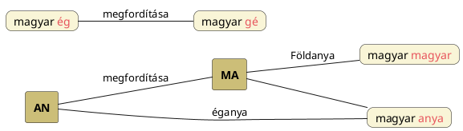

---
{"dg-publish":true,"permalink":"/A/Anya/","title":"Anya","created":"2024-11-08T00:20","updated":"2024-11-23T04:50"}
---

# Anya

Lásd nemcsak etimológia és rokon szavak kapcsán [[A/ANA\|ANA]]. Minden anya és fiú/férfi kapcsolatú gondolatot lásd [[T/Tejútanya\|Tejútanya]], [[N/Nő és férfi\|nő és férfi]], valamint lásd még [[H/Hímség és nőiség\|hímség és nőiség]] és [[A/Anyakultusz – apakultusz\|anyakultusz – apakultusz]].  
Ana, anya, Boldogasszony/Anya és [[S/Szíriusz mint istenanya\|Szíriusz mint istenanya]] összefüggését is lásd [[A/Annual\|annual]].  

## Anya szavunk ny hangja

[[N/Nyelvtani nemek\|Nyelvtani nemek]] címnél volt már arról szó, hogy a puha hangzók a nőnemet, a kemények a hímnemet fejezték ki a magyarban. Falvay Károly szól arról könyvében, hogy az árja nyelvekben hímségi az [[E/Ég\|eg]]et és mennyet jelentő szó. Véleményem szerint ez [[E/Egy\|egy]] nem az [[E/Ég\|ég]] becézése, ahogy Péterfai János írta, hanem nőnemű formája azzal, hogy lágyultan jelenik meg. 

Péterfai több helyen a [[N/Ny\|ny]] hangos szavak "eredetijének" bemutatásakor az n-hangos formát idézve utóbbit régiesebbnek mondja (`anya` szónál `ana` nála is régibb). Talán menny szónál is mondja/gondolná, hogy a [[M/Men\|men]] alak a régibb. Holott az általa igen réginek mondott [[S/Székely-magyar rovásírás\|székely-magyar rovásírás]]ban megvannak a lágy hangok betűjelei!  
Az efféle kijelentésekkel vigyázni kell, ugyanis akaratlanul is a magyar-idegen, magyargyűlölő akadémisták kezére játszunk (`anya` szavunkat finnugor vagy ótörök eredetűnek mondják). Azért sem mondhatjuk, hogy az ny régies formája n és a puhulás később (a jelenhez közel) jött létre, mert a [[S/Székely-magyar rovásírás\|székely-magyar rovásírás]]ban szerepel minden lágyított hang betűjele.  
A valóság az, hogy a puhább formák használata a magyar, a keményebb hangok használata a hun és hun-származék nyelvekre volt jellemző. [[N/Nyelvtani nemek\|Nyelvtani nemek]] címnél írottak szerint a lágyítás a nőnemet fejezi ki. A magyar nép inkább matriarchális volt, az őket védő hun inkább apaelvű. A [[M/Magyar\|magyar]] népnév gy hangja kapcsán is elmondhatjuk: az anya neve gy-hangos, fia, [[M/Magor\|Magor]]/Magur neve keményebb, g-hangos.  
Erről [[N/Ny\|NY]] címnél is volt szó.  

## Anya és magyar

`Anya` és `magyar` is jelent anyát, vagyis inkább anyára utaló. Mindkettő lehet éganya, de a kettő közül csak Magyar/Mater-nek (lásd [[M/Mother\|mother]] és [[M/Mater\|mater]]) van [[F/Földistennő\|Földanyá]]ra ([[M/MA\|MA]], [[M/MAT\|MAT]], [[M/Mada\|mada]]) utaló jelentése, míg anya az [[A/AN, ÁN\|AN, ÁN]] és [[A/ANA\|ANA]] ég(isten) jelentése révén csak éganyaként vehető számba.  

Azt is meg lehet figyelni, hogy ahogy az `ég` (lásd [[E/Ég\|Ég]]) szavunk megfordításaként kezelhető `gé` (lásd [[G/GE\|Gé]]) = föld jelentésű, úgy `MA` = föld, anya jelentésű etimon is tulajdonképpen (sumér) `AN` = ég jelentésű szó megfordítása.  

Lásd még [[S/Szómegfordítás#Ég és Föld jelentésű kétbetűs szavak megfordítása\|Ég és Föld jelentésű kétbetűs szavak megfordítása]], ahol kimondjuk, hogy MA lehetett előbb AN-nál.  

## Kettős anyaság

Valójában [[H/Három istennő\|három istennő]] címnél írottak szerint három fejlődési állapot létezik, de abból kettő anyaság.  

#### Nagyné dr. Fülöp Krisztina Mária élete édesanyák lelke...  

...című Ősi Gyökér 2006/1. sz. megjelent cikkében foglaltakkal való első találkozásomkor először nem tudtam hová tenni (bevezetést lásd [[B/Bába\|bába]]). Mert az tiszta, hogy létezik [[N/Nagyboldogasszony\|Nagyboldogasszony]] – [[B/Boldogasszony\|Boldogasszony]] és Boldogasszony – [[K/Kisasszony\|Kisasszony]] párosítás, de hova tartozik a Szűz és a Szűzanyaság (na és persze a [[S/Szajha\|szajha]])? Arra is emlékezzünk, hogy [[E/Edda\|Edda]], [[A/Anna\|Anna]] és más címnél láttuk hogy az anya, nagyanya és ősanya fogalmak utódnyelvekben keverednek. Nyilván a Nagyboldogasszony-Boldogasszony kultuszok idegenbe átkerülése még zavarosabb helyzetet szült, mint amilyen ma nekünk ezen fogalmakat magyarként értelmezni.  
[[S/Szűz\|Szűz]] címnél is szerepeltek az alábbiak:  
> A pólyából szabadult, a növekvő gyermek, ha lánynak született, 4-7 esztendős korában szívesen rajzolja a királylányt, azt a fényes nőalakot, amelyben, akiben a kettős-anyaság testesül-lelkesül. A királylány gyakran földig érő haja-sátra az anyaméhben öntudatlanul átélt kerek szeretetről vall, s az anya áldozatos gondoskodásáról, amellyel körbe fogja, öleli a cseperedő gyermeket; mindez a gyermeklánnyal születő, benne javarészt tudat mögött munkálkodó anyaságvágy táplálója, életben tartója, s növelő-nevelője egyben. A királylány alak szoknya-sátra-háza a rajzoló gyermeklány anyaság-óhajtásáról, a "szűz anyaság"ról beszél, a [[K/Korona\|korona]] e kettős anyaság szentséges voltára utal. A kettő, illetve három együtt adja, adhatja az emberélet folyamatosságát, nemzedékről nemzedékre megújuló szakadatlan láncolatát. A királylány alakban föllelhető kettős anyaság jelen van őshitünk Boldogasszony képében... A hajsátor a Nagyasszony megfelelője, a szoknyasátra-háza annak szűz lányát, a Kisasszonyt varázsolja, idézi meg.  
> A kettős Boldogasszony-kép okán, népünk kezdetben, néhány hagyományőrző vidéken ma is Mária anyját, Annát tisztelte, tiszteli Nagyasszonyként, s Mária fölmagasztosult Kisasszonyként élt, él tovább a népi hitvilágban. 
- Folytatást lásd [[H/Három istennő\|három istennő]] vagy [[S/Szépasszony\|Szépasszony]].  
Amint Nagyné Fülöp ezen sorait olvastam, a [[S/Sziget\|sziget]] címnél ábrázolt finn terítő istenanyaképe jutott még eszembe.  

Az általam mindenütt hangoztatott kozmikus anya földi tükörképéről...

#### Falvay Károly Nagyboldogasszony egykor az augusztusi telihold...  

...című, az Ősi Gyökér 2005/3. sz. megjelent cikkében is ír csak a megnevezésekben ugye asszony szerepel (de [[A/Asszony\|Asszony]] is Ős-Anya értelmű):  
> A pogány Nagyboldogasszony anya-leány kettőssége kozmikus tartalmú: a menny és a föld kettősség egysége. A kettősség első részének mennyei párhuzamában az anya a személytelen anyagi természet virtuális (nem valóságos) személyisége (szellemisége): a Nagyboldogasszony. A kisasszony leány a megszemélyesült mennyei istenasszony: a [[B/Boldogasszony\|Boldogasszony]]. Földi párhuzama a gyermeket váró fiatal nő (meny, menyecske, [[M/Menyasszony\|menyasszony]]).  

Lásd még [[K/Kisasszony\|Kisasszony]] címnél legalul írottakat.  

