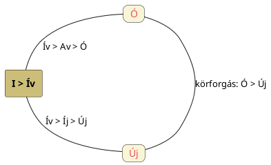

---
{"dg-publish":true,"permalink":"/A/Avul/","title":"Avul","created":"2024-11-21T17:21","updated":"2026-02-24T01:09"}
---

# Avul

Lásd [[A/Ava\|ava]]. Nemcsak az [[O/Ó\|ó]] szóból képzett lehet, hanem lehet [[E/Évül\|évül]] alaki változata is.  

[[A/Apolló\|Apolló]], valamint [[E/Épül és évül\|épül és évül]] címnél is írtuk, hogy az Ikrek után a Rákba lépve kezd Avulni (vagy Évülni/Ebülni \[hanyatlani\], azaz semmiképp sem Épülni) a Nap (ereje).  

Lásd még [[O/Ó#Alternatív elemzése\|új és ó]] témát, diagrammal:  

<a class="markdown-embed-link" href="/O/Ó/#cykil0" aria-label="Open link"><svg xmlns="http://www.w3.org/2000/svg" width="24" height="24" viewBox="0 0 24 24" fill="none" stroke="currentColor" stroke-width="2" stroke-linecap="round" stroke-linejoin="round" class="svg-icon lucide-link"><path d="M10 13a5 5 0 0 0 7.54.54l3-3a5 5 0 0 0-7.07-7.07l-1.72 1.71"></path><path d="M14 11a5 5 0 0 0-7.54-.54l-3 3a5 5 0 0 0 7.07 7.07l1.71-1.71"></path></svg></a>

