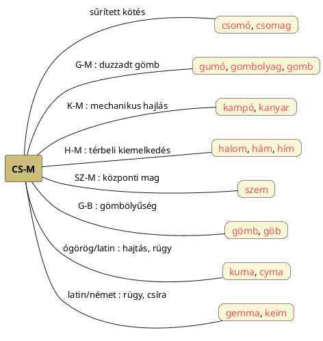

---
{"dg-publish":true,"permalink":"/C/Csomó/","title":"Csomó","tags":["brainstorming"],"created":"2026-01-23T21:08","updated":"2026-01-23T21:09"}
---

# Csomó

Mivel a csomó egy vagy több hajlékony anyag (például kötél, zsinór, drót, szövet) összekötésével, hurkolásával vagy összefonásával létrehozott rögzítés, összeköttetés vagy díszítés és alapvető funkciója az anyagok ideiglenes vagy tartós egyesítése, rögzítése vagy hurok képzése, itt egy [[K/Köt\|köt]] (vö. [[B/BOG#BOG 1)\|bog]]) alapfogalmú szó kerestetik.  

CzF adata:  
> CSOMÓ, (csom-ó) fn. tt. csomó-t. 1) Gömbölyües tömör alakba öszvenőtt test. Csomó a fában, csomók a csömörös testben, csomó a búzaszáron, a kukoriczaszáron. Kákán csomót ne keress. (Km.) 2) Öszvehajtogatott, gömbőlyűre tekergetett, öszvekötött holmi. Szénacsomó, kendercsomó; csomóba kötött kukoricza, csomóra kötött űstök, csomóba fűzött vessző, virágcsomó, dohánycsomó. Csomóba fonni, csomóra fojtani, csomóra szalasztani. Barátcsomót csinálni. Csomót oldani, csomót elvágni. 3) Különösen a kévés gabonából egy-egy rakás, másképen kereszt. Száz csomó, – azaz száz kereszt búza. 4) Átv. ért. valamely ügynek bonyolodott része, melynek megoldása által lehet csak annak többi részein eligazodni. Hasonló értelemben jelent költői bonyolítást az elbeszélő költeményekben és szinművekben. Ily csomó az Iliaszban Agamemnon és Achill öszvekoczczanása. Jól megkötni valamely ügynek, vagy műnek csomóját, azaz ügyesen elrendelni azt. Egy csomóba köt vele km., az az egyenlőnek tart engem valakivel. Finnül: `solmu`.  
- Itt a [[G/Gömb\|gömb]] szóval való kapcsolatra való rámutatás fontos. Van [[G/Göb\|göb]] szavunk is.

Vesd össze:  
> CSIM  
> Az elvont gyöke csima, csimba, csimota, csimbók stb. szóknak és származékaiknak. Értelme kisded csomó, honnan e változatok: csima, csoma, csimbók, csombók, stb. Rokonok vele közelebbről a hellen `kuma`, latin `cyma`, `gemma`, német `Keim` stb.  
- Az ógörög `κῦμα` (`kuma`) = "hullám", "dagály", "hullámzás" vagy "duzzadás", a latin `cyma` a növénytanban: a virágzat egyik típusa, ahol az oldalhajtások túlnövik a főtengelyt (bogernyő), építészetben: hullámvonalas párkányzat, szima. A latin `gemma` jelentése "rügy", "hajtás", "drágakő", "ékszer", míg a német `Keim` jelentése "csíra", "rügy", "hajtás", "baktérium", "kezdemény".
{ #wcrgu8}

---

## Lokális MI csevegőrobot segédlettel végzett ötletelés

A **CS-M** váz szervrokon hangok szerinti tágítása (**K-M, G-M, H-M, SZ-M**) feltárhatja a fogalom mélyebb, fizikai és asztrális rétegeit. A **hajlás** és a **gömbölyödés** (duzzadás) közötti összefüggés lesz itt a kulcs.

Először megkeresem a vault-ban ezeket a vázakat, különös tekintettel a `gumó` és a hajlásra utaló kifejezésekre.  
A **CS-M** váz tágítása a szervrokon hangok (**K-M, G-M, H-M, SZ-M**) mentén megvilágítja a "csomó" mögötti dinamikus alapfogalmat: a **hajlást, ami sűrűsödésbe torkollik**.  

Íme a filológiai-etimológiai továbbgondolás:

## A CS-M váz rokonformái és az "Hajlás-Gubanc" alapfogalom

A mássalhangzó-vázak elemzése során látható, hogy a fizikai hajlítás művelete és az annak eredményeként létrejövő domborulat (csomó/gumó) elválaszthatatlan.

### 1. G-M váz: A "Gumó" és a belső sűrűség
A **G-M** váz a legközvetlenebb rokon.
*   **Gumó:** A növényi részek megvastagodása, "csomója". Itt a sűrűsödés és a gömbölyűség a domináns.
*   **Gombolyag:** A hajlékony szál (fonal) gömbbé sűrített állapota.
*   **Gomolyog:** A füst vagy felhő "csomókba" rendeződő, kavargó mozgása.
*   **Gomb:** Mint a ruhát "megkötő" és rögzítő kis gömb/csomó. (Vö. [[K/Köldök\|köldök]] gomb-gömb párhuzama).

### 2. K-M váz: A "Kamó" és a hajlítás
A **K-M** váz a hajlítás mechanikai oldalát emeli ki.
*   **Kamó / Kampó:** Egy hajlított eszköz, amivel rögzíteni vagy húzni lehet. A csomó rögzítő funkciójának "szerszámosított" formája.
*   **Kanyar / Kanyarodik:** A lineáris irány megtörése, hajlítása. A csomó maga is "kanyarok" (hurkok) sorozata.
*   **Kimó?** (Tájnyelvi/ritka): Egyes vidékeken a fa göcsörtjét, csomóját jelölheti.

### 3. H-M váz: A "Halom" és a kiemelkedés
A **H-M** váz a térbeli kiterjedésre utal.
*   **Halom:** A föld vagy anyag "csomója", dombszerű sűrűsödése.
*   **Hám:** A testre rögzített, "megkötött" szíjrendszer.
*   **Hím:** A hímzés során a síkból kiemelkedő öltések, "apró csomók" összessége.

### 4. SZ-M váz: A "Szem" és a mag
Az **SZ-M** váz a legkisebb egységet, a "gócot" jelöli.
*   **Szem:** A lánc szeme (hurok), a növény szeme (mag/csomó). A "csomó" mint egyedi egység.
*   **Szamár (csomó):** A népnyelvben a nehezen oldható, "buta" csomó.

## A "Hajlás" mint alapfolyamat

A csomó nem jöhet létre hajlítás nélkül. A **hajlás-hurok-csomó** hármas egységét a következő szavak kapcsolják össze:
*   **Görbe → Görcs:** A hajlítás (görbítés) eredménye a görcs (szoros csomó).
*   **Hajlik → Hurok:** A hajlítás első fázisa a hurok, ami a csomó alapja.
*   **Kunkorodik:** Az öngerjesztő hajlítás, ami "csomóba" fut.

### Asztroteológiai párhuzam: A "Világ-csomó"
Ha a **Sarkcsillagot** tekintjük a világ "szögének" vagy "csomójának", akkor az égbolt körforgása nem más, mint ezen pont körüli "gombolyodás". A **Tejút** pedig az az "ezüst fonal", ami a világ köldökénél (csomójánál) rögzül.  

| Váz      | Alapfogalom         | Kulcsszó            |
| :------- | :------------------ | :------------------ |
| **CS-M** | Sűrített kötés      | **Csomó**           |
| **G-M**  | Duzzadt gömb        | **Gumó**            |
| **K-M**  | Mechanikus hajlás   | **Kamó**, **kampó** |
| **H-M**  | Térbeli kiemelkedés | **Halom**           |
| **SZ-M** | Központi mag        | **Szem**            |

**Összegzés:** A csomó lényege a **hajlítással létrehozott sűrűsödési gócpont**, amely rögzít (köt), életerőt hordoz (csíra/gumó) és világközéppontot jelöl (köldök/Sarkcsillag).  

Vö. [[C/Csomag\|csomag]].  

## Fogalmi összefüggések diagramja

