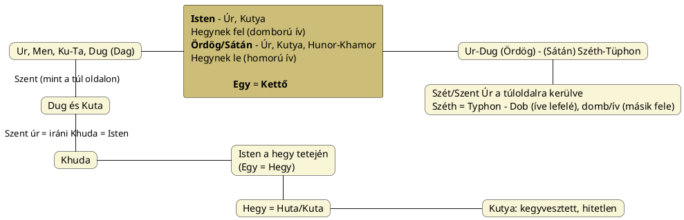
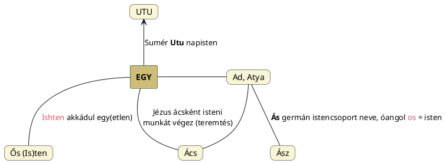

---
{"dg-publish":true,"permalink":"/C/Csuda/","title":"Csuda","tags":["containstransclusions"],"created":"2025-06-12T01:36","updated":"2025-09-11T16:56"}
---

# Csuda

Bár alanyi jogon is értelmezhető, [[K/Kutya\|kutya]] szavunk (és [[S/Suta\|suta]] szavunk) alakváltozatának tekinthető.  
Utóbbi címnél egy levezetésbe is bocsátkoztunk.  

Végeredményben Csoda/Csuda lehet [[I/Isten\|Isten]] neve/jelzője. [[I/Isten\|Isten]] címnél kifejtettük, hogy Isten valójában inkább istennő, kinek állatalakbani megnyilvánulása az a [[C/Csudaszarvas\|Csudaszarvas]], mely (egyrészt [[S/Szarvas\|szarvas]] címnél Isten fogalmával vétetett össze) az egész csillagos eget és a Tejút sávját is szimbolizálja (bár mivel leginkább a Tejútrendszer csillagait látjuk a csillagos égen, ezért a kettő egy és ugyanaz). Ezen Csoda szóval azonos viszont a [[K/Kutya\|kutya]] és a Kutyacsillag Szíriuszról tudjuk, hogy az is istennő (de – Orionból irányuló – hímségi aspektusa is van) és hogy a Kutya nem választható el a Tejúttól (legalábbis isteni felfogásukat tekintve). Ez a Csoda és Kutya az, amely jó eséllyel a [[S/Szkíta\|szkíta]] és perzsa Khoda/[[K/Khuda\|Khuda]] és a germán [[G/God\|God]] nevek eredetét adja meg. Viszont a [[G/Göd\|Göd]] nevet se felejtsük el.  

A csoda, csuda szavunk tulajdonképpeni értelme [[F/Fény\|fény]], írja Magyar Adorján (lásd külön alcímet lentebb). (De a [[M/Mirage\|mirage]] és [[M/Miracle\|miracle]] = csoda szóban található [[M/MIR\|MIR]] is fényt jelent.)  
Igen ám, de mivel a csuda a szarvas mellékneve, és az az éji égen keresendő, ezért nem a napközbeni süt fogalmával párosítunk, hanem az éjszakai csillagfényekre.  
Legutóbb [[A/Awe\|awe]] címnél is csuda = [[E/Ég\|ég]] értelmére vonatkozó kijelentést tettünk. És lám, a Csudaszarvas valóban Égjelkép.  

Mivel itt és más hasonló cikkekben a Csudaszarvasról lesz főként szó, mely pedig állatalakja a Tejútanyának, kinek nevét a germán nyelv alapján is egy [[G/Göd\|Göd]] névformával adtuk meg, nem-e lehet itt azt mondani, hogy a csud, csuda, stb. szavak nemcsak a [[S/Süt\|süt]], [[S/Suta\|suta]] hanem a [[K/Kut\|kut]], [[K/Kutya\|kutya]] változatainak is felfoghatók? (Lásd még [[H/HUD\|HUD]] és [[G/GUD\|GUD]] formákat is.)  
Tulajdonképpen itt a kentum-[[S/Szatem\|szatem]] szabály logikájának belső magyar fejlődési módját láthatjuk.  

#### Péterfai János írja:  

> Csuda szavunk két eleme, a Csu és Da, kétségtelenül a Su-Da elemeivel rokonítható. A Suda magyar családnév, mint a Sutus is (Sütős). A Csu-Da fogalmilag és alakilag is a Csillag-Föld, illetve a Sütő rokona. A Csuda az éjszakai égbolt, ahol a sok csillag, amelyek világítanak, az Isten kezei, sütői is lehetnek. A Sutaszarvas maga a [[C/Csudaszarvas\|Csudaszarvas]], ami azt is jelenti, hogy egykor a suta nem csak az őzek, hanem a szarvasok nőstényét is jelenthette, amit ma, talán helytelenül, [[T/Tehén\|tehén]]nek mondunk.  

Péterfai János rengeteget említi a Csuda népet:  
> A [[C/Csud\|Csúd]] nép természetesen a Csuda magyarok népe. Vagyis az ázsiai szkythák.  
> A Szkytha és Csuda azonosságát elég sok szó igazolja. Felcsut kisvárosunk nevében a Csut a Csuta szó maradványa, amint Alcsutdoboz és Alcsut településeink nevében is. A Csuta abszolút azonos Szkytha nevünkkel, amit Csytha alakban írva már Csutának kellene ejtenünk. A görög ábécében nincs U betű, le sem tudják írni az U hangot a görögök, akik a Szkytha névformát megalkották. Az írás a görögöknél is változott, a Kr.e-i 8. század írásformái között még volt U betű, de a 24 betűs görög ábécében már nem volt. Használtak később Oü betűket is, amivel az U hangot igyekeztek lejegyezni.  
> 
> Mivel igen nagy szókincs igazolja a Szkytha Csuda olvasatát, kétségtelennek kell látni a Szkytha Csuda, Csuta valódi formáját.  
- [[S/Suta\|Suta]] és [[S/Suta#Sutúl\|sutúl]] szavaknál más dolgok is előjöttek; lásd [[C/Csudaszarvas\|Csudaszarvas]].

> Nagyon fontos a balti finnek és volgai finnek emlékeiben a csudok, másként csitkik népe. Ismert a Csúd-tó is. A név a Csuda szóból ered, a Csuda pontos jelentése Csu-Da alakban Csillag-Föld, vagyis az égbolt. A magyarok a csillagok népe, a Csuda is magyar szó, változata a Suda és a Suta, a szarvas, ami megint Égboltot jelent, mint a Csuda-Szarvas fogalma. De a Csuda szó megfelel a Szkytha népnévnek is. A görög sem tudta leírni a Cs betűt, a Cserebog, Cserebüj náluk Szkarabeus, vagyis a Cs betűt Szk, a latin Sc formában írta. Így a Csuda valóban Szkytha a görögöknél. De ezzel az is kiderül, hogy a szkythák valóban magyarok, nem az oroszok ősei, amint azt Nagy Katalin kitalálta.  
> A Csúdoktól eredő finnségiek egyértelműen nem szlávok. Ebből az is következik, hogy a csúdok a szkíták, akik magyarok-hunok, a régebbiek, majd a szlávok kialakulnak 500 körül, magyar alapokról. Csitki, mint a csúdok egyik neve, nem más, mint Csicsi király, aki hun nagykirály. Csitki neve is bizonyítja, hogy a hunok nem törökök, ráadásul a finnek eszerint hun eredetűek.  

#### A Czuczor-Fogarasi szótár adata:

> CSUD (2)  
> v. CSÚD, tt. csud-ot. Az oroszok némely finn népséget csudok-nak neveznek. Azt gondolták s gondolják, hogy e csud név azonos a régi **sküth** (szittya) névvel. A csud kifejezés az Enari, vagy Anara körül lakó lappoknál azt teszi, mint a finn `sota`, s magyar csata; csud tehát am. csatanép, hadi nép, a csudeh (mely többes = csudok) pedig jelent nálok csatanépet, vagy csatározó, száguldó hadnépet. Közel az Enári egyházhoz magas hegy van: csudvár, melyen hajdan a lappokat bántó csatanép tartózkodott. S ezen nevezés legjobban illik azon népekre, kiket az orosz krónikák csudoknak neveztek, illenék egy szóval a hellén által nevezett sküth-ekre. A lapp `csud` jelentését, melyet a skuth-ekre hajlandók vagyunk érteni, nagyon találólag kifejezi a magyar csatangol ige szó is. (Sjögrén után Hunfalvy Pál)  

Az albán nyelvben is `çudë` = csoda, `çudis` = csodálatba ejt.  

Az Ipolyi Arnold Magyar mythologia című könyvének 169. oldalán felhozott orosz `czudo morskoje` = tengeri tündér(lány) czudo-jával azonos csecsen `zuda` = nő mindketten nyilván csuda szavunkkal azonosak és a [[C/Csudaszarvas\|Csudaszarvas]]ünővel azonos [[T/Tündér Ilona\|Tündér Ilona]] nyomán alakulhattak ki.  

Csuda valóban megfeleltethető K>CS és T>D átmenettel [[K/Kutya\|kutya]] szóval. Hogy írta Péterfai János:  
> A szkytha névben a Kutya is benne van. Az Askuta névalak nagyjából Isten-Kutyáit jelenti. A Kan és Kán, meg az Eb is Király, a Magr-Eb Magor-Királyság, viszont a török `Kan` Vér értelmű, és nem Király.  
- A török `kan` szó kapcsán lásd [[K/Kentum#^74sz0y\|kentum]] és [[K/KAN#Török 'kan' vér jelentése\|KAN]].

Másutt:  
> A Skutas névforma a Kutasok fogalmat is felvetik, az Ász-Kuta név az Isten-Kutatók jelentést is tartalmazhatja.  

Megint másutt Péterfai János újra összeveti a két elnevezést:  
> Szkütész neve rokon a szkíta népnévvel. Talán a Kut(at), Kút, Kutya nevekkel rokon a király neve. A hunoknál a Kutu (Guti), és Hunza-Kut, meg a Kutrigur népnevekben is benne van a Kut szó.  
- Az már további bizonyíték, hogy a területük a kúnoknak/húnoknak egyezik Szkítiával!

Csuda viszont [[C/Csut\|csut]] címnél írottak szerint is lehet a [[T/Tejút\|Tejút]] Teut nevének T>CS változata is.  

Ugyanakkor a szaka ill. csák lehet hogy külön meg volt:  
> A Szaka szóban a Szák, Szág is benne van, ami magyar szó, de a szumer nyelvben is jelen van, és Főség az értelme mindkét nyelvben. Továbbá rokon a Sák, Ság formákkal, amelyek csak az előbbiek változatai. Sőt, a Szék, Szég, Sék, Ség és egyéb formák is csak alaki módosulások.  

Megint másutt is megtörtént az azonosítás:  
> Szelényi Imre megemlíti a Skutas névformát is. Ez a név bizonyára Isz-Kuthas lehetett, jelentése Fény-Kutyás nép. Az Isz az Iz, Is, Ész stb. Közvetlen rokona, az izzás a csillagokra vonatkozik. Az Izzó Kutyák a Nagy Kutya és a Kis Kutya, vezetőjük Vadász, akinek lassan másfél tucat nevét sikerült már összeszedni. Tehát égi csillagképekről van szó a Skutas név mögött, amit Szelényi Imre a pannonokra ért. De a pannonok és a szkíták egyaránt magyarok.  

Amikor Pesti István egyvelegének csúdokról szóló részében az alábbi adatsort megláttam...  
> Grienberger szerint a "csud" szónak köze sincs a lábhoz és a vándorláshoz. A `thiudos` szóval azonosítja a kéznél levő gót szótárából, s "nép" jelentést ad neki.  

...rögtön az ötlött fel, hogy a [[S/Szkíta\|szkíta]] is lehet akkor kutya/csuda helyett ennyi erővel [[T/Teuta\|Teuta]], melyről [[D/Dsida\|dsida]] (és utána [[S/Szkíta\|szkíta]]) címnél volt is szó.  
Lásd még [[K/Kut\|kut]].  

## Csuda ég jelentése

[[C/Csődör\|Csődör]] címnél írtuk: mivel a [[S/Szkíta\|szkíta]] és csuda név is ide, a Tejúthoz (mely szintén lehet állatalakban ló) és a mellette lévő Orionhoz, nyári csillagképhez kötődik (mely időszakban nagyon süt a Nap), valóban a Süt-Úr felel meg neki.  

#### Magyar Adorján...

...fény jelentéssel közelíti meg:  
> Másrészt a görög `fémi` = előtűnik, feltűnik szót a nyelvészek a szanszkrit `bámi` = tűnni, feltűnni, előtűnni szóval vetik össze, amelyre pedig a magyar bámul ige úgy értelemben, mint hangzásban elég közel áll, mert kimutatható, hogy a magyar `csodálni`, `csoda` és a szláv `csudo` szavak mind egy régi `csod` vagy `csud` = süt, fény szóból származnak.  

Az alapján, hogy a CzF által is megadott szanszkrit `csúdá` = tetőt, hegycsúcsot jelent, azaz nemcsak az alakilag azonos szanszkrit `kuta` jelent hasonlót (hegy, hegycsúcs; a **Devakūṭa** (देवकूट) összetételben is a "hegy" vagy "csúcs" jelentésben szerepel a `kūṭa`, így az "Istenek hegye" vagy "Isteni csúcs" jelentést hordozza), és az alapján, hogy az istenhegy (lásd [[V/Világhegy\|Világhegy]]) az égig ér ([[E/Egy#^pqd018\|hasonlóan ered]] [[M/Men\|menny]] szavunkból a latin `mons`, walesi `myndd`, stb.), úgy tűnik, hogy `csuda` jelentése inkább ég, mely ugye igei jelentésében áll közel a csuda nyilvánvaló alakváltozatához, [[S/Süt\|süt]] igénkhez. Sőt, akár azt is mondhatnánk, hogy süt sem [[T/Tűz\|tűz]] megfordításaként jött volna létre, hanem egy tágabb, [[K/Kentum#^i1e0w6\|kentum]]-szatem rendszerbeni kut, kuta, csud, csuda szóbokor tagja. Ugyanakkor a tűz ég, azaz a fogalmak többszörösen, ahogy másutt is mondtuk, fraktálszerűen szerveződve függenek össze.  
- Azt se feledjük, hogy már maga a tűz jelképe is egy csúcsával felfelé álló háromszög: hegy.

[[C/Csudaország\|Csudaország]] címnél írottak is arra utalnak, hogy az égről van szó, és ahogy fentebb szerepelt, az ég jelképeként a [[C/Csudaszarvas\|Csudaszarvas]] = Égi Szarvas.  

Még azt is érdekes lehet elgondolni, hogy a szarvas négy lába a Föld négy fordulati pontjára is helyezhető és az [[A/Agancs\|agancs]]a = [[E/Ég\|ég]] (agancs = láng jelkép).  
Ezek szerint a szarvas élő illetve állatjelképként értelmezett [[S/Szakrális geometria\|szakrális geometrikus]] jelkép.
{ #250529}

### Csuda, szarvas, kutya, hegy, God/Khoda = isten, szkíta, zsidó nevek összefüggései

A zsidók magukat tartják Isten népének. A [[J/Judeo-kereszténység#Judeo-keresztény teológia – az egyház baklövései és hatalomtechnikai játszmái\|judeo-keresztény teológia]] is erre épül: ha nincs zsidó, nincs kereszténység sem. Viszont a zsidó szemitának vallja magát, nyelve szerint, de a héber nyelv csak menet közben vette fel a szemita jegyeket, mely szemita kifejezés csak megegyezés kérdése, ahogy az is, mik a jellegzetességei. A héberek meg egyébként sem zsidók, hanem szkíta-avar származékok, a zsidók pedig inkább pre-szemita jász-filiszteusok, de ahogy az avar és palóc típusú/törzsbéli szkíták már maguk is keveredtek egymással (amit látunk abból is, hogy a palóc [[B/Bál\|Bál]] isten az avaroknál ugyanez, de r-esen [[B/BAR\|Bar]]), a zsidók hasonlóképpen e keveredésből jönnek létre, illetve szemitává alakulásuk a [[J/Jehova-program\|Jehova-program]] eredménye is.  
Lehetséges, hogy már a szemita identitás létrejötte előtt...
- Kérdés, volt-e szemita identitás? A szemitizmus nyilván papi közreműködéssel jöhet létre, ideológiai alapon. Az identitást pedig jelen időből is lehet visszafelé extrapolálni: mármint, hogy korábban is létezett volna. A kárpát-medencei magyarság szlávokkal élt együtt, de azon szlávoknak nem volt szláv identitása. A szláv identitást egyrészt az orthodox egyház hozza létre, saját liturgiai nyelvén keresztül, másrészt a későbbiekben az a politikai megrendelésre dolgozó tudomány, melynek érdeke, hogy a magyar ne érezze magát otthon, hagyja el a Kárpát-medencét és magyar múltját idegenben végleg elfeledje.

...a szkíta népek magukat isten népének tartották és ez a képzet maradt meg a menet közben elszemitásodott zsidóknál...?  

Amikor Hérodotosz – nyilván nem minden előzmény nélkül – a szkíták nevét megtudja ill. rögzíti, `skytha`-ként, és ezt a nevet görgetjük a latinon keresztül tovább, elveszik a név illetve a mögöttes fogalom eredeti értelme és torzul az eredet névalak is. A [[S/Szkíta\|szkíta]] és [[Z/Zsidó\|zsidó]] nevek lehetséges eredetével már a helyükön foglalkoztunk, de ilyen tágabb, germán [[G/God\|God]] és iráni [[K/Khuda\|Khoda]] neveket is tömörítő írás még nem született.  

Mit látunk? Azt, hogy a szkíta név indogermán íjfeszítő/íjjal lövő (ld. [[S/Shoot\|shoot]]) értelmezésén keresztül kimondhatjuk, hogy a szkíta ember magát a nyári napfordulós [[I/Íj csillagkép\|Íj csillagkép]]pel, tulajdonképpen az éggel, égből való eredetével azonosítja, mely ég neve lehet `csuda`, az ég jelképe a [[C/Csudaszarvas\|Csudaszarvas]], és a földről nézett Nap éves útján elért legmagasabb pontja a hegy ([[K/Kutya\|Ku-Ta]]) csúcsa, mely hegyeket istentiszteleti célokra használtak és ahol ilyen nem volt, ott [[T/Tájépítés\|megépített]]ék hegyeiket.  

Ki kell mondani, hogy a Khoda-God alakok ugyanerre a [[K/Kutya\|Ku-Ta]] = istenhegy összefüggésre mennek vissza, azaz – ősi iráni kutyatisztelet ide vagy oda – nem közvetlenül a [[K/Kutya\|kutya]] névre megy vissza az eredetük, ahogy – előítéleteink által vezérelve(?) – a zsidó névnél sem lehet egyszerűen [[S/Széth\|Széth]]/[[S/Sátán\|sátán]] vonalon megállapítani az eredetet, főleg, hogy a nyári napfordulós ponthoz egyszerre tartozik egy pozitív (fényes) és negatív (sötét) értelem. Sőt, ahogy [[S/Sátán\|sátán]], [[D/Dialektikus ellentét\|dialektikus ellentét]] és több más címnél taglaltuk, eredetileg leginkább semlegesnek tekintették a két pólust, hiszen törvényszerű, hogy nyáron meleg van és télen hideg, minden egy körforgás eredménye – csak értelmezés kérdése minden.  

Ettől fogva mondhatjuk, hogy a Devakuta kifejezés pleonasztikus, hiszen az előtag istent jelent, és az utótagból látszik eredni az istent jelentő iráni és germán szó ([[K/Khuda\|Khoda]] és [[G/God\|God]]).  
A nyelvészet persze nem foglalkozik [[S/Szakrális geometria\|szakrális geometriá]]val és, miután a proto-indoeurópai szógyökökre való visszavezetésekkel véglegesítették álláspontjukat, nem fogják belátni, hogy itt összefüggéseket lehet keresni. Ők már elkönyvelték, hogy a perzsa Khuda/Khoda név eredete az "önmaga által teremtett" fogalomhoz, a germán Gott/God pedig az 'invokált' fogalomhoz kötődik. Innentől kezdve akárki mondhat akármit, maximum "ezoterikus zagyvaságnak" fog hatni. Miért? Mert a jelenlegi oktatásrend nem tiszteli az ősöket és magas rendű mellérendelő gondolkodásukat, melyben nagyon is szerepet kapott az absztrakció. Ez nem valami új indoeurópai találmány.  

A hegyek mint szent helyek, mint az istenek lakhelyei egy nagyon gyakori és erős szimbólum sok ősi kultúrában és vallásban (gondoljunk csak a görög Zeusz isten kapcsán az Olümposzra, aztán Baal a Szafon-hegyhez, Siva a Kailashhoz kötődik, de a Sínai-hegyet és sok más kultúra szent hegyeit se hagyjuk ki). Ez az analógia nemcsak csábítóvá teszi a gondolatot, hogy a "hegy" jelentésű szó és az "Isten" jelentésű szó között legyen kimutatható kapcsolat. A kapcsolat valódi, csak a nyelvészet nem szakosodott szakrális geometriára, mitológiai elemzésekre; leginkább csak fonetikában gondolkodik és ha két szó azonos alakilag és fogalmilag is egymással, de ezt okosék nem vették figyelembe, akkor hárítanak és vak követőik is csak holmi elgurult gyógyszerek bevétele ügyében keresnek fel minket (John Nethem elemzéseiben is azt látjuk, hogy a finnugristák is ugyanígy tesznek: személyeskednek a nekik be nem hódolókkal).  

Ez az isten-hegy aztán az [[E/El Shaddai\|El Shaddai]] istennév elemzésében akkád-asszír `shadu`-ként úgy jön elő, hogy – "zsidó" Bibliáról lévén szó – rögtön S-D váza alapján a zsidó névvel vagyunk kénytelen rokonítani. De ezzel egyúttal kénytelenek vagyunk azt is megállapítani, hogy a zsidó név nem egyszerűen negatív értelmű név.  
Kapcsolódhat hozzá negatív és pozitív jelentés is, ahogy a [[K/Kutya\|kutya]] névhez is.  

Összefoglalva, az elképzelt [[V/Világhegy\|Világhegy]]/Istenhegy az égig ér, az eget támasztja alá, a régiek világnézete szerint, mely ég állatjelképe a szarvas, mely kozmikus jelképe a [[S/Szarvas#^250529\|szarvas]] címnél szereplő ordoszi csodaszarvas ábrázolással érthető meg, és azzal, hogy az agancs láng, tűz jelkép, melyet csúcsával felfelé álló háromszöggel is szokás volt jelölni, és ezért tarthatók a piramisok kozmosz-redukcióknak.  
A hegy csúcsán az [[A/Atya\|Atya]] = [[E/Egy\|Egy]] = Isten van, mely istennek a régi Mezopotámiában a Sarkcsillag volt a lakóhelye. Idővel pedig, a [[P/Poláris-szoláris átállás\|polárisról szolárisra való átállás]] során kialakult az a nézet, hogy a Sarkcsillagban mozdulatlan rendező elv, Isten helye a Nap erejének teljét mutató nyári napfordulós helyen, az elképzelt hegy csúcsán van. A Nap a Kutya csillagképbe érve éri el ezt a helyet, és mivel a Ku-Ta összetétel a régi alapszavakra építő nyelv szerint nem csak a kutyát (pontosabban: a Nap Kutyába való érését) jelentette, egy alternatív hegy jelentés nyomán eredt aztán az istent jelentő név szkíta-hun utódnépeinknél.  

Isten és hegy összefüggését mutatja még a magyar [[I/Isten\|Isten]] név és a germán `Stein`/[[S/Stone\|Stone]] = kő szavak alaki kapcsolata is (mert amúgy honnan jönnének azon szavak), mely [[K/Kő#Hasonló idegen nyelvű szavak\|kő]] szavunk indo-iráni nyelvekben hegyet jelent.  

Van-e még más ilyen etimológiai-filológiai egyeztetési lehetőség hegy és isten jelentésű szavak között?  
Itt van rögtön az [[E/EL\|El]] szó és Gemini okfejtése:  
> Az *El* (אֵל) szó a sémi nyelvekben (héber, ugariti, föníciai, akkád `ilu`) egy általános szó "istenre", "istenségre", "hatalmasra". Az etimológiája leginkább egy olyan gyökre vezethető vissza, ami "erőt", "hatalmat", "kiemelkedőséget" jelent. Bár az erő és szilárdság szimbolikusan kapcsolódhat a hegyekhez, az *El* szó *nem* jelent etimológiailag "hegyet" vagy "mereven állót" abban az értelemben, ahogyan a szanszkrit `kūṭa` vagy az akkád `šadû` igen. Az *El* az istenség lényegére utal, nem egy fizikai formára.  

Viszont a sumér [[I/IL\|IL]] meg éppen magas jelentéssel adatolt és azt másutt is megállapítottuk, hogy El tulajdonképpen [[U/UR\|Úr]] változata, mely ismét kiemelkedést, így hegyet (vö. görög `ὄρος`), sőt óegyiptomi-kopt és sumér nyelvben a Nap magas állására mutató kutyát, valamint eget (ég = hegy ismét) jelent és a legfőbb úr itt is Isten.  

Az imént említett El név még átvezet minket a szarvashoz és tölgyhöz, a nyári napforduló fájához (még ha nem is almafa). Lásd [[C/Csudaszarvas#^aaa459\|itt]].  

Tehát a szarvas, agancs, szarv, hegy összefüggései abban állnak, hogy ég = csuda = süt = tűz, fény, és ha van fény, akkor annak van hiánya is.  

Záró gondolatok további kapcsolatok bemutatásával (az egyes helyeken további gondolatok korábban rögzítésre kerültek):  

A magyar nyelvben is megtaláljuk az összefüggést:  

```plantuml-svg
@startuml
left to right direction
skinparam BackGroundColor transparent
skinparam rectangle {
    BackgroundColor #ccbe78
}
skinparam card {
    roundCorner 15
    BackgroundColor #f9f5d7
}

rectangle "<b>Ég</b>" as w3 {
}
card "Hegy" as w4 {
}
rectangle "<b>Menny</b>" as w1 {
}
card "latin <color:#e7545c>mons</color>" as w2 {
}

together {
w1 --w2 : "Régies men (változat&#58; mon, mun)"
w3 --w4 : "Hehezettel, lágyult g-vel"
w3 - w1
}

note top of w3
<b>A hegy az égig/mennyországig ér</b>
end note

@enduml
```

<a class="markdown-embed-link" href="/E/Egy/#pqd018" aria-label="Open link"><svg xmlns="http://www.w3.org/2000/svg" width="24" height="24" viewBox="0 0 24 24" fill="none" stroke="currentColor" stroke-width="2" stroke-linecap="round" stroke-linejoin="round" class="svg-icon lucide-link"><path d="M10 13a5 5 0 0 0 7.54.54l3-3a5 5 0 0 0-7.07-7.07l-1.72 1.71"></path><path d="M14 11a5 5 0 0 0-7.54-.54l-3 3a5 5 0 0 0 7.07 7.07l1.71-1.71"></path></svg></a>

- Arról pedig Mircea Eliade adatával [[E/Ég\|ég]] címnél volt szó, hogy több helyen a világon az ég jelentésű szót használták istenre, sőt, ha megnézzük, éppen `ég` szavunk változatainak is tűnnek azon nevek!

Az alábbi diagram [[S/Szakrális geometria\|szakrális geometria]] és [[O/Ördög\|ördög]] címnél is szerepelt:  

És akkor egy harmadikat se hagyjunk ki:  

Ezzel körbeértünk. Ég, Hegy, Egy, Atya, és, lám még az [[A/Ács\|Ács]] is megjelenik, Teremtő minőségben, hiszen József és Jézus foglalkozásai valójában többletjelentést tartalmaznak, és ezt az ácsot `carpenter`-ként ismerő világpolgár nem fogja észrevenni, de mi, csodás nyelvünkkel észrevesszük.  

Innen még lehetne tovább menni, hogy ha Jézus szarvasfiúként való értelmezése ismert, akkor [[M/Mária\|Mária]] lehet-e pl. szarvas[[M/Marha\|marhá]]val kapcsolatba hozható..? Valószínűbb, hogy a [[M/Magyar Ilona\|Magyar Ilona]] istennőnevet kell keresni benne...amivel visszatérnénk [[E/ÉL\|ÉL]] istennevünkhöz, a szarvas `elen` alakú neveihez és a többi...  