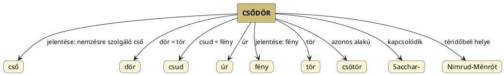

---
{"dg-publish":true,"permalink":"/C/Csődör/","title":"Csődör","created":"2024-02-13T13:58","updated":"2024-12-18T06:57"}
---

# Csődör

Csőd-Ör vélhetően annyit jelent, mint Csud-Ur, azaz Fény-Úr (mert a fény a nemző).  

#### Péterfai János írja:

> Csődör szavunkban a Cső kétségtelenül a nemzésre szolgáló Cső neve, a Dör a Tör változata. Talán nem kell részletesebben ecsetelni, hogy mit csinál a Csődör a Kancával, hogy Csikó szülessen.  

A ló (hímtagján és Nimrud attribútumán/jelentésén keresztül) kapcsolható Orionhoz, ménként, csődörként. Mivel a [[S/Szkíta\|szkíta]] és [[C/Csuda\|csuda]] név is ide, a Tejúthoz (mely szintén lehet állatalakban ló) és a mellette lévő Orionhoz, nyári csillagképhez kötődik (mely időszakban nagyon süt a Nap), valóban a Süt-Úr felel meg neki és valóban igaz, amit Magyar Adorján ír, hogy a csuda jelentése fény.  

[[C/Csötör\|Csötör]]-rel azonos alakú. [[S/Sacchar-\|Sacchar-]] címhez is bekerült. A Csődör téridőbeli helye Nimrud-Ménrót.  

