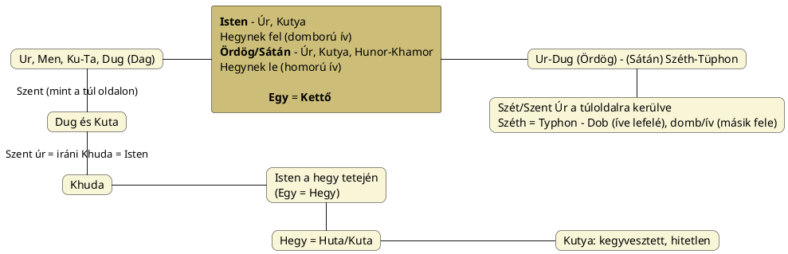

---
{"dg-publish":true,"permalink":"/E/El Shaddai/","title":"El Shaddai","tags":["containstransclusions"],"created":"2025-09-21T21:40","updated":"2025-09-21T21:41"}
---

# El Shaddai

[[J/Jahve\|Jahve]] korábban, amikor Ábrahámmal, Izsákkal és Jákobbal szövetséget kötött, nekik nem Jahve-ként mutatkozott be, hanem El Shaddaii-ként, ami azt jelenti, hogy Jahve elődjét kell látnunk benne illetve ez egyúttal egyszerűen karakterére vonatkozó többlet információval bír.  

A nevet a nyelvészek (egy része) az akkád-asszír `shadu` = hegy szóból vezeti le, de láss csodát, ez a szó a [[S/Shade\|shade]], [[S/Shadow\|shadow]] szavakkal és [[S/Sötét\|sötét]] szavunk gyökével, valamint [[S/Szaturnusz\|Szaturnusz]] előtagjával, [[S/Széth\|Széth]] és [[S/Sátán\|Sátán]] nevekkel, és végső soron a [[Z/Zsidó\|zsidó]] névvel egyeztethető.  
- Legutóbb [[K/KAT\|KAT]] címnél és [[S/SZAT\|SZAT]] (újra)bevezetőjében írottak alapján éppen fényes jelentése is van. Ne feledjük, a hegy mindig többlet, ami fénytöbblet: a hegyet jelentő szavak Nap illetve annak tüzét, fényét jelentő alapszavak mellékértelmei nyomán jönnek létre.

Pap Gábor egy beszélgetésben *sivatagi démon*nak mondja, és szót ejt az értelmezők takaródzásáról is. [Ezen](https://www.youtube.com/watch?v=R8u27XQCafI) Ne Legyen Áldozatos A zsinatok emberiségre gyakorolt hatásai 1. rész című műsorban 20:20-nál azt mondja, hogy kimutatták, hogy...
El Shaddai a puszta/sivatag démona volt és magának a pusztulásnak is (démona/istene).  
Ezt a felfogást módosították utána – úgy, hogy egyáltalán elfogadható legyen –, a "végső dolgokat kimondó" minőséggel.  
- Persze azt el kell mondani, hogy a [[F/Fekete démon\|Fekete démon]] sem volt eredetileg negatív, sátáni és [[S/Széth\|Széth]] volt a korábban tisztelt egyiptomi isten is.

A démon, ördög és sátán valójában leginkább a sötét térfélbe/félévbe jutásra, a [[N/Nap#Nap az Orionban\|Nap Orionba]] érésére utal. Kubínyi Tamás egy műsorában [[N/Nergal\|Nergal]] kapcsán azt mondta, hogy a sötét Nap istene (lásd [[N/Nap – fekete Nap\|Nap – fekete Nap]]); hasonlóan Shaddai = [[S/Széth\|Széth]] = Setét minőség(e Orionnak, ahogy Jahve is az, csillagkép szinten).  

[[S/Szutek#Szutek másnevei\|Szutek másnevei]] cím/alcímnél Godfrey Higgins The Celtic Druids című könyvének adataként "mindenhatónak" van fordítva.  
Azon címnél lásd még külön alcímnél írottakat is.  

Ezen név előjön [[A/Amurru\|Amurru]]/[[M/Martu\|Martu]] isten Wiki oldalán is:  

<a class="markdown-embed-link" href="/M/Martu/#077c8" aria-label="Open link"><svg xmlns="http://www.w3.org/2000/svg" width="24" height="24" viewBox="0 0 24 24" fill="none" stroke="currentColor" stroke-width="2" stroke-linecap="round" stroke-linejoin="round" class="svg-icon lucide-link"><path d="M10 13a5 5 0 0 0 7.54.54l3-3a5 5 0 0 0-7.07-7.07l-1.72 1.71"></path><path d="M14 11a5 5 0 0 0-7.54-.54l-3 3a5 5 0 0 0 7.07 7.07l1.71-1.71"></path></svg></a>

> Amurru/Martu was probably a western Semitic god originally. He is sometimes described as a 'shepherd' or as a storm god, and as a son of the sky-god Anu. He is sometimes called `bêlu šadī` or `bêl šadê`, 'lord of the mountain'; dúr-hur-sag-gá sikil-a-ke, 'He who dwells on the pure mountain'; and kur-za-gan ti-\[la\], 'who inhabits the shining mountain'. In Cappadocian Zinčirli inscriptions he is called `ì-li a-bi-a`, 'the god of my father'.  
> Accordingly, it has been suggested by L. R. Bailey (1968) and Jean Ouelette (1969), that this Bêl Šadê might be the same as the Biblical [[E/El Shaddai\|'Ēl Šaddāi]] who is the God of Abraham, Isaac, and Jacob in the "Priestly source" of narrative, according to the documentary hypothesis. Bêl Šadê could also have become the fertility-god 'Ba'al', possibly adopted by the Canaanites, a rival and enemy of the Hebrew God YHWH, and famously combatted by the Hebrew prophet Elijah.  
> Amurru also has storm-god features. Like Adad, Amurru bears the epithet `ramān` 'thunderer', and he is even called `bāriqu` 'hurler of the thunderbolt' and Adad ša a-bu-be 'Adad of the deluge'. Yet his iconography is distinct from that of Adad, and he sometimes appears alongside Adad with a baton of power or throwstick, while Adad bears a conventional thunderbolt.  
> —  
> Az Amurru/Martu valószínűleg eredetileg egy nyugati sémi isten volt. Néha "pásztorként" vagy viharistenként, valamint Anu égi isten fiaként írják le. Néha `bêlu šadī`-nak vagy `bêl šadê`-nek, "a hegy urának" nevezik; dúr-hur-sag-gá sikil-a-ke, "aki a tiszta hegyen lakozik"; és kur-za-gan ti-\[la\], "aki a ragyogó hegyen lakozik". A kappadókiai Zinčirli feliratokban `ì-li a-bi-a`-nak, "apám istenének" nevezik.  
> Ennek megfelelően L. R. Bailey (1968) és Jean Ouelette (1969) azt sugallta, hogy ez a Bêl Šadê azonos lehet a bibliai [[E/El Shaddai\|El Shaddai]]-jal, aki Ábrahám, Izsák és Jákob Istene a narratíva "papi forrásában", a dokumentumhipotézis szerint. Bêl Šadê a termékenységisten "Ba'al" is lehetett, akit esetleg a kánaániták fogadtak el, a héber YHWH Isten riválisa és ellensége, akivel a héber próféta, Illés híresen harcolt.  
> Amurrunak viharisten-jellemzői is vannak. Adadhoz hasonlóan Amurru is viseli a `ramān` "mennydörgő" jelzőt, sőt `bāriqu` "mennydörgés dobálója" és Adad ša a-bu-be "az özönvíz Adadja" néven is emlegetik. Mégis, ikonográfiája különbözik Adadétól, és néha Adad mellett jelenik meg hatalmi bottal vagy dobóbotokkal, míg Adad egy hagyományos villámot tart. 

Az [alábbi](http://grahamhancock.com/phorum/read.php?4,797678) oldal adata szerint ugariti istenség lesz:  
> What is the origin of the Ila and Yahweh? El was the chief god of the Phoenicians and the Ugarits. Yet El is also the name used in many Psalms for Yahweh. In 2 Kings 22:19-22 we read of Yahweh meeting with his heavenly council. The Ugaritic texts have a similar account, with the difference that the "sons of god" are the sons of El. Other deities worshipped at Ugarit were El Shaddai, El Elyon, and El Berith. Since the writers of the Old Testament apply all these names to Yahweh, we can be sure that the Hebrew theologians assimilated the earlier mythology into their system.  
> —  
> Mi az Ila és Jahve eredete? El a föníciaiak és az ugaritok főistene volt. Ugyanakkor El számos zsoltárban Jahve neve is. A 2Királyok 22:19-22-ben olvashatjuk, hogy Jahve találkozik mennyei tanácsával. Az ugarit szövegek hasonló beszámolót tartalmaznak, azzal a különbséggel, hogy az "isten fiai" El fiai. Az Ugaritban imádott más istenségek El Shaddai, El Elyon és El Berith voltak. Mivel az Ószövetség írói mindezeket a neveket Jahvéra alkalmazzák, biztosak lehetünk benne, hogy a héber teológusok a korábbi mitológiát is beolvasztották a rendszerükbe.  

Az [alábbi](https://web.archive.org/web/20200325101442/http://www.himavanti.org/en/c/himavanti-1/yahvah-the-lord-god-in-indian-veda) oldalon El/Bél/Bál istenekkel egybe véve említik: El/Bel/Baal Shaddai. [[B/Bál#Bál mint Nimród\|Bál mint Nimród]] cím/alcímnél ugye volt szó Bál Nimróddal való azonosításáról.  

Ha nem is El Shaddai, de **El Shaddar** előjön Richard H. Allen Star Names című könyvében Szíriusz **Sopdet**, **Sept**, **Sed**, stb. elnevezéseinél, minthogy bizonyos Müller szerint a Sed, Shed hieroglifa-olvasatok héber megfelelője lenne El Shaddar.  
Nyilvánvalóan a [[S/Szít\|szít]] és a [[S/Sötét\|sötét]] szavak gyökének hasonlósága (de ellentétes értelme) okozza a zavart.  
De talán nincs is zavar. Ezen Müller féle adat ugyanis bizonyítékként szolgálhat arra nézve, hogy:  
A Jehova-kultusz nem más, mint a [[S/Széth\|Széth]]-kultusz fennmaradása/folytatása, és így az [[O/Ószövetség\|Ószövetség]] elnevezés is eredetileg a – [[P/Poláris-szoláris átállás\|poláris-szoláris átállás]] címnél taglalt változások alapján – régi anyakultuszra utalt volna \[ami a jász-filiszteus nép eredeti [[J/Jazidi vallás\|jazidi vallás]]a lett volna?\] és az Újszövetség pedig a szoláris napfiú-kultuszra, csak éppen az eredeti Ószövetséget a már korrumpált napvalláson lévő szemiták a maguk szájíze szerint átírták.  
[[S/Széth\|Széth]] és [[Z/Zsidó\|zsidó]] címnél is szerepelt (ott Müller adatával is), hogy mind – az ezek szerint külön eredettel bíró – [[Z/Zsidó\|zsidó]] és [[J/Júda\|Júda]] nevek is arra a Széth- és kutya-tiszteletre utalnak, melyek a hunok, keták, szkíták körében is megszokott volt.  
Persze El Shaddai kapcsán kérdés, hogy ez már szemita felfogást tükröz ill. hordoz-e (neve alapján igen). [[S/Szutek\|Szutek]] és [[S/Sátán\|Sátán]] címnél is kimondtuk, hogy az ősturáni felfogásban [[S/Széth\|Széth]] akkor tisztelhető, ha a Hold- és Istenanya-tisztelettel megférő Ősanyagistennő/Őskezdet fogalmát foglalja magában. El Shaddai már nem ennek a minőségnek megmutatója lehet, de eredetét ettől még korábbi nyelvi rétegből veszi.  

## Az akkád-asszír 'shadu' = hegy szó isteni-sátáni összefüggéséről

[[S/Sátán#Az éj sötétjének királynője/démona\|Az éj sötétjének királynője/démona]] cím/alcímnél és [[S/Sátán\|sátán]] címnél az oszét Satana hercegnő név kapcsán is volt szó a női elvről.  

#### Dr. Kovács Sándor Gán.Muš – a kígyó kertje avagy a sötétség...

...című az Ősi Gyökér 2010/1-2. sz. megjelent cikkében idevonatkozó adatot találunk:  
> A középkorban a "[[F/Fekete démon\|Fekete Démon]]" többszörösen modifikált alakja lett a démonikus mágia főszereplője, s mint ilyen, Szent Antal megkísértője – a *fekete heggyé* változott gyönyörű, sátáni királynő. (v. M. Schongauer: Szent Antal megkísértése című metszetét (1480-1490 körül) vagy H. Bosch: Szent Antal megkísértése című festményét (1500 körül), valamint G. Flaubert: Szent Antal megkísértése című regényét (1849) etc.) Eredetileg tőle származott az alkimista tradíciók "tökéletesen fekete nő" képzete is.  

#### Jankovics Marcell A Nap könyve...  

...című könyvében is nőiség kapcsán említi a nevet:  
> Vagy itt van az ószövetségi Isten egyik vitatott jelentésű megszólítása: El-Saddáj, ami fordítható a "hegyek Istené"-nek - gondoljunk Isten hegyes lakhelyeire, magaslati oltáraira -, de a név "keblek Istene"-ként is értelmezhető, ami az elnevezés mögött nőnemű istenséget sejtet, ilyen volt a sumer [[N/Ninhursag\|Ninhursag]], "Világhegy-úrnő" (a hegy-kebel analógia felismerhető még a szicíliai Szent Ágota legendájában és az Etnához kapcsolódó kultuszában is).  
- [[C/Cybele\|Cybele]] nevét is említhette volna.

Jankovics Marcell arra utal, hogy az El Shaddai név másik értelmezésében előkerülő héber `shad` = mell értelmű, de a [[C/Csöcs\|csecs]] és [[C/Csúcs\|csúcs]] szavak is így függenek össze, tehát most hogy akkád vagy héber értelmezésből indulunk ki, mindegy.  
A [[H/Hegy\|hegy]]-[[K/Kebel\|kebel]] párba állítása azért is érdekes, mert előbbi [[E/Ég\|ég]], utóbbi [[O/Öböl\|öböl]] és [[I/Ív\|ív]] szavakkal hozható kapcsolatba és az égnek (bolt)íve van, továbbá hegy = ég, ahogy [[E/Egy#^pqd018\|ég]] címnél szereplő diagramon is mutattuk.
{ #250819}

És hogy lehet egyszerre valami isteni és sátáni? Úgy ahogy egy adott szó lehet egyszerre fehér és fekete jelentésű (lásd e témát [[B/Black\|black]] és [[B/Balog\|Balog]]). A nyári napfordulós ponton válik el sötét és világos térfél (a sötét javára: a sötét követi a világosat; így értjük meg Káin és Ábel és Romulusz és Rémusz kapcsán azt, hogy miért öli meg előbbi utóbbit).  
A hegy csúcsa a [[S/Szakrális geometria\|szakrális geometria]] címnél taglalt nyári napforduló.  
Máskor nem napforduló, hanem az Ikrek mutatja e kettősséget, mely átmehet Orionra is: benne is megmutatkozik az a kettősség, mely [[N/Nimrud\|Nimród]] alter ego-jának, a szemita felfogásban már (még?) negatív [[J/Jahve\|Jahvé]]nek alakját is adja.  
- A már-még kérdés azért is érdekes, mert fentebb is kifejtettük, hogy a később démonizált istenek korábban istenek voltak: Széth és Bál is.

Nimród és Jahve párosának még megfelel Jupiter és Szaturnusz párosa: utóbbi névben ismét ott a [[S/SZAT\|Szat]] elem, míg Jupiter [[J/Jove\|Jove]] nevével szokás Jahve nevét kapcsolatba hozni.  
Látjuk, hogy a hétköznapi értelmezésben nem lehet gondolkodni. Bonyolultabb a helyzet, de mégis egyszerű. A hegy csúcsában [[E/Egy\|Egy]] a [[K/Kettő\|Kettő]].  

Van egy hasonló értelmű összetétel még itt: [[K/Kutya\|Ku-Ta]], a Nagy Kutya csillagkép a már említett Ikrek cikkelyében. Ez is a hegyre, a Nap legmagasabb évi állására utal.  
Ahogy [[K/Kentum\|kentum]] címnél is említettük, ennek K-T szóváza mintha az S(z)-T szóvázú szavakra illene. És ahogy az [[O/Ördög\|ördög]] és [[S/Szakrális geometria\|szakrális geometria]] címnél bemutatott diagramban is látjuk, ami lehet isteni/szent, az lehet sátáni, negatív megítélésű is:  

<a class="markdown-embed-link" href="/S/Szakrális geometria/#ovbsl7" aria-label="Open link"><svg xmlns="http://www.w3.org/2000/svg" width="24" height="24" viewBox="0 0 24 24" fill="none" stroke="currentColor" stroke-width="2" stroke-linecap="round" stroke-linejoin="round" class="svg-icon lucide-link"><path d="M10 13a5 5 0 0 0 7.54.54l3-3a5 5 0 0 0-7.07-7.07l-1.72 1.71"></path><path d="M14 11a5 5 0 0 0-7.54-.54l-3 3a5 5 0 0 0 7.07 7.07l1.71-1.71"></path></svg></a>

Ezek után nem is lenne meglepő, ha S-T/S-D vázzal nemcsak hegy, hanem kutya jelentésű szót is találnánk valamilyen nyelvben (főleg, hogy Ku-Ta is tulajdonképpen hegy alap- vagy mellékjelentésű). Van is ilyen: az ajnó/ainu `seta` és a mundari `seta` = kutya jelentésű!  

Az S-T/S-D váz pedig egyúttal az elválás két ([[S/Süt\|süt]] és [[S/Söt\|söt]]) oldalára ([[S/Side\|side]]; egy újabb S-D vázú szó, ahogy a latin `sidus` = csillag is, mely Szíriuszként a két oldalt választja el) is rámutat, valamint [[S/Szutek\|Szutek]] és a [[Z/Zsidó\|zsidó]] nevekre is.  
Azaz nem olyan egyszerű, hogy csak azt mondjuk, hogy Széth is negatív, sátáni és akkor az El Shaddai és a zsidók is azok.  

De látjuk, hogy a [[S/Szarvas#Szarvas isten(anya)ként vagy szarvasfiúként való értelmezése – szarv-as ördög\|szarvas isten(anya)ként vagy szarvasfiúként való értelmezése – szarv-as ördög]] alcím nevében is már megvolt ez a kettős megosztás és [[C/Csuda#Csuda ég jelentése\|csuda]] helyen is kitértünk (többek közt) arra, hogy a szarvas beillik hegynek.  

Azaz a fogalmak összekapcsolódását érteni kell és a le kell ásni mélyre, hogy értsük.  
