---
{"dg-publish":true,"permalink":"/E/Evil/","title":"Evil","created":"2024-11-23T04:54","updated":"2024-11-23T04:54"}
---

# Evil

Gonosz. Az óangolban `yfel`, `yfil`, ófelnémetben, ósvédben `ubil`, gótban `ubils`.  
Az utóbbi szavak a mohamedánok (görög `diabolosz`-ból származtatott) [[I/Iblisz\|Iblisz]] (mely egyik nevük [[S/Sátán\|Sátán]]ra; a másik a `saitán`) szavával mutat egyezést. (Eric Partridge nem viszonyítja vele.) Tomory Zsuzsa [[B/Bal\|bal]] szavunkkal azonosítja, ami már [[B/Bál\|Bál]] démonizálására utalhat.  
Nem lehet kizárni, hogy (ível helyett/mellett) [[E/Évül\|évül]] szavunk adja ki, hiszen a régi istenek elévülésével gonoszokká válnak. Bár itt is inkább a – látszólag csak egy d hanggal többnek mutatkozó – [[D/Devil\|devil]] szónál taglalt sötét félévről van szó. (Évül és ebül? Olyan lenne, mint a más(od)ik félévre utaló [[B/Bűn\|bűn]]?)  
Amikor azt mondom, hogy ível (mellett), arra gondolok, hogy az ív, [[K/Konyul\|konyul]], [[H/Homorú\|homorú]] fogalmak is ugyanúgy a második, sötét, gonosz félévre, annak kezdetére utalnak.  

Evil és [[I/Iblisz\|Iblisz]] szavakkal való összevetése után [[D/Devil\|devil]] szó esetében a görög `diabolos` = csinál balt/bajt levezetés látszik igaznak. Hogy a szóeleji d- hogyan maradt el, ez rejtély, mert általán [[H/H, J, V\|H, J, V]] hangok szoktak szó elejéről lekopni.  
Lehet(ett volna) egyszerűen csak E-Vil Világosság Háza. [[R/Rossz\|Rossz]], [[U/Utál\|utál]], stb. magyar [[N/Negatív értelmű szavak\|negatív értelmű szavak]]hoz hasonlóan itt is pozitív lenne a kiinduló értelem, melyből gonosz lett valamiféle valláscsere hatására. [[O/Ördög\|Ördög]] névnél is erről volt szó.  

Hasonló alakú név még az [[A/Ábel\|Ábel]] is. Márpedig van olyan elképzelés, hogy nem Káin ölte meg Ábelt.  

[Ezen](https://www.wordsense.eu/evil/) oldalon körül nézve megállapíthatjuk, hogy a gonosz fogalma idegen nyelvekben is évköri értelmezhetőségű lehet. Az [[I/Íj\|íj]]/[[E/Év\|év]] alakú szavak mellett a skandináv `and`/`ond` érdekesek és főleg a [[K/Kutya\|kutyá]]s alakú török `kötücül`.  
Azaz, ahogy egy Quora válaszban is felhívtam rá a figyelmet, az and/ond alakú szavak úgy aránylanak a vadászebet jelentő germán `hund`/[[H/Hound\|hound]]-hoz, ahogy az angol evil szó gyöke a magyar [[E/EB\|eb]]hez.  

```plantuml-svg
@startuml
left to right direction
skinparam BackGroundColor transparent
skinparam card {
    roundCorner 15
    BackgroundColor #f9f5d7
}
card "<color:#e7545c>evil</color> = gonosz" as w1
card "eb (kutya)" as w2
card "ördög" as w3

w1 <-- w2 : B-V váltás
w2 -- w3
@enduml
```

Érdekes a hettita `huwappi` ("rosszul bánni, zaklatni") és `huwappa` ("gonoszság, rosszaság"), gondolván apa végződésre, de még a [[J/Jehova\|Jehova]] alakhoz is hasonló. Jehova – ha nem lenne ismert a Jahve forma – Ég-Apa is lehetne (de a [[J/Jahve\|Jahve]] nevet is lehet ekként magyarázni, miért ne).  