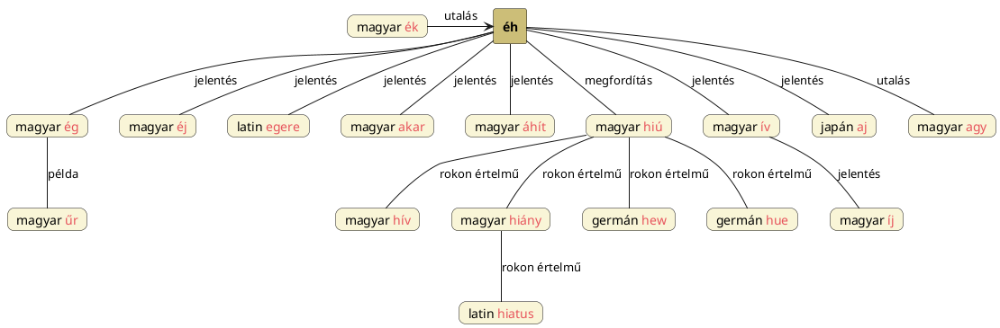

---
{"dg-publish":true,"permalink":"/E/Éh/","title":"Éh","tags":["containstransclusions","Englishtexttranslated"],"created":"2024-11-06T16:20","updated":"2024-11-21T18:14"}
---

# Éh

Éh szavunk nyilván az [[E/Ég\|ég]] fogalmából indul ki: így lesz `űr`-ből is űr-es, üres. [[E/Éj\|Éj]] szavunkból is levezethető: a sötét a világos által való nemzésre éhes/áhítozik.  
Előjött [[A/Ache\|ache]] szónál is, ahol megemlítettük a latin `egere` = hiánya van, kell jelentésű igét is. Éhes szavunkról van szó. Ache eredhet [[A/Áhít\|áhít]] szóból is, de lényegében ugyanarról a szóról ill. fogalomról van szó.  
Megfelel neki [[A/Akar\|akar]] ak- gyökén kívül [[E/Ég\|ég]] szavunk is, amennyiben a [[H/Hunger\|hunger]], [[E/Éva\|Éva]] (és [[E/Eire\|Eire]]), [[I/Íj és a nyíl\|íj és a nyíl]] és [[S/Szivárvány\|szivárvány]] címnél is érintett ég íve is lehet nőiség. [[A/Ache\|Ache]] és [[E/Eager\|eager]] szavak [[A/Akar\|akar]] címnél is megvoltak.  

Éh, ih szócskáink megfordítása a hí, melyből lesz [[H/Hiú\|hiú]], [[H/Hív\|hív]] (honnan a magyar-kabar-héber [[E/Éva\|Éva]]) és [[H/Hiány\|hiány]] és a latin [[H/Hiatus\|hiatus]] is, illetve a germán [[H/Hew\|hew]] és [[H/Hue\|hue]].  

Az [[E/Éva\|Éva]] név elemzése kapcsán felhozható az éh szó. Ezen éh a [[H/Hiú\|hiú]] (hívó) megfordítása és tulajdonképpen űrt, hiányt jelent. A [[S/Szakrális geometria\|szakrális geometria]] címnél lévő diagramon is szerepel a hiú, éh, Éva a felső tartományban.  
Amit Magyar Adorján ír éha szóról:  
> A magyar hiányzik, hiány szónak mily sok hasonló hangzású és rokonértelmű megfelelői vannak. Említve volt hogy a magyar heanyozik, tájszólásos hiányozik, valaminek híján van, szavunknak népünknél megfelel a megfordított `éha` szó, amelynek értelme "valaminek éha" = valaminek ürege, üressége, lyuka.  

## Éh – evés/ivás – ívás

### Az ívás/nemzés nyári napfordulós helye

Fontos is szólnunk arról, hogy az éh megfelel az [[I/Ív\|ív]] (és [[I/Íj\|íj]]) szavaknak és [[H/Hunger\|hunger]], [[K/Khamor\|Khamor]], valamint [[H/Homorú\|homorú]] címnél írottak alapján egy csillagászati hátterű témát sikerült feldolgozni, de legalábbis a vizsgálati alapokat lerakni: a nyári napfordulón van a nemzés (amikor a Nap legmagasabbra hág, akkor a legerősebb és Szíriusszal is akkor kel együtt, mely Szíriusz kapcsán lásd még [[K/Kutyanemzés\|kutyanemzés]]).  
Az [[I/Ív\|ív]] címnél is taglalt, [[E/EB\|EB]] = [[I/Ív\|ív]] = [[I/Íj\|íj]] összefüggései alapján taglalt joruba `ìfẹ́`/`ife` = szerelem szót (lásd [[E/EB\|EB]] címnél, külön alcím alatt) éh ≈ vágy szóval is lehetséges megfeleltetni. Még inkább a japán `aj` = szerelem szó is közvetlenül éh/áh-ít szavunkkal feleltetendő meg (nem a török Holdat jelentő Aj-jal vagy a magyar ajz-zal).  
[[H/HAM\|HAM]] címnél is szóba került az éhség és a nyári napfordulós téridőbeli pont.  
A folklórban az evés gyakran az intim kapcsolat metaforája.  
Az éh(om), az almából evés, valamint a [[H/Hysteria\|hysteria]] címnél álló adat, hogy a méh tápláléka az ondó, mind ide tartozik.  
A nemzés kapcsán elhangzott [[E/Éva\|Éva]] címnél is, hogy az evés a mítoszokban nemzés kapcsolatú. Lám például a Jankovics Marcell egyik könyvében említett magyar Szűz Mária és a keresztleánya mesében is látjuk párhuzamát:  
> Egy igaz leányzó lenyel egy "tolakodó" borsszemet. Teherbe esik. Szégyenében a havasba bujdosik, ott egy odvas fában aranyhajú leányt szül. A gyermekből Szűz Mária szolgálója lesz, akit Isten anyja hazugságon kap, s ezért büntetésből egy fa tetejére varázsolja. (Szűz Mária és a keresztleánya. A faodúban születő aranyhajú gyermek a tejúthasadékban télen újjászülető Napot személyesíti meg, a fa tetején csücsülő hős, hősnő pedig, akár fel kell másznia rá, akár odavarázsolják, a Tejút másik végén, nyárban delelő Napot jelképezi.)  

[[F/Féreg\|Féreg]] címnél ír mitológiai adatokat találunk:  
Például [[C/Concobar mac Nessa\|Concobar mac Nessa]] születése kapcsán:  

<a class="markdown-embed-link" href="/c/concobar-mac-nessa/#fb75s" aria-label="Open link"><svg xmlns="http://www.w3.org/2000/svg" width="24" height="24" viewBox="0 0 24 24" fill="none" stroke="currentColor" stroke-width="2" stroke-linecap="round" stroke-linejoin="round" class="svg-icon lucide-link"><path d="M10 13a5 5 0 0 0 7.54.54l3-3a5 5 0 0 0-7.07-7.07l-1.72 1.71"></path><path d="M14 11a5 5 0 0 0-7.54-.54l-3 3a5 5 0 0 0 7.07 7.07l1.71-1.71"></path></svg></a>

> An omen came to her one day: Two worms appeared in a pail of water from a holy well. Nessa drank them down, thus becoming pregnant (see pregnancy through drinking), but through her magical power she assured that the child was born clutching one of the worms, so that no one would mistake the future hero for Cathbad's son.  
> —  
> Egy nap egy ómen érkezett hozzá: Két féreg jelent meg egy vödör vízben, ami egy szent kútból származott. Nessa megitta őket, így teherbe esett (lásd terhesség ivással), de mágikus erejével biztosította, hogy a gyermek az egyik férget szorongatva szülessen, hogy senki ne tévessze össze a leendő hőst Cathbad fiával. 

- Sőt, anyja, Nessa később [[F/Fergus\|Fergus]] mac Róich felesége is lesz.

De ami még ennél is fontosabb, [[C/Cuchulainn\|Cúchulainn]] is így született:  
> Cúchulainn was born magically when his mother, [[D/Dechtire\|Dechtire]], drank water with a worm in it.  
> —  
> Cúchulainn varázslatos módon született, amikor anyja, [[D/Dechtire\|Dechtire]], olyan vizet ivott, amelyben egy féreg volt.  

Az éhséget kielégítő evés tehát a sötét fénnyel való táplálkozására és szexuális értelemben az az által való megtermékenyülésre vonatkozik.  
Egyébiránt a [[V/Vízi Péter és Vízi Pál mese\|Vízi Péter és Vízi Pál mese]] is teljesen hasonló képpel nyit.  
[[S/Száj\|Száj]] címnél írottakat kihagytam. Szájon át nemzés = evés.  
Megfelel neki eszik [[E/ESZ\|esz]]- eleme is. Ez körülbelül olyan, mint amiről [[P/Pina\|pina]] (és [[S/Száj\|száj]]) címnél is volt szó (de a [[G/Göd\|Göd]] név kapcsán taglalt Ku-T(a) = tűz és és [[K/Kut\|kut]] \[[[Coot\|coot]]\] = pina is nevek azonossága is ilyen; [[T/Tűz\|tűz]] címnél pedig a pina tüzéről volt szó, talán hibás elméletet gondolva ott?). Nevezetesen, hogy a tűz a lyukon bemegy és ki is jön (nemzés és szülés; [[S/Száj\|száj]] címnél pedig beszéd kapcsán volt még erről szó, de a szájba való bevitel is tűz vagy víz: [[E/ESZ\|ESZ]] és [[I/ISZ\|ISZ]], melyek egylényegűek, ahogy [[V/Víz\|víz]] is lehet [[V/VID\|VID]]).  

Lásd még [[H/Hunor és Magor#Evés és éhség Magor és Khamor/Hunger alakú nevei és lehetséges évköri értelmezésük\|evés és éhség Magor és Khamor/Hunger alakú nevei és lehetséges évköri értelmezésük]] cím/alcímet.  

### Nap és Hold – éhség és a Hold

Lásd [[H/Hold#Hold nevünk szláv éhség jelentése\|Hold nevünk szláv éhség jelentése]].  

Péterfai János írásában látom, hogy az Éh pedig a Hé = Nap tükrözése. Nem rossz észrevétel, hiszen a Jin oldalnak megfelelő éhes/sötét oldal a Jang világos oldal ellenrésze. [[T/Tükörképes világkép\|Tükörképes világkép]] címnél volt szó hasonlóról. Lásd még [[J/Jin és jang\|jin és jang]].  

^ncyrlu