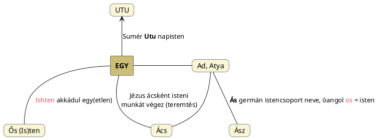

---
{"dg-publish":true,"permalink":"/F/Flexió/","title":"Flexió","tags":["nyelvészet","Götz"],"created":"2024-10-22T22:07","updated":"2025-08-06T22:05"}
---

# Flexió

#### Végvári József Ragozó-rügyező nyelvünk...  

...című írásában közli:  
> A körülöttünk élő, illetve a világot ma uraló népek kivétel nélkül hajlító nyelveket beszélnek. A négyes felosztás, mely szerint vannak elszigetelő (kínai), hajlító (indogermán, sémi), ragozó (finnugor, török, busman, bantu nyelvek, több kaukázusi nyelv mint például csecsen és grúz, a kihalt sumér, baszk) és összegző vagy bekebelező (eszkimó, amerikai indián, ausztráliai) nyelvek. A mai angol eredendően hajlító, de vannak elszigetelő vonásai is.  
> Miben áll a hajlítás? Egyfelől abban, hogy a szó tőmagánhangzója változik meg, méghozzá minőségileg. Az angolban legjobb példa erre a rendhagyó igék három alakja: *drink* – *drank* – *drunk* stb.; ez az ún. tiszta vagy belső hajlítás, melyre a mi nyelvünkben nincs példa (ugyanakkor mutatja a magánhangzók fontos szerepét is az indogermán nyelvekben). Az ún. külső hajlításban végződések, toldalékok jelennek meg, ezek azonban egészen mások mint a magyar ragok, legföljebb látszatra és messziről hasonlítanak.  
> A latinban (és minden más hajlító nyelvben!) az egyes esetvégződések az alanyeset -us végződése helyébe kerülnek, tehát ahhoz képest valóban elhajlásokat vagy eltéréseket képeznek. A magyarban viszont a ragnélküli alapszóhoz illeszkednek a ragok, az alapszó változatlan marad, legföljebb mennyiségi változások vannak, például nyúlás: fa – fák.  
> A négyes besorolást eredetileg ugyanazok a nagy nyelvészek: F. Schlegel (1808), A.W. Schlegel (1818), W. Humboldt (1822), egyúttal a nyelv fejlődési szintjeinek tartották, és bizony **a fejlődési láncban legmagasabbra a hajlító (vagyis az indogermán és sémi) nyelveket helyezték. A ragozó nyelvek egy fokkal alacsonyabbra kerültek**.  

A Götz László Keleten kél a Nap című könyvének 94-95. oldalain megszólaltatott N. S. Trubetzkoy véleménye szerint viszont:  
> A flexió primitívebb nyelvi állapot, mint az agglutináció, mert az indogermán nyelvek fejlődése kimutathatóan a hiperflektáló kaukázusi nyelvektől az agglutináció felé halad.  
- De ezt bizonyítja az is, hogy az indogermán nyelvészek által összeállított ideális nyelv, az eszperantó, nem más mint indogermán elemekből felépített tiszta agglutináló nyelv.    
Könyvének 133. oldalán tér vissza a témára, indogermán és szemita példákat bemutatva. Utána is folytatja.  

## Hangfejlődés és hajlítás

[[H/Ház\|Ház]] szónál került szóba, hogy k-előtétes szavak másutt h-előhangosak. Ilyenkor a nyelvészet nyilvánvalóan mindig [[N/Nyelvészet mint tudomány#Grimm-féle hangtörvények\|Grimm-féle]] "szabályos" hangfejlődésekben fog gondolkodni. A fókuszba az kerül, hogy adott szavakról adott vizsgálati környezetben, adott(?) szabályszerűségek szerint valami tudományosat kell kanyarítani. Mindeközben megfeledkeznek a régi ember [[A/Analogikus gondolkodásmód\|analógiás gondolkodás]]áról, nyelveik szóalkotásának azon igényéről, hogy a hasonlót a hasonlóval fejezzék ki: tehát nem annyira hangfejlődésekről van (csak) szó; nem szabad figyelmen kívül hagyni, hogy egyes szavak flexiós változatait kell inkább észrevenni (értsd: szándékosan készülnek pl. k- és h-előhangos formák hasonló ideák kifejezésére).  

## Magyar hajlítás mint nyelvünk szavainak alapképessége

Van eset, hogy rendkívül csekély hajlítás történik. Pl. a *homofónia* esetén a szavak ugyanazt a hangalakot használják, de eltérő jelentéssel rendelkeznek (pl. `kész` - `kéz`).  
Czakó Gábor **gyökhangváltás**nak nevezi, olyan példákat hozva, mint `borít` és `burkol`, amelyek ugyanazt jelentik: "befed, betakar".  

Akár hívhatnánk zéró hajlításnak azon eseteket, amikor *homonímiá*ról beszélünk. (A homonímia az egyik típusa a szemantikai homogenitásnak, amely a szavak jelentésbeli kapcsolatrendszerét vizsgálja. A *homonimák* olyan szavak, amelyek ugyanazt a fonetikai vagy ortográfiai formát használják, de eltérő jelentéssel rendelkeznek.)  
A [[M/Méh\|méh]] kettős jelentését mindenki ismeri, de a közös kiindulót csak őseink gondolkodásának megértése révén fedezhetjük fel.  
Azt is tudja mindenki, hogy a [[M/MAG\|mag]] örökítő anyagot, ondót is jelent, de azt már kevesen, hogy a [[M/Magor\|Magor]] nevünkben is megtalálható [[M/MAG\|Mag]] Nap jelentésű. (Magor pedig épp a Tejútanya Méhszájából születik meg, a téli napforduló után.)  
Magor ikerpárjának, [[H/Hunor\|Hunor]]nak nevében Hun is jelenthet Napot, de leginkább kemény K/G hangzókkal találjuk meg. Ott is megjelenik az örökítő anyag, [[K/Könny\|könny]] és [[G/Geny\|geny]] formában. Itt az eredeti [[K/KÖN\|Kön]]/[[K/KEN\|Ken]] formához képest már némi hangalaki változást is tapasztalunk.  
- K-N vázú napnevekről a témában lásd még [[T/Teremtő és teremtett#HUN, KUN\|itt]].

Mielőtt további példákkal szemléltetnénk, hogyan működik mindez a magyar nyelvben, hallgassunk meg másokat is.  

#### Péterfai János írja:

> A Ku flexiót alkot a magyar nyelvben, Kő jelentéssel. A flexió sorozata a következő: Ku, Ko, Ka, Kő, Ke, Ki, Kü. Mindegyiknek van Kővel kapcsolatos jelentése. A bemutatott flexiós nyelvi jelenséget Archaikus Flexiónak nevezem, szemben a szemita nyelvekre jellemző Modern Flexióval. Teljesen bizonyos, hogy a szemita nyelvek flexiós jelensége a magyar Archaikus Flexióból alakult ki.  
> A szemita nyelvekben ugyanis a flexiós ragozás BABAB típusú szavakon megy végbe, amíg a magyar flexió AB vagy BA, nagyon egyszerű szavakon jelentkezik. Általában a magyar flexiós, hajlítós nyelvi jelenséget Szóbokor képződésnek nevezik. A magyar nyelvben a Flexió, vagy a Hajlítás sok tízezer évvel megelőzi a szemita nyelvekben megjelenő Flexálást, vagy Hajlítást, ami valójában az oldalra kitérést, az egyenestől való eltérést írja le, nyelvi alap jellegzetességként.  { #bjhh4f}

- Más címnél is írtuk:  
Úgy tűnik, hogy már a magyar nyelv sémit megelőző archaikus flexiós fejlődésében lezajlott az ív alak h/k/g hangos toldásával képzett változatainak létrehozása. Ezek lehetnek: [[H/Hív\|hív]], [[K/KAP\|kap]], [[G/Göb\|göb]], [[K/Kúp\|kúp]], stb.
{ #p3kgqp}

-  CzF [[G/Gabona\|gabona]] címnél álló adata szerint a geb, gib, göb, gub gyökök általában meghajlást, görbeséget jelentenek, mint egyszerűn a g betű, különösebben pedig födést, födözést jelentenek, s az értelemárnyéklatokat csaknem egyedül az önhangzók teszik. Így gab is jelent födözést, valaminek felső részét, fejét, s rokonok vele a szanszkrit `kub` v. kup (am. födöz, fölemel), a német `Haufe`, `heben`, `Haupt`, `Kopf`, `Giebel`, `Gipfel`, latin `copia`, `capio`, `caput`, svéd `kopp`, `kappe`, olasz `coppa`, `capo`, hellen `kubh`, `kejalh` stb, végül ide tartozók még más rokon betükkel a magyar kúp, csúp, hápa-hupa stb. szók is.

#### Götz László Keleten kél a Nap...  

...című könyvében is hoz példákat magyar és szumer nyelvre:  
> A ragozó nyelveknél alapvetően más a helyzet. Ezek ugyanis – mivel a nyelvtani viszonyokat ragokkal, képzőkkel, jelekkel fejezik ki – szabadon felhasználhatják az egész magánhangzó-skálát szemantikailag összetartozó szavak árnyalati megkülönböztetésére.  
> Pl. **magyar:** HAL, HÁL, HULL; LAK, LIK, LUK, LÉK; ESZ-ik, ISZ-ik.
>
> Már a ragozó sumér nyelv is alkalmazta a magánhangzóvariációkat egyrészt szinonimák, másrészt szemantikailag közel álló jelentésárnyalatok kifejezésére.  
> **Sumér:**  
> `BAR` (szétválaszt), `BUR₂` (széttép)  
> `GAR` (körülzár), `GUR` (körülvesz)  
> `GUR₄` (rohan), `GIR₄` (fut)  

A magyar nyelv tehát belső működése szerint egyes hangokban alakváltoztatásokat ejt meg, hogy hasonló jelentésekkel hozzon létre új szavakat. Például [[V/VAK\|vak]] – fek(ete), fek(szik) (\[V-F\]). – Lásd még [[M/Mássalhangzók felcserélődése\|mássalhangzók felcserélődése]].  
Nyilván lesznek olyan ellenérdekeltek, akik ebben nem hisznek; nekik sem kell hosszasan magyarázni, hogy a [[H/Hold\|Hold]] neve nyomán keletkezik [[H/Hölgy\|hölgy]] nevünk. Vagy igen?  
Az egyik legszemléletesebb összetett példa magyar belső flexióra a [[M/Magyar szavak, mondák idegen népek szavaiban, mondáiban felismerhetők#Világ teremtéséről szóló mondák\|magyar szavak, mondák idegen népek szavaiban, mondáiban felismerhetők]] cím/alcímnél említett [[E/Ég\|ég]], [[E/Egy\|egy]] és [[H/Hegy\|hegy]] szavak közös mondai eredetében mutatkozik meg.  

Egy másik másik ilyen az [[E/Egy\|Egy]] – [[A/Atya\|Atya]] ([[U/UTU\|UTU]]; [[A/Ad\|Ad]]) – [[A/Ász\|Ász]]/[[O/Ős\|Ős]] ([[A/Ács\|Ács]]) sorozat, és persze ne felejtsük `egy` számnevünk más számneveinkben (2,4,5,6,7) való előfordulását sem.
{ #250806}

Továbbá flexiós kapcsolatot találunk [[H/Huny\|huny]], [[H/Hany\|hany]] (mint [[H/Hanyatlik\|hanyatlik]]), [[K/KONY\|kony]] ([[K/Konyul\|konyul]]), [[K/KUM\|kum]] (`lekum` a Nap), valamint a Nap [[E/Ecliptic\|ekliptiká]]n való esésének téridőbeli pontját jelölő [[K/KAN\|kan]] ([[C/Canis Maior\|Canis Maior]]) (mely a [[G/Gonosz\|gon]]osz félévet nyitja), és sok más magyar-utód elnevezés (a Rák [[C/Cancer\|Cancer]] nevének előtagja, a Rák japán neve, stb.) között.  

Ott van még a [[S/Süt\|süt]] ige [[S/Sötét\|sötét]]/[[S/Sötét\|setét]] szavak gyökével való megfelelése, [[K/Kör\|kör]] szóbokrunk olyan tagjai, mint [[G/Gyűrű\|gyűrű]], `gördül`, [[F/Fal\|fal]] főnév [[F/Fél\|fél]] szóval alkotott flexiós viszonya, vagy például felhívhatjuk a figyelmet [[E/Éh\|éh]] = [[A/Áhít\|áhít]], [[A/Akar\|akar]] szavak gyökeinek azonosságára.  
A kutyára visszatérve, [[E/EB\|eb]] és [[A/Apa\|apa]] szavaink [[I/Ív\|ív]] szavunkkal való viszonya említhető még ilyen szinten (lásd [[G/Gene#^eeeksm\|gene]] címnél található diagramot megjegyzésekkel ill. még témát [[L/Lemniszkáta\|lemniszkáta]]), de például magánhangzó cserével a [[M/Más\|más]] (lásd még [[M/MAS\|MAS]]) fiú, hős jelentése az, ami majd a [[M/Mese\|mese]] szavunk létrehozója is lesz.  
Sok más szópár ismert: [[I/Isten\|Isten]] – [[O/Ösztön\|ösztön]], [[V/Vessző\|vessző]] – [[F/Fasz\|fasz]]; [[V/Víz\|víz]] szavunk [[V/Vedel\|vedel]], [[V/Vödör\|vödör]], [[V/Vád\|vád]]ol, [[V/Vese\|vese]] szavakban ugyanúgy megtalálható; fentebb említett [[H/Ház\|ház]] szavunk (közös gyöke) ismerendő fel olyan szavakban, mint [[H/HAS\|has]], [[K/KAS\|kas]], [[K/KÁD\|kád]], [[K/Kagyló\|kagyló]], [[H/HAT\|hat]], mint [[H/Hathor\|Hathor]] névben, stb.  
M>N változásra sok példa van; itt csak a magyar [[M/Magas\|magas]] szó gyökét mutassuk be [[N/Nagy\|nagy]] szavunk párjaként.  
[[M/Magyar szavak, szórészek alakváltozatai\|Magyar szavak, szórészek alakváltozatai]] címnél korábban más példákat is bemutattunk.  
A fentebb idézett Végvári József [[S/Szócsaládok\|szócsalád]]-rendszere is szavak hajlított hangjaiból épülő szópárjai közti lehetséges kapcsolatok feltárásában segíthet (pl. [[O/Ostya\|ostya]]/[[T/Tészta\|tészta]] ← [[T/Test\|test]]).  

[[S/Szláv és török jövevényszavak#-Cs, -csk(a), -ka végződések\|-Cs, -csk(a), -ka végződések]] cím/alcímnél pedig arról szóltunk, hogy ha a szavak közös szóbokorhoz tartoznak, meg tudjuk őket védeni magyarnak.  
[[K/Kovács\|Kovács]] és [[K/Kalács\|kalács]] esetében is ezt tettük: előbbi [[K/Kohász\|kohász]] és [[K/Kovász\|kovász]], utóbbi [[K/Kalász\|kalász]] alaki párja, mely esetekben logikai összefüggést is fel lehet fedezni, azaz nem alaptalan a szavak kapcsolása.  

## Sémi vonal

#### Krizsa Katalin és Karvaly Katalin A magyar nyelv gyöknyelv...  

...című az Ősi Gyökér 2013/4. sz. megjelent cikkükben írják (nyilván előbbi):  
> Amíg a magyar gyököt csak 1 vagy 2 mássalhangzóra definiáljuk, addig más gyöknyelvek – például a héber – praktikus okokból a 3, illetve, gyökismétlődés esetén, a 4 mássalhangzóból álló gyökvázat is gyöknek nevezik. Például a héber `BLT` gyökszavai: `balát`, `balut`, `baluta`, `blita`, `bolet`; közös jelentésük: feltűnik. Egy másik, egy önismétlő gyök, a PRPR: `pirper`, `pirpur`, `parpár` (pörög). A praktikus ok az, hogy a héber (de csak az újkortól), a különböző igemódok képzésére használja a magánhangzók szóbelseji variálását (a flektálást). Mivel ez nemcsak az egy, hanem a két (három) szótagúakra is érvényes, ezért célszerű nekik a 3 (kivételesen 4) mássalhangzóból álló vázakat is gyöknek tekinteni.  

A flektáló sémi nyelvekben láttuk, hogy ami egyszer \*hamar vagy hasonló alakúként jelenik meg, másutt \*mahar alakúként jön elő[^1]. Ennek éppen a [[H/Hunor és Magor\|Hunor és Magor]] címnél, külön alcímnél taglalt évköri-nyelvi okai is lehetnek(?).  

A sémi (és indogermán) vonalon maradva...

#### Götz László Keleten kél a Nap...  

...című könyvének 190. oldalán írja:  
> A nyelvészet megállapítása, de a 4-5000 éves szumér nyelvemlékek tanúsága szerint is, a nyelvek legősibb tőszavai egyszótagúak voltak. Igen fontos tehát közelebbről is megvizsgálni, milyen eszközökkel képezték a nyelvek később kialakult két- és többszótagú szavaikat. Két szótagból – pontosabban három mássalhangzóból ("triszonancia") – álló alapszavak elsősorban a flektáló nyelvekre, az indogermánra és a szemitára jellemzőek. Ezen alapszavak azonban nem eredeti tőszavak, hanem úgy alakultak ki, hogy mivel a flektáló nyelvek a magánhangzók változatait úgyszólván teljes egészükben a nyelvtanban alkalmazzák, a szemantikai összefüggések jelölésére, a rokon fogalmak árnyalati megkülönböztetésére többnyire tőbővítésekhez kellett folyamodniuk. Idővel ezek a triszonanciák – vagy trikonszonanciák – annyira összeforrottak, hogy összetett voltuk ma már első pillantásra alig ismerhető fel.  
>
> Jól megfigyelhető ez a nyelvfejlődési folyamat a "gyors mozgás" alapjelentésű F-L tőmotívum különböző német származékainál:  
> FAL-L-en = esni, FÜL-L-en = önteni, tölteni;
> FL-IEG-en = repülni, FL-IEH-en = menekülni;
> FL-UT-en = ömleszteni, dagasztani (vizet),
> FL-ITZ-en = suhanni, iramodni, FL-IESS-en = folyni,
> FL-ATT-ern = csapkodni (szárnyat).  
> Láthatjuk, a német a legtöbb esetben tőbővítésekkel specializálja az alapjelentést. Más képet kapunk, ha a megfelelő latin szavakat nézzük meg:
> FL-uo =folyik, PL-uo =esik (eső), BULL-io = ömlik, dagad (víz),
> VOL-o = repül, PAL-us = mocsár, tó; BAL-N-eo =fürdik.

Götz a 194. oldalon is folytatja még a flektáló és a ragozó nyelvek összehasonlítását.  

Könyve 883-884. oldalán írja:  
> Köztudomás szerint a legtöbb nyelv szavainak jelentései a mássalhangzókhoz tapadnak, ugyanakkor a szemita magánhangzóváltozások (az ún. szimbolikus magánhangzóváltások) – éppúgy mint az indogermán "Ablaut" – éppen ellenkezőleg, nem rokon jelentésű új szavak képzésére szolgálnak, hanem gyakorlatilag kizárólag nyelvtani és belső szóképzésbeli szerepük van.  
> A ragozó típusú nyelvekre – amilyen a szumér is – jellegzetes, hogy a magánhangzóváltozásokat az alapszó jelentésétől bizonyos fokig eltérő, de vele szemantikailag rokon szóvariánsok képzésére használják fel (vö. pl. magyar `lik` vagy `luk`, `lék`, `lak`; l. I. könyv 4-5. fej. is).  { #vbsdd9}

[[G/Gyakorítás\|Gyakorítás]] címnél is elhangzott:  
> Ezek a bővítmények az eredeti ige általános alapjelentését tényleg nem változtatják meg, hanem csak a cselekvés mikéntjét variálják, módosítják; a finom megkülönböztetéseket jelölik. Ilyen jellegű jelentéskülönbségeket a német nyelv vagy körülírással, külön segédigékkel, vagy pedig a tőmagánhangzó megváltoztatásával, "Ablaut"-tal fejez ki: `trinken` (inni), `tränken` (itatni); `dringen` (sürögni, sietni), `drängen` (sürgetni, (kölcsönözni), `bürgen` (a kölcsönért jótállni).  

## Óegyiptomi példa

> Ilyennel is találkozni. Pl. a több helyen említett óegyiptomi `p-t`/`pt` jelentése ég, égbolt, melynek megfelel illetve nyilván ennek nyomán jött létre a Mercer (1952: II, 183, 509) adatát megosztó Morris Silver Talking Ancient Mythology című könyvében megadott `pdt`/`pedjet` = ív, íj; égbolt szó.  

## Lábjegyzetek

[^1]: Lábjegyzet:  
Több hasonló esetet láttam, de most csak kettőt teszek ide:  
Amit egyszer Magyar (istennőre) vonatkoztatva mutattunk ki a héber `matar` = eső jelentésű szóban, az Ernest Klein héber etimológia szótárának (Comprehensive Etymological Dictionary of the Hebrew Language) 322. oldalán arab `hamra` = eső szóként kerül elő; jogosan, hiszen azonos alakú a [[H/Humour\|humour]] szóval és azon keresztül Khamor-Orion vízfakasztó/esőisten szerepkörével hozható kapcsolatba. Ott, [[M/Magyar\|magyar]] és [[H/Humour\|humour]] címnél is leírtam, hogy a sémi nyelvekben másutt (egyre több esetben) láttuk, hogy hangátvetésekkel, hajlításokkal operál (flektáló nyelv).  
—  
A másik esetről [[K/Khamor\|Khamor]] címnél volt szó. Krizsa Katalin Gyöknyelvészet című héber-magyar nyelvrokonságot is taglaló könyvében előjön héber MKR vázú hajlításra vonatkozó szó: a héber `m'kaer` = homorít igének viszont elvileg K-R gyöke lenne csak, az ott írottak szerint. [[M/Magor\|Magor]] féléve viszont a domború, nem a homorú lenne elvileg.  