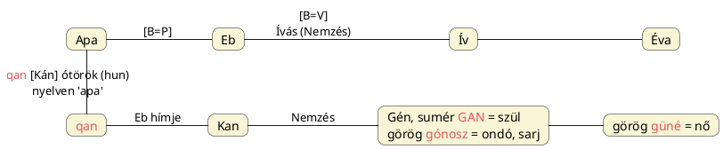

---
{"dg-publish":true,"permalink":"/G/Gene/","title":"Gene","tags":["Englishtexttranslated","containstransclusions"],"created":"2025-03-05T02:31","updated":"2025-06-07T23:01"}
---

# Gene

Gén. Lásd [[G/Geny\|geny]].  

#### Magyar Adorján...

...írja ([[K/KAN#KAN folyadéknemű, örökítő anyag jelentése\|KAN folyadéknemű, örökítő anyag jelentése]] cím/alcímnél is beágyazásra került):  
> Ugyanezen gyan, gyon szótövünknek azonban még felhangos kiejtése is volt, amely a mai jön, jönni, jő, jőni igénkben is fönnmaradott, és amelynek tájszólásokban gyön, gyűn, gyönni, gyünni alakjai is élnek, és mind amely szavak egyrészt a termékenyítő ondó kifolyására s a nemzésre, de másrészt minden kifolyásra, ki származásra és eredetre, eredésre is vonatkoztatva azután a nőre is mint szülőre, azaz tehát szintén nemzőre, is alkalmaztattak. Hozzáteendő ezekhez, hogy jenő, gyenő valamint a Jenő személynév értelme is nemző, azaz eredő, származtató volt, ami a görög és latin `genezisz`, `gente`, `geino`, `gono`, `genus`, `genero` szavak eredetét is képezte, amelyek értelme szintén, nemzés, szülés, kiszármazás, eredtetés; csakhogy e nyelvekben mind e szavak legrégibb értelme: a folyás, kifolyás jelentés már nincsen meg.  { #111b08}

Kiss Dénes is felveti: [[I/Idegen\|idegen]] szavunk is az "ide jön" fogalommal függ össze?  
  

Götz László Keleten kél a Nap című könyvének 162-164. oldalain található görög és héber szavakat hasonlító szószedetében találjuk a görög `gennao` = teremt, gyárt ige mellé téve a héber `ķana` = teremt, gyárt igét. Ez utóbbi nem annyira a könny, hanem inkább az imént említett [[K/KAN#KAN folyadéknemű, örökítő anyag jelentése\|KAN folyadéknemű, örökítő anyag jelentése]] és a [[K/Kutyanemzés#Kan teremtői képessége – nyelvészeti kapcsolat\|kan teremtői képessége – nyelvészeti kapcsolat]] cím/alcímnél írottak irányába tereli gondolatainkat.  

Lásd még ott az észak-kurd `gan` = baszni (lásd [itt](https://en.wiktionary.org/wiki/gan#Northern_Kurdish)) és mandarin-kínai `gàn` = cseszni, baszni (megcsinálni) szavakat.  

A teremt a nemz és nem fogalmával és így a görög `geneá` = születés; rassz; generáció szóval és a mellé tehető, Götz László által másutt megadott sumér `GAN` = szül szóval hozható kapcsolatba.  
- [[K/KAN#Könny/Geny/KAN nemzés/nemzettség\|Könny/Geny/KAN nemzés/nemzettség]] cím/alcímnél is említésre került a [[H/Halcyon\|halcyon]] eredetvizsgálatában említett görög `kyōn` = fogantatás szó, mely szóalak "rendesen" kutyát jelentene.

A sumér szó kapcsán jegyezzük meg, hogy a [[N/Nevel és növel\|nevel és növel]] címnél is taglalt szülő ma is lehet anya és apa, és hogy van ilyen jelentésű szó: az ótörök `qan`/[[K/Kán\|kán]] = apa jelentésű. Apa az lehet, aki már nemzett gyermeket.  
Ezzel a K-N (G-N) vázú szavak párhuzamba állíthatók az egymás [[F/Flexió\|flexiós]] változataiként értékelhető [[A/Apa\|Apa]]/[[E/EB\|Eb]]/[[I/Ív\|Ív]] szavakkal, egyúttal rámutatva az eredeti magyar teremtőgyökökre:
{ #3c6s0u}

- Az Eb/Kan szavakat első helyre is lehetett volna tenni.
- Ha valaki kételkedne az eb és ív szavak összetartozandóságában, csak jelzem, hogy a görög `skolios` = görbe szónak megfelel a kutyát jelentő görög [[S/Szkílosz\|szkílosz]]: ahol az [[I/Ív\|ív]]/[[I/Íj\|íj]], ott a Kutya.
{ #eeeksm}

- Azt is jegyezzük meg, hogy a sumér `GAN` szónak és a [[N/Nevel és növel\|nevel és növel]] címnél taglalt indoeurópai megfelelőinek (én itt a diagramban csak a mindenki által ismert gén szóval egyszerűsítettem, de a [[G/Geny\|geny]] és [[K/Könny\|könny]] szavak is odatehetők lehettek volna) tisztán látható párja a görög `güné` = nő (mondhatjuk: a szülésre termett), azaz a másik oldalról női kapcsolatot is fel lehetett venni. Az [[I/Ív\|ív]] (görbe, kör) pedig nőiség is, mely szóelemet [[E/Éva\|Éva]] nevében is megtaláljuk.

Ergo a szó a sumér szóhoz ugyanúgy passzol, mint ahhoz a téridőbeli összefüggéshez, melyet Esra Dur AKA Supplex nevű török lánynak is pedzegettem [ezen](https://qr.ae/pvbODD) Quora válaszom kommentjeiben:  

<a class="markdown-embed-link" href="/K/Kagán/#wwf26" aria-label="Open link"><svg xmlns="http://www.w3.org/2000/svg" width="24" height="24" viewBox="0 0 24 24" fill="none" stroke="currentColor" stroke-width="2" stroke-linecap="round" stroke-linejoin="round" class="svg-icon lucide-link"><path d="M10 13a5 5 0 0 0 7.54.54l3-3a5 5 0 0 0-7.07-7.07l-1.72 1.71"></path><path d="M14 11a5 5 0 0 0-7.54-.54l-3 3a5 5 0 0 0 7.07 7.07l1.71-1.71"></path></svg></a>

> Yes, but the origin of connotative associations are lost on most people/linguists. The Dog star's position is important here (when the Sun, the male principle is strongest; hence also Turkic `Kagan` = strongest of all males: makes him fit to be a leader of them, Old Turkic `qan` = father (= who has already begotten offspring); from Magyar `Kan` = Male Dog (its position on the ecliptic that's important here); Old Egyptian `Cahen` = Dog Star) (Kan ~ Hun).  
> —  
> Igen, de a legtöbb ember/nyelvész számára a konnotatív asszociációk eredete ismeretlen. A Kutya csillag helyzete fontos itt (amikor a Nap, a hím princípium a legerősebb; ezért is török `Kagan` = legerősebb a hímek közül: alkalmassá teszi arra, hogy vezetőjük legyen, ótörök `qan` = apa (= aki már utódokat nemzett); a magyar `Kan` = Hím Kutya (itt az ekliptikához viszonyított helyzete fontos); óegyiptomi `Cahen` = Kutya csillag) (Kan ~ Hun). 

- A hím az aki ad; innen válhat érthetővé az oromo `kennuu` = ad szó is.

[[N/NU#Nu sumér/szumér jelentései\|Nu sumér/szumér jelentései]] cím/alcímnél szintén szó esett a nemzésről, szülőről.  
Lásd még [[G/Gonosz\|gonosz]] vonalon [[E/Epigon\|epigon]] szónál írottakat.  