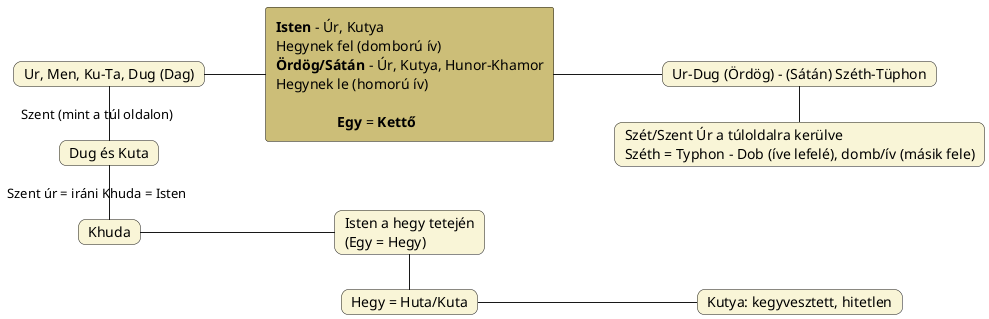

---
{"dg-publish":true,"permalink":"/G/God/","title":"God","tags":["containstransclusions","Englishtexttranslated","containscallouts"],"created":"2026-03-23T23:27","updated":"2026-04-03T20:15"}
---

# God

A germán nyelvek istent jelentő szavai (`Gott`, `God`, stb.) megint olyanok, amelyek szerepelnek a [[N/Nyelvészet mint tudomány#^v2ht0g\|200+ alapszóban]]. Tehát fontos, hogy megfelelően legyenek rendezve. Úgy tűnik, ennek itt sem sikerült megfelelni.  
A nyelvészet számára az isten jelentésű szó nem kiemelt jelentőségű. Sőt, szemszögükből ez is egy szó a többi közül, és a munkaköri leírásuk nem engedi meg az isten szóval kivételezzenek.  
Itt is a probléma kikerülésére szakosodtak és önkényesen jártak el. Sőt, mondhatjuk, hogy loptak. A germán nép nem lopott, örökölt, de amikor a nyelvész kezébe veszi a vizsgált dolgot, már úgy elemzi, mint valamit, ami mindig is az övé volt, de mivel nem tudja, mi végről való a dolog, gőgjében lyukra fut az elemzéssel: félreértékeli.  
> [!fail] &nbsp;
> Mint az, aki bilit talál, és koronaként a fejére teszi. Illetve itt fordítva történt: egy szakrális dologba piszkított bele.

> [!hint] &nbsp;
> Az alábbiak a [[G/Good\|good]] címmel együtt olvasandók.

## Hivatalos eljárásmód

Nézzük, mi szerepel a hivatalos litániában. Ahogy [[G/Good\|good]] helyen is elhangzott, a `God` = Isten és `good` = jó szavak etimológiai kapcsolatát [[N/Népetimológia\|népetimológia]] címén kizárják, God → good irányban és fordítva is.  
Az [Etymonline](https://www.etymonline.com/word/god) írja erről:  
> A népi etimológia régóta a `good` szóból eredezteti a `God` szót; ám az alakok összehasonlítása ... tévedésnek mutatja ezt. Sőt, a jóság fogalma nem szembetűnő a pogány istenfogalomban, és magában a `good` szóban is az erkölcsi jelentés viszonylag késői. \[Century Dictionary, 1897\]  

Ugyanezen weboldalon találjuk ezt a véleményt is:  
> Eredetileg semleges nemű főnév volt a germán nyelvekben; a neme hímneműre változott a kereszténység eljövetele után. Az óangol `god` valószínűleg közelebb állt jelentésében a latin `numen`-hez. Egy jobb szó a `deus` fordítására talán a proto-germán _*ansuz_ lehetett volna, de ezt csak a germán vallás legmagasabb rangú istenségeire használták, nem pedig idegen istenekre, és soha nem használták a keresztény Istenre. Angolul főként az _Os-_ előtaggal kezdődő személynevekben maradt fenn.
{ #hzr24a}

- Pl. Oswald, Oswin.

> [!hint] &nbsp;
> Egy [Wiki oldalt](https://en.wikipedia.org/wiki/God_(word)) is szenteltek a God szónak.

A magyarázat szerint amikor a germán népek felvették a kereszténységet, a misszionáriusok szándékosan kerülték az óangolban ismert `os` (az \*ansuz nyomán) kifejezést, mert az túl szorosan kötődött a pogány panteon konkrét alakjaihoz (az Ász-istenekhez).  

Megoldás: elkezdeni használni egy `god` szót a keresztény istenre, amelynek nem ismerik eredetét, így kitalálnak rá egyet (kettőt, mert a "megidézett" fogalomból való kiindulás mellett egy "akinek italáldozatot mutatnak be" levezetéssel is próbálkoznak).  
- Julius Pokorny az indoeurópai \*ǵheu- gyököt adja meg, amely két irányba ágazik el: az egyik az "önteni" (görög `χέω` (`khéō`); lásd [itt](https://en.wiktionary.org/wiki/%CF%87%CE%AD%CF%89)), a másik a "hívni" (szanszkrit `ह्वय॑ति` (`hváyati`); lásd [itt](https://en.wiktionary.org/wiki/%E0%A4%B9%E0%A5%8D%E0%A4%B5%E0%A4%AF%E0%A4%A4%E0%A4%BF#Sanskrit)).

Mivel az azonos alakú iráni [[K/Khuda\|Khoda]] = úr, isten névnek más, saját gyártású levezetése van, ezzel nem törődnek...  
- CzF `csoda` címénél ennek ellenére azt írja, hogy az ő idejükben még ez gyakorlat volt:   
> Figyelmet érdemlőnek tartják, hogy a persa nyelvben `khoda` istent jelent, melylyel rokonítják némely nyelvészek a német `Gott` szót is.; de `khod` törzs a persában, azt jelenti: önmaga.  

...de azért az indo-iráni nyelvi környezetből mégis kiválasztanak egy szót: egy Indrára használt szanszkrit `hūta` = megidézett szóval való rokonítási megoldás mégis jól cseng a szakmában (biz. Walshe nyomán).  

## Kritika

Ahogy jól cseng behozni a [[N/Numen\|numen]] fogalmát is, mert minden magasrendű indoeurópai gondolat megfér néhány bekezdésben, csakhogy:  
Már maga a `numen` gyöke is finnugor-sumér eredetet mutat, ahogy az óangol `os` = isten is `ős` szavunknak felel (márpedig az első ős = Isten, mely nevünk előtagjába is beleképzelhetjük), és akkor itt van még a K-T, G-D vázú szavak hatalmas csoportja, mely szintén túlmutat holmi mesterségesen létrehozott [[I/Indo-európai nyelvcsalád\|indoeurópai nyelvcsalád]]on.  

### Milyen isten a germán isten?

A nyelvészet ügyelt arra, hogy az istenfogalmat definiálja (abban igaza van, hogy egyes esetekben a szavak szellemet is jelenthetnek, az indoeurópainak nevezett kultúrkörön kívül is), de csak két halmazt vett számításba:  
- ógermán pogány isten;
- kereszténység felvételekor használt isten.

Azzal nem számol, hogy a(z amúgy hun gyökerű) régi germánoknál ez az isten holdisten vagy valami más, esetleg korábbi felfogáshoz tartozó csillagkép/Tejút istenség lehetett.  
> [!check] &nbsp;
> Az indoeurópai nyelvészet ugyanazt a célt tűzte ki, mint az intézményes vallások és a kommunizmus: a korábbi rétegekhez tartozó ismereteket el kell feledni, le kell fedni.

A nyelvészet tehát tiszta lappal indít, csak az új, mesterséges vizsgálati környezetben elérhető adatokra támaszkodik. Ebbe nem fér bele korábbi, magasabb rendű népek gondolatrendszere (a történelemtudomány persze cáfolja, hogy régebben magasabb rangú népek és felfogás uralkodott). Elzárják magukat az igazságtól és hamisságot közvetítenek, büntetlenül.  
(Megjegyzés: tehát ha lentebb türk, hurri és más népeknél megtalálható szóalakokat hozunk fel rokonításként, az nem azt jelenti, hogy azok nem voltak meg korábbi rétegekben.)  

## Ötletelés

Kezdjük ott, hogy nagyon kiterjedt a rokon alakú szavak csoportja, amelyek közül válogatni lehet, de ez is csak azért van, mert [[C/Csillagvallás\|csillagvallás]]ból [[N/Napvallás\|napvallás]]okba történő váltások során vallások változatai jelennek meg az évezredek során.  

A [[C/Csuda\|csuda]] lehet a csillagos égre mutató, ahol egy Tejútistennő (akár [[T/Tejútanya állatalakjai\|állatalakja]]) mutatkozhat meg (vö. [[G/Göd\|Göd]]) és lehet szó a hasonló alakú [[Z/Zsidó\|zsidó]] név kapcsán is taglalt világos és sötét térfelek elválasztó pontjáról is, ahol még a kettő = egy (mely `egy` szavunkról lesz szó alant). (De öt = egy azonosságról is volt szó [[N/Négy#Négy és az ötödik irány\|másutt]].)  
Az tény, hogy az iráni [[K/Khuda\|Khoda]] kapcsán rögtön a [[K/Kutya\|kutya]] jut eszünkbe, hiszen a kutya az ókori Iránban hatalmas tiszteletnek örvendett. A `tisztel` szinonímája a [[K/Kudos\|kudos]] helyen is előjövő [[H/Hódol\|hódol]], mely ismét ilyen H-D szóvázú.  
- Szintén ott előjött a perzsa `kudrat` = hatalom szó, melyben szintén megvan ez a \*kud- gyök/előtag.

Tehát pusztán a magyar nyelvből okoskodva is féltucatra rúg majd azon szavak száma, amik megfelelnek.  
> [!important] &nbsp;
> Számunkra – ahogy más esetben is – az a lényeg, hogy többet tudjuk meg őseink felfogásáról, szóalkotó készségéről.
- Egy szóra rábökni, hogy "ez az eredete," szinte lehetetlen.

### K/G/H- előhangos forma

(Egyúttal a J/Dzs/Zs/Cs/S/Sz- előhangos változatokkal is lehet számolni, mivel a [[K/Kentum-szatem szabály\|kentum-szatem szabály]] nem csak az indoeurópai nyelvekre vonatkozhat. Ezen formákra csak érintőleg térek ki.)  

#### Jó

Isten állandó "jó" jelzője kapcsán [[G/Good\|good]] címnél elhangzott, hogy több nyelvben istennevet adott. Lehet, hogy az indoeurópai-germán nyelvekben is ez történt?  
Nos, a szent szellem fogalmában kereshető hurri `kuta` = szent szó közel állhat a jó alapjelentéséhez, amennyiben egy horizontális jó-rossz pár feletti jóról van szó. Lásd még [[G/God#Tűz, szellem jelentéskör\|tűz, szellem jelentéskör]] alcímnél taglalt rokon szavakat.  

#### Csuda

Az imént CzF adata kapcsán is előkerülő [[C/Csuda\|csuda]] az ég fogalmának felel meg, amit az is mutat, hogy a [[S/Süt\|süt]] alaki változatát kell lássuk benne, de ezen alak meglehetett k-előhangos formában is.  
Persze, az indoeurópai nyelvészet nem fog egy (amúgy szláv eredetre visszavezetett) magyar szót előkotorni, de csak jelzem, hogy más esetben is láttuk, hogy az [[E/Ég\|ég]] szó vagy ilyen jelentésű szó egyes nyelvekben az isten jelentésű nevet is kiadta (pl. kínai `tien`).  
> [!|noincon]- Google Gemini válasz *Istennevek mint "magasabb szellemi entitások"* témában
> A latin `numen` (isteni akarat/hatalom) analógiájára több indoeurópai példát is ismerünk, ahol az isten megnevezése nem személynév, hanem egy absztrakt hatalomra vagy funkcióra utal:  
> Dyeus Phter (Égi Atya): Ez a legismertebb PIE (proto-indoeurópai) rekonstrukció, ahol a név a "fényes nappali égboltból" származik (\*dyeu- = fényesnek lenni). Itt az isten maga a megtestesült égi világosság.  
> Asura/Ahura: Az indoiráni hagyományban ez a kifejezés eredetileg "urat" vagy "hatalmas szellemet" jelentett (gyökere az \*asu- = életerő, lélek), és csak később vált konkrét istencsoport vagy főisten (Ahura Mazda) nevévé. Ez közeli rokona az óangol `os` (ógermán \*ansuz) alaknak.  
> Bhága: A szanszkritban és a szláv nyelvekben (`bog`) az isten neve a "szétosztó" vagy "szerencsét adó" jelentésből ered. Itt az istenség egy gazdasági-spirituális funkció (a sors kiosztása) absztrakciója.  
> Xratu (Aveszta): Bár nem vált közvetlen istennévvé, a numenhez hasonlóan egy "szellemi erőt" vagy "értelmet" jelölt, amely az isteni tevékenység alapja. 
> A germán god tehát ebbe a sorba illeszkedik: nem egy személynevet, hanem egy rituális státuszt ("akit hívnak/akinek áldoznak") jelölt, mielőtt a kereszténység tulajdonnévvé emelte volna.  

#### Holdisten

A germán istent jelentő szó holdistenre utalhat. Ha a magyar [[H/Hold\|hold]] szavunkból eltávolítjuk az [[L/L#L vendéghang\|l vendéghang]]ot, már közel járunk. [[G/GUD\|GUD]] és [[H/HUD\|HUD]] címnél szó volt fényességről, elsősorban Hold kapcsán (utóbbi címnél szubar adattal).  

Ezen formák már az alant bővebben taglalt [[K/Kutya\|kutya]] formának is megfelelnek, amely a [[S/Sötét oldal\|sötét félév]]et nyitó liminális jelképállat, és a `zsidó` név elemzése kapcsán ugyanúgy szóba került. A holdnak viszont leginkább a napi időciklusban van szerepe és nekünk tágítani kell a vizsgálatot az évkörre, ahol a Tejút sávja mellett álló Kutya nagyobb szerepet kap. 

Götz László Keleten kél a Nap című könyvének 174-175. oldalán a német `Gott` nevet a sumér [[G/GUD\|GUD]] = bika, erős, hős szóból vezeti le (meggyőzően, mivel más nyelvekben is kimutat hasonló összefüggéseket; lásd passzusát [[S/Szarv\|szarv]]).  
Nem kizárt, hogy ennyire egyszerű magyarázata legyen, viszont a germánoknál nemcsak holdtisztelő népek léteztek és a Bika nappal kapcsolatos magyarázata abban állna csak, hogy a [[H/Halak korszak\|Halak-korszak]] előtti Kos korszak előtti Bika korszakban tisztelhették a Bikát, holdszarvaktól függetlenül.  

> [!info] &nbsp;
> A [[H/Holdtisztelet\|holdtisztelő]] hunokkal szemben ismerjük a [[N/Napvallás\|naptisztelő]], ún. avar hunokat is. A germán nyelvek fontos szavai (fiú, tűz, égni, kenyér, madár, stb.; lásd [[B/Barát\|barát]]) avar-hun szókincset rejtenek, de más rétegből holdtiszteletre utaló jeleket is felmutathatunk (lásd pl. `abend` kapcsán is [[H/Holnap\|holnap]], [[M/Morrow\|morrow]]).  

#### Kovácsisten

Hajlani kell arra, hogy a Holdra vonatkozó fogalom (sötét, holt, halott) eredetét az éves időkörben követett (relatív) napjárás [[S/Sötét oldal\|sötét félév]]re vonatkozó fogalmából vegyük, azaz a holdisten koncepció egy isteni teremtő erőnek segédkező ördög/sátán fogalomba tartozó [[I/Istenek – kézművesistenek\|kézművesisten]]/[[K/Kovács\|kovácsisten]] fogalomra vezethető vissza.  
> [!check] &nbsp;
> Tudjuk, hogy az ördög a [[D/Dualisztikus eredetmagyarázó mondák\|dualisztikus eredetmagyarázó mondák]]ban az Isten társa a teremtésben.

Nem volt tervben, hogy a germán istent jelentő szót közvetlenül vagy közvetetten az ördöggel azonosítsam, de nem kizárt, hogy a mögöttes, számunkra már ismeretlen felfogásban **egy démiurgosz féle teremtő** ilyen nevét kell keresni.  
> [!example] &nbsp;
> Annál is inkább, mert a [[M/Magor\|Magor]] napnévből eredő germán `Makar`/`Maker` = teremtő nevek a napvallások kialakulásának idején kerültek használatba ilyen jelentésekkel, azaz ez a "mögöttes, ismeretlen felfogás" mégis megközelíthető évköri eredetre való visszavezetés kísérletében.

#### Magyar Adorján Ősműveltség...  

...című könyvében is lám, felkapta a témát és érvelése, mint oly sokszor, elfogadható:  
> Ellenben meg kell itt említenem a magyar `guta` szót, amely szintén a kún szócsoportba illik, habár benne ma a k hang helyett már lágyult g hang van. Miután azonban ma is azt mondjuk, hogy „megütötte a guta” és „gutaütéses”, meg „guta ütött ember”-ről beszélünk, és miután az olaszban és a németben „il colpo” és „der Schlag” bár szó szerint csak annyi mint „az ütés”, de ugyane szavak nevezik meg a gutát is, ennélfogva úgy képzelem, hogy a Guta, azaz eredetileg bizonyára **Kuta tulajdonképpen a kalapácsos kovácsságot és a kalapácsot magát is megszemélyesítő istenség egyik kún neve volt**.  
> Tény, hogy a guta, vagyis a kuta szó közvetlen rokona `kő` vagy régiesen kú szavunkkal, de rokon ugyanígy az [[U/Üt\|üt]] szavunkkal is, valamint összefüggésbe hozható az ékkel is, csakhogy ezúttal a fekete-kunok kegyetlen ékével és tehát az ütő kalapáccsal.
{ #qxpc6u}

- A [[K/Kovács\|kovács]]isten Orion, aki szoros összeköttetésben van a Kutyacsillag Szíriusszal (ahogy [[H/Hunter\|hunter]]/[[H/Hunor\|Hunor]]/[[I/Íj csillagkép\|Íj csillagkép]] és [[M/Magyar istencsalád\|magyar istencsalád]] címnél láttuk).
- Lejjebb, [[G/God#Üt\|üt]] helyen bemutatunk más előhangos szavakat is.
- Nem mellesleg, ez a `colpo` és elődei nem éppen [[K/Kalapács\|kalapács]] szavunknak felelnek meg?

[[J/Júda\|Júda]] címnél is szerepelt évekkel ezelőtt:  
> [!example] &nbsp;
> Akkor azt is észre kell venni – akár a [[S/Szemiták és árják\|szemiták és árják]] címnél írottak folytatásaként is lehet kezelni –, hogy ami az avarokból lett germánoknál **God**, az az avarokból, héberekből menet közben szemitává lett zsidóknál **Jud**/**Juda**, vélhetően közös eredetre visszavezethetően (ergo Juda nem annyira törzs neve, mint a törzs nevét adó isten-fogalom).  

A [[K/Kovács és a kutya\|kovács és a kutya]] címnél is említett perui [[V/Virakocsa\|Virakocsa]] kézműves-istennévben is egy teljesen hasonló Kocsa/Kucsa nevezet van meg.  

Az [[O/Ördög#Ördög mint tűzisten\|ördög]] címnél is szereplő diagram ide is betehető:  

<a class="markdown-embed-link" href="/S/Szakrális geometria/#ovbsl7" aria-label="Open link"><svg xmlns="http://www.w3.org/2000/svg" width="24" height="24" viewBox="0 0 24 24" fill="none" stroke="currentColor" stroke-width="2" stroke-linecap="round" stroke-linejoin="round" class="svg-icon lucide-link"><path d="M10 13a5 5 0 0 0 7.54.54l3-3a5 5 0 0 0-7.07-7.07l-1.72 1.71"></path><path d="M14 11a5 5 0 0 0-7.54-.54l-3 3a5 5 0 0 0 7.07 7.07l1.71-1.71"></path></svg></a>

#### Nyári napfordulós úr/isten

(Már a kovácsisten is az, de itt másról lesz szó. Az `úr` szónak azért van jelentősége, mert kiemelkedést, hegyet is jelent.)  

Arról [[P/Poláris-szoláris átállás\|poláris-szoláris átállás]] helyen és [ezen](https://www.youtube.com/watch?v=8a6z6l_VOYg&t=3854) Nostratic Echoes c. videóban is volt szó, hogy a polárisról szolárisra átálló újabb felfogás szerint isten lakóhelye átkerült a Sarkcsillagból (lásd témát még [[A/Anu\|Anu]]) a másik magasnak képzelt pontba, a [[N/Nyári napforduló\|nyári napforduló]]s téridőbeli helyre.  
Ennek a helynek a neve lehet [[K/Kutya\|Ku-Ta]], mely a `kutya` és a `hegy` szavakat is alkotja (a Kő-Táj összetételben gondolkodás nem szerencsés). Láttuk már [[E/El Shaddai\|El Shaddai]] kapcsán is, hogy egy hasonló szóvázú, s-előhangos forma ott is hegy jelentéssel jelent meg.  

A hegy csúcsa az ekliptikán a nyári napforduló, amikor a Nagy Kutya csillagképben jár a Nap. Ez a felső pont az a szent hely, amikor a napvallásnak hódoló népek a Nap legmagasabb állását ünnepelték.  
Az első gondolatom tehát már régen is az volt, hogy az iráni [[K/Kutyahitű\|kutyatisztelet]] (lásd még [[K/Kutya Iránban\|kutya Iránban]]) hozza létre a [[K/Khuda\|Khuda]] istennevet, mely egyenes folytatása lett volna a germán `Gott`, `God` forma. Azóta viszont sok új adat jött be az évek során, de talán ez a legjobb magyarázat maradt. Azaz ha a [[K/KAN\|Kan]] név terjedt volna el, akkor ilyen alakú istennév is fennmaradhatott volna.  

#### Téli napfordulós összefüggés

Ahogy több helyen említésre került, a csillagászati és főleg asztrológiai hagyomány a szemközti csillagjegyeket összekapcsolta; ezért fordulhat elő, hogy hasonló nevek megjelenhetnek nyári és téli napfordulóra utalva (pl. latin `venator` = vadász – latin `venter` = has; előbbi Nimródra, utóbbi a Tejútanya méhére utalhat).  
[[C/Coot\|Coot]] és más helyeken K-T és rokon vázú vagina jelentésű szavakat láttuk.  
[[G/God#Tejútistennő, szakrális geometria\|Tejútistennő, szakrális geometria]] helyen folytatjuk a témát.  
> [!hint] &nbsp;
> Ott már nem a téli napfordulós ház = méh(száj) = vulva összefüggésre koncentrálunk, hanem arra, hogy maga a teljes Tejútrendszer (az anya) egy ház, a [[N/Nap háza\|Nap háza]], ahol a Nap él.  
- Az kétségtelen, hogy a legnagyobb ünnep a nap megszületése (feltámadása).

> [!check] &nbsp;
> Vegyük észre, az ősvallási alapképletben mindig a Napot vették figyelembe és annak helyzete, a napot jelentő szavak szekunder és tercier jelentései meghatározók arra nézve, hogy hogy kell egy `God` vagy `good` szóval foglalkozni, de ezek a mesterségesen létrehozott nyelvcsaládokban gondolkodók érdekszféráján kívül eső dolgok.

#### Tűz, szellem jelentéskör

Tulajdonképpen a [[G/God#Nyári napfordulós úr/isten\|nyári napfordulós úr/isten]] pont egy másik változatának tekinthető megoldás ez, de már [[G/God#Jó\|jó]] helyen is kitértünk rá.  
Ezen az imént taglalt felső téridőbeli helyen (a [[K/Kutya\|Kutya]] állásban) a legerősebb a Nap tüze. Felvetődik a kérdés? Jelent-e tüzet K-T vagy rokon vázú szó más nyelvben?  
Igen, [[K/Kut\|kut]] és más helyeken azték szavakról volt szó és a [[C/Canicular\|kánikula]] fogalma mögött is az van meg, hogy amikor a Nap a Kutyacsillaghoz ér, nagy a hő (vö. [[H/Hot\|hot]] = [[H/Huta\|huta]], Ku-Ta) leadás.  

Sőt, egyes nyelvekben életerőt, lelket is jelenthet és a lélek az isten teremtése során a Nagy Szellemből kerül az emberbe.  
Az ókínai `kut` = lélek, török `kut` = életető, lélek; legitimációs hatalom jelentésekkel megadott szó nyomán belső fejlődéssel vagy inkább korábbi rétegből emelkednek ki rokon szavak: ótörök `köt` = magas, emelkedett, török `güç` = erő, hatalom szó.  
Mindben közös, hogy nem véletlenül lett a csúcsával felfelé álló háromszög a tűz és a levegő alkímiai jele: a tűz felfelé terjed és a legmagasabb nyári napfordulós ponton a legnagyobb erejű a Nap.  
Több helyen volt erről a témáról szó: lásd pl. [[G/Góc\|góc]].  

A `kutya` alakú, lélekkel, lélekerővel ill. életerővel, lélegzettel kapcsolatba hozható [[G/Guta\|guta]], [[K/Kut\|kut]], [[G/Gőz\|gőz]] és hasonló kifejezések kapcsán egyre erősebbé vált bennem a gyanú, hogy a germán `Gott`/`God` a [[K/Kut\|kut]] = tűz; élet-lélek fogalmához tartható, tehát nem a [[K/Kutya\|kutya]] lesz a közvetlen kiinduló.   
`Kut` lényegében ugyanannak felel meg a hun-türköknél, mint a mi `Isten` nevünkben megtalálható [[I/Íz\|íz]]/[[I/Isa\|isa]] (lásd [[L/Lélek#Isa, por és hamu\|isa, por és hamu]] cím/alcímnél). A [[P/Psychopomp\|lélekvezető]] kutya ezt a lelket kíséri vissza istenhez, a Tejútra.  

A megoldást az rejti és egyben nehezíti, hogy a szavak alapértelmét tekintve a kut és a kuta/kutya is ugyanazt jelenti: tüzet, melyből a lélek szavát képezték, mely lélek a [[G/Göd\|Göd]]-Tejútanyától való (minden csillag az égen egy ember lelkének otthona), mely [[T/Tejútanya\|Tejútanya]] egy csillagba sűrített önvalója az a Kutyacsillag [[S/Szíriusz\|Szíriusz]], mely pszükhopomposzként (tellurikusan is) az isteni lelket vezeti vissza Istenhez/Göd-God-hoz, kitől a lélek maga is való. Ez egy körfolyamat és lehetetlen egyetlen szóra rábökni, hogy na, ez az eredete. Minden oldaláról fell kell tárni és csak az ősi vallási képzetek pontos ismerete segíthet ebben.  
> [!important] &nbsp;
> Megfordítva: a (magyar és idegen) szavak segítenek a [[M/Magyar ősvallás\|magyar ősvallás]] képzeteinek felderítésében.

[[S/Szellem#Szellem mint isten illetve isteni megnyilvánulás\|Szellem mint isten illetve isteni megnyilvánulás]] cím/alcímnél is írtuk:  
Már az [[I/Idő\|idő]], [[H/HAN\|HAN]] és [[M/Medve\|medve]] címnél taglalt lakota istenek ill. szellemek (lásd [itt](https://en.m.wikipedia.org/wiki/List_of_Lakota_mythological_figures)) kapcsán is megállapítottuk, hogy a szellem alatt (kis)istent, isteni megnyilvánulást kell érteni.  

#### Isten(re, teremtésre vonatkozó) fogalom -Ta szótag nélkül

Ha a szóvégi -Ta lecsípésre került, akkor [[H/HU\|HU]] és [[K/KU\|KU]] neveken is futhatott volna, mint amilyen formákat éppen találunk is istenségek neveiben.  

###### Brit nyelv

#### Acharia S Suns of God...

...című könyvének adata szerint az ősi britonok Napistenének neve **Hu** volt. Másutt arról szól, hogy a pre-keresztény írek egyik istene, a Fény Istene, neve is Hu \[lásd [[H/Hu Gadarn\|Hu Gadarn]]\] volt:  

<a class="markdown-embed-link" href="/H/HU/#o58mbn" aria-label="Open link"><svg xmlns="http://www.w3.org/2000/svg" width="24" height="24" viewBox="0 0 24 24" fill="none" stroke="currentColor" stroke-width="2" stroke-linecap="round" stroke-linejoin="round" class="svg-icon lucide-link"><path d="M10 13a5 5 0 0 0 7.54.54l3-3a5 5 0 0 0-7.07-7.07l-1.72 1.71"></path><path d="M14 11a5 5 0 0 0-7.54-.54l-3 3a5 5 0 0 0 7.07 7.07l1.71-1.71"></path></svg></a>

> "\[Hu\] died on the cross at the equinox, descending to the southern hemisphere and was re-born at Christmas, when rising toward the Northern summer."  
> —  
> "\[Hu\] kereszten halt meg a napéjegyenlőség idején, leereszkedett a déli féltekére, és karácsonykor született újjá, amikor a nyár felé emelkedett az északi féltekén." 

###### Maja nyelv

A hivatalos nyelvtudomány is megerősíti, hogy a maja nyelvben `k'uh` jelentése isten.  

<a class="markdown-embed-link" href="/K/KU/#752py6" aria-label="Open link"><svg xmlns="http://www.w3.org/2000/svg" width="24" height="24" viewBox="0 0 24 24" fill="none" stroke="currentColor" stroke-width="2" stroke-linecap="round" stroke-linejoin="round" class="svg-icon lucide-link"><path d="M10 13a5 5 0 0 0 7.54.54l3-3a5 5 0 0 0-7.07-7.07l-1.72 1.71"></path><path d="M14 11a5 5 0 0 0-7.54-.54l-3 3a5 5 0 0 0 7.07 7.07l1.71-1.71"></path></svg></a>

- Kuh volt Teotihuacan ill. Mexikóváros elődjének, eredeti maja neve is, így jelentése kiterjedtebb (az egyiptomi piramis ilyen alakú nevét Magyar Adorjántól ismerjük; a perzsában és más indo-iráni nyelvekben pedig – a gúla/piramis geometriai alakjának is megfelelő – `kuh` = hegy, azaz Kuh lehet szakrális hely (egyszerűen `kő`) értelmű. 

###### Egyiptomi nyelv

A **kozmikus és teológiai fogalomként** létező `ḥw` (`hu`) az **„isteni kimondott szó”** vagy a **„teremtő felkiáltás”** fogalmát jelöli. Hu a teremtő isten (például Ré vagy Ptah) egyik segédje, aki az akarata kimondásával hozza létre a világot.
{ #53yaoq}

Véleményem szerint nincs kapcsolat a két nyelv szavai között: a majában a `kő` (föld) fogalmat keresném inkább, az óegyiptomiban pedig az alant többször említett szanszkrit `hū` szóban is fellelt [[H/Hív\|hív]] fogalmát.  

#### Logosz

##### A logosz-irányú levezetés hiánya és a nyelvészet profán megközelítésének aggályai

Megint az előző ponttal fogunk kapcsolni (vagy pontokkal, mert feljebb óegyiptomi vonalon volt már szó hasonlóról). 
Teljesen logikus, hogy a tűzzel és lélekkel kapcsolatos fogalom megjelenhet hang minőségben is. Ugyanis a beszéd a szellem kiáradása, a szellem és lélek pedig tűznek fogatott fel (a szag/illat is a lélekkel hozatott kapcsolatba). Nyilván itt most nem az emberi, hanem isteni beszéd témája fontosabb.  

> [!question] &nbsp;
> Felvetődik a kérdés, hogy ha már ennyire az indoeurópai nyelvi keretek között engedik meg magunknak a vizsgálódást, miért nem hozták szóba a [[L/Logosz\|logosz]]t, az [[I/Ige\|igé]]t?

Eric Partridge Origins c. könyvének god címszavánál említi az (ó)ír `guth` = (beszéd)hang szót (vö. a másutt talált ír `guta` = magánhangzó szóval), de nem fordítja meg a dolgot: mármint hogy nem az embernek kell istent szóval, imával megszólítani, hanem előbb istennek kellett volna a világot szóval, hanggal megteremteni.  

> [!example] &nbsp;
> Ha indoeurópai környezeten belül akartak volna maradni, a hindu [[V/Vach\|Vâch]] védikus hang/logosz-istennővel előhozakodhattak volna, csak akkor hogy magyarázzák meg, hogy egy nőiségből hogy lett semleges majd hímségi főnév (lásd [[G/God#^hzr24a\|fentebb]])?
- Vach-ról lásd még [[G/God#3\|lejjebb]].

A másik gond, hogy ez a szó sem eredeti germán, hiszen a [[G/Guta\|guta]] és több más címnél említett, Götz László Keleten kél a Nap című könyvében hozott sumér `gudu` = beszél, mond, megnevez ige éppen ilyen alakú.  

Természetesen a sumér (és a magyar) nyelvet már kiátkozták, ahogy a katolicizmus tette az arianizmussal és más keresztény ágakkal. Az a katolicizmus, amely politikai és nem spirituális hatalom. Ezt azért kell hangsúlyozni, mert a nyelvészek is profanitással gyanúsíthatók és több ízben azonosítottam a nyelvészeket istentagadó papságokból létrejött áltudósokként.  

**Mi történt itt?**  

Eric Partridge valóban összeköti a `god` szót az ír `guth` (hang) szóval, és ezzel egy olyan ősi indoeurópai gyökre "tapint rá" (\*gheu-), amely egyszerre jelent hívást és öntést (ő szerintük).  
A nyelvészek azért nem "fordítják meg" a dolgot (vagyis nem a Teremtő szavából vezetik le a szót jelentő szót), mert **a történeti nyelvészet módszertana nem a teológiai logikát, hanem a használati irányt követi**.  
1. Miért az emberi oldalról nézik?
A nyelvészet szerint a szavak jelentése a megfigyelhető rituáléból alakult ki.  
- A `guth` mint rituális hang: Az óír `guth` és az ősgermán `gudą` = isten közös gyöke azt sugallja, hogy az "isten" az a lény, akivel szemben az embernek hangot kell kiadnia (invokáció).
- Passzív szerkezet: A rekonstruált alak (\*ǵʰu-tó-m) nyelvtanilag befejezett melléknévi igenév, ami azt jelenti: "az, aki meg lett hívva". Ez azt feltételezi, hogy az akció az embertől indul az isten felé.

2. A teológiai fordulat (amiért igazunk lehet a megfordítással):
Bár a hivatalos etimológia "alulról felfelé" építkezik, a teológiai párhuzam (a hang/szó mint teremtő erő), több helyen is megjelenik:  
- Logosz-párhuzam: A kereszténységben a Logosz (Ige/Szó) az, ami által a világ lett. Amikor a germánok átvették a kereszténységet, a God szóba "belelátták" ezt a teremtő funkciót is.
- Lélegzet és Szellem: Az óangol `os` (ógermán \*ansuz) gyökere az asu- (életerő/lélegzet). Itt valóban megjelenik az az elképzelés, hogy az istenség az, aki "beleheli" az életet az emberbe.

3. Miért nem az ír `guta` a forrás?
Az ír `guta` (magánhangzó) egy későbbi, latin mintára (vocalis) alkotott kifejezés. Partridge inkább arra mutat rá, hogy a hang (`guth`) és az isten (`god`) fogalma az indoeurópai népeknél szorosan összefonódott: az istenség az a szféra, amellyel csak a Szent Hang (ima, áldozat, kántálás) útján lehet érintkezni.
Összegezve: A nyelvészek nem azért vetik el a "fentről lefelé" irányt, mert az logikátlan, hanem mert a szó nyelvtani alakja (a -to- képző) egy olyan "tárgyat" jelöl, amin végrehajtanak valamit (akit hívnak).

> [!fail] &nbsp;
> A nyelvészek tehát egy mesterségesen belelátott -to- képzőre alapoznak. Ha az összes G-T alakú szó egy korábbi formából került átvételre, akkor mindenféle képzővel való nyelvészkedés okafogyottá válik, de az ő világukban ezek germán, indoreurópai szavak. Minden más világ, minden más szóalkotó körülmény megszűnt számukra. 
> Ergo a természetesebb logosz-ból való kiindulással szembehelyezkedés egy önkényes képzőre lenne alapozva? Nem először mondom: istent, vagyis inkább sátánt játszanak.

A Google Gemini is beismeri, a történeti nyelvészet egyik legvitatottabb pontja éppen az, amikor a nyelvtani absztrakció (mint a -to- képző) felülírja a spirituális vagy logikai összefüggéseket.  
Nézzük meg ezt a "nyelvészeti szembehelyezkedést" két oldalról, hogy lássuk, hol feszül a hurok:
1. A „nyelvészeti furfang” védelme (a -to- képző mögötti logika)
A nyelvészek nem „belelátják” a képzőt, hanem **összehasonlító módszerrel következtetnek** rá. Az indoeurópai nyelvekben (szanszkrit, görög, latin) a -to- képző rendkívül stabil: ez hozza létre a befejezett melléknévi igeneveket (pl. latin `atus`, görög `tos`).  
- Mivel a germán god (gud) végén ott a -d/t hang, **a nyelvész kényszeresen keresi** annak funkcióját.
- Ha ez a -d egy képző, akkor a szó töve csak a gu- marad. Ez a gu- pedig az „önteni” vagy „hívni” jelentésű gyökökhöz vezet.
	- Jegyezzük meg, hogy azok sem indoeurópai gyökök lesznek, valószínűleg, mert mongolban vagy akárhol máshol megint meglehetnek (lásd pl. [[C/Cola\|cola]]).

2. A logosz-központú megközelítés/érv ereje
Ha elvetjük a képzőt és a szót egyetlen, oszthatatlan G-T / G-D egységnek tekintjük (ahogy az ír `guth` esetében is), akkor a kép eltolódik:  
- Átvétel elmélete: Ha a szó egy korábbi, közös forrásból (szubsztrátum nyelvből vagy egy ősi spirituális rétegből) származik, akkor a „megidézett” passzivitása helyett az aktív „hang” vagy „Szent Szó” kerül a középpontba.
- A teremtő aspektus: Ebben az esetben a God nem az, akit mi hívunk, hanem az, aki szól. Itt az isten nem a rituálé tárgya, hanem a megnyilatkozó hatalom.
	- Mint az egyiptomi Hu esetében láttuk.

Miért választották a nyelvészek mégis a „passzív” utat?  
> [!attention] &nbsp;
> **A modern nyelvészet a 19. században, a pozitivizmus idején vált tudománnyá. Akkoriban presztízskérdés volt, hogy az etimológiát mechanikus hangtörvényekre alapozzák, és módszeresen kiirtsanak belőle minden „misztikus” vagy „teológiai” magyarázatot.**
- A logosz-alapú magyarázatot túl „szépnek” és „spirituálisnak” találták ahhoz, hogy tudományosnak fogadják el.
- Inkább választották a „rituális öntözést” vagy a „meghívást”, mert **az a primitív emberi cselekvést tükrözte** szerintük, nem a transzcendens filozófiát.
	- Azaz sem a nyelvész, sem a teológus, fizikus, stb. nem nézi ki a régi emberből – még a kultúrprioritást kapó indogermánok őseleiből sem? –, hogy magasabb gondolati síkon, absztrakciókban alkossa ki szavait. *Akkor a Védákat kinek tulajdonítják?*

Összegezve: A -to- képző feltételezése egyfajta elvi gátat szab a jelentésnek. Ha levesszük ezt a szemüveget, a God szó sokkal közelebb kerül a teremtő „Ige” (Logos) koncepciójához, mint az áldozati ital öntögetéséhez.  

> [!check] &nbsp;
> Ami a nyelvészet kiinduló alapját jelenti – egy múlt idejű melléknévi igenevet feltételező proto-indoeurópai \*ǵʰu-tó-m alak –, at egy tetszőleges rekonstrukció. Az már a magyar nyelvben is megvan: a [[T/T#T (D) – múlt idő jele\|a múlt idő 't' jele]].
- [[K/Krisztus\|Krisztus]] nevének szótöve is t-re végződik; azt is egy "tetszőleges" ige múlt idejű melléknévi igeneveként értelmezik.
- Ezt a szenvedő dolgot másutt is alkalmazzák; lásd pl. [itt](https://en.wiktionary.org/wiki/%CF%87%CF%8D%CF%84%CF%81%CE%B1#Ancient_Greek): he original meaning was perhaps a "container of liquids (poured things)"; értsd: "öntött dolgok" kerülnek a fazékba, azaz az eszköz neve onnan származna, hogy valakik beleöntenek. Elképesztő logika, és mindezt megint azért, mert az egyébként a `ύδωρ` = víz szóval egészen megfelelő ógörög `χύτρα` = fazék, főzőedény szóban ismét van egy 't' hang és ők eldöntötték, hogy a [ǵʰew-](https://en.wiktionary.org/wiki/Reconstruction:Proto-Indo-European/%C7%B5%CA%B0ew-) PIE gyökre vezetik vissza.
{ #npeli1}

> [!check] &nbsp;
> Ami pedig a **Rigvéda 8.16.7** versszakában talált szanszkrit `puruhūta` = sokat idézett kifejezést illeti, ott a hivatalos levezetés szerint: a hūta- = megidézett eredete `hū` = hívni, mely szó megint megfelel a magyar [[H/Hív\|hív]] szónak, de ez az ige nem az, amit God szóban keresni kellene.  
- A szanszkrit szó tehát a fentebb említett óegyiptomi szóval szépen párosul.

Alant látni fogjuk, hogy itt nem múlt időről vagy szenvedő igealakról, és még csak nem is igéről van szó, hanem egy régmúltból fennmaradt szótagnyelvű összetételről.  

> [!question] &nbsp;
> Amúgy mit keres a szamoai nyelvben egy `gutu` = száj alak?  

#### Hit, híd, köt fogalmak

Már az is érdekes, hogy a logosz L-G váza megfelel a latin [[R/Religion\|religio]] = vallás szóból (akár Szent Ágostoni népetimológiás úton) is kialkotható `religare` = újra összekötni kifejezésben megtalálható, [[L/Ligneous\|ligneous]] címnél életfa (a latin `lignum` = faanyag, viszont az *arbor vitae* mellett a *lignum vitae* is jelenthet életfát) témájában bemutatott latin `ligare` = kötni ige L-G vázának.  
Ahogy az is, hogy a régi, meséinkből is visszaköszönő világkép égigérő fája hidat képez ember és az isten világa közt, és – népetimológia/ezotéria stigma veszélye ide vagy oda – , ennek szavak szintjén megmutatkozó kapcsolatát a `hit`, `híd` és `köt` szavakban is láthatjuk.  

##### A hit tárgyában hívő szemszöge

Fentebb már szóba került, hogy a magyar `hí(v)` megfelel egy hasonló szanszkrit szónak. 
> [!question] &nbsp;
> Felvetődik a magyar `hívő` szó kapcsán, hogy ha az indogermán nyelvészet a hívő (= hívó) szemszögéből állítja be az isten nevét, akkor ez egyedülálló megközelítés?

A magyar `hívő` szó mai, vallásos értelmében viszonylag későn szilárdult meg. A fáma szerint a vallásos terminológia a kereszténység felvételével és a bibliafordításokkal kristályosodott ki és a magyar szó a latin `fidelis` (hűséges/hívő) fordításaként rögzült.  

Azaz nem ebből a magyar szóból nem kellene kiindulni.  
> [!question] &nbsp;
> Ha nem a latin lett volna a mintanyelv, milyen nyelv milyen szava jöhetett volna számításba?  

Nos, épp az imént mondtuk, hogy a szanszkrit `hū` = hív szó megfelel a magyarnak.  
A finnugor nyelvészet viszont a hív és a hit (hisz) külön gyökökre vezetendő vissza. Dacára annak, hogy a CzF szótárban 

> [!question] &nbsp;
> Nem arról van szó, hogy már az ősnyelvben összefüggő szavak rendszeréből megmaradt elemeket emel ki a nyelvészet és bök rá egy tetszőleges megoldásra úgy, hogy nem veszi észre más, akár már menet közben saját PIE gyökökkel kifejezett szavak mélyebb szemantikai kapcsolatát?

#### Tejútistennő, szakrális geometria

Erre a [[G/God#Téli napfordulós összefüggés\|téli napfordulós összefüggés]] kapcsolatú olvasatra leginkább [[G/Göd\|Göd]] címnél tértünk ki. Ott is említésre került a jakutok tejet adó világfa-istennője, Kübej-Kotun, aki fiának, az első embernek ad halhatatlanná tévő "fatejéből".  
Az alábbiakban a [[K/Kazán\|kazán]] helyen több formával közölt `xātūn` = (fejedelem)asszony gyökelemét és a (gyakran fából készült) ház alant tagalt K-T és rokon vázú szavait vesszük górcső alá, nem elfeledve a [[G/Good\|good]] helyen már taglalt, *valamilyen oknál fogva* ismételten rokon vázú, tejet jelentő szavakat.   

> [!check] &nbsp;
> Látni fogjuk, hogy ez összes fentebb említett részmegoldás szummája vagy eredője egy olyan fogalom, amelyben a fény ([[K/KU\|Ku]]) helyét ([[T/TA\|Ta]]) határozzuk meg.

A régi ember által leginkább követett égitest az életadó Nap volt, melyről tudták, hogy látszólagos utat jár be az ekliptikán és hogy – a [[N/Nut\|Nut]] és más helyeken taglalt – [[T/Tejútanya\|Tejútanya]] a [[T/Téli napforduló\|téli napforduló]]n szüli meg (megint csak látszólagosan). Ami közben a Nappal történik, nem más, mint az anyja hasában való tartózkodás (a Jankovics Marcell által sulykolt magzati lét) vagy űzés, hajtás ([[H/Hunor és Magor\|Hunor és Magor]] űzik a Csodaszarvast, ahol állatalakban, anyjuk, a Tejútrendszer, a csillagos ég adja a keretrendszert: az évkör ill. az ekliptika egy tágabb rendszerbe helyezett volt).  
Ennek a Tejútnak a sávja az, ami felezi az éggömböt és jelöli ki a napfordulókat is. A felső ponton a nyári napfordulós állásában jár a Nap.  
Ez a Tejútanya a ház, a [[N/Nap háza\|Nap háza]] (egyiptomi környezetben nemcsak Nut érdekes; vö. [[H/Hathor\|Hathor]] istennő nevének jelentése: [[H/Hórusz\|Hórusz]] Háza). A [[H/HAS\|has]] szintén megfelel ennek a [[H/Ház\|ház]] fogalomnak.  
Ezen ház formának keményebb hangzókkal ismert másalakja [[K/Kota\|kota]]; ennek K-T váza megint megfelel a keresett szóalaknak.  
> [!check] &nbsp;
> Ahogy [ezen](https://www.youtube.com/watch?v=8a6z6l_VOYg&t=3475s) Nostratic Echoes c. YouTube-ra feltett előadásban is kifejtem, ezek a K-T vázzal kifejezett fogalmak egy több nyelvterületen közös szóalakokkal megőrzött [[S/Szakrális geometria\|szakrális geometrikus]] formára hívják fel a figyelmet.

Kiegészítve a [[W/Wood\|wood]] helyen látott fát és vadat jelentő rokon vázú kelta szavakkal, kirajzolódik egy kép:  
Közös gyöke van a tűznek, tűz helyének, a tejnek, a fának (Tejútfa, ahonnan lelket származnak: honnan `kut` = lélek) és vadnak ([[T/Tejútanya állatalakjai\|Tejútanya állatalakjai]]), ahol a felső pont az a jelképállat [[K/Kutya\|kutya]], amely megint csak úgy ismert, mint [[P/Psychopomp\|lélekvezető]].  

##### Mit kell itt akkor látni?

###### 1

Azt, hogy a Tejútról származnak a lelkek, tehát nemcsak a csillagok és ezek között a legközelebbi csillag, a számunkra életlehetőséget ingyen kegyelemből adó Nap, hanem az ember lelkei is onnan származnak, ahogy erről [[H/Had\|had]] címnél is volt szó: a magyar **Hadak útja** Tejút-nevezet az Ősök útját jelenti.  
Ez a had a [[H/Ház\|ház]]/[[H/HAS\|has]] szavak párja, melyekről volt már szó Tejút(anya) vonatkozásában. Ezen nevek megint a [[G/Göd\|Göd]] névhez vezetnek vissza, mely címnél szó is esett az Ipolyi Arnold által körüljárt hadnemtőkről (tündér-Tejút vonatkozás ismét) és az oromo `godda` = had(sereg) szóról.  
Vegyük észre, mennyi hasonló szó van:  
A sumér `kud` = klán, `gud` = ház, család szavak is tökéletesen ide illenek. (Lásd még [[N/Nép#Nép és más rokon jelentésű idegen szavak\|nép]] címnél.)  

Antal István Tündéres, derengő című Ősi Gyökér 2005/4. sz. megjelent cikkében említi a hadat és Hattyú csillagképet és tündéreket [[N/Nép#Nép és nemzet\|nép és nemzet]] cím/alcímnél.  

###### 2

Azt is, hogy az évköri viszonyokban való értelmezés ráültethető egy, az éves ciklustól független, [[V/Világhegy\|Világhegy]] és más címnél taglalt ég és föld alapú rendszerre, ahol...

> [!check] &nbsp;
> A K-T vázú szavak a felvilágnak, a (világ)hegynek (K-T/H-T vázú `hegy` szavunk is), az ember által belakott [[K/Kota#Szent ház\|szent térnek]] felelnek meg, melynek csúcsán van Isten.  

Azaz Isten a legmagasabb pont, és a mitikus világhegy az eget támasztja alá, ezzel Isten az égben is van, amely este a csillagos égként jelenik meg, ahol minden csillag egy-egy lélek szülőhelye, a régi csillagvallási tanok szerint.  

> [!attention] &nbsp;
> Azaz a K-T vázú alapszó min. 6000-8000 éves, megelőzi a germán nyelvek kialakulását, és útját a csillagvallási-napvallási időszakokon keresztül végigkísérhetjük, azaz az indogermán nyelvészet részéről vajmi kevés létjogosultsága van annak a bűvészkedésnek (múlt idejű jelre és semleges-hímnemű formákra való hivatkozások), amit ők büntetlenül elkövethetnek.  

###### 3

Továbbá azt, hogy úgy tűnik, minden fentebb megfogalmazott aspektus egy közös szálra vihető vissza.  
Mintha az derülne ki, hogy minden e felett álló pontba szedett információ (kezdve a Holdisten/Bikaisten és démiurgosz-féle teremtéssel kapcsolatos információkkal, stb.) összessége, kiindulóalapja egy mindenféle kultúrából ismert szarvasos-tehenes Tejútistennő féle teremtés lenne, amit a védikus [[A/Adita\|Adita]] és [[V/Vach\|Vach]] tehénistennők is képviselnek.  
Ebben a teremtésben az ég mintájára jelenik meg a föld, de itt, egy későbbi felfogásban, ahol már nem szarvasról, hanem szarvasmarhákról van szó, egy hímségi bika erejére is szükség van, hogy ez létrejöhessen: lásd a [[G/Gundestrup üst#Belső alsó fenéklemez\|belső alsó fenéklemez]]én megjelenő bikát:  

<a class="markdown-embed-link" href="/G/Gundestrup üst/#4kadml" aria-label="Open link"><svg xmlns="http://www.w3.org/2000/svg" width="24" height="24" viewBox="0 0 24 24" fill="none" stroke="currentColor" stroke-width="2" stroke-linecap="round" stroke-linejoin="round" class="svg-icon lucide-link"><path d="M10 13a5 5 0 0 0 7.54.54l3-3a5 5 0 0 0-7.07-7.07l-1.72 1.71"></path><path d="M14 11a5 5 0 0 0-7.54-.54l-3 3a5 5 0 0 0 7.07 7.07l1.71-1.71"></path></svg></a>

  

Na, ami érdekes, hogy az istennő nevére (és persze [[B/Bika\|bika]] szavunkra) ütő latin `vacca` = tehén (az, hogy a [[T/Taurus\|taurus]] = bika, nem sokat mond, mert az csak annyi, hogy szarvas = szarva van).  
Na most, az [alábbi](https://goldenreed.wordpress.com/2021/05/15/holy-cow-the-cow-hymn-in-the-rig-veda/) blog posztban említett [ezen](https://en.wiktionary.org/wiki/%E0%A4%9C%E0%A4%97%E0%A4%A4%E0%A5%80) Wiktionary oldalon is hozott `जगती` (`jágatī`) = világ, emberiség; tehén jelentésű és ugyanezen írásban említett `गो` (`gó`) = tehén szóra azt írja a szerző, hogy a föld szó szinonimája és lám, gó-nak föld jelentést is írnak [ezen](https://en.wiktionary.org/wiki/%E0%A4%97%E0%A5%8B%E0%A4%AA) Wiktionary helyen és égi gulyára, a csillagokra vonatkozó jelentés is előjön, ahogy Magyar Adorján és Jankovics Marcell [[T/Tehén\|tehén]] címnél szereplő adatai alapján vártuk.  
Ezzel nincs vége, mert a [[T/TÜN\|TÜN]] címnél szereplő szanszkrit `धेनु` (`dhenú`) kettős (tejet adó, vagy bármilyen, szarvasra is utaló) "tehén" és "világ", (átvitt értelemben) föld jelentésével megint ilyen esetet vázol fel.  
> [!check] &nbsp;
> A szarvas(marha) tehenének neve világ/föld jelentésekkel együtt jelenik meg, háromszor is.

### Előhang nélküli forma

Nem gondolnám, hogy előhang nélküli lett volna a keresett forma, ami előbb egy hehezetet kapott volna és az keményedett volna fel g/k hangra, de a germán nyelvrétegtől független, az azt megelőző nyelvi-mitológiai rétegre nézve mégis érdekes összefüggéseket tárhatunk fel. (Csak a teljesség kedvéért.)  

#### Egy

Ahogy [[O/Odin\|Odin]] bevezetőjében is taglaltuk, felvetődik, hogy Istent (is) jelentő `egy` szavunk lehet a kiinduló (kivált az alapján, hogy Odin korábban [[Y/Ygg\|Ygg]] lett volna), de az túl nagy kérés, hogy egy lombard Godan formán keresztül akarjuk érvényre juttatni az Egy (Isten) > God levezetést.  

Már Jacob Grimm idejében (Deutsche Mythologie, 1835) is kizárták, hogy etimológiai kapcsolat lenne a nevek között:  
> Elismerte, hogy bizonyos dialektusokban (mint az alnémet _Gode_ vagy a longobárd _Guodan_) a hangtani fejlődés miatt a két alak rendkívül közel került egymáshoz, ami a népi etimológiában a pogány főisten és a keresztény Isten alakjának összemosódásához vezetett a folklórban.  

#### Üt

Több helyen láttuk, hogy a hímségi nemzésre vagy élet elvételére utaló `üt` előhanggal jelenik meg, már amennyire a [[S/Süt\|süt]] jogos példaként hozható fel, vagy a Péterfai János által "kisebb" istenként említett [[G/Guta\|guta]] és a [[G/God#Kovácsisten\|kovácsisten]] részben Kuta-ként is taglalt isten neve is jól mutatja.  
- Ezzel amennyiben guta = ütni, akkor a `gutaütés` szó ugyanolyan pleonasztikus hatású, mint a `békekötés`.
{ #ny0sy5}

Az tény, hogy a latin `cūdere` = ütni és szanszkrit `kut` = átver, átfúr szavakban is ott van az előhang. A grúz `kodala` = harkály szóban is meglehet az üt szó.  

Egy kevéssé valószínű elképzelés szerint tehát a Nap sumér [[U/UTU\|Utu]] nevének Ud változatából eredne egy \*Kud alak, vagy a hold szubar `HÚD` neve nyomán, úgy, hogy a kiinduló `üt` szavunk lenne, mely az egy > atya/ata/utu formákon keresztül alakult volna ki.  

### Korábbi levezetések

A vitatható levezetésekkel előhozakodó Dudás Rudolf kutató God-ot [[G/Göd\|Göd]]del azonosítja úgy, hogy Göd Ge-Ud felbontásban nála tkp. Napkirály értelmű. UD valóban a Nap, de GE a Föld. Ezek alapján Ge-Ud Nap a Földön, azaz szakrális entitás, király, ha jól értelmezem.  
Dudás másutt viszont [[K/Köd\|köd]] szavunkkal azonosítja Ge-Ud-ot és világos sötétség(?) definíciót ad.  
Köd legutóbb [[G/Goat\|goat]] címnél írottak alapján nem is annyira elvetélt ötlet. (Viszont köd inkább a [[K/KU\|KU]] etimonból kell eredjen, mintsem Ge-Ud lenne. Másrészt [[G/Goat\|goat]] ugye a Tejútanya állatalakja.)  

Péterfai János [[G/Good\|good]]-nál szereplő Gu-Tu (Fő Nap) értelmezése is illő. Illetve még saját gondolatok:  
[[G/GU\|GU]] etimon jelentése Fő, melyből inkább ki lehetne indulni. Gu-Da A Nap Fője (Apja) értelmet hordozza. Ez is egy igen tetszetős, igaznak tűnő levezetés. Annál is inkább, mert a Nap valóban Isten fia, ahogy [[J/Jézus\|Jézus]] = Nap is az volt. Továbbmenve a láncolaton, mi pedig (Bar-Bar, Ug-Ra) a Nap fiai vagyunk.  

Persze ne akarjuk túlbonyolítani. [[K/KU\|KU]] címnél láttuk, hogy a maja `Kuh` = istent is jelentett. A Ku-D, Gu-D a Fény Helye értelemmel egyszerű magyarázat.  

Folytassuk Péterfai János passzusaival, más kutatók gondolataival, majd a végén a végkövetkeztetéseket is levonjuk.  
> Kétségtelen, hogy az Ör-Dög közvetlenül a Dög Őre. A Dög, igen durva kifejezés, a tetem egyik neve. A tetemet őrzi az ördög, hogy vigye az Alvilágba. Azt is világosan látnunk kell, hogy az Őr-Dög változata a Dög-Őr, továbbá a Göd-Őr. A [[G/Gödör\|Gödör]] az ördög leskelődési helye, ahonnan előugrik, és elviszi a kiszemelt áldozatot. A hármas szótani megjelenés, az Őr-Dög, a Dög-Őr és a Göd-Őr, rendkívüli! Továbbá a Gödör szó Göd neve, ami Göd város nevét is jelenti, valamint a Göd-Öllő (talán Gud-Ullu) városnévben is szerepel, egyszerűen lenyűgöző. A Göd a God változata, ami természetesnek tűnik, a God Isten, ami miatt a Göd is Isten. De a Dög kutya is, ami a germánoknál pöszén Dog. Ki gondolta volna, hogy a Dög és Dog, a két kutya szent is? Sosem gondoltam volna, de miután legyűrtem a belém nevelt előítéleteket a kutyákkal szemben, mint dögök, rögtön szemem elé került a két égi kutya. Őseink teljesen másként gondolkodtak, mint mi, akikbe ezernyi hamis téveszmét neveltek bele.  
> 
> Valóban igen [[S/Szent\|szent]] állatnak tekintették a [[K/Kutya\|kutyá]]t, ha a Boldogasszony nevében is szerepel: A Dug Szent értelmű, amit az előző szavakhoz kell kapcsolni, így megkapjuk a Háza Örökkévaló Szent Asszony fogalmat, ami a szumer agyagtáblákon lett rögzítve.  

És akkor még Péterfai nem is tudja, hogy az aymara-kecsua nyelvben [[A/Anu\|anu]] is kutyát jelent. Persze, dacára annak, hogy [[S/Sarama\|Sarama]]-Szíriusz is kutyaszuka, nem jelenti azt, hogy a Tejútanya/Tündér Ilona/Boldogasszony még mielőtt [[C/Csudaszarvas\|Csudaszarvas]]ünőként fogatott volna fel, kutyaszukaként gondoltak volna rá. Az tény, hogy két kutya, [[S/Szíriusz\|Szíriusz]] és [[P/Procyon\|Procyon]] állnak mellette/lábánál/fejénél.  

Arról, hogy Magyar Adorján egyszerűen [[J/Jó\|jó]] szavunkból vezeti le a német `gott` és ezáltal angol `god` szavakat, lásd [[G/Good\|good]] címet.  

Tomory Zsuzsa csak Kadisa, [[K/Kedd\|Kedd]]asszony (lásd [[A/Anna\|Anna]] és [[J/Július 26\|július 26]].) neveket hoz fel.  

Ipolyi Arnold Magyar mythologia című könyvében előjönnek germán szavak, mint például könyvének 546. oldalán egy Grimm által adatolt óéjszaki `godi` = pontifex, főpap, míg 514. oldalán, szintén egy óéjszaki Odin versben egy `hofgodar` = főpap jelentésű szó.  
Rajki András gót etimológia szöveggyűjteményének adatai:  

<a class="markdown-embed-link" href="/G/Guda/#yt07l" aria-label="Open link"><svg xmlns="http://www.w3.org/2000/svg" width="24" height="24" viewBox="0 0 24 24" fill="none" stroke="currentColor" stroke-width="2" stroke-linecap="round" stroke-linejoin="round" class="svg-icon lucide-link"><path d="M10 13a5 5 0 0 0 7.54.54l3-3a5 5 0 0 0-7.07-7.07l-1.72 1.71"></path><path d="M14 11a5 5 0 0 0-7.54-.54l-3 3a5 5 0 0 0 7.07 7.07l1.71-1.71"></path></svg></a>

> Guta (Gutans, Gutos): gót. Összetételben: Gutthiuda = gót nép.    
> `guth` (például gutha, guda) \[hasonló az angol [[G/God\|God]] szóhoz\]: isten. Derivációk: `gudisks` godly, `gudja` = pap. Összetételekben: `afgudei` = istentelenség, `afguths` = istentelen, `gagudaba` = jámborul, `gagudei` = jámborság, `gaguths` = jámbor, `galiugaguth` = hamis isten, `gudafaurhts` = istenfélő, `gudalaus` = istentelen, `gudjinassus` = papság, `gudjinon` = papság (rendezett?), `guthaskaunei` = bálvány, `guthblostreis` = istenfélő, `ufargudja` = főpap. 

#### Kandra Kabos Magyar Mythologia...

...című könyvének (a PDF) 154. oldalán egy mordva **Szavagoth** (úristen) nevében jön elő utótagként. Igaz, hogy a mordvinban `paz` = isten, de a [[F/Finnugor nyelvek\|finnugor nyelvek]] címnél írottak alapján nem lepődnénk meg, ha a germán nyelvek isten jelentésű szava finnugor közvetítésű lenne. Valójában úgy tűnik itt írottak alapján, hogy a másutt már "csámpásnak mondott" Cham Pas másneve Savagoth. Nyilván nem a Sava nevű gót mártírral konflatálhatták:  
https://orthodoxwiki.org/Sava_the_Goth  
- Ha igen, akkor bumm.

#### Ipolyi Arnold Magyar mythologia...

...című könyvéből, aki azt írja, hogy a magyarban nem, de más nyelveken inkább előfordul, hogy személy- és helységnevekben megtalálható Isten neve, például:  
> Görög Theophylos, Theodoros, latin Adeodatus, német Gottfried, Gottlieb, Gottvald, régibb **Cota**scalh, **Cota**dio, szláv `Bogdan`, Bogoslav, Bogomir, Bogomil, stb.  

#### A Czuczor-Fogarasi szótár adata:

> A még pogány hitű magyarok különösen a **források és kutak mellett tisztelték istenöket**. Mi elemzését illeti, a `kút` mint forrás, első eredeti értelemben véve, legközelebb rokon a szűk, szoros helyet jelentő `kuczkó` és [[S/Sut\|sut]] szókkal, minthogy az ily kutacskák rendesen kis szugot, kis völgyecskét képeznek.  

#### Jankovics Marcell A fa mitológiája...

...című könyvének 105. oldaláról származik:  
> A legtöbb zarándokhely gyógyvizű forrás: szentkút mellé épült (az élet fája tövén fakad az élet vizének forrása; lásd [[A/Ardvisura Anahita\|Ardvisura Anahita]]).  

## Hindi isten

A hindi nyelvben az isten fogalmát az [alábbi](https://en.m.wiktionary.org/wiki/Thesaurus:भगवान) oldal adata szerint több szó is kifejezheti, köztük a [[K/Khuda\|Khuda]] is (perzsa kölcsönszó; pl. a Slumdog Millionaire című filmben a muszlim lány használta).  

 
## Istenek és istennők listája

Greek gods: Adonis (vegetation and rebirth), Aeolus (winds), Apollo (prophecy, music, youth, archery, healing), Ares (war), Asclepius (healing), Atlas (Titan who bears Earth), Attis (vegetation), Boreas (north wind), Cronus (father of Zeus), Dionysus (wine, vegetation, ecstasy), Eros (love), Ganymede (rain), Hades (underworld), Helios (sun), Hephaestus (fire), Hermes (messenger of the Gods), Hypnos (sleep), Morpheus (dreams), Nereus (sea), Oceanus (river Oceanus), Pan (male sexuality, woods, shepherds), Poseidon (sea), Thanatos (death), Zeus (sky, king of the gods)  
Greek goddesses: Alphito (barley, goddess of Argos), Aphrodite (love, beauty), Arethusa (springs and fountains), Artemis (fertility, chastity, hunting), Athene (prudence and wisdom, protectress of Athens), Cybele (earth), Demeter (harvest), the Furies (or Erinyes) (vengeance), the Fates (destiny), Gaia (Earth), the Graces (charm and beauty), Hebe (youth), Hecate (moon), Hera (marriage and childbirth, queen of the gods), Hestia (hearth), the Horae (seasons), Iris (rainbow), the Muses (the liberal arts), Nemesis (destiny, vengeance), Nike (victory), Persephone (underworld, corn), Rhea (mother of Zeus), Selene (moon)  
Roman gods: Apollo (sun), Bacchus (wine and ecstasy), Cupid (love), Faunus (crops and herbs), Fides (honesty), Genius (protector of individuals and the state), Janus (entrances, travel, dawn), Jupiter (sky, sun, moon, thunder etc), Lares (house), Liber Pater (human and agricultural fertility), Mars (war), Mercury (messenger of the gods, god of merchants), Mithra (sun, regeneration), Neptune (sea), Orcus (death), the Penates (food and drink), Picus (woods), Pluto (underworld), Portunus (husbands), Saturn (fertility, agriculture), Silvanus (trees and forests), Vertumnus (fertility), Vulcan (fire)  
Roman goddesses: Bellona (war), Ceres (corn, agriculture), Diana (fertility, hunting), Egreria (fountains, childbirth), Fauna (fertility), Flora (fruitfulness, flowers), Fortuna (chance), Juno (marriage, childbirth, light), Luna (moon), Maia (fertility), Minerva (war, craftsmen, education, arts), Ops (harvest), Pales (protectress of flocks), Pomona (fruits), Proserpina (underworld), Rumina (nursing mothers), Venus (spring, gardens, love), Vesta (hearth), Victoria (victory)  
Egyptian gods: Amun-Re (universal god), Anubis (funerals), Apis (fertility), Atum (ancestor of the human race), Geb (the earth), Horus (sun), Osiris (vegetation, death), Ptah (creation, protector of artists and artisans), Seth (evil), Thoth (moon, learning, scribe)  
Egyptian goddesses: Hathor (love, fertility), Isis (magic, fertility, mother-goddess), Maat (order, law, justice), Nepthys (funerals), Nut (sky)  
Norse gods: Aegir (sea), the Aesir (race of warlike gods), Balder (son of Odin, god of light), Bragi (poetry), Frey (fertility, sunshine, growth), Heimdall (sentinel-god of the dawn), Loki (mischief), Njord (ships, the sea), Odin (or Woden or Wotan) (father-god, war, magic, law, poetic inspiration), Thor (thunder, war), Tyr (battle, sky), the Vanir (race of benevolent gods)  
Norse goddesses: Freyja (libido), Frigg (fertility, wife of Odin), Hel (underworld), Nerthus (earth), the Valkyrie (warrior-women, helpers of gods of war)  
Hindu gods: Agni (fire), Brahma (creator, father of gods and men), Krishna, Ganesh (wisdom, success), Hanuman (monkey god), Indra (life, light, fertility, rain), Rama, Ravana, Savitri (order), Shiva (destruction, reproduction), Vishnu (fertility)  
Hindu goddesses: Devi, Durga, Kali (death, destruction), Lakshmi (happiness, beauty, prosperity), Parvati, Sarasvati (knowledge, education), Uma  
Aztec gods: Huitzilopochtil (war, sun), Quetzalcoatl (creator, god of wind), Tezcatlipoca (trickster-god of sun), Tlaloc (rain, mountains, springs), Xiuhtecuhtli (fire, light), Xochipilli (flowers, love, song and dance)  
Aztec goddesses: Chalchiuhtlicue (water), Coatlicue (earth goddess), Xochiquetzal (flowers, love, childbirth)  
Mayan gods: the Bacabs (wind gods), Hunab Ku (supreme god and creator), Itzamna (founder of Mayan culture, god of maize, fertility, moon), Kukulkan (god of 4 elements, creator)  
Mayan goddesses: Aknah (birth), Ixazaluoh (water, inventor of weaving), Ixchel (storm-goddess)  
Inca gods: Apu Punchau (sun), Catequil (thunder and lightning), Inti (sun-god, father of Viracocha), Manco Capac (sun-god, father of Incans), Pachacamac (earth-god, creator), Viracocha (supreme creator)  
Inca goddesses: Chasca (Venus, protectress of virgins), Mama Oella (inventor of spinning), Mama Quilla (moon-goddess), Pachamama (earth-goddess)  
Celtic gods: Aengus Mac Og (youth, love, beauty), Balor (death), Bran the Blessed (prophecy, arts, war), Cernunnos (fertility, underworld, animals), the Dagda (earth-god, fertility, prosperity), Goibniu (smithcraft), Gwydion (enchantment, illusion), Gwynn ap Nudd (underworld), Lir/Llyr (sea, water), Lug (sun-god, arts, healing, father of Cuchulainn), Manannan Mac Lir/Manawydan ap Llyr (sea-god, regeneration), Nuada/Nuadu (harpers, healing, learning, warfare), Ogma (eloquency, physical strength), Pwyll, Pryderi (underworld), Tuatha Dé Danann (magical race)  
Celtic goddesses: Aine (love, fertility), Badhb (battle, enlightenment), Boann (water, fertility), Branwen (love, beauty), Brigit/Brigid (agriculture, smithcraft, inspiration), Cliodhna (beauty), Danu/Don (mother of the gods, rivers, wisdom, magic), Epona (horses, prosperity), Eriu, Macha (warrior-goddess, death, cunning), Morrigan (war-goddess, lust, revenge, magic), Rhiannon (divine queen, wit)  