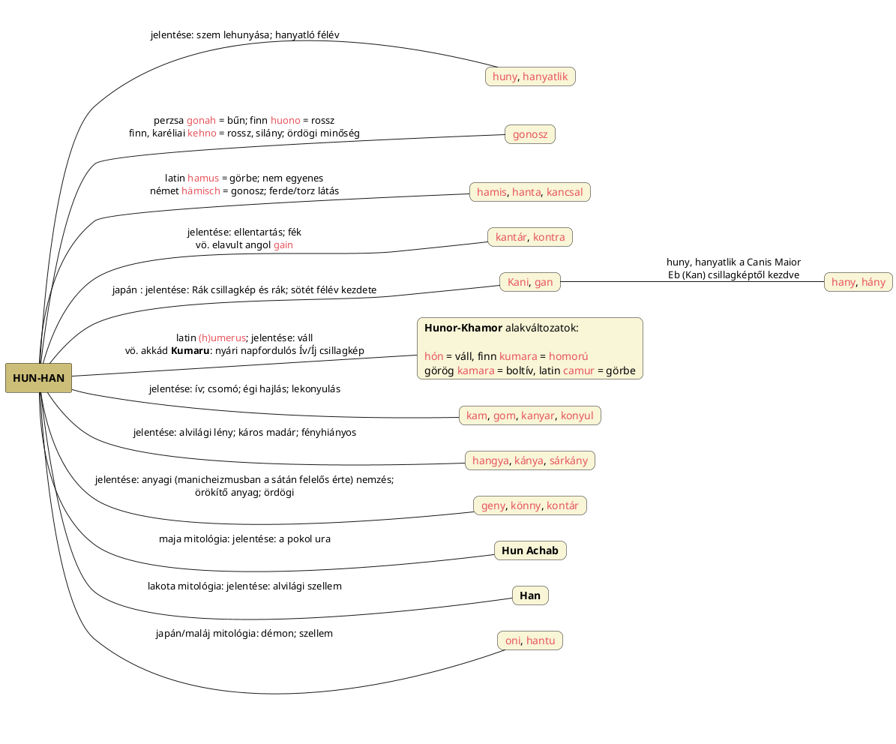

---
{"dg-publish":true,"permalink":"/H/HAN/","title":"HAN","created":"2025-04-25T20:34","updated":"2026-01-17T00:11"}
---

# HAN

#### Péterfai János írja:

> An-U jelentése Égi-Magasságos, lehet válogatni az [[U/U\|U]] jelentései között. Az U önálló szó, a magánhangzók családjába tartozik, változata az Ü és Ő. De Anu isten neve mindentől függetlenül, az Ég, An nevéből képződött. [[D/Dialektikus ellentét\|Dialektikus ellentét]]e az An névnek az Ördög, amit Han, Hány alakban írunk. An az Ég, de változata az Ördög, sok név alatt. An ugyanis nálunk mindig Ég, ige és főnév, de éjjel fekete, nincs fenn a Napisten, illetve Napkirály. A fekete szín a végzet színe, az ördögök éjjel járnak elsősorban kísérteni. Ha Anu jellegtelen ősisten, aki már a szumerok korában is az idők homályába vész, akkor csakis magyar istenség lehet, mert mi írunk sok tízezer év óta, nem a szumirok. A Han, szinte teljesen biztos, az An szóból keletkezett, hasonlóan a Jan szócsoporthoz. A Han-Ság nagy mocsár, az ördög területe. [[H/Hany Istók\|Hany Istók]] nem más, mint Ördög Istók. Akit megszállt az ördög, azt Hánytatni kell, hogy kijöjjön belőle a rossz. Matematikában a Hány? kérdőszó az ördöghöz, a Mennyi? kérdőszó a Mennyhez (eredetileg Mén) tartozik. A hánykolódik, hányja-veti magát és egyéb szavaink a rossz állapotot írják le.  
> De a Kor-Hány, Kur-Gán halotti építmények nevében is szerepel a Hány. A Kur és Kor itt egyértelműen Hegy, de előfordul Ország jelentése is. Ám a Kor lehet Kör is, mivel a felhányt hegyek kör alakúak, a Kör szó viszont a Nap sajátja, elterjedt a magyar földrajzi nevekben. Különösen a Gán szó fura, mert a király jelentésű Kán szóval is rokon, ami Gán és Hán alakra fejlődött a törököknél. A Kán magyar szó, a Kan változata, amiből kialakult a Gan és Han. Han Tengri értelme Tengri Király, de akkor mi a kapcsolat a Kán és az ördögöt jelentő Hán között? A magyar nyelv nem utóda a török nyelvnek, a származás éppen fordított, magyarból ered a török, de a Han, mint kínai Hanok népe, a Han Tengri, és a magyar Hany Istók, Hány kérdőszó, az An, vagyis égi eredetű szavakat jelöli, esetleg a bukott angyalt is, aki az Anból ered, de Hanná, ördöggé változott.  
> A Hant szavunkra is ki kell térni. A Han az égi temetkező hely, magaslat. Lehet néhány deciméter, de lehetett régebben sok méter magas, vagyis Hegy, Kur. Manapság a temetőkben a nép Hant alá temetkezik. A régi, több ezer éves magyar temetkezések Korhányai, Kurgánjai mára kicsi dombokká szelidültek, a temetőkben járva ezrével láthatjuk népünk mai temetkezését.  
> Még egy nevet meg kell vizsgálni, mielőtt tovább lehet haladni. Ez a név a Hangya. Emberi családnév is. A [[H/Hangya\|Hangya]] olyan lény, aki a tetemeket eltűnteti, felfalja, széthordja, de az Alvilágból, a földből jön elő, és oda is megy vissza. A termeszeknek nem rokona, a Hártyásszárnyúak közé tartozik, értelmi képességei nagyon magasak. A Hangya szó Ant az angoloknál. Mivel a Han-Gya magyar név egyértelműen a Han névre utal, a Gya meg a Ga alapján Ház, ezért a Hangya népek a Han alapján építenek Házakat, a házuk az Alvilágban van, ahol az ördögök uralkodnak, de nem mindenhol. Vannak hangyavárak is, mint az erdei hangyáknak, a vöröshangyák ugyanis várakat építenek.
{ #sgpvca}

A Han tehát egy sötét minőség, mely a Hun/[[H/Huny\|Huny]] fogalmában is látható. A [[K/Kán\|kán]] viszont fehér, fényes (kutyahitre/fejűségre utaló magas/vezetői/királyi és persze [[K/Kutya\|kutya]]) minőség. De [[G/Gond\|gond]] címnél is azt láttuk, hogy mintha a fényes "kanos/kutyás" Hund minőség sötét minősége lenne. [[O/Ördög#Ördög: fekete kutya; Isten: fehér kutya\|Ördög: fekete kutya; Isten: fehér kutya]] cím/alcímnél az egészet úgy magyaráztuk, hogy a kétféle minőség úgy járulhat ugyanahhoz, hogy belátjuk, egy van Szíriuszból és hozzá tartozik egy fehér kutyaként értelmezett isteni (innen Khoda/[[K/Khuda\|Khuda]]) és egy fekete kutyaként értelmezett ördögi/sátáni aspektus azzal, hogy ő választja két [[F/Fél\|fél]]re a téridőt. A [[S/Sárkány\|sárkány]] elemzésénél is azt láttuk, hogy van egy fényes Szár-Kan és egy fényhiányos Sár-Kan minősége.  
[[H/Hun#Hun fény jelentése\|Hun fény jelentése]] cím/alcímnél, valamint [[H/Hunter\|hunter]] és [[F/Fény csökkenése\|fény csökkenése]] címnél volt már a [[F/Fény\|fény]] szavunkról, ilyen jelentésről és az alábbiakról:  
Legutóbb a(z egyébként ványad és fonnyad fogalmakkal is társítható) [[B/Banya\|banya]] szó lehetséges kialakulásának taglalásakor ötlött fel, hogy az Orion (plusz Szíriuszból kialkotott Íjazó Isten/Ember) csillagkép Pan/[[P/Pán\|Pán]] alakú neveivel ([[P/Panther\|Panther]], [[M/Mul.Pan\|Mul.Ban]]) való összecsengés egyrészt nem véletlen, másrészt itt ugyanúgy látni kell a Pen/[[F/Fény\|fény]] szavunk sötétbe hajló [[P/PAN\|PAN]]/[[B/BAN\|BAN]] változatát, ahogy a Hunhoz képest létezik szintén a-hangos **Han**. A B-N vázú szavak között ott van még a szintén égen/téridőben is elhelyezhető [[B/Bűn\|bűn]], melynek a szintén az évben/évkörön megtalálható [[P/Pünkösd\|Pünkösd]] kapcsolatáról szintén volt szó.  
Hasonló eseteket a sötétbe való áthajlásról lehet bőven említeni ([[F/Fény és sötétség\|fény és sötétség]] címnél és helyükön voltak taglalva); ilyenek például: [[S/Süt\|süt]] (szít) > söt (sut); [[S/Szín\|szín]] > [[S/SZÜN\|SZÜN]] (lásd még [[S/Sin\|sin]] és [[S/Sine\|sine]]).  
Ezen szavak megint csak -N végződésűek, mint a F-N/B-N/P-N-vázú szavak. Azt az [[A/A\|A]] címnél álló MindMap-en is látjuk, hogy az [[A/AN, ÁN\|AN, ÁN]] illetve [[E/EN\|EN]] szócskára épülő, ilyen-olyan előhangos, akár fog- akár torokhangos szavak lényegében megegyeznek jelentésüket tekintve.  
Lásd még életkör-diagramokat [[D/Deer\|deer]], [[M/MISZ\|MISZ]] és [[K/Kut\|kut]] címnél.  

A Quorán a Why do Germanic languages have an etymological relationship between "again" and "against" (also in German "wider" vis à vis "wieder")? What was the initial semantic relationship that connected those two words? kérdésre [ezen](https://qr.ae/pNc7ZL) válaszban a [[G/Gainsay\|gainsay]] és [[A/Against\|against]] címnél is taglalt fogalmakat járja körbe a német válaszadó. Ő az idő megfordulásáról beszél, holott itt is az [[E/Életkör\|életkör]] a helyes fogalom. Ami jön, az megy. Azaz a [[J/Jön\|jön]]/hun szavak és az ezekkel azonos [[K/KAN\|kan]] szó alaki párját kell gain-ben keresni.  
  
- A német `wieder` = újra szó [[V/Vissza\|vissza]] szavunkkal való párba állíthatóságát is meg kell említeni.

Közben [[J/Jón\|jón]] címnél találtunk adatokat, köztük egy proto-mongol szót fekete jelentéssel, és ott szintén fekete kutyás összefüggésre gyanakodtunk.  

Kis (és Nagy) éves időkör vizsgálatában: a növekvő [[F/Félév\|félév]] van a bal oldalon: télitől a nyári napfordulóig, és jobb oldalon a [[H/Hanyatlik\|hanyatló]] (HAN) félév.  

A [[B/Bűn\|bűn]] címnél említett szláv `vina` és perzsa `gonah` szavak eredete kapcsán született meg [[H/Hun#Hun mint huny = HAN = gon(osz)\|Hun mint huny = HAN = gon(osz)]] cím/alcím: itt látjuk, hogy a [[H/HAN\|HAN]], [[H/Huny\|huny]] szavak értelmét viszi gonosz.  
Ott említettük a japán `gan` = rák (betegség), rákos gonosz szót és a rák (állat és csillagkép) **kani** nevét.  

A Rákba lépve indul a sötét félév, így a [[C/Cancer\|Cancer]] név előtagja megfelel a HAN szónak, melynek a gané is.  
Ha már itt tartunk, [[G/Guano\|guano]] címnél említettük a latin `coenum` = sár, szar, valamint `cunio` = szarok, piszkítok szavakat.  

Furcsa, hogy a [[H/Hanta\|hanta]] szót Péterfai János nem említette. De [[K/Kánya\|kánya]] szóról sem szól: ennek neve kapcsán is arról szóltunk, hogy káros madárként a sötét félévhez passzol.  

Innen látszik kiindulni a maláj `hantu` = szellem (a halál után megjelelő ghost-féle) szó is.  
Az [alábbi](https://mythopedia.com/japanese-mythology/gods/fujin/) oldalon talált info alapján a japán `oni` = démon, ördög, troll jelentésű, és ha nem [[H/Hun\|hun]] (mely óriás is lehet a germánban), akkor Han megfelelést lehet észrevenni. Gregory Wright [[F/Fujin\|Fujin]] szélistenről írja:  
> Fujin is a well-depicted oni who is also sometimes treated as a kami (a type of god or spirit in the Shinto religion). With green skin and wind-disheveled red-white hair, his monstrous face is like that of a hungry ogre with eyes that are wide and fearful.  
> —  
> Fujin egy jól ábrázolt oni, akit néha kami-ként is kezelnek (a sintó vallásban egyfajta isten vagy szellem). Zöld bőrű, szél által összeborzolt vörös-fehér hajú, szörnyűséges arca olyan, mint egy éhes ogréé, szemei tágra nyíltak és félelmetesek.  

Érdekes, hogy a japán nyelvben több szó olyan jelentéssel áll, amit téridőbeli helyre vonatkozóan meg is felel:  
Japán `han` = fél (half, semi-); anti-, valamint ellenáll, lázad jelentésű szavak is han- kezdetűek. Azaz a Han ellenható/gonosz/ördögi szerepe ilyen mód is megmutatkozik. Ugyanúgy ahogy [[K/Kantár\|kantár]]/[[C/Contra-\|contra-]] szavakban ott a kan/con és az ördög [[K/Kontár\|kontár]] nevében ott a kon.  

De nemcsak Japánban kerül Han-hoz hasonló név ilyen negatív, alvilági, ördögi jelentéssel. Sőt, a magyar/hun Han névvel teljesen egyezik a lakota mitológia `Han` nevű alvilági szellemének neve.  
Az [alábbi](https://en.m.wikipedia.org/wiki/List_of_Lakota_mythological_figures) Wiki oldalon álló adat szerint **Han**:  
> The ancient spirit of darkness; banished to be under [[M/Maka\|Maka]] (Maka or Maka-akaŋl: The earth Spirit created by Inyan as his lover (Inyan is the name of the primordial creator Spirit)).  
> —  
> A sötétség ősi szelleme; [[M/Maka\|Maka]] alá száműzve (Maka vagy Maka-akaŋl: Inyan által szeretőjeként teremtett földi Szellem; Inyan az ősi teremtő Szellem neve).  

[Ezen](https://web.archive.org/web/20200809212003/http://members.iif.hu/visontay/ponticulus/rovatok/hidverok/szilagyi-fereg.html) oldalon dél-amerikai bennszülött nyelven is hasonló szóalak kerül elő:  
> A férgek másutt is démon-státuszban vannak, például Kolumbiában. Azt hiszik, hogy a démonok vagy szellemek (`hanai`) éjszaka féreg-alakban járkálnak, és megtámadják az embereket.  

Lásd még skandináv vonalon hasonló, gonosz jelentésű szavakat [[U/Undor\|undor]] címnél.  
A finn `huono` = rossz és `kehno` = rossz, silány (vesd össze karéliai `kehno` = ördög/rossz) szavak is a gonosz és ezen Han formákkal egyező.  
Kállay Ferenc A pogány magyarok vallása című könyvének [80. oldalán](zotero://open-pdf/library/items/DFI47XPY?page=80&annotation=2VBJ8E9F) említi a lapp **ganok**/**gánok** kifejezést, mely (gyötrő) gonosz lelkeket jelent.  

Benyák Attila (melyik?) cikkében ír Hun Achab-ról: a maja hagyományok szerint a [[P/Pokol\|pokol]] ura.  

Megfelel nagyjából neki a (furcsamód nem perzsa eredetűnek tartott) perzsa `khanum` = asszonyom és a görög [[G/Gyne\|gyne]]. Hasonló eset lehet, mint a [[S/Sátán\|Sátán]] címnél taglalt Nárt eposz Satana-ja esetében.  
Hány és mennyi témát lásd bővebben [[H/Hány\|hány]].  
Lásd még [[H/Hiány\|hiány]].  

## Han-hany-huny diagram

A sötétbe borulással járó konyul, ellen(tartás), gonosz, stb. jelentésű szavakat Hun(or-Khamor)/Han (Kan) alapszavakra bontás után kiviláglik, hogy az egész földön egyazon szóalak és annak változatai terjedt el:  

## Han nép

#### Péterfai János írja:

> A kínai Hanok meg ördögök a magyar Hunokkal, a Menny Fiaival szemben. A Hun és Han népnév régebben azonban egy nép két részét jelentette, vagyis magyarokat és kínaiakat.  

Hasonló ellentétet alkotnak így, mint például [[D/Dévák és Aszúrák\|Dévák és Aszúrák]] és [[I/Irán és Turán\|Irán és Turán]].  

### Koreai han

**한 (han):** Ennek a szónak több jelentése is van a koreai nyelvben.
- Jelentheti a koreai népet vagy Koreát.
- Jelentheti azt is, hogy "nagy" vagy "nagyszerű".