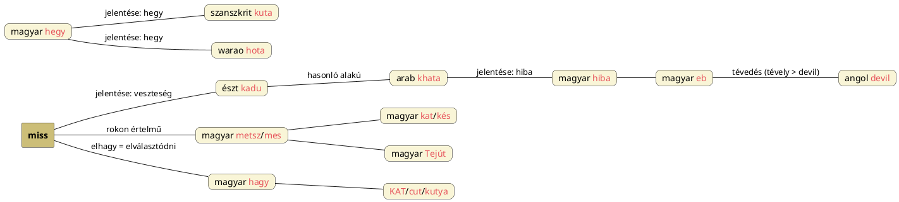

---
{"dg-publish":true,"permalink":"/H/Hagy/","title":"Hagy","tags":["Englishtexttranslated"],"created":"2024-11-09T01:30","updated":"2024-11-23T05:08"}
---

# Hagy

Hagyni igénk eredete [[A/Ad\|ad]] flexiós változata (mint ad ellentéte), vagy [[H/Ház\|ház]] > had > hagy (otthon hagy; haza = [[H/Hoz\|hoz]] = hagy) lehet.  
Azonosnak látszik vele a Kasgari gyűjtötte oszmán-török `kod` = (fel)hagy, letesz, mely egyúttal a [[G/God\|God]] címnél említett perzsa visszaható névmást is idézi. Lehetséges "istenre bíz" jelentést adni neki?  
A japán `hottoku` = hagyni ige szintén egyezik vele (-ku végződéses/igeneves ige).  
Ezek finnugor párjait például [ezen](https://en.wiktionary.org/wiki/kadota) oldalon találjuk meg:  
> A proto-finn \*kadot'ak-ból, a proto-uráli \*kaďa(w)-ból ("elhagyni"). Szinte minden uráli nyelvben találunk rokon nyelveket, pl. északi lapp `guođđđit` ("elhagyni valamit, távozni"), skolt lapp `kuéđđđed` ("elhagyni valamit"), moksa `кадомс` (kadoms, "elhagyni"), erzya `кадомс` (kadoms, "elhagyni"), keleti mari `кодаш` (kodaš, "maradni"), udmurt `кыльыны` (kylʹyny, "maradni"), magyar `hagy` ("hagyni; hagyni"), mansi `хули` (huli, "hagyni"), szelkup (/quəčə-/, "elhagyni"). A törzs magánhangzójának labializációja már a proto-finn nyelvben is előfordult, vö. észt `kadu` ("veszteség"), észt `kaduma`.  

Szinte azonos vele a tagmondatok összekötésére használt, és így kuta/[[K/Kut\|kut]] = tűz értelműnek tartható [[H/Hogy\|hogy]] szavunk. Ugyanakkor a hagy alapfogalma mögött megtalálható az elvesztés és hiány, míg abbahagy mögött pedig a [[S/Stop\|stop]] címnél is taglalt fényelzárás.  

## Hagy mint vál

Az észt `kadu` = veszteség mutat rá, hogy ez a szó tulajdonképpen a [[M/Miss#Eltéveszt – elveszít rokon fogalmai\|miss]] = hiányol ige k-előtétes változata. Ahogy [[H/Hun szavak\|hun szavak]] címnél is szerepelt, a metsz/mes felel meg a [[K/KAT\|kat]]/[[K/Kés\|kés]] szónak.  

Másik megközelítése:  
A legutóbb [[L/Left\|left]] címnél írottak alapján (minthogy elhagyni = elválasztódni) hagy igénk váza úgy aránylik a [[K/KAT\|KAT]]/[[C/Cut\|cut]]/[[K/Kutya\|kutya]] K-T/K-Ty vázához, ahogy [[H/Hegy\|hegy]] szavunk a szanszkrit `kuta` = hegy és az ennek megfelelő dél-amerikai warao `hota` = hegy szavak vázához.  

Az észt `kadu` = veszteség szó alakja és jelentése kapcsán említsük meg az arab `khata` = hiba szót is, mely nyilván a téved(és) fogalmát hordozza; hasonló alakú a [[K/Kutya\|kutya]] szavunk (vö. [[E/EB\|eb]] – [[H/Hiba\|hiba]] összefüggésével) is; az ördögre utaló tévedés (tévely > devil) itt is megmutatkozik: a kutya a sötét félévet nyitja, ott ahol a Tejút sávja az éggömböt mesi/metszi ([[M/Miss#Miss 2)\|miss]], [[C/Cut\|cut]]/[[K/KAT\|kat]]).  

