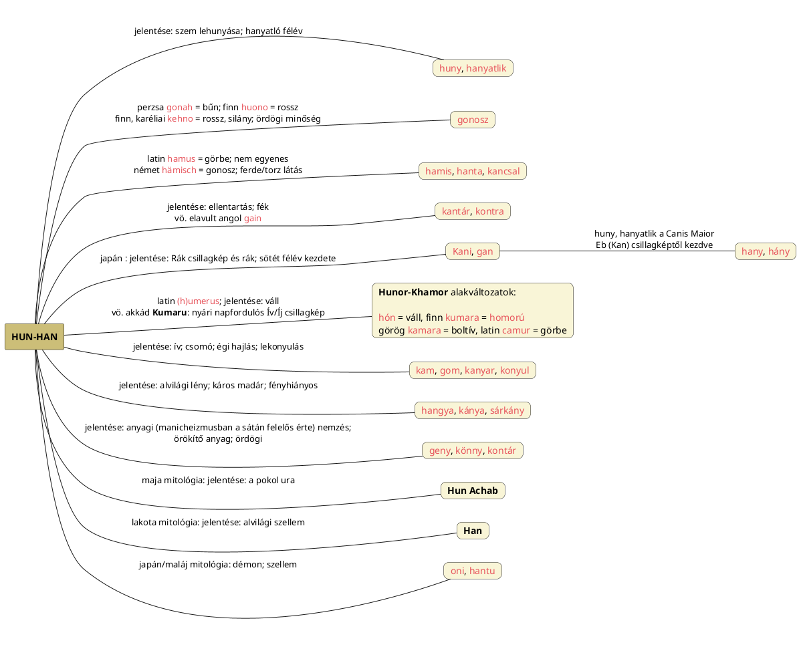

---
{"dg-publish":true,"permalink":"/H/Hamis/","title":"Hamis","created":"2026-03-03T15:29","updated":"2026-03-03T15:30"}
---

# Hamis

Fényhiányos minden ami igaztalan vagy halandó, azaz nőiségi-tellurikus szó ez is. Érdekessége, hogy felbontható kétféle, Ha-Mis és Ham-Is formában is. Kérdés, hogy Ha-Mis formába bontva negatív párja lehet-e [[M/MISZ\|MISZ]]-nek, bár valójában [[M/MIS\|MIS]] azonos MISZ-szel.  
- Ha-Más, A-Más(ik) értelmezésében a másik oldal a [[S/Sötét oldal\|sötét oldal]]; rosszindulatú jelentésű `hämisch` német szó is előjön alant.

Ha-Mis az Ifjú(ság) Háza értelemben elfogadható, ha gyerekek és kamaszok csintalankodásaira ("te kis hamis") gondolunk, de nem ez lesz a megoldás. Nem így működik a nyelv.  
Amennyiben sikerül Ham-Is-nak értelmes negatív értelmezést adni, megfejtenénk vele az egyébként száj (és fény) jelentésűnek látszó magyar [[H/HAM\|HAM]] szót. (Hímségi és száj jelentésű szavak összefoglalását lásd [[S/Száj\|száj]].) Lásd még analógiákért [[H/Hamar\|hamar]] szót Ha-Mar bontásban.  

#### Péterfai János írja:

> A Hamis szóban a Hamita Fénye ismerhető fel. A Ham-Is jelentése szerint a Hámi nép többször be akarta csapni valamelyik magyar népcsoportunkat, ami miatt kialakult ez a név.   
- Másutt a szumer névben látja a szamarat; nem csillagászati értelmezésben gondolkodik. Az mondjuk igaz lehet, hogy pl. `hőbörög`, `szemét` és `ocsmány` szavak utalhatnak arra, hogy a magyar nép bizonyos népekről alkotott véleményét szókincsében tárolta.

[[H/Hemi-\|Hemi-]] és [[S/Semi-\|semi-]] címnél szerepelt:  
Hogy a fél és hamis ugyanaz, mutatja a hamis szavunk; itt meg a görög `hémiszusz`, szittya/dór `hamisz` fél jelentésű; álbölcs `hémiszophosz` (vesd össze latin `semidoctus`). Hamisan mérni: hiányosan, hibásan, félig-meddig, nem teljesen.  
CzF is talál rokont más nyelvben (itt a németben már egyenesen rosszindulatú, gonosz jelentéssel áll):  
> Rokon vele hangokban a német `hämisch`, de értelemben nem egészen egyező, s eredetére nézve sincsenek vele a német nyelvészek tisztában.  

A gonoszság ott kezdődik, hogy hazudunk. A hamis szóhoz hasonló [[H/Hazug\|hazug]]ot hoztuk elő [[H/Haze\|haze]] és [[H/Hazard\|hazard]] szavaknál is.  

A CzF szótár kantár címnél említett latin, görbeséget jelentő `hamus` szó ébreszt rá, hogy a hamis HAM eleme a görbeséget jelentő [[K/KAM\|KAM]] változataként is felfogható, azaz így hamis annyit jelentene, hogy nem egyenes.  
- Vö. a magyar `finta` = félre görbült, rendes vonalától elhajlott jelentésű szót a (más, latin `fingo` = színlel eredetből levezetett) olasz `finta`/`finto` = hamis, mű szóval. Utóbbi kapcsán [[F/Fény csökkenése\|fény csökkenése]] került szóba és akkor a HAM/KAM sem lenne más, mint [[H/Huny\|huny]]/[[H/Hanyatlik\|hanyatlik]]/[[K/Konyul\|konyul]]: sötétségbe hajlás. Lásd diagramot alul.

A magyar nyelv szokása azonban, hogy a szavaknak sokszor van mellék/rejtett értelme is, ami itt a [[H/Hamu\|hamu]] = kihűlőfélben lévő vagy kihűlt (így fényhiányos) parázs, tűz. Ezért kellett h-ra alakítani a k-előhangot is.  

De már kantár, a [[K/Kontár\|kontár]] szónál eszembe jutó [[H/Hanta\|hanta]] is hasonló előtagú, míg értelmileg is azonos.  

[[K/Kantár\|Kantár]] és főleg [[K/Kontár\|kontár]] téridőbeli helye a nyári napforduló, ha a [[H/Hunter\|hunter]] névből indulunk ki. Ha már a témánál vagyunk, ide is tehető a...

#### Bakos Attila Duna evangéliuma...  

...című könyvének 229. oldalán említett [[A/Ahankár\|ahankár]] óind/szanszkrit kifejezés mely filozófiai jelentése **hamis ego**, azaz testi [[O/Önazonosítás\|önazonosítás]]. Világi, materialista ember.  
Majd magyarítós értelmezésébe is belefog:  
> Ősi magyar értelmezéssel A-Hank-Ar, azaz A jelentése nem, Hank jelentése Hun (Magyar), Ar jelentése Ur. Nem-Magyar-Úr, vagyis nem megvilágosodott.  

Nos, az elemzése lehetne A-Hungár is, utalva a sötét téridő-félre (és északra). Ugyanakkor a szóban a h hang felesleges is lehet. Ez esetben Án-Kár ugyanolyan név lenne (még mindig), mint [[H/Hungár\|hungár]], továbbá hasonló nevek [[A/Ankara\|Ankara]], [[A/Angara\|Angara]], [[A/Angkor\|Angkor]], [[A/Angol\|angol]] és több más név.  

Összességében, hamis olyan, mintha [[H/Hunor\|Hunor]] nevet alkotó [[H/Hun\|HUN]], [[H/HAN\|HAN]], [[K/KAN\|KAN]] eleme lenne benne keresendő és az alak akár eredetileg \*hanis lehetett.  
A [[H/Hunger\|hunger]], [[L/Lemniszkáta\|lemniszkáta]] és más címek alapján és a görbeséget jelentő latin `hamus` alapján a második/másik sötét félévre utaló szó, ahogy [[B/Bűn\|bűn]], [[G/Gonosz\|gonosz]] és más szavak is.  
- Jegyezzük meg, hogy a szanszkrit `kūṭa` is jelenthet hamisat, csalárdot; a [[K/Kut\|kut]]-diagramban láttuk, hogy pozitív és negatív jelentései is lehetnek ilyen szavaknak.

Lásd még perzsa [[D/Druj\|druj]].  

<a class="markdown-embed-link" href="/H/HAN/#han-hany-huny-diagram" aria-label="Open link"><svg xmlns="http://www.w3.org/2000/svg" width="24" height="24" viewBox="0 0 24 24" fill="none" stroke="currentColor" stroke-width="2" stroke-linecap="round" stroke-linejoin="round" class="svg-icon lucide-link"><path d="M10 13a5 5 0 0 0 7.54.54l3-3a5 5 0 0 0-7.07-7.07l-1.72 1.71"></path><path d="M14 11a5 5 0 0 0-7.54-.54l-3 3a5 5 0 0 0 7.07 7.07l1.71-1.71"></path></svg></a>

# han-hany-huny diagram

## Han-hany-huny diagram

A sötétbe borulással járó konyul, ellen(tartás), gonosz, stb. jelentésű szavakat Hun(or-Khamor)/Han (Kan) alapszavakra bontás után kiviláglik, hogy az egész földön egyazon szóalak és annak változatai terjedt el:  

