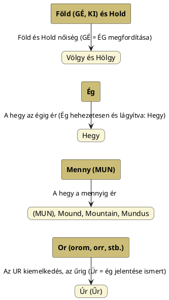

---
{"dg-publish":true,"permalink":"/H/Hegy és völgy/","title":"Hegy és völgy","created":"2024-11-19T11:24","updated":"2024-11-23T05:09"}
---

# Hegy és völgy

Tulajdonképpen Nap alapjelentésű szavak adják ki a [[H/Hegy\|hegy]]et és a völgyet is, állapíthatjuk meg (magyarázatot lásd [[F/Fény és anyag\|fény és anyag]], valamint [[F/Fény és sötétség\|fény és sötétség]] alatt).  
Hasonló eset áll fenn [[H/Hegy és barlang\|hegy és barlang]] esetében; lásd ott.  

Valójában a [[V/Völgy\|völgy]] szó a [[F/Föld\|föld]] szavunknak felel meg: a völgy a lentlétet, alsó állapotot mutatja, ahogy az alaki azonos föld is az éghez ([[E/Ég\|ég]] = [[H/Hegy\|hegy]]) képest lent van.  
Egy táblázatban az azóta másutt is taglalt [[M/Men\|menny]]/[[M/MUN\|MUN]] és [[O/OR\|OR]]/[[U/UR\|UR]]/[[U/Űr\|űr]] esetekkel is kiegészítve így mutatnám be:  

Az azóta több címnél szereplő passzus is kerüljön ide:  
Az [[E/Ecliptic\|ecliptic]] és [[S/Sine\|sine]] címnél bemutatott szinusz-görbe hegy és völgy amplitúdó-pontjai a [[L/Lemniszkáta\|lemniszkáta]] diagramon egy pontba konvergálva jelennek meg.  
A hegy és völgy fogalmainak vizsgálata történhet a hegy és annak gyomrának, a barlangnak összefüggésein keresztül is.  
[[B/Barlang\|Barlang]] címnél írtuk, hogy a hegy gyomra a barlang. A barlang pedig nem más, mint a Nap szülőhelye.  
A [[G/Gyomor\|gyomor]] címnél említett szótagmegfordítás kapcsán annyit, hogy az mégiscsak érdekes, hogy [[M/Magur\|Magur]], [[M/Magura\|Magura]] és [[M/Makara\|Makara]] nevek mind a (barlangra és) barlangban való születésre utalnak, de maga a barlang gyomrának neve, [[G/Gyomor\|gyomor]] [[K/Khamor\|Khamor]] alakú. Khamor pedig a kulminációs pontja az évnek és a sémi nyelvben is halom értelmű (halom = hegy). Ez megint olyan téma, melyet [[H/Hunor és Magor\|Hunor és Magor]] címnél külön alcímnél taglaltunk. Ugyanazt tudom itt is elmondani, mint ott is: a [[L/Lemniszkáta\|lemniszkáta]] címnél látott diagramon a két, éggömbön ellentétes pont egymásra csúszva jelentkezik. Azaz a hegy (ami a Világhegy) és a gyomor (az anyaméh) egy és ugyanaz: ezért lehet a [[K/Köldök\|köldök]] is ilyen kétértelmű. [[V/Világhegy\|Világhegy]] címnél, külön alcímnél erről már volt szó.  

### ÚR – ŰR

Nem kell túlmagyarázni; az [[U/UR\|UR]]/[[O/OR\|OR]] = hegy, míg az űr az a szó, melyből űres > üres szavunk is ered. Érdekes még magyar nyelvi szempontból talán az [[A/ÁR\|ÁR]] – [[A/Árok\|árok]] páros.  

### SZIN

A [[S/Sine\|sine]] = szinusz(görbe) szót [[S/SZIN\|SZIN]] ([[S/Szín\|szín]]) és [[S/SZÜN\|SZÜN]] (szűn) szavaink adják ki egyszerre, azaz egyszerre fényes és fényhiányos (amplitúdójú) ciklusok váltakozásairól van szó. Felfogató szín hegynek, szün a völgynek. Persze Szünt lehet Színnek is felfogni, így olyan kétpólusúvá válik, mint az alant előjövő [[T/TÜN\|TÜN]].  

Az alábbi csángó hiedelem is ezt mintázza (és lényegében a görög Sziszüphosz sziklájának görgetése is erről a tőrő fakad):  
> "Ki [[T/Tök\|tök]]öt lop, kell vigye a másvilágon a Kálvária-hegyre, s mindig gurul vissza, mindig kell felvenni, annak vége nincs soha." (Somoska, Bosnyák Sándor gyűjtése)  

### D-V és rokon vázú szavak

Egészen hasonló a SZIN-SZÜN pároshoz a török [[T/Tepe\|tepe]] = domb, hegy és a germán-angol [[D/Deep\|deep]] = mély szavak képviselte páros, ahol a háttérben ott vannak a [[D/Dév\|dév]], [[D/Devil\|devil]], [[T/Téved\|téved]], [[T/Typhon\|Typhon]] szavak, Isten és ördög. Lásd még sötét és más fogalmakat [[D/DUB\|DUB]] és [[S/Stupid\|stupid]].  

### KAP – BAK, KAB (KÜB, KEB)

A kebel – öböl/köböl is lehet ilyen páros, ha a keblet hegyként fogjuk fel (az öböl egyértelmű, a köböl edényféle, mely a német `kübel` = vödör szóba is átment). Lásd még bővebben erről [[H/Hegy\|hegy]] és [[K/KAP\|KAP]].  
Tulajdonképpen a [[K/Kebel\|kebel]] forma feleltethető meg a hegynek és öböl ([[O/Öl\|öl]]) a völgynek. Erről [[S/Sine\|sine]] és [[S/Sinister\|sinister]] címnél is volt szó.  

[Ezen](https://youtu.be/RyaTXRx-hu8) VNTV műsorban 3:45-nél Géczy Gábor elmondja, hogy a szinusz-hullám a világegyetem legegyszerűbb és leggyakrabban használt motívuma. Hegy és völgy helyett adó és kapó párt használ, továbbá Molnár V. Józsefre hivatkozva a [[K/Kapu\|kapu]] és [[K/Kupa\|kupa]] szavakkal is magyarázza (kupa a kehely, de a hupolag is hasonló, valamint a kebel szó is, mely annak az öbölnek a párja, amit a latin `sinus` éppen jelent). Adok-kapokok sorozata a [[H/Hullám\|hullám]].  

### MONY – NYOM

A megfordított szópárról [[M/Mony\|mony]] címnél ír Magyar Adorján. Mony ([[M/MUN\|MUN]]) a hegy, viszont nyom ugye csak a hímtagnak a női nemi részbe való benyomását jelenti. Ugyankkor [[N/NUM\|NUM]] Nu-Ma (Nuna) lehet nőiségi.  

### AL/ALA (ÁLL) – AL (Alsó, Alul)  

[[A/Ala\|Ala]], [[A/Áll\|áll]], valamint [[I/Isten\|Isten]] címnél, külön alcímnél taglaltuk a magas és isteni (de a Czeglédi Katalin Magyar-török nyelvviszony című az Ősi Gyökér 2012/2-4. sz. megjelent cikkében talált kelet-mongol `óla`, valamint a kalmük `úla` és ojrot nyelvű `ûla` = hegy jelentésű szavakkal még inkább célra mutató) jelentésű szavakat, melyek gyöke egyező az alul és alsó szavaink gyökével, de [[U/Ullu\|Ullu]] címnél írottak szerint [[A/Áll\|áll]] szavunkkal is.  

### BÁL (VAL/FAL)  

Tulajdonképpen felfogható előbbi előhangos változatának.  
Lásd még Magyar Adorján írását [[W/Wave\|wave]], ahol a völgyelet ellenpólusát falnak hívja (a latin `vallum` gyöke megfelel a völgyet jelentő szó gyökének is; [[S/Sine\|sine]] címnél láttuk, hogy ott szintén azonos (SZ-N) vázú mindkét jelentésű szó):  
[[V/Valley\|Valley]], [[V/Vale\|vale]], [[W/Well\|well]] szavaknál a nőiségi völgyet, [[V/Váll\|váll]] szavunknál a hímségi hegyet láttuk.  

### TAL – TÁL

Tulajdonképpen ismét egy előtagos, itt t-előhangos változatot látunk. Van magas és medence jelentése is: az arab `tall` = hegy és angolban is magas [[T/Tall\|tall]], de a németben már `taal` = völgy (a szintén német toll viszont megint csak magas, nagyszerű). [[D/Dal\|Dal]] szavunk definícióját ez a kettősség adja meg. A török `dalga` = hullám jelentését Magyar Adorján is említette.  

### TEN – TON – TÜN

A [[T/Tone\|tone]], [[T/Tune\|tune]] (továbbá [[T/Thunder\|thunder]]) hanggal kapcsolatos szavak a kelta ([[B/Balaton\|Balaton]]nál is említett) `tonn` = hullám jelentése alapján válnak értelmezhetővé. De nemcsak a fény és hang, a tenger is hullámzik, mely szóban a Ten a kiinduló, ahogy a többiben is. [[T/TÜN\|TÜN]] szavunk is a Ten szócsoportjába tartozik. Tün inkább már csak fénnyel, látással kapcsolatos, de megfigyelhető a fentebb említett [[S/SZÜN\|SZÜN]]-nel való azonossága is. TÜN önmagában tartalmazza a hegy-völgy fogalmát, így egyben a [[H/Hullám\|hullám]] fogalmat.  

A hegy és völgy jelentésű szavakban közös még, hogy az [[E/Életkör\|életkör]] is megvan bennük, hiszen az életkör "szinusz-görbésítése" a hullám. Például a [[K/KUR\|KUR]] is állhat hegy és alvilág jelentéssel, de a K-R váz a kör váza is. Életkör-diagramokat lásd [[D/Deer\|deer]], [[K/Kut\|kut]] és [[M/MISZ\|MISZ]]. Egyéb adatokat [[S/Szakrális geometria\|szakrális geometria]].  

  
Makoldi Sándor – Szarvasvadászat című képének elemzésrészletében:  
> Az ékek sorának szimbolikája a háromszögek jelképiségére vezethető vissza. Az egyenlő oldalú háromszög isteni jelkép, a harmónia, a tökéletesség, a szenthármasság – és nem csak keresztényi értelemben –, a harmónia és stabilitás szimbóluma. Az ékek sorában fellelhető hármas-hármasság ősvallásunk alapeleme is. A csúcsukkal felfelé álló, világos ékek a férfi, az ég és a tűz, míg a csúcsával lefelé néző sötét háromszögek a nő, a föld és a víz jelképei. A mitológia világa számtalan vízben született, vagy onnan kiemelkedő, az égi folyón érkező isteni lényt, héroszt, és nemzet alapító személyiséget ismer. A magyar mondavilág ilyen személyei Csaba királyfi, Álmos, vagy Hunor és Magor. Képírásunkban a hullámvonal a víz, a folyó, és a tenger szimbóluma, de áttételesen utal az istenre, vagy annak jelenlétére is. Az Isten, Ten, Tengri, Yo Tengrit, Ős Thana nevek általában az "ős tenger végtelen" kifejezésre vezethetők vissza. Ebben a megközelítésben az Isten jelenlétére utaló hullámvonal, a történet isteni eredetére, illetve a születő ikerpár istenségére, vagy isteni kiválasztottságára utal. A vadászmondák Csodaszarvasa üldözőit a vízen túlra vezeti, mely víz az élet-halál vize. A Szarvassá vált fiúk balladájában is megkülönböztetett szerepe van a víznek. A halhatatlanság és halál jelképe:  
> *A mi szájunk többé  
> Nem iszik pohárból,  
> Csak hűvös forrásból.*  

Legutóbb [[H/Henger\|henger]] címnél is említettük a hegy és völgy váltakozásait.  
Tulajdonképpen az [[A/AR, ÁR\|AR, ÁR]], [[F/FU\|FU]], [[A/Alma\|alma]], [[J/Jin és jang\|jin és jang]], valamint [[C/Chakra\|chakra]] (és [[H/Helix\|helix]]) és [[S/Sine\|sine]] (valamint [[C/Caduceus\|caduceus]], [[O/Ouroboros\|ouroboros]], [[E/Életkör\|életkör]], [[E/Ecliptic\|ecliptic]] stb.) címnél vizsgált témák mind összefüggnek: minden a kör és spirálszerű mozgásokról szól, mindennek olyan metafizikai háttere van, amiről őseink tudtak és szimbólumokba, szavakba helyezték el őket.  

A [[H/Hegy\|hegy]] = [[E/Egy\|egy]], völgy = [[H/Hölgy\|hölgy]] (nulla) azonosításól lásd [[H/Hegy\|hegy]].  
Lásd még [[F/Fehér és fekete#Fehér és fekete hegy\|fehér és fekete hegy]] cím/alcímnél írottakat is.  

Szóba került [[K/Kövér és sovány\|kövér és sovány]] címnél is, minthogy ami egyszer szinusz-görbeként, másszor [[L/Lemniszkáta\|lemniszkáta]]ként vizsgálható.  

Lásd még [[K/Kebel és öböl\|kebel és öböl]].  
Hegy és völgy kapcsán is taglalt v-alakról lásd [[L/L-alak\|L-alak]].  
[[P/Pina#Női és hím nemi részek hasonló szóalakjai\|Női és hím nemi részek hasonló szóalakjai]] cím/alcímnél volt szó a női és hím nemi részek hegy és völgy alakjáról.  