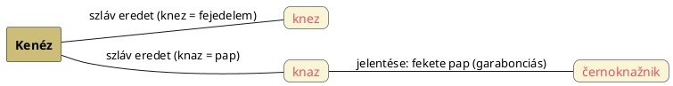

---
{"dg-publish":true,"permalink":"/K/Kenéz/","title":"Kenéz","created":"2023-11-02T11:45","updated":"2025-08-03T18:35"}
---

# Kenéz

Természetesen szláv eredetűnek tartják (`knez`) és fejedelem jelentéssel adják vissza.  

#### Péterfai János írja:  

> Kenéz rangnevünk szintén magyar eredetű, keleten általánosan elterjedt volt. Alapja a Ken, ami önmagában is Kisebb Király jelentésű. Sok rokona van, ilyen a Kin, Kán, Kény, Kün és egyebek. Gyakran Nap a jelentése, ami valamilyen napúr rangnevet igazol. Voltaképpen a szkűthának nevezett magyaroktól ered ez a név. Kened, Kent volt a régi formája. A Kened a Kenéz szabályos ősalakja, ami a Kündü/[[K/Kende\|Kende]] rangnévvel is rokon, jelentése ismételten Nap-Király. A Kennedy-k is innen veszik eredetüket, akik egy ősi magyar család. A Kent tartomány Angliában szintén magyarok által volt lakott, a Kentaur népnév már a mitológiai ősidőkbe röpít vissza.  
>
> [[Z/Zsidó\|Zsidó]] rokonaink Ász-Kenázi, vagyis Szkűtha-zsidó nevében is ott van, csak a vak nem látja. Kendúrszág a vízözön körüli Mezopotámia neve, mellesleg. Ennyi talán elég a Kenéz rangnevünkről, amit a románok is átvettek.  

Ipolyi Arnold adata szerint a szláv `knaz` = pap (a `černoknažnik` = fekete pap, azaz [[G/Garabonciás\|garabonciás]]), mely nyilván a `knez` = kenéz, fejedelem után módosult és nyilván a magyarok [[S/Szakrális kettős királyság, kettős fejedelemség\|kettős fejedelemség]]e miatt lett annak párja.  

Ipolyi Arnold írja még:  
> \[...\] és a godar papok régi kiváltságait is megtartják. A szlávoknál egyenesen a pogány `knez` név jön elő a papra és fejedelemre, egyiránt azonos értelemmel, mint az a pogány korban ismét a legtöbb szláv népeknél azonos papfejedelmi méltóság volt.  

Tehát az [[A/Askenázi\|askenázi]] névben is ez a kenéz van meg.  

A **Knézy**, **Kinizsi** és **Könözsi** tulajdonnevekben is Kenéz változatait látjuk.  