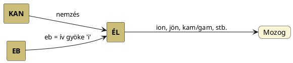

---
{"dg-publish":true,"permalink":"/K/Kinetic/","title":"Kinetic","created":"2024-11-23T05:18","updated":"2024-11-23T05:18"}
---

# Kinetic

Mozgási. A görög `kinétikosz` szó nyomán, mely a `kinein` = mozogni, mozgatni szó származéka. Kín és kén szavainkról Aczél József értekezett, de mozog mellett nyugtalankodik, reng jelentéseket is párosít a `kíne` igéhez, melyek (a mint kiderül, munkával járó) [[K/Kín\|kín]] szavunkkal inkább összevethetők.  

Másutt Aczél József kínál szavunkat veti össze a `kíne` = nógat, ösztönöz szóval. A kinein szónak sok jelentése lehet, de nem csoda, hisz kún alakú szó, így az előretöréssel, ékalakkal, mozgással, harciassággal kapcsolatos: férfi princípiumokat magába foglaló.  
Lovaknál `kíne` = űz, hajt, ösztönöz szót jelentéssel adja meg és kínoz szavunkra hívja fel a figyelmet lehetséges összevetésként.  

A helyzet az, hogy a görög szavakról tudjuk, hogy sok közülük a mitológiai képek mesterséges szóbokraiból kerülnek ki. Azaz például [[C/Centaur\|centaur]] esetében az efféle etimologizálások egész sora gyártható (Jankovics Marcell A Nap könyvének adata):  
> Emlékeztetnék arra, hogy gulyását Erűtiónnak hívják, mint Héraklész egyik kentaur-ellenfelét. A szerzők nyilván a Centaurus csillagképre gondolva ragasztották a gulyásra a kentaur nevét. Ésszerű magyarázatokat kereső "mitológusok" szerint a kentaurok valójában lovas pásztorok voltak. L. gör. `kentao` = "hajt", "ösztökél".  

Aztán ezen kentao illetve igepárjai (`kíne` = űz, hajt, ösztönöz ill. `kentein` = kényszerít) előkerülnek [[C/Centre\|centre]] címnél is. De hasonló szó még a [[C/Cant\|cant]] címnél előjövő hellén-latin `kantharos`-`cantharus`, stb. Mindezen szavak visszavezethetők egyszerűen [[K/Kantár\|kantár]] szavunkra, mely a ló két oldalról végzett irányítására, ösztökélésre használatos (innen két fogantyújú a `kantharos` ivóedény is). De hasonló szó még a `gantár` (melyet lásd [[G/Gantry\|gantry]]) és ki tudja hány más magyar és utódnyelvi szó tevődik ki két olyan fontos alapszóból, mint a [[K/KAN\|KAN]] (és párjai) és [[T/TÁR\|TÁR]] (és párjai).  
Ergo a kentaur, Kende, kínoz, stb. szavakban a közös, hogy a kún-hun nyelvben a legfontosabb bolygó, a Nap neve K-N vázú, de a Hold neve is lehet ez (lásd sumér és (ó)finn példát [[K/KUN\|KUN]]). Minden mozgás, ösztökélés, hajtás, az égre vonatkoztatható. Az alábbiakban erről is lesz szó.  

[[C/Contra-\|Contra-]] és [[C/Centre\|centre]] szavaknál volt szó a [[K/Kontár\|kontár]] szavunkról: ami e szót illeti, mai jelentését biztosan meg kellett előzze egy ősvallásbeli jelentése, hisz Kon-Tár felbontásban utótagja Csillag. CzF adata szerint a konta a csonka fogalmát takarja, mely utalhat eltakarásra ([[A/Apocalypse\|apocalypse]]). A csonkaságról, [[S/Suta\|suta]]ságról, [[S/Sutúl\|sutúl]]ásról [[K/Kutya\|kutya]] és [[C/Circumcision\|circumcision]] szavaknál is szó volt.  
Érdekesebb itt még a görög `kinein` és `kentein` szavakkal párosítható (CzF adata):
> KONTAT  
> (kon-tat) áth. és mivelt m. kontat-tam, ~tál, ~ott, par. kontass. Valamire sürget, izgat, ösztönöz valakit, különösen ellentállásra, roszra, tehát: bujtogat, bőszít, mintegy konokít. Alakjára és képzésére épen olyan, mint vontat, untat, a von és un törzsöktől. A kontat törzsöke kon; tiszta gyöke lehet a menést, mozgást jelentő on, melyből ered onszol v. onzol, azaz menésre sürget, ösztönöz; átvetve: noszol, nógat; ugyanazon értelmü: unszol vagy onszol és ontat. Ez utólsó k előtétellel lett: kontat, melyben a k nak ,görbe' mintegy ellenszegülő jelentése lényeges részt veszen; V. ö. KONOK.

Érdekes a Szinnyei Tájszótárában előjövő `gentet` = ballag (farkas). A mozgás, mint tudjuk, a bolygók (a Nap és Hold beleszámítva) tulajdonsága, és még a farkas (kutya) idevétele is stimmel.  

Magyar Adorján [[C/Caduceus\|caduceus]]-nál illetve [[K/Káin\|Káin]] címnél előjövő utalása arra, hogy a kien ősnyelvünkben csúszómozgásra is utalhatott, szintén megfontolandó (Káin valóban hímségi, így ezen szavaknak mind közük lehet egymáshoz).  

Hogy a (bináris?) Naprendszerünk mozgatásáért a Kin/Kün/Kan (sárkan = [[S/Szíriusz\|Szíriusz]]) vagy [[N/Nimrud\|Nimrud]] lehet felelős (ketten együtt), lásd még [[C/Centre\|centre]] szón kívül [[H/Heart\|heart]] és [[K/Krishna\|Krishna]] címszavaknál írottakat, és magát a [[N/Napunk bináris rendszerben\|Napunk bináris rendszerben]] szócikket. (Kína/kínál szavunkkal kapcsolatban lásd [[N/Need\|need]].)  
Lásd még kozmikus széllel kapcsolatban viszont [[F/FU\|FU]].  

Kinetic-ről szó esett legutóbb [[K/Kezdet és vég\|kezdet és vég]] címnél is.  
Lásd még összefoglalást [[S/Színkódok\|színkódok]]. Lásd még Péterfai János írását [[M/MAR\|MAR]] etimonnál: a színek megoszlása a Nap kelet>nyugat irányába tett mozgásán is alapszik.  

[[C/Caduceus\|Caduceus]] illetve [[K/Káin\|Káin]] (lásd lábjegyzetben) címnél arról is volt szó, hogy nem-e a kion/küon = kígyó (Magyar Adorján adata szerint kígyó szavunk népi alakja kió, régi kion = csúszó jelentésű) mozgásáról van szó.  
Ezen szóelem egyúttal azonos a [[G/Gene\|gene]] más címnél taglalt nemzést jelentő szavakkal. A nemzés nyomán jön létre az élet, és – ahogy [[I/I#I mint mozgást kifejező, életkörre utaló szócska\|i]] címnél taglaltuk – az mozog ami él.  

A nemzés oldaláról vegyük figyelembe az alábbiakat is:  
A Jankovics Marcell tollából több helyen (teljesebben) idézett adat szerint a [[C/Centaur\|kentaur]] eredetét téves levezetésére használt) görög `kentao` = hajt, ösztökél, sarkall jelentésű (továbbá `kíne` = űz, hajt, ösztönöz ill. `kentein` = kényszerít). Mivel a Kutya+Orion a vadászok (a vadász [[H/Hajt\|hajt]], [[U/Űz\|űz]]), itt mégis inkább a [[K/KAN\|KAN]] nevét kell keresni, illetve a kinetic szóban nem [[K/Kín\|kín]]t, hanem a görög kyon-t (ha a szót belső fejlődésűnek fogadjuk el) (igaz, a [[K/Kezdet és vég\|kezdet és vég]] címnél taglalt lengyel `gonić` = üldöz, űz szóban is megvan a szóalak). Innen már az is egyértelműnek látszik, hogy a [[K/Kényszer\|kényszer]] nem véletlenül egyező a téridőbeli helyét tekintve stimmelő [[C/Cancer\|Cancer]]-rel és a kényszer = szükség = szukaság azonosságát is értjük.  

Persze mondhatnánk, hogy fentebb túlbonyolítottuk, mert egyszerűen megjelölhetnénk a görög ige elé a szumér `GIN` = megy szót, ahogy Götz László Keleten kél a Nap című könyvének 165. oldalán a szumér-görög szavak párhuzamait bemutató szavaknál teszi, viszont a kérdés akkor az, honnan jön a GIN? És vajon biztos, hogy megy, nem éppen [[J/Jön\|jön]] jelentésű (volt eredetileg)? A [[C/Come\|come]]-mal azonos szanszkrit `gam` is megy jelentésűnek megadott.  

Azzal is kibővíthetnénk, amiről [[I/I#I mint mozgást kifejező, életkörre utaló szócska\|i]] címnél volt szó: az mozog, ami él, és az él amit nemzettek. Így már helyükre kerülnek a fenti szavak.  

Megfontolható még (alul taglalja igei értelmeit) (CzF adata):  
> KÉGY, KÍGY  
> elavult fn. Értelme a régiek szerént: stadium, futamat, pálya. Az érsekujvári codexben: "Az ydőben Jezwsnak tanytwaany kezzwl ketten mennek vala az napon azaz hwswet napian egy warosban, kinek newe emaws, ki vag'on Jerwsalemhez hatwan keeg'ny feulden." (Az időben Jezusnak tanítványi közzől ketten mennek vala az napon azaz husvét napján egy városban, kinek neve Emaus, ki vagyon Jeruzsálemhez hatvan kégynyi földön). Sylvester Újtestamentomában háromszor használja stadium magyarázatául: "Kettő ő közőlök megyen vala azon napon egy városkába, mely Jerusalemhez hatvan kigyne (kígynyi) földönn vala." Luk. XXIV. 13. "Mikoron annakokáirt az tengherenn evezvínn (evezvén) közel huszonöt avagy harmincz kigyne (kígynyi) földet mentenek volna." János VI. 19. "Vala kediglen Bethania Jerusalemhez nem messze, ollymint tizenöt kigyne (kígynyi) földön." János XI. 18. Ugyan Sylvester a stadium-ot más helyeken majd pálya, majd futás szóval magyarítja.  
> A kégy, kigy hangoztatás fentebbi idézetekben kégyó, kígyó, kigyó szókra emlékeztet, mely részesülői végzetével (serpens) mint gyökre kégy, kígy igére utal; ez pedig halad, szalad, fut érteményű, s azon szók osztályába tartozik, melyek ugyanazon alakban igék és nevek egyszersmind, például fagy, fog, nyom, les, zár stb. E szerint kégy, kígy, kigy a) mint ige am. fut, szalad, b) mint fn. am. futamat, szaladás, illetőleg azon vonal, pálya, melyen a futás, szaladás történik. (Mátyás Flórián után).  