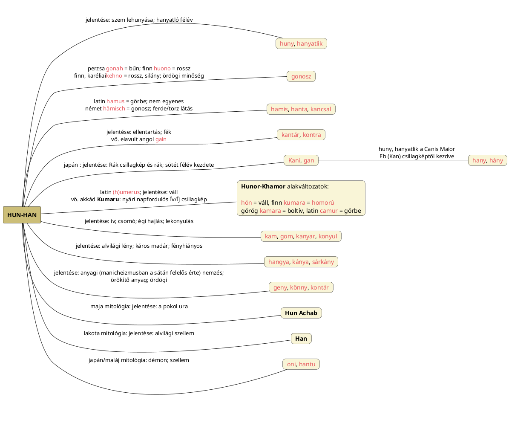

---
{"dg-publish":true,"permalink":"/K/Kontár/","title":"Kontár","created":"2025-03-05T02:30","updated":"2026-01-05T21:39"}
---

# Kontár

#### A Czuczor-Fogarasi szótár adata:

> Széles ért. mesterember, ki mesterségét nem érti, ki rosz munkát készít. Szorosb ért. czéhba nem keblezett, alattomban dolgozó kézmives. Ha első értelmét veszszük, valószinüleg a csonkát jelentő konta törzstől ered, mely szerént kontár az, ki nem ép, nem tökéletes, hanem hiányos, hibás, mintegy csonka müveket készít \[nem úgy mint isten\], mintegy: tonkár, csonkár. Ez értelmezést az is látszik erősíteni, hogy Gáthy János szerént (Tájszótár 112) épen Szathmárban divatozik különösebben ezen két szó: konta és kontár a nép között; de ez utóbbi az ország nagy részében ismeretes. Adelung szerént is ugyanezen fogalomrokonság van a német `stümmeln` (csonkít) és `Stümper` (kontár) között. Átv. ért. kontárnak mondják gúnyosan és megvetőleg, ki a szépmüvészetet kellő képesség is kiképzés nélkül űzi. Kontár festész, szobrász, költő.
- Ezen Stümper ha az s-mobile leválasztásra kerül, nem más, mint tümper, mely már a [[D/Dumb\|dumb]], valamint a [[S/Stupid\|stupid]] és [[T/Typhon\|Typhon]] neveket idézni. A csonkítás fényelvonás.

Egynémely helyen már előjött a szó: lásd [[C/Contra-\|contra-]] és [[C/Centre\|centre]]. Utótagja tehát mivel csillag jelentésű kell legyen, és [[K/KON\|KON]] = Nap, igen könnyen kivehető a kontár [[O/Ördög\|ördög]]i értelmét tekintve, hogy a(z Orion-)Szíriusszal való azonosítása indokolt.  

Kandra Kabos Magyar Mythologia című könyvének (a PDF) 37. oldalán jobb oldalt középen is szól arról, hogy a világ teremtésében (a különféle eredetmondák alapján) **az az [[O/Ördög\|ördög]] teendője, hogy Isten mellett kontárkodjék és a teremtés urának tehetetlen utánzója legyen**.  
- Nem is tudta Kandra, hogy milyen jól fogalmazott, hiszen az Ördög és a Kontár azonosak!

Madách Imre Az ember tragédiájából is idézhetünk (Első Szín, Lucifer szájába adva):  
> *"Te nagy konyhádba helyzéd embered,  
> S elnézed néki, hogy kontárkodik,  
> Kotyvaszt s magát istennek képzeli."*

Az ördög képzet viszont kiterjedt az ősfelfogásban: egyrészt ellenpárja a fényt szülő Istennek és a fény-árnyék rendszerben a [[K/Kutya\|kutya]] szerepében is ő jelenik meg, valamint csillagászati szempontból az [[A/Alvilág\|alvilág]] (az [[E/Égi egyenlítő\|égi egyenlítő]] alatti tér) ura is lehet.  
Legutóbb egy Quora válaszadó adatai nyomán [[D/Drug\|drug]] címnél a "húzza a lábát" (azaz [[S/Sánta\|sánta]]) fogalma mellett előjött a kontár fogalmának körülírása is.  

A [[K/Kantár\|kantár]], kontár és a kontra = ellen értelem egy fogalmi körből kerül ki és bár mai értelmezésben a [[L/Ló\|ló]]val (mely ló a Tejút is lehet) kapcsolatos (tellurikus) kontextus juthat eszünkbe, az etimonok jelentésének ismeretével sikerül asztrális környezetbe visszaemelni.  

[[K/Kantár\|Kantár]], [[K/Kuntar\|kuntar]] nevek és a [[C/Contra-\|contra-]], [[C/Centre\|centre]] szavak mellett említhető a [[H/Hunter\|hunter]] is. Valójában ezen nevek, sőt, kiegészülve az [[A/Andra\|Andra]] és [[O/Other\|other]] címnél taglalt An-Dar formával[^1] (és akár az [[A/Anta\|anta]] és [[A/Anti-\|anti-]] = ellen formával, de még a [[H/Hanta\|hanta]] is efféle, logikus név) mind ugyanazt jelölik: Orion kovácsistent/Démiurgoszt, aki sátáni/ördögi szerepkörét úgy nyeri el, hogy a Nap azon égi territóriumba jutva már veszti erejét.  
Tehát ami a germánban `Hunter` = Vadász, Orionra utalva ([[W/Winter\|winter]] is azonos lehet vele, hisz télen látható), az a magyarban `Kontár` = Orion ördög aspektusa, az aki félmunkát végez, mert a tökéletes munkát csak olyan Isten végezhetne el, aki a sötétséget és a sötét, gonosz mentalitást nem tűrné a földünkön. Igaz, a világ egyensúlya csak úgy jöhet létre, ha létezik ellenerő. Ha nem létezne, elszabadulna minden. Ha nem lenne tél, kiszáradna a Föld.  
Ezen ellenerő az, ami a latin [[C/Contra-\|contra-]] fogalmában megvan. [[E/Ellen\|Ellen]] fogalmáról lásd ott, valamint [[E/Ellentétek harca\|ellentétek harca]] és [[N/Nap#Nap – Ellen-Nap\|Nap – Ellen-Nap]] címeknél.  

[[S/Sarkcsillag\|Sarkcsillag]], valamint [[S/Szíriusz és a medvék\|Szíriusz és a medvék]] címnél szerepelt legutóbb a fentebbi passzus átírva:  
Van más kapcsolat is a Szíriusz és a Sarkcsillag között, elnevezések (és mögöttük álló fogalmak) szintjén (talán már megvolt valahol hasonló okfejtés).  
Kontár címnél legutóbb írottak alapján tudjuk, hogy ami egyszer Hun-Ter = Vadász, másutt Kantár, Kontár, mely mutatja, hogy ellen-Napról van szó (Orion-Hunor csillagkép [[M/Magor\|Magor]] születési helyével szemben áll). Az [[A/Andra\|Andra]] és [[O/Other\|other]] (valamint [[A/Anta\|anta]] és [[A/Anti-\|anti-]]) címnél írottak alapján is látjuk, hogy a másik Nap, az [[N/Nap#Nap – Ellen-Nap\|ellen-Nap]] az, amiről itt szó van. Igen ám, de igen hasonló alakú szavak a [[C/Centre\|centre]] = központ és a [[K/Kampó\|kampó]] és [[K/Kantár\|kantár]] címnél is előjövő török [[K/Kuntar\|kuntar]] = kampó is. Ezen szavak már inkább a [[S/Sarkcsillag\|Sarkcsillag]]ra látszanak utalni (An-Dar jelentése Án Csillaga, mely viszont a mindenkori [[S/Sarkcsillag\|Sarkcsillag]] neve is lehet [[A/Anu\|Anu]], [[S/Sárkány csillagkép\|Sárkány csillagkép]] és [[T/Thuban\|Thuban]] címnél írottak szerint). [[C/Centre\|Centre]] lehet még persze a [[G/Galactic centre\|Galactic centre]], a Tejútközpont is. Az egész rendszer működését a szavak alapján le kellene már fixálni ([[D/Dzsed\|dzsed]] és más címnél már volt erről szó, ki tudja mennyire helyesen megrajzolt diagramos adatokkal is; közben a [[S/Szíriusz mozgása#Szíriusz ketyegő, oszcilláló mozgása\|Szíriusz ketyegő, oszcilláló mozgása]] cím/alcímnél írottakat is figyelembe kell venni).  

A Kontár-Ördög szaturnikus is. Az alábbi, Hamlet Malmából való, [[S/Sarkcsillag\|Sarkcsillag]] címnél is szereplő sorokat leginkább a török [[K/Kuntar\|kuntar]] = kampó(csillag) szóval való kapcsolat miatt venném ide, de azért is, mert a szerzők által megfogalmazott "középpont felett ügyelő isten" valójában rámutat, hogy a [[S/Sarkcsillag\|Sarkcsillag]] körüli mozgatásért felelős isteni erő ("[[F/FU\|FU]]") és az Ördög és Isten harca ugyanaz:  
> A\[z Orion csillagképhez köthető bolygó-istenség\] Szaturnusz, a kozmosz mértékeinek adója, Babilonban a "Törvény és Igazságosság Csillaga", a "Nemezis Csillaga" Egyiptomban, de a Szükségszerűség és Megtorlás Uralkodója, röviden a Császár. Kínában Szaturnusznak a címe "Génie du pivot", mint a **Középpont felett ügyelő isten, s ugyanezt a címet kapja a Sarkcsillag**.  

Lásd még a rokon alapszavakat tartalmazó [[H/HAN\|HAN]] és [[G/Gonosz\|gonosz]].  

<a class="markdown-embed-link" href="/H/HAN/#han-hany-huny-diagram" aria-label="Open link"><svg xmlns="http://www.w3.org/2000/svg" width="24" height="24" viewBox="0 0 24 24" fill="none" stroke="currentColor" stroke-width="2" stroke-linecap="round" stroke-linejoin="round" class="svg-icon lucide-link"><path d="M10 13a5 5 0 0 0 7.54.54l3-3a5 5 0 0 0-7.07-7.07l-1.72 1.71"></path><path d="M14 11a5 5 0 0 0-7.54-.54l-3 3a5 5 0 0 0 7.07 7.07l1.71-1.71"></path></svg></a>

# han-hany-huny diagram

## Han-hany-huny diagram

A sötétbe borulással járó konyul, ellen(tartás), gonosz, stb. jelentésű szavakat Hun(or-Khamor)/Han (Kan) alapszavakra bontás után kiviláglik, hogy az egész földön egyazon szóalak és annak változatai terjedt el:  

## Lábjegyzetek

[^1]: Lábjegyzet:  
An-Dar = más(ik) értelme lényegében azt jelenti, hogy a [[M/MES\|MES]]-fa Tejútközponttal szemközti oldalára, a "másik Nyilasra" utaltak vele, de valódi értelme Án Csillaga, mely viszont a mindenkori [[S/Sarkcsillag\|Sarkcsillag]] neve is lehet [[A/Anu\|Anu]], [[S/Sárkány csillagkép\|Sárkány csillagkép]] és [[T/Thuban\|Thuban]] címnél írottak szerint.  
An-Dar egyúttal megfelel a [[H/Hunter\|hunter]] névnek is: a másik, a télen ([[W/Winter\|winter]] is hasonló alakú szó) látható Orion a nyári napfordulós állás a téli napfordulóshoz képest.  