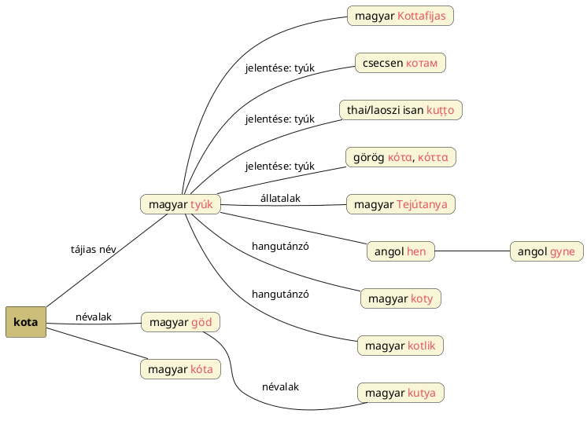

---
{"dg-publish":true,"permalink":"/K/Kota/","title":"Kota","created":"2024-11-08T15:22","updated":"2024-11-21T18:23"}
---

# Kota

## Kota - tyúk

Tájias neve a tyúknak. És hogy ez mennyire így lehet, elárulja egyrészt, hogy megjelenik a Toroczkai-Wigand Ede könyvében található népi csillagnevek között is, a **Kottafijas** = Fiastyúk névben, másrészt, hogy az idegen nyelvek közül a csecsen `котам` = tyúk, a thai/laoszi isan nyelvű `kut̩t̩o` = tyúk, de a görög `κότα`, `κόττα` = tyúk egy az egyben azonos a hun-magyar szóval! Még ugyanúgy egy és kettőzött t-s variánsa is van.  

A tyúk (kivált többes alakjával, mely a Tejút csillagtestére lehet utalás) igen is lehet a [[T/Tejútanya állatalakjai\|Tejútanya állatalakja]], nemcsak mert tojás tojással melengetéssel anyai szerepkört lát el, hanem mert a Kota/Kotta ugyanúgy [[G/Göd\|Göd]] alakú név, mint a kutya.  

Még egy dolog miatt gondolnám, hogy a tyúk lehet a Tejútanya állatalakja: a [[H/Hen\|hen]] címnél előjött szóalakok egyeznek a [[G/Gyne\|gyne]] címnél előjövő szavakkal. Persze lehet, hogy csak arról szó, hogy a tyúk a földi nőkre utalva köznyelviesen volt használatban régen is.  
Ha a nevét a kotlásáról, kot-kot-olásáról kapná, lásd erről [[K/Koty\|koty]] és [[K/Kotlik\|kotlik]]. Lásd még [[K/Kóta\|kóta]].  

^ogfwrw