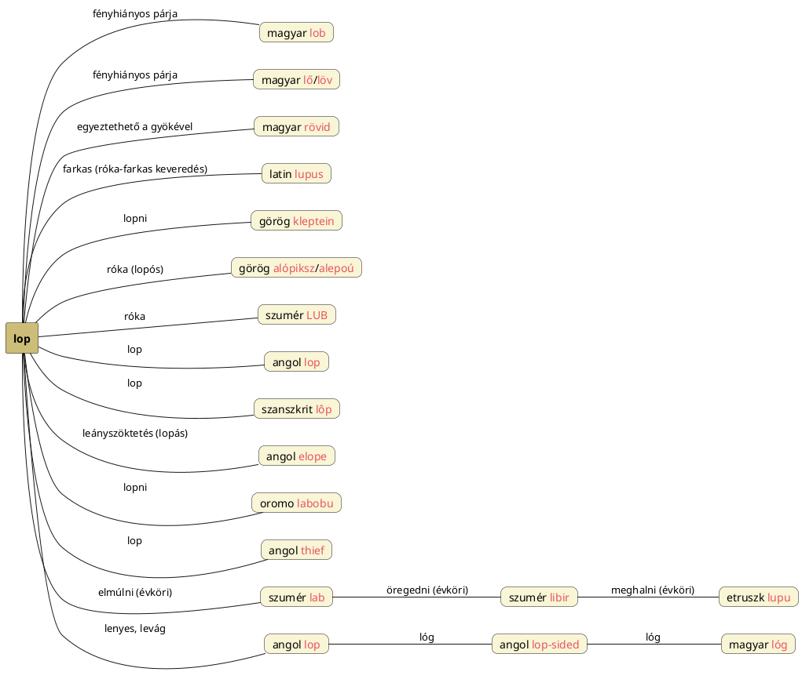

---
{"dg-publish":true,"permalink":"/L/Lop/","title":"Lop","tags":["titleandheadingonedontmatch","multipleentries","stitched"],"created":"2024-11-23T05:21","updated":"2025-06-08T01:14"}
---

# Lop 1)

A lop a [[L/LOB\|LOB]] illetve a [[L/Lő\|lő]]/[[L/Lő\|löv]] fényhiányos párja. Lopni a tüzet és az aranyat, pénzt szokták, na meg az aranyos menyecskét (lásd [[N/Nőrablás\|nőrablás]]), de leginkább arra utal a szó, hogy lopni [[B/Bűn\|bűn]], és ahogy a [[C/Csór\|csór]] is fényhiányos, ez is, és ha lehet évköri értelmet adni neki, akkor a lop oldala a [[B/Bűn\|bűn]]/[[F/Fene\|fene]]/[[G/Gonosz\|gonosz]] sötét oldala, a sötét félévre utalóan.  
[[R/Rövid\|Rövid]] szavunk röv- gyökével is egyeztethető lehet \[L = R\].  
[[B/Bal és jobb#Bal/Bál oldal és Láb (Löv/LOB kontra Lop) oldal\|Bal/Bál oldal és Láb (Löv/LOB kontra Lop) oldal]] cím/alcímnél írottak alapján lop lenne a téli napfordulós pont, [[L/Lő\|löv]] pedig a nyári napfordulós pont.  
Tomory Zsuzsa és Kolumbán Sándor szerint az egyébként farkas jelentésű latin [[L/Lupus\|lupus]] is a lop szavunktól ered (amennyiben itt is a róka-farkas ideák keveredéséről lenne szó; a róka lopja a tyúkot ugye, viszont [[F/Fenrir\|Fenrir]] farkasként égitest/fényrabló). A nyelv illetve a szavak kialakulása nem így működik viszont.  

#### Péterfai János...

...levezetése szerint:  
> [[F/Farkas csillagkép\|Farkas csillagkép]] a [[L/Lupus\|Lupus]], ahol a Lu Fény, a Pus lehetne Láb is, ami a farkasnak Fény-Lábú jelentést ad. Egyértelműen a Farkas, vagyis Lupus csillagképről van szó a latin névben.  

Igen ám, de mivel viszont a latin `lupa` = kurva és a [[R/Róka\|róka]] a női szeméremrész állatalakja, nem elképzelhetetlen, hogy eredetileg tényleg a rókát nevezték így, vagy arról lehet szó, hogy a farkas a kutyával lett keverve és a [[K/Kurva\|kurva]] címnél írottak figyelembevételével annak szeméremrésze/vulvája vitetett át magára a kurva jelentésre. Figyeljük meg, a farkas germán [[W/Wolf\|wolf]] neve egyező is a [[V/Vulva\|vulva]] névvel!  

(Azt most külön nem magyarázom, hogy a [[F/Farkas\|farkas]] és róka hogyan keveredett és a farok hossza alapján mely állatnak kellene inkább farkas nevűnek lennie a magyarban is, az viszont érdekes és fontos, hogy téridőbelileg a [[F/Farkas csillagkép\|Farkas csillagkép]] helyileg ott van, ahol a [[V/Vulva\|vulva]] is, a [[L/Lyuk\|lyuk]] is: márpedig a farkas görög neve `lykosz`.)  

Lop szavunk [[K/Kleptomania\|kleptomania]] címnél említett görög előtétes változata `kleptein` = lopni.  
`Lop` igénk látszik feltűnni a görög `alópiksz` (másképp: `alepoú`) = róka szóban is. Névelővel: [[A/A#'A' a nevek elején (névelő?)\|a]] lopós? Gyanús tehát megint, hogy ami egy helyen róka, másutt farkas.  
Az [[A/A-\|A-]] címnél is említett görög rókát jelentő szóban nem annyira a "lopós" értelmet kellene keresni, hanem Kal-Eb ([[K/Kalb\|kalb]]) előhang nélküli változatát.  

#### Götz László Keleten kél a Nap...

...című könyvében szereplő adatok alapján viszont a [[W/Wolf\|wolf]] a kiinduló. Aztán másutt, könyvének 164. oldalán a szumér-görög szavak párhuzamait bemutató szavak között hozza a számomra eleddig ismeretlen sumér `LUB` = róka (ennek párhuzama lenne a latin `lupus` = farkas; vesd össze a latin `vulpes` = róka szót a `wolf` szóval) szót, mely viszont aligha lehet a Wolf nyomán eredő, így már a [[L/Lubdhaka\|Lubdhaka]] és [[L/Love\|love]] címnél írottakat idézi.  

Götz László könyvének 552. oldalától találjuk [[I/Iráni jövevényszavak\|az iráninak megállapított jövevényszavainkat]] és [[H/Harmatta János\|Harmatta János]] felé szóló kritikáját (kiemelendő, hogy a valódi ékírásos szumér szavakkal szemben az ősiráni és finnugor alakok csak becsillagozott hipotetikus alakok):  
> Ősir. \*raupaḥ, \*raupāśaḥ; fgr. \*repa, \*repeśe, ropa, \*ropaśa "róka".  
> Szum. `lub-a` = "Fuchs" (róka); vö. az ékjellel, amelynek piktográfikus ősképe "Kopf und Hals eines Vierfüsslers" (egy négylábú állat feje és nyaka), Deimel szerint valószínűleg a sakálé.  

Az angol [[L/Lop#Lop 2)\|lop]] és szanszkrit `lôp` = lop(!) szóban is megvan; létezik egy angol `elope` szó is, ahol a leányszöktetés kapcsán lopás ismét szóba kerülhet.  
Az afrikai oromo nyelvben `labobu` = lopni, ill. lásd még Magyar Adorján adatait [[T/Tűzlopás\|tűzlopás]].  
[[T/Thief\|Thief]] címnél is említettük lop szavunkat. Az angol szó T-F váza megegyezik [[T/Typhon\|Typhon]] neve előrészének vázával és akár [[D/Devil\|devil]]-ével is.  

Jobb híján ide téve:  
Götz László Keleten kél a Nap című könyvének 872-873. oldalán található szumér és etruszk szavakat hasonlító szószedetében hozza a szumér `lab` = elmúlni, `libir` = öregedni és etruszk `lupu` = meghalni szavakat, melyek eredete [[L/Lupus\|lupus]] vagy [[L/Love\|love]] eredetéhez köthető lehet, azaz mindenképpen évkörire gondolok, a Nap éves öregedésére. A [[M/Múlt\|múlt]] szóban is a csillagok neve volt meg.  

# Lop 2)

Lenyes, levág. Fák metszéséről [[T/Trim\|trim]] és [[P/Prune\|prune]] szavaknál is volt szó. [[L/Lop#Lop 1)\|Lop]] szavunk is elvevő értelmű, így az angol `lop` utalhat a fák lombozatának kisebbítésére is.  

# Lop 3)

A `lop-sided` szó után érdeklődve derül ki, hogy lop = `lóg`, mely szavak közel azonosak.  

