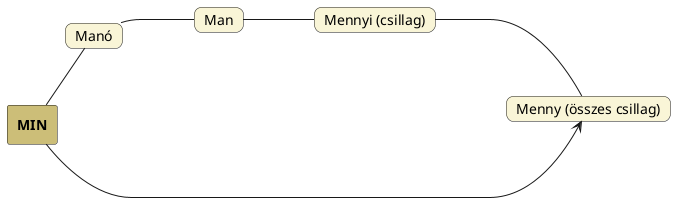

---
{"dg-publish":true,"permalink":"/M/Manó/","title":"Manó","created":"2024-11-23T05:21","updated":"2024-11-23T05:21"}
---

# Manó

#### Péterfai János írja:

> A magyar Manó szót régebben sokan Mani nevével hozták kapcsolatba. Maninak volt egy festett tankönyve, aminek Ertenk volt a neve. Ezt az Ertenk szót, aminek nem tudták a jelentését, rokonították az Ördög szóval, teljesen helytelenül. Ez alapján a Manó nevet Manihoz kapcsolták, akit egyébként rendkívül utáltak, és Manit is az ördöghöz igyekeztek kapcsolni.  
> A Manó névnek ősvallási a jellege. Sok mondás fűződik hozzá: Manó vigye, Mi a Manó, Hozott a Manó, A Manóba!, Mi Manó hozott ide?, Hiszi a Manó, Egye meg a Manó, Beleszeretett a Manó és hamar elvitte, Hogy a Manó el nem vivé a vén szipát, Tölts az ecetes korsóra, eljön a Manó, elviszi korsóstól.  
> Talán eredetileg jóságos volt a Manó, de a kereszténység felvétele után rossz lett.  
> A vénbába manó-ördögnek hadnagya. Ebben a szólásban a vénség fogalma jelenik meg. Az Ormánságban a Manyó Öregasszony. Hasonlóan a tündéri Banya, Bába név is az Öregasszonyra vonatkozhat. A [[M/Manes\|Manes]] Házi istenek Rómában, lehetséges a Manó kapcsolata velük is.  
- Ipolyi is rokonítja, de a házi istenek a [[L/Lares\|lares]].

> A szegények ajtaját nem őrzi a Manó, "A kevély szegényt a Manó is csudálva nézi", ebből a két mondásból a Manó Kincsőr szerepét lehet kiolvasni.  
> A szalma bábokat, madárijesztőket a nép Manóknak nevezte.  
> Még akkor a Manó is gatyában járt – ebből a mondásból azt véli kiszűrni Ipolyi Arnold, hogy a Manó ijesztő alak, valamint régi, mesés korból származik, vagy kincsszellem.  
> A Manók mérete lehet kicsi és lehet akkora, mint az ember. A füle hegyes, vagy nem hegyes. Használjuk keresztnévként is. A Manó név jelentése valószínűleg a Man és Ó nevekből áll. Ó-Emberekről van szó esetükben, amint a Manyó név is jelzi. A Man szó nagyon régi, a Men (Menny), Min, Mun rokona. Szó sincs germán eredetéről, sokkal régebbi, mint a germánok. Úgy gondolom, a Manók képzete tízezer évesnél régebbi.  

#### Bíró Lajos...

...alábbi adatát [[M/Manes\|manes]] címnél is szerepeltettük:  
> A magyar `manó` (malus genius, daemon) összevethető az avesztai `manah`, `mano`-val, melyek jelentése: 'geist, sinn', azaz: szellem, kísértet, Ielkület.
{ #xtn2o}

A polinéz/hawaii `menehune` kb. erdei kobold, manó: de [[M/Mana\|mana]] ill. menny és – a másutt erdő jelentéssel is ismert – hun szó is megvannak benne.  

## Manó szó kapcsolatai

Elsősorban a [[M/Men\|menny]] csillaga = tündér = manó = ember ([[M/Man\|man]]) (fia) – vö. [[M/MIN\|MIN]] megállapított csillag értelmével; MIN megoldását is men/menny szavunk segíti és a [[M/Mennyi\|mennyi]] megint csak a csillagok számára utal – logikai összefüggésben gondolkodhatunk.  

A latin-angol [[M/Minor\|minor]] szóval kapcsolható kelta-ír `meann`, walesi `myn` és az alant említett lapp `mana` is (kis)gyerek jelentésűek és a gyerekek mindig csillagok.  
Alapvetően a fiú = csillag, amely ha a Földhöz rendelt legfőbb csillag, a Nap éves útját tekintjük, a nyári napfordulón lesz (éves) élete delelőjén, mikor nemző apává érik.  
Hogy a manó szó az indoeurópai nyelvek [[M/Man\|man]] szavát adná, kétséges. Inkább közös eredetük kereshető [[M/Men\|men]]/menny-ben.  

Ami a Hold mén és manó kapcsolatát illeti, lásd [[M/Mén\|mén]] és alant.  

#### Kállay Ferenc A pogány magyarok vallása...

...című könyvében talált adatai:
> Kresznerics szerint "malus genius, daemon"; közmonda Dugonicsban "szegények ajtaját nem őrzi a manó", Dankovszki tovább nem tudott hatni, mint a görög `mainoon`-ra hivatkozni = daemoniacus, szokás szerint azért azt görög szónak adta ki. ([Lásd 276. old.](zotero://open-pdf/library/items/DFI47XPY?page=276&annotation=IGLSGKC6))  
> 
> De mi hát a Manó? felelet a Meny istene, különösben pedig a hold, mire a fennmaradt mythologiai és nyelv emlékek utalnak. Szóllottunk már Jesaiás Meni v. Meny nevü bálványáról s meny szó alatt, szólottunk az arab `menath`-ról, mely görög `μηνη` = hold. ([Lásd 276. old.](zotero://open-pdf/library/items/DFI47XPY?page=276&annotation=J3K2X2N8))  
> 
> Possart lapp grammatikájában is `mana` = kisgyermek, `mano` = hold. ([Lásd 278. old.](zotero://open-pdf/library/items/DFI47XPY?page=278&annotation=G9MKGJMP))
> 
> Bullet igy ir kelta szótárában `manong` örményül petit garcon (a lapp `mana`), franche comté-ben Manau-nak nevezik a gyermekek a felöltözött főfedett embert, ki őket ijeszti. ([Lásd 278. old.](zotero://open-pdf/library/items/DFI47XPY?page=278&annotation=6CPA2NWC))  
> 
> Mindezekből kitetszik, hogy a Manó név különösben a hold tiszteletét tárgyazta. ([Lásd 278. old.](zotero://open-pdf/library/items/DFI47XPY?page=278&annotation=33TJB374))  
- Minden más holddal kapcsolatos sorát lásd [[M/Moon#Hold idegen nevei\|moon]].