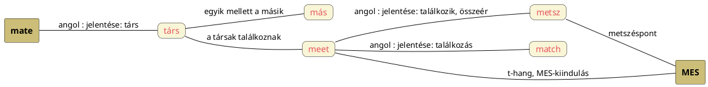

---
{"dg-publish":true,"permalink":"/M/Mate/","title":"Mate","created":"2025-05-29T17:04","updated":"2026-08-03T20:45"}
---

# Mate

Társ, barát, haver. A brit angolban sokszor feleslegesen használják, pl. "You're all right, mate?"; annyira feleslegesen, mint ahogy maga a kérdés sem kérdés, "magyar típusú" választ (jól vagyok vagy sem) nem várnak rá.  

Eredetileg [[M/Mátka\|mátka]] (amennyiben -ka kicsinyítő, édesgető, akkor mát alak is kellett létezzen) lehetett, ahogy Ádámnak is Éva segítő mátkája; később bővült jelentésköre. (`Mátka` szavunk helyett még jobb a `maca` alak. (Lásd még édesgető macz gyököt CzF szótárban.)  
  

A magyar mátka szót mind férfiról, mind nőről szokták érteni (holott valójában csak a nőre értett lehetne), de leginkább a mátka párja a [[K/Koma\|koma]].  

[[M/Más\|Más]] szavunk sokkal valószínűbb lenne eredeteként: a társ a.m. egyik mellett a másik (csillag).  
Annál is inkább mert, a társak találkoznak ([[M/Meet\|meet]]); itt és ott is t-hangos az a szó, amely [[M/MES\|mes]] ([[M/Metsz\|metsz]]\(éspont)) kiindulású lehet. Ha elmesek valamit, egyik és másik feleket kapom, melyeket össze is tudom találkoztatni ([[K/Köt\|köt]]ni; vö. [[C/Cut\|cut]] = vág).  

Argentínában `mate`/`maté` főzött teaszerű ital, melyet leszűretlenül isznak. Illata és íze az angol utazó szerint olyan mint a marijuanajé.  
Lásd még [[M/Mæg\|mæg]], [[M/Maik\|maik]], [[M/Match\|match]], [[M/Marry\|marry]], továbbá lásd még [[W/Wife\|wife]], [[F/Friend\|friend]], [[F/Fellow\|fellow]] és [[C/Chum\|chum]]. 