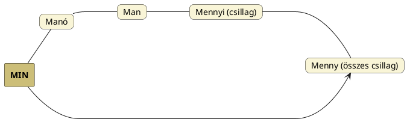
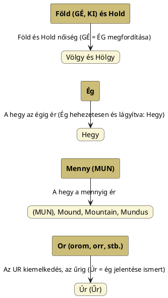

---
{"dg-publish":true,"permalink":"/M/Men/","title":"Men","tags":["containstransclusions","Englishtexttranslated"],"created":"2025-09-28T19:59","updated":"2025-09-28T20:00"}
---

# Men

Az alábbiakban többféle idea kerül tárgyalásra. A Men a Menni szavunk gyökere és Menny szavunk régies alakja is. [[M/Mén\|Mén]]t külön címnél érintjük, [[M/Megy\|megy]] címnél pedig inkább a gy-s végződésre irányítottuk a figyelmet.  

## Men, Menni, Mén

Menny szavunk régiesen[^1]. Okunk lehet feltételezni, hogy a Tejútanya ló-állatalakja erről a szóról kapta nevét[^2], de már hímségi lett. Sőt, a hímségi Holdisten neve is Men, Mén a kúnoknál, továbbá [[M/Mén\|mén]] irányban sok szó, értelem boncolgatható (lásd Fáy Elek adatát is ott). Például az [[A/Almanac\|almanac]] szónál is előjövő, egyszerre magyar és hun szócsoportba tartozó [[M/Megy\|megy]][^3], mendegél:  
Figyeljük meg, hogy minden menéssel, járással, úttal kapcsolatos szónak égi eredete van, ahogy a magyar nyelvet beszélő néptörzsek nevei is kapcsolatba hozattak ilyen bolyongást, [[V/Vándor\|vándor]]lást jelentő igékkel (persze azt le kell szögezni, a népnevek és az igék ugyanazon égitest-nevekből származnak és a népnevek nem a bolyongást jelentő igékből születtek).  
Eképpen pl. a palócok nevéhez a ballag, bolyong, a csángók nevéhez a csángat, magyarok-hunok nevéhez a megy, mendegél, kőrösök nevéhez a ([[C/Calendar\|calendar]] szónál is előjövő) halad kapcsolódik.  
A székelyek nevében szék egy helyben maradásra látszik utalni[^4], de mivel [[S/SZÉK\|SZÉK]] a Nap neve, (látszólagosan, a Földhöz képest) az is mozog.  

Tény, hogy a székelyekhez kapcsolt "székel" igéből messzemenő következtetéseket is levontak történészeink. Igazuk is lehet. Amíg a magyarok tanították a Föld népét és a hunok védték őket, addig a székelyeink székeltek, helyőrségként védték a Kárpát-medencét.

A császkál, csúszkál szavak akár összefüggésbe hozhatók az orosz `csasz` = óra szóval és [[U/UT\|UT]] = Nap (Ut > USZ, úszik az égen a Nap) nevével.  

A harmadik lábjegyzetes adathoz kiegészítésként jöjjön Götz László Keleten kél a Nap című könyvének 178. oldaláról az alábbi táblázatos adat (egy része):  

| óegyiptomi      | szumér      | akkád-asszír        | latin             | magyar |
| --------------- | ----------- | ------------------- | ----------------- | ------ |
| MAN-MAN (mozog) | MEN₃ (megy) | MÛN-abtu (menekült) | MAN-o (elmenekül) | MEN-ni |

Tulajdonképpen mindenhol megvan a Man/Men alak mozgás jelentése, és mivel több helyen kimondtuk, hogy a mozgás mindig körmozgás, lehet a [[M/MUN\|MUN]] címnél is taglalt Menny (csillagai) elfordulásáról szó és lehet szó a [[M/Mén\|mén]] = Hold körmozgásáról is.  

## Menny

Varga Zsigmond forrásaira (Bobula Ida) hivatkozva a menny szót Mu-An összetételűnek határozza meg. Valóban elgondolkodtató, hogy az `An` = Ég jelentése nem-e lehet meg a men szóban.  
Fáy Elek A magyarok őshona című könyvének 190. oldalán a szíriai Bál-Meon kapcsán írja, hogy a meon igen hasonló a mi szavunkhoz (de persze ő Szíriát őshazának mondja).  
Hasonló az eset a magyar én ([[E/EN\|EN]]) szóval, melyek más nyelvekben m-előhangosak; lásd sorolva [[M/Mine\|mine]].  
De ha már itt tartunk, [[A/AN, ÁN\|AN, ÁN]], valamint [[E/EN\|EN]] és [[I/IN\|IN]] címnél (sőt, az [[A/A\|A]] címnél álló MindMap diagramban) is arról volt szó, hogy sok igen fontos szakrális szavunk ezen alapszók előtételezésével jön létre.  

De akkor ott van még a Péterfai János által boncolgatott [[M/MUN\|MUN]]:  
> A Mun jelen van ősi Mun-Dil nevünkben, ami Mennyei Csillag jelentésű. A Mun Kő fogalma már a régebbi magyar nyelvből eredő nyelvekben csak Kő értelmű, és már talán nem tartalmazza a Menny (Mun) fogalmát.  

[[M/MUN\|MUN]] címnél (is) szerepelt a perzsa `āsman` = menny, ég szó értelmezése is. (A Wordsense oldal adata szerint a pártus `assamän`, perzsa `åsmān` = ég, menny, mely nyilván Ász-Menny, Ős-Menny olvasatú.)  

De ha már perzsa, lásd az alábbi adatsort más perzsa szavakkal...

#### Fáy Elek A magyarok őshona...  

...című könyvének 189. oldaláról:  
> A mi `menny` (a mordvin: `menel`, `menil`, ó-perzsa `manijú`, avesztai: `mainiju`, `zend`: `man`, új-perzsa: `minó`, `menó` megfelelőivel együtt) és `minden` szavaink elég szóalaki hasonlóságot mutatnak az egyiptomi Mendesz (a mendeszi kos) isten "a fiatal asszonyok férjé"-nek, továbbá a kosszarvú [[A/Amon\|Amon]] napistennek, az "elrejtett"-nek, valamint Min-nek, az egyiptomi `Pan`-nak neveivel, hogy már csak ezen hasonlóság alapján is lényegi összefüggést keressünk közöttük és az említett, kiválólag hímelvi termékenyítő istenségek között. A mi minden szavunknak az azonos jelentőségű egyiptomi Min (`Pan` = minden) istennel való összefüggését a japán `minna` (minden) szó is támogatja.  

#### Vámbéry Ármin Égitestek a török-tatár nép kultúrájában...  

...című dolgozatában az 5. oldalon hozza a türk párhuzamokat:  
> `Meng` vagy `mäñ`, a magasság, a mi fönn van, a legfelsőbb regio átalános elnevezése, mert végleges jelentése: ég csak a jak. `mängge` s magyar menny szóban található meg, a többi ide tartozó nyelvben pedig az e szóval összefüggő alakok mint melléknevek fordulnak elő. Így ujg. `meng-ki` = égi, örök (v. ö. `mengki ata` = Isten, a mennyei atya); `möngkü` = örök, halhatatlan.  

Mint ahogy az [alábbi](https://qr.ae/pNKAW4) válasz kommentfelületén Geetha Thirumalai nevű asszonnyal kialakult beszélgetésben kiderült, a tamil `maan` = szarvas, őz, mely tökéletes lenne mennyre vagy akár [[M/Mén\|mén]]-re. A másik, irodalmi latin szó szarvasra `marai`, mely már a `marha` szó felé terelne.  

Lásd még elsődlegesen [[M/Man\|man]], ahol szintén szerepelt az ősök, halottak, mennybe jutottak tiszteletével kapcsolatos, Sergei Tokarev által adatolt `manes`:  

<a class="markdown-embed-link" href="/L/Lares/#6m3nr" aria-label="Open link"><svg xmlns="http://www.w3.org/2000/svg" width="24" height="24" viewBox="0 0 24 24" fill="none" stroke="currentColor" stroke-width="2" stroke-linecap="round" stroke-linejoin="round" class="svg-icon lucide-link"><path d="M10 13a5 5 0 0 0 7.54.54l3-3a5 5 0 0 0-7.07-7.07l-1.72 1.71"></path><path d="M14 11a5 5 0 0 0-7.54-.54l-3 3a5 5 0 0 0 7.07 7.07l1.71-1.71"></path></svg></a>

> One of the most ancient aspects of the religious beliefs and rites of the Romans that lasted until the end of the Roman Empire, as was the case with the Greeks, was clan religion, the cult of family-clan guardian spirits. This form of religion lasted so long because the vestiges of clan organisation survived for so long, especially among patrician families. The Romans believed that the souls or shadows of the dead, manes, were guardians of the family and clan.  
> The expression `dii manes` (god – manes) was common. The initials of these words (dis manibus), the letters D.M. can be constantly found on tombstones. Incidentally, the term manism comes from manes, and denotes the cult of the dead, ancestor cult, as well as the theory for the religion related to this cult. Manes were regarded as similar or even identical to [[P/Penates\|penates]] that originally personified the household granary or storeroom (from penus – provisions, food supplies), and subsequently were considered household guardian spirits.  
> A third notion was similar to the first two, lares, which had broader meaning. A lar was in general a guardian spirit. Besides lares familiares (family guardian spirits) there were lares viales (guardian spirits of roads), lares compitales (guardian spirits of crossroads), lares permarini (spirits of seafaring), and even lares militares (military spirits) .  
> The extraordinary longevity of the family-clan cult among the Romans is evident from the fact that it continued until the total triumph of Christianity over the old religion: one of the last imperial orders against paganism, Lex Theodosius (392), banned family rites for the Lares and Penates. The family-clan cult among the Romans was related to archaic fire worship. Penates were spirits of the house-hold hearth. But the fire cult also took on a national form in connection with the origin of the Roman community out of clan associations. The eternal flame in the communal sanctuary was personified in the form of the goddess Vesta who was analogous to the Greek Hestia. In both cases the personification of fire in female form could be regarded as a survival of matriarchal society. Vesta was not depicted in anthropomorphous form; her symbol continued to be a natural flame burning eternally in the temple. This was further proof of the deep archaic roots of the fire cult among Romans.  
> —  
> A rómaiak vallási hiedelmeinek és szertartásainak egyik legősibb aspektusa, amely a Római Birodalom végéig fennmaradt, akárcsak a görögöknél, a klánvallás, a családi-klán őrzőszellemek kultusza volt. Ez a vallási forma azért tartott fenn ilyen sokáig, mert a klánszervezet maradványai is sokáig fennmaradtak, különösen a patrícius családok körében. A rómaiak úgy hitték, hogy a halottak lelkei vagy árnyékai, a manesek a család és a klán őrzői.  
> Gyakori volt a `dii manes` (isten – manes) kifejezés. E szavak kezdőbetűi (dis manibus), a D.M. betűk folyamatosan megtalálhatók a sírköveken. Egyébként a manizmus kifejezés a manes szóból származik, és a halottak kultuszát, az ősök kultuszát, valamint az ehhez a kultuszhoz kapcsolódó vallás elméletét jelöli. A maneseket a penateshez hasonlónak vagy akár azonosnak tekintették, amelyek eredetileg a háztartási magtárat vagy raktárt személyesítették meg (a `penus` – élelmiszer, élelmiszerkészlet szóból), és később háztartási őrzőszellemeknek tekintették őket.  
> Egy harmadik fogalom hasonló volt az első kettőhöz, a `lares`, amelynek tágabb jelentése volt. A `lar` általában egy őrzőszellem volt. A lares familiares (családi őrzőszellemek) mellett voltak lares viales (utak őrzőszellemei), lares compitales (keresztutak őrzőszellemei), lares permarini (tengerészek szellemei), és még lares militares (katonai szellemek) is.  
> A családi-klán kultusz rendkívüli hosszú élettartama a rómaiak körében abból is látszik, hogy a kereszténységnek az ősi vallás feletti teljes győzelméig fennmaradt: a pogányság elleni egyik utolsó császári rendelet, a Lex Theodosius (392) betiltotta a lares és penates családi szertartásait. A rómaiak családi-klán kultusza összefüggött az archaikus tűzimádattal. A penatesek a háztartási tűzhely szellemei voltak. De a tűzkultusz nemzeti formát is öltött a római közösség klánszövetségekből való eredetével kapcsolatban. A közösségi szentélyben lévő öröklángot Vesta istennő személyesítette meg, aki a görög Hesztia analógiájára szolgált. Mindkét esetben a tűz női alakban való megszemélyesítése a matriarchális társadalom fennmaradásának tekinthető. Vestát nem ábrázolták antropomorf formában; szimbóluma továbbra is egy természetes láng volt, amely örökké égett a templomban. Ez továbbá bizonyította a tűzkultusz mély archaikus gyökereit a rómaiak körében. 

Egy hasonló, sőt azonos alakú latin szó a [[L/Ló\|ló]] címnél is említett `mane` = reggel[^5], mely Ipolyi Arnold Magyar mythologia című könyvének 332. oldala alapján érthető meg: a futó ló személyesíti meg a Napot. A 353. oldalon és előtte hosszan elemezni a lovat, melyen a hajnal jön. Ezek illetve az ottaniak szerint a Nap és a Hold ló által húzatik be/elő, éppen úgy, ahogy a [[H/Hamlet malma\|Hamlet malma]] lóerővel forgattatik.  
A latinban tehát nemcsak a hónap, hanem a reggel is a [[M/Mén\|mén]]hez köthető (ezen passzus ott is szerepelt).  
Ugyanakkor [[H/Hajnal\|hajnal]] címnél írottak alapján az sem kizárt, hogy meny szavunk élő mögötte.  
Götz László táblázatos adata szerint másutt is megtalálható a latin szó párja:  

| óegyiptomi               | szumér         | akkád-asszír                | latin          | magyar |
| ------------------------ | -------------- | --------------------------- | -------------- | ------ |
| MAN-u (a napkelte helye) | MEN₇ (ég, nap) | MUN-attu (hajnali derengés) | MAN-e (reggel) | MENNY  |

Falvay Károly Nagyboldogasszony című könyvének 43. oldalán Mészöly és Rédei adatait osztja meg a menny és a [[M/Megy\|megy]] kapcsolatáról. Könnyen lehet, hogy belemagyarázós okoskodás. Annál is inkább, mert véleményem szerint megy a [[M/MAG\|Mag]] Napnév nyomán jött létre: minden mozgás hímségi (továbbá a [[J/Jön és megy\|jön és megy]] témát is lásd). Igen ám, de legfelül azzal kezdtük, hogy a Hold [[M/Mén\|mén]] nevéből is származhat a mozgás fogalma.  
Falvay könyvének 84. oldalán újra felkapja a témát és kijelenti, hogy igeként a menny szó megy, változik értelmű, hogy a csillagos ég forogva megy. Nos, valóban a [[M/MUN\|MUN]], [[M/Munka\|munka]] és [[H/Hamlet malma\|Hamlet malma]] címnél írottak szerint ez igaz is. Felhozza még nők forgása kapcsán [[F/Fortuna\|Fortuna]] istennő és gyermekjátékaink leányfordulatát.  
Az általa még felhozott [[M/Mennyi\|mennyi]] szó is ugyanúgy a mennybeli csillagokra utal.  

### Menny és mony (tojás)

Fentebb már szóba jött a [[M/MUN\|MUN]], mely munka szavunk alkotója és a [[M/Munka\|munka]] az a szó, mely a [[K/Kozmogónia és kozmológia\|kozmogónia és kozmológia]] fogalmai mögött egyaránt áll: munka a szülés/születés és a körforgás fenntartása ([[H/Hamlet malma\|Hamlet malma]] képzet).  
Igen érdekes, hogy a maja nyelvben is megtaláljuk a párhuzamokat. A Bakos Attila A Duna Evangéliuma című könyvének 167-168. oldalán említett mayapáni Mehen vagy Mahan (az első teremtmény, minden létező ősének képzete, aki kékre festett kozmikus tojásban trónolt) neve [[M/Mén\|mén]] és [[M/Man\|man]] mellett `men` = menny lehet, de figyeljük meg, hogy a [[M/Mony\|móny]] = tojás értelme is innen ered, men fogalmából.  
A Mehen/Mahan (mely utóbbi [[M/Magan\|Magan]] (Bakos Attilánál másképpen Maan) nevét is idézi) nyilván olyan, az [[A/Ajakhangok a szó közepén\|ajakhangok a szó közepén]] címnél is taglalt széthúzásról árulkodnak, mint más esetekben (hogy lesz Úrból Uhor és Ugor).  

A menny-mony összefüggésének párhuzamát látjuk a [[K/Kuk\|kuk]] (ég kékje/sötétje) és a [[C/Coco\|coco]] címnél is taglalt magyar tájias `kokó`, `kuku` szavakban.  
[[K/Kuk#Kuk és kok(ó)/kuku (tojás)\|Kuk és kok(ó)/kuku (tojás)]] cím/alcímnél volt szó arról, hogy a tojás az eget szimbolizálja. Melyhez annyit tehetünk hozzá, hogy a felső [[H/Héj\|héj]]át látjuk mindig (mint [[C/Csuda\|csuda]] címnél láttuk az égboltot) és a teremtéstörténetek tojása is ég-metafora.  
Lám, a tojás és a kékség Bakos könyvében az említett helyen elő is kerül[^6].  

### Menny és ég

Falvay Károly Nagyboldogasszony című könyvének 74. oldalán a magyar nyelvünkbeni női kifejezéseket taglalva rámutat, hogy a **menny és ég szavak között különbséget kell tenni. Előbbi nőiségi, utóbbi hímségi** lenne.  
Innen [[M/Meny\|meny]] egyértelműen nőiségi szavunk.  
Az [[E/Eire\|Eire]] és [[E/Éva\|Éva]] címnél írottakat (miszerint Évát egyes felfogás szerint ugyanúgy (l)égistennőnek (azaz ezek szerint inkább menyasszonynak) foghatták fel, mint az egyiptomi [[N/Nut\|Nut]]ot és [[A/Ádám\|Ádám]] (= föld\[?\]), úgy kerülne alá, mint ahogy az egyiptomi [[G/Geb\|Geb]] földistennek\[?\] volt felfogva (lásd képekkel [[N/Nut\|Nut]] és új adatokkal [[G/Geb\|Geb]]).  
Ezen menny fia lenne a [[M/Man\|man]] = ember; a menny tulajdonképpen a Tejút (szférája), ahonnan az ember (lelke) származik.  

  

#### Falvay Károly Nagyboldogasszony...

...című könyvében írja:  
> Énekes gyermekjátékaink feldolgozása és értelmezése közben meglepődve ismertem föl azok kizárólagos női kapcsolatát, és egyben rendkívüli nevelési jelentőségét, melyről könyveim és tanulmányaim jelentek meg. Először észleltem a magyar nyelv nemiséggel kapcsolatos érzékenységét. A nyolcvanas évek végén mindezt felerősítette a vizsolyi biblia első sorához írott Károli Gáspár-féle jegyzet megismerése. Az általa magyar nyelvre fordított Genezis első sorában "Kezdetben teremte az Isten a mennyet és a földet" a menny szót Károli megjelölte. A lapszéli jegyzetben a következőket olvashatjuk: "Az Mennyen, Földen, mélségeken, vizeken mind eggyet ért, tudniillic azt á miből Menynyet, Földet minden ékességével egybe terété."  
> Pongrátz Eszter 1719-ben először kiadott Arany Korona imádságoskönyvének Kisaszszony napi magyarázata megerősíti Károli megállapításait: "Kezdettől fogva, és az idők előtt teremtettem, és mind a' jövendő világig meg nem szűnöm..." ami idézet a Példabeszédek vagy Bölcsesség Könyvéből. (Másutt: Arany Korona imádságos könyv 11. része Kis Asszony napján, 8. Sept. olvashatjuk: Halmoknak előtte születtem én, még a' földet nem teremtette vala és a' folyó vizeket, és a' **föld kereksége sarkait**. Mikor a' földnek fundamentomit veti vala, ő véle voltam, mindeneket elrendelvén..." E szövegben nem kevesebbről van szó, mint a női teremtő erő elsőségéről.)  
> Pedig, ha ez így van – márpedig így van – akkor a menny nem lehet hímnemű fogalom! Sőt! Az ellentét egységében a Földdel szemben az Ég a hímnemű fogalom! A keresztény vallásnak is ez a képzet a szilárd alapja, (Krisztus: a "Világ világossága.") ami ugyanakkor mindenben azonos a magyar világképi hagyományokkal, melyek nem azonosak az indoeurópai népek sokkal korlátozottabb nyelvi lehetőségeivel!  
> 
> Már Károli Gáspár figyelmeztet a vizsolyi Biblia fordításában a Föld és a Menny egységének női tulajdonságára, amikor a Menny fogalmat, mint a Menny és a Föld egységét, de nem azonosságát magyarázza.  
> Ugyanez hangzik föl a régi sumer táblán:  
> *The lord whose decision are unalterable,*  
> *Enlil, who brings up the seed of the land from the earth,*  
> *Took care to move away Heaven from Earth,*  
> *Took care to move away Earth from Heaven.*  
> —  
> *Enlil, az Úr, akinek elhatározásai megváltoztathatatlanok,*  
> *Ő az aki felhozza a föld mélyéből az ország magját,*  
> *Óvatosan mozdítsa el a Mennyet a Földtől,*  
> *Óvatosan mozdítsa el a Földet a Mennytől.*  

Ezen a ponton kívánkozik ide Péterfai János passzusa:  
> Schalk Gyula írja, hogy a magyar nyelvben megkülönböztetődik a Légkör (`firmamentum`) és az Égbolt, ami a Fény (`lux`), az Égés (`ardet`), a Láng Fénye és a Ragyogás birtokosa. Van egy másik Egünk is, ez a Mennybolt, a Mennyország, eredetileg Men. Az An is Ég, Menny értelmű, sok változatban szerepel a magyar névanyagban, például Ány, vagy An. A német nyelvben a `Himmel` mellett a szász tájnyelvben előforduló `Hevan`, és az angol `Sky` és `Heaven` ismer ilyen kettős értelmet. Ennek eredete talán az lehet, hogy a germánok kialakulásában a magyarok játszották a legfőbb szerepet.  
- Az angol [[S/Sky\|sky]] = ég, [[H/Heaven\|heaven]] = menny, míg a latin [[C/Caelum\|coelum]] = menny, ég és `firmamentum` = ég(bolt).

Kétségtelen, éppen ahogy a régi nyelv megkülönböztette a hajnalt, pitymallatot, pirkadatot, megkülönböztette az ég (hagymahéjszerű) rétegeit, melyekről [[H/Héj\|héj]] és [[S/Sphere\|sphere]] címnél is volt szó.  

Falvay Károly könyvének 107. oldalán pedig arról szól, hogy a (judeo-)keresztény felfogásban a mennyország atyai terület. Ez ellenkezik a magyar ősfelfogással. (Bakos Attila A Duna Evangéliuma című könyvének 228. oldalán az Úr-Szék összefüggésben látja az [[O/Ország\|ország]] értelmét, miután a Mennyország szavunkat Mén-Úr-Szék-ként említi. Bakos nem veszi észre, hogy az elnevezés patriarchalizmus előtti.)  
Több helyen szól arról, hogy egyes indo-európai szavak hímneműként jelölnek meg olyan fogalmakat, melyek nőneműnek kell lennie (az olasz `la notte` nőneműsége például stimmel):  
> A német nyelvű `der Himmelsgöttin` = égistennő hímnemű fogalom, ami önmagában képtelenség.  

#### Karcagi Oláh Imre Külföldi és magyar írók a magyar mitológiáról...

...című Ősi Gyökér 2005/2. sz. megjelent cikkében bizonyos Kulcsár Józseftől idézi:  
> Egy egyiptomi felirat azt mondja, hogy "Borral terhes az Ég, amikor megszüli leányát a hajnalt."  

Valójában itt is az ég helyett a men = menny szó kell szerepeljen, hiszen a [[H/Hajnal\|hajnal]] előtt a csillagos eget látjuk. A meny-asszony lánya a hajnal. Ez lehet akár a [[N/Napistennő\|Napistennő]] képzet alapja is.  
Az tény, hogy a menny [[M/Mén\|mén]]nel, hímlóval való (nyelvi és mitológiai) azonosítása már a későbbi, hun napvallások kialakulásának idejéből származik, mégpedig Ménrót-Nimród "lósága illetve lófasza" ideájának kibontásával.  

Másutt még (Falvay Károly Nagyboldogasszony című könyvéből; [[A/Alvilág\|alvilág]] címnél is szerepelt):  
> A menny tehát térben felső fogalom, mint a mennyboltozat fölötti világ, ami valahol a sötétség fölött, a "föld fölött", a csillagok boltozata fölötti térben vagy éppen az alvilágban van. A kiskert ugyanis félreérthetedenül az Éden, a gyönyörök kertje, ahol a Boldogasszony méze, az istenek eledele "terem" a "kiskertjében". A menny és a föld fogalom közös egységében más nézetben az ismeretlen "más-világ" és az ismert világ egysége is megmutatkozik. Ez az egység a más-világban működő ősök, és az élők világának egysége.  

Falvay könyvének 149. oldalán a változás = forgás és világosság/sötétség kapcsán írja:  
> Az ég szó alatt égboltot is értünk. Kör horizontjuk egyértelműen utal a kör szimbólumának kapcsolatára. Sajátossága, hogy világosság, változatlanság jellemzi.  

A menny a magyar fogalmak szerint a sötétséggel azonosul, ami a kettőződés folyamán kiterjed a csillagos éjre, s ezzel együtt a változással, körbefordulással azonosul. Ez azt jelenti, hogy a menny változó, alapjaiban igei fogalom ([[M/MUN\|MUN]] is menny, mely [[M/Munka\|munka]] és [[M/Malom\|malom]] vonatkozású is).  
Ő hozza létre magából a fényt, majd a világosságot, ami később őbenne tűnik el. Más nézetben és jelenségként a csillagképek a mennybolton kör alakúan forogva mozdulnak el. A forgás az ún. [[S/Sarkcsillag\|Sarkcsillag]] körül történik, mely változó helyzetű a földi tengely billegése miatt. A forgáspont így virtuális középpont.  
Az ég és a menny fogalom között tehát éles különbség van a világosság és sötétség, a változatlanság és a változó állapotuk miatt, ugyanakkor mindkettő a kör fogalomhoz kapcsolható. Ez utóbbi is képezheti a zavart a megkülönböztetésükben. A tudományos gyakorlat mind a mai napig nem számol ezzel, amiből súlyos képzetzavar és félreértések származnak.  
Itt jutnak eszembe a [[K/Kuk\|kuk]] és [[S/Sine\|sine]] címnél kék szín kapcsán írottak.  
A kék, mely az orosz nyelvben külön nem is szerepel, csak világos és sötétkék formában, két ilyen ellentétes színe tehát az égnek/mennynek: ég(szín)kék(je), és a feketébe átmenő sötétkék pedig az éjszakai ég, a menny színe. Ugye a téma nálam ott indult el, hogy a sumér `gig` = kék és (sötétkék?) fekete jelentésekkel is előjött. Lásd [[K/Kuk\|kuk]].  
Tulajdonképp az orosz jól gondolkodik, mert meg akarta különböztetni az eget a mennytől.  

Falvay Károly Nagyboldogasszony című könyvének 384. oldalán taglalja az istenanyát, ahol nagyon szépen rámutat, hogy a magyar népi gondolkodás a Nagy természettel és az ezt jellemző Nagy Évkörrel azonosította. Majd:  
> Ebben a magyar fogalmak szerint a menny és a föld képzet kettőssége kap hangsúlyt. Ezt a kettősséget nyelvi okokból a keresztény eszmeiség nem ismeri. Csak ég képzetben gondolkozik, ami alatt viszont "éjszakai eget" érthet, amit egy szóval magyarul csak a menny szó fejez ki. Ebben egyezik meg a két gondolkozás és tökéletesen azonosítható lehetne az egymástól nyelvileg különbözően megjelenő képzet.  
- Erre válaszul még azt mondanám, hogy ég jelentéssel [[A/AN, ÁN\|AN, ÁN]] is jelentkezik, melyet akkor vajon milyen jelentéssel adna meg Falvay, ha tudná, hogy anya/ana szavunk ebből az értelemből indul ki? Nem lehet, hogy a magyar nyelvben ég kettős jelentésű, azaz külön nem mondja ki, hogy éji vagy nappali ég? Itt jut viszont eszünkbe az orosz nyelv "kékes ügye," mely nyilván nem véletlen.

[[T/Tűz\|Tűz]] címnél is szóba került a menny és ég ellentétessége:  
Bármennyire hímséghez is kötött a tűz, kapcsolódik a nőhöz is. Falvay Károly Nagyboldogasszony című könyvének 138. oldalától taglalja a tűz és víz fogalmait. Széljegyzetben találtam írni (miután Falvay azt írja, hogy a tűz "egyértelműen" női szimbólum \[is\]):  
Mindenütt hímségi volt a tűz. Persze a házitűznek őrzője Hesztia/Veszta szűz. A [[S/Szűz\|szűz]] és tűz is alaki változatok. Falvay könyvében is szerepel, a szentiváni ünnepségen is mindenütt csak a leány ugrik át a tűz fölött, akkor is, amikor az ő neve hangzik föl, akkor is, amikor a fiúé.  
Egyébként hasonló esettel találkoztunk fény kapcsán, hiszen a legfőbb fényforrás, a hímségi Nap mellett az éjszaka látható nőiségi Hold is égi világító, de főképpen a Tejút fehéresen fénylő sávja is nőiség.  
A leány tehát a magyar hagyomány Föld szimbólumában mindig a tűzzel, és esővárással, a fiú mindig az éggel és az ezzel összefüggő esővel kapcsolódik, írja Falvay. Ez jól kiegészíti a(z itt) fentebb írottakat. A (nőiségi-)sötét menny szférájába tartozik a Tejútanya, míg alatta helyezkedik el a hímségi ég, ahonnan a hímségi (spermiummal egyenértékű) [[E/Eső\|eső]] esik.  
> "Az asszony két formában fejezi ki a ragyogó férfielvet – írja Erich Neumann –, úgy mint tűz és mint magasabb fény. Ezzel kapcsolatban a tűz alacsonyabb minőségű (földi jellegű) földi tűz, ami az asszony egyik lényegét jelenti, s melyet a szexualitásban a férfi forgat ki belőle a libidó fellángolásával. Ez a belső tűz az, ami elvezet az orgazmushoz, és ami azonnal jelentkezik magasabb megfeleléssel az extázis orgazmusában."  
- Falvay K. anyagának folytatását lásd [[T/Tejútanya\|Tejútanya]].

[Ezen](https://qr.ae/pNz4CL) Quora válaszban az alábbi (What is Slavic etymology based on? Can it be traced as far back as Latin or Greek etymology? Is it as complex? For instance, in Polish niebieski means blue, but comes from "heaven" (niebo). What and when does niebo trace back to?) kérdésre a [[S/Sine\|sine]] címnél taglalt kék kérdést is említve írtam:  

<a class="markdown-embed-link" href="/N/Nebula/#tk036" aria-label="Open link"><svg xmlns="http://www.w3.org/2000/svg" width="24" height="24" viewBox="0 0 24 24" fill="none" stroke="currentColor" stroke-width="2" stroke-linecap="round" stroke-linejoin="round" class="svg-icon lucide-link"><path d="M10 13a5 5 0 0 0 7.54.54l3-3a5 5 0 0 0-7.07-7.07l-1.72 1.71"></path><path d="M14 11a5 5 0 0 0-7.54-.54l-3 3a5 5 0 0 0 7.07 7.07l1.71-1.71"></path></svg></a>

> We find Greek `νέφος` = cloud as a cognate, but if you want to go back a bit more, there was Old Egyptian `n-f` = air and also Hittite `nepis` = sky. Air, sky and cloud are related concepts and heaven and sky are to be taken as one, basically (there is a distinction, but with Indo-European languages some things have changed, for example gender: mind you, heaven was always more a feminine concept and sky a more masculine one; we can say that when the Sun is up, you see the sky; when the Sun's not up, you see heaven, but the latter is also a more abstract concept; light is masculine and dark is feminine).  
> The consonant base of the original word (whatever it meant) was N-P, N-B or N-F.  
> In Magyar language, we have `Nap` = Sun, which is seen up there in the clouds, during daytime (believe it or not).  
> I only stress daytime because light blue refers to daytime and dark blue to nighttime (and I seem to remember from Russian a distinction, also related to two kinds of blue, but in my logic Russian `siniy` should (also) mean light blue, rather than dark).  
> Also, the Sun is masculine (usually and originally, as Earth is feminine) and therefore the Magyar word has a right to give a new meaning in connection with sky, rather than heaven (which is a bit further out of reach, especially for the kind of people I have in mind).  
> —  
> A görög `νέφος` = felhő rokon értelmű, de ha egy kicsit visszamegyünk, akkor ott volt az óegyiptomi `n-f` = levegő és a hettita `nepis` = ég szó. A levegő, az ég és a felhő rokon fogalmak, a menny és az ég pedig alapvetően egynek tekintendő (van különbségtétel, de az indoeurópai nyelveknél néhány dolog megváltozott, például a nemek: ne feledjük, a menny mindig is inkább nőnemű fogalom volt, az ég pedig inkább hímnemű; mondhatjuk, hogy amikor a Nap fent van, akkor az eget látjuk, amikor a Nap nincs fent, akkor a mennyet, de ez utóbbi is elvont fogalom; a fény hímnemű, a sötétség pedig nőnemű).  
> Az eredeti szó mássalhangzóalapja (bármit is jelentett) N-P, N-B vagy N-F volt.  
> A magyar nyelvben `Nap` = Nap, amit ott fent van a felhők között, és nappal (hiszitek vagy sem) látjuk.  
> Csak azért hangsúlyozom a nappalra, mert a világoskék a nappalra, a sötétkék pedig az éjszakára utal (és mintha az oroszból is emlékeznék egy megkülönböztetésre, ami szintén a kétféle kékkel kapcsolatos, de az én logikám szerint az orosz `siniy`-nek (is) világoskéket kellene jelentenie, nem pedig sötétkéket).  
> Továbbá a Nap hímnemű (általában és eredetileg is, mivel a Föld nőnemű), és ezért a magyar szónak joga van új, ég jelentésű szót adni, de nem menny (ami egy kicsit távolabb van, különösen az általam elképzelt emberek számára) jelentésűt. 

- [[E/Éj\|Éj]] címnél szintén volt szó arról, hogy [[E/Ég\|ég]] a hímségi.

[[M/Menog\|Menog]] szóban mindkét szavunk meglenni látszik; így Men-Og = Menny-Ég pleonasztikus. 

Lásd még [[M/Men#Égig érő hegy\|égig érő hegy]].

### Menny és föld

#### Falvay Károly Nagyboldogasszony...  

...című könyvében egy teljes fejezetet szán a témának. Több adata [[B/Búza\|búza]] és [[M/Mono- prefixum\|mono- prefixum]] címnél szerepelt. Ami ide tehető:  
> A menny és a föld női egységét egyetlen természeti jelenség: az éjszaka sötétsége és vele a titokzatosság és a tudatalatti időtlensége határozza meg. Az ég és a föld ellentétének egységét a sötétből foganó és születű világosság éles különbözősége, a vele párhuzamos nemi különbség női-férfi kettőssége: a létezés időhöz kötöttsége, valamint a tudatalatti-tudatosság kettősségének egysége jellemzi.  
> \[...\]  
> A női [[P/Pete\|pete]] önmagában nem elégséges teremtő állapot létrehozásához. Ehhez magra van szükség. A [[M/Mony\|mony]] mint mag ugyanakkor abból a szempontból nem elégséges erre a célra, hogy csirke kelhessen ki belőle. Ehhez szükség van a tyúkra, annak türelmes tojásmelengetésére is. A tojás és a tyúk között ekkor és csak ekkor képződik föld-menny kapcsolat. A tojás ugyanakkor nem igazi föld, hanem csak mag, de a tyúk igazi menny, mert a tojást a melegítés miatt a tollai alatt a föld sötétségében tartja, s költi ki a tojásból a csirkét.  

Lásd még [[E/Ég és föld\|ég és föld]].  
Lásd még alant [[M/Men#Menny a földön\|menny a földön]] alcímet.  

### Meny és menyasszony

Falvay Károly könyvében szintén kitér a menny és a menyasszony szó előtagjának összevetésére. Az tisztán látszik, hogy a menyasszonyból nem azért lészen "meny," mert hozzá "megy" a férfihoz és családjához[^7]. Inkább lehet a menyasszony és a meny istennőnév vagyis inkább a mennybeli asszony szerepkörére utal. Emlékezzünk Magyar Adorján [[M/Magyar\|magyar]] címnél álló adatsorára, miszerint Magorral való násza előtt [[M/Magyar Ilona\|Magyar Ilona]] istennő neve [[T/Tündér Ilona\|Tündér Ilona]]. A menyasszony ma is jövendőbelit jelent, nem feleséget, azaz a nász (házasság és consummatio) előtti állapotra utal.  
Amit Falvay ír:  
> A menny szó a magyar nyelvben a menyecske fogalommal együtt keletkezhetett, mert a menyecske a térfogalom (menny) sajátos, létezést jelentő idő fogalmával azonosul. Ugyanis a menyecske a szűzföld értelmű leányfogalomból változik át, más világot is jelentő térfogalommá, paradicsommá, éden-kertté, azaz mennyé. Azonosul a boldogság, gyönyör, túlvilág (kedveskedő, boldogságot sugárzó) érzettel. Egyben az időtlenség mennyei (tér) fogalmát is kifejezi. Az idő változást mutató tulajdonságának megfelelően a menyecske lesz átváltozásával a menny földi képviselője. A női szerepkör összeköttetést biztosít a földi és mennyei világ, "más világ": idő és az időtlenség fogalmak között. Ugyanakkor felveti a más világ, édenkert, paradicsom fogalmak kapcsolatának párhuzamos ismeretét.  

Meny szavunk jelentései és megfelelői más nyelveken (MNyTESz adata):  
> (1) fiatal nő, leány, szűz; (2) menyasszony; (3) (a férj szüleinek szempontjából) a fiú felesége; (4) fiatalasszony; (5) (a férj rokonainak szempontjából) (többnyire fiatalabb) férfirokon felesége; ősi örökség az uráli korból; vö. vogul T. `min` 'meny'; osztják V. `men` 'ua.'; zűrjén V. `mon` 'a fiú felesége, a testvér felesége'; votják Sz. `men`: `ici-men` 'menyecske, fiatal asszony'; sógorasszony (a bátya feleségének az öcs felesége): menyaszszony'; finn `minia` 'meny'; észt `minia` 'u.a.' lapp N. `mannje` 'menye valakinek, a fiútestvér felesége stb.'. Az uráli alapalak mina lehetett. Indoiráni kapcsolata nem valószínű.  
- "Nem valószínű"...Mire fel, nem valószínű? Mivel minden nyelvcsaládban megvan ez a szó ilyen-olyan jelentéssel, most nem kell indoeurópai nyelvből eredeztetni, vagy a szemitából? Most nem jött el az ideje? Nem jött telefon?

A vogul `min` alak alapján gondolható lehetett volna (ha men/menny szavunk nem lett volna ismert), hogy [[M/MIN\|MIN]] = csillag számba vehető. Illetve inkább mondható az, hogy éppen fordítva, a MIN megoldását men/menny szavunk segíti.  

#### Péterfai János...  

...nagyon egyszerűen elintézi:  
> A Meny Mennyei jövevény a házhoz, fiúnk felesége, ő a Menyecske, aki a Mennyekből érkezik, gyerekei a Menny Fiai.  
- [[M/Manó\|Manó]] címnél is szerepelt az alábbi ábra:

[[N/Nász\|Nász]] címnél is szerepelt lábjegyzetben:  
A régieknél a **nászéjszaka a padláson** történt meg, ezzel vált teljessé ég és föld násza, lásd MeNNY – MeNYasszony – MeNYegző. \[Végvári József; Molnár V. József szól az [alábbi](https://youtu.be/8qsdm5hf6nE) Agora videóban 41:00 előtt illetve körül a padláson konszummált nász(éjszaká)ról is.\]  
Falvay Károly Nagyboldogasszony című könyvének 336. oldalán oldalán említi a témát.  

#### Várkonyi Nándor Sziriat oszlopai...  

...című könyvében írja:  
> A Nap és a csillagok járásának ilyen célú megfigyelése igen régi eredetű lehet, mert a civilizálatlan népeknél is megtaláljuk elsődleges formájában: ezek természetes menhireket használnak. Herman Wirth a következő adatokat gyűjtötte össze: "Az eszkimóknál a napjárás rendkívül fejlett megfigyelését találjuk a tájak meghatározott pontjaihoz kötötten. Régi tudósítók szerint az eszkimók a sziklákra eső napfényből meg tudják állapítani a legrövidebb napot. Újabban az amaszalikokról ismeretes, hogy előre pontosan ki tudják számítani a legrövidebb napot, nemcsak a napforduló pontjának segítségével, hanem az Altar csillag állásának alapján a reggeli szürkületben. A tavasz náluk akkor kezdődik, midőn a Nap ugyanazon a ponton kel fel, mint az Altar. A Hudson Bay eszkimói aszerint határozzák meg a napforduló közeledését, hogy a Nap mozgása hogyan viszonyul a tájék egyes fix pontjaihoz. Az év náluk akkor kezdődik, midőn a Nap a legalsó ponthoz ér, azaz téli napfordulókor... Az év legnagyobb eseménye, mikor a Nap visszatér: ez jeladás a népnek nagy ünnepi örömre. Az arizonai indián törzsek pontosan figyelik a Nap mozgását, mind kultikus ünnepek időpontjának meghatározása céljából, mind pedig köznapi munkáik végzéséhez. A zuniknál a téli napfordulat akkor kezdődik, ha a felkelő Nap a Maghegy délnyugati kifutójának egyik pontját érinti; ekkor nagy ünnepet ülnek. A Nap ettől fogva Észak felé halad, megelőzi a Holdat, és továbbvonul északnyugatnak a **Nagy Hegy egyik pontjáig; ott négy napon át ugyanazon a helyen nyugszik le. Ez a nyári napforduló**, s nagy ünnepséggel jár." (Der Aufgang der Menschheit, 1-2. Bd., 1928.)  
> Ilyen természetes menhireket használtak a görögök még műveltségük fénykorában is, mind a csillagászok, mind a nép. Ernst Curtius ir erről: "Az [[J/Jón\|ión]] természetbölcselők az Archipelagosz szigetein felhasználták a földfelület alakulásait csillagászati megfigyeléseikre; elsősorban a Nap útjának tanulmányozására. Leszbosz szigetén Methümnaia lakóinak a magas Lepetümnosz szolgált erre a célra, Tenedosz lakóinak pedig az [[I/Ida\|Ida]] hegység: az előbbi helyen Kleosztratosz, az utóbbin Matiszkétasz végzett így csillagászati megfigyeléseket. Athénban különösen jó szolgálatokat tett a meredek Lükabettosz, ugyanis nyári napfordulókor a Nap éppen abból a szögletböl emelkedett fel, melyet a Lükabettosz éles pereme alkot a Brilesszosz alatta fekvő hegyvonulatával. Az attikai tájnak ez a különlegessége vonzotta Athénba Phaeinoszt, hogy Kisázsiában kezdett megfigyeléseit a napforduló pontos meghatározásával kapcsolatban a Lükabettosz segítségével tökéletesítse." (Griechische Geschichte, 1-3. Bd., 1887-1888.)  

### Menny szavunk idegen nyelvekben

A [[M/Menorah\|menorah]] szót már ismerjük. Fentről amit ide letenni kívántam:  
`Men` breton nyelven kő, [[M/Menhir\|menhir]] pedig kelta nyelven kőszál, obeliszk.  
Ipolyi Arnold megosztja a szanszkrit `menni` = világ jelentésű szót; hasonló a latin `mundus` is.  
Lásd még [[D/Dolmen\|dolmen]], [[M/Menhir\|menhir]] és [[O/Obeliszk\|obeliszk]]. Lásd még továbbá \*men- indo-európai gyökkel kapcsolatban [[M/Mind\|mind]].  
Lásd még szintén a fentebb említésre került [[M/Menog\|menog]] és még [[M/Ménkű\|ménkű]].  
A polinéz/hawaii `menehune` kb. erdei kobold, [[M/Manó\|manó]]: de [[M/Mana\|mana]] ill. menny és – a másutt erdő jelentéssel is ismert – hun szó is megvannak benne.  
A maja nyelvben `man` = fa, de úgy tűnik, csak szóösszetételekben (szó végén például `b'akel-man` = majagua fa). A fa valóban a mennyben van (és oda vezet \[különösen [[K/Karácsony\|karácsony]]kor\]).  
A kazah `emen` = tölgy E-Men, Háza a Mennynek olvasatú lehet (a tölgy ágai a [[C/Csudaszarvas\|Csudaszarvas]] agancskoronájához hasonlíttatott; lásd [[O/Oak\|oak]], [[P/Perennial\|perennial]] és [[Z/Zodiac\|zodiac]]).  

Götz László Keleten kél a Nap című könyvének 166-167. oldalán szumér-germán szavak párhuzamait bemutató szavak között találjuk a szumér `MEN` = korona, diadém szó mellé téve az óskandináv `men` = nyakék, nyaklánc szót. Az óegyiptomiban is megvan hasonló jelentésű szó (`mani` = nyaklánc).  
A Kállay Ferenc A pogány magyarok vallása című könyvének [277. oldalán](zotero://open-pdf/library/items/DFI47XPY?page=277&annotation=HKNVM3X6) hozott görög `manos`/`mannos` = egyfajta dísz, a zsidó `menik` (Dániel 5. 7.) a `meni` bálvány ékessége, melyeknek megfelel az egyiptomi szóval alakjában és jelentésében azonos szanszkrit `mani` = nyaklánc.  
A Götz László féle táblázat egy a fentihez tartozó másik része:  
  
Nyilván az – akkád-asszír `mênu` = fejkötő jelentése alapján is kikövetkeztetett – menyasszony nem "felékesített" jelentésű, mert a magyar a kiinduló.  
- Ahogy [[M/Moon#Hold idegen nevei\|moon]] címnél is írtuk, az alábbi logikai kapcsolatot lehet feltárni:  

- A tágabb összefüggéseket az Ég/Menny és Föld összekötésében nyerjük. Gondoljunk még a [[M/Madár#Madaras koronák\|madaras koronák]]ra is.

#### Kállay Ferenc A pogány magyarok vallása...

...című könyvében talált adatok ömlesztve:  
> Következetesen az ős névnek holdra, napra, emberfajokra, földre, hegyekre, s királyokra alkalmazása igen természetesen megeshetett, mint ez más vallásos nevekkel is megtörtént, s azt kell hinni, hogy azok még az első nyelv maradványai, melyek később különféle színezetekben használtattak. ([Lásd 288. old.](zotero://open-pdf/library/items/DFI47XPY?page=288&annotation=RR55G6HG))  
> 
> Wahl szerint a\[z Ararat hegyi\] nemzet neve (`minni`, `minnas`), a zend `mino`, parsusul `myny` = coelum, tehát a magyar `meny` (Asien p. 807), Bochart és Schütz szinte igy magyarázzák a nevet. ([Lásd 282. old.](zotero://open-pdf/library/items/DFI47XPY?page=282&annotation=B3QE57FX))  
> 
> A birman vagy Barman `mien`, a zend `mino`, parsus `myny`, a pehlvi nyelvben `mini`, többesben minian = menyeiek "les célestes"-nek fordítja a pehlviben ritka jártasságú Müller is, honnan `mainyu` = menyei, zendül `mainyneys` (Journ. Asiat. 1839. April Nro 40. p. 322.). ([Lásd 282. old.](zotero://open-pdf/library/items/DFI47XPY?page=282&annotation=U9DAX8X4))  
> 
> Hymalaya déli részeiben tiszteltetik a meny tava Manas sarovara, (`sara` = tó, a magyar sár) a tó körül lakók neve, Manasaucos, manasa nyelvökben = menyei Moorcroft szerint (Ritter II. 510.). ([Lásd 285. old.](zotero://open-pdf/library/items/DFI47XPY?page=285&annotation=IFS2BCCU))
> 
> Indiában szinte a Ramajana epos szerint [[M/Manu\|Manu]] volt az első király a meny törvényadója. Ha már a Zend, parsus, pehlvi, birman nyelvek, a meny szó alakját épen a magyar meny (coelum) értelemben tisztán fenntarták, ha koptusul ma is `menuth` = la divine, coelestis, honnan Menuthis város neve Byzanti Istvánban, melyet a koptosul irt könyvek is Canope mellett emlitnek (Ackerblad j. asiat. Nro 77. p. 407.) ([Lásd 288. old.](zotero://open-pdf/library/items/DFI47XPY?page=288&annotation=DWJ6MC3C))  
> 
> Ha a finn, tatár nyelvekben ma is él a szó, még az esthunnusok főistene is (Tarapyhha = teremtő) **Monu** vagy **Mone** fellegvárban lakott (Mone Geschichte des Heidenthums t. 66.), tehát a menyben. ([Lásd 288. old.](zotero://open-pdf/library/items/DFI47XPY?page=288&annotation=ZC8T97AW))

## Égig érő hegy

#### Kállay Ferenc A pogány magyarok vallása...

...című könyvében szól a fogalmak kapcsolásáról:
> Valamint az ég, nap, bál s bálvány stb. szók hegyek elnevezésére is használtattak, mivel azt hitték, hogy a magos hegyek az égig felnyúlnak, s az istenek is ott laknak (az olympusról való mythus keleti eredete Gesenius s mások által ki van mutatva), a meny szóval szinte igy van a dolog.  
> Mona v. Muna s Mino magos hegyekről volt már szó a 2. szám alatt, mikhez most hozzáadjuk a kelta `mane`, `mun` szókat = hegy (Bullet t.l.p. 31.) más kelta dialectusokban `maen`, `main`, `man` alakokban jő elő Leo szerint (Jahrb. für W. Kritik 1844. Nro 56.) latin `mons`, franczia `montagne`, a görög `müno` = munio, `müne` = moenia, ily hegy erősségek, meny várai voltak, az azokban lakók általában véve a hegyes földek lakosai, Minaeus nevet nyertek. ([Lásd 294. old.](zotero://open-pdf/library/items/DFI47XPY?page=294&annotation=N2IKVBC9))

Másutt ugyanez:  
> ...csak azt jegyezzük meg, hogy Dánielben (11. 35.) az isten s királyi hatalom a hegyek magossága által jeleltetik ki, s ez a megszokott keleti metaphora a szenthegyek ismeretes tiszteletével összefüggött, melyeknek csúcsai a közhiedelem szerint égig nyúlván, azok isteni lakoknak nézettek. ([Lásd 334. old.](zotero://open-pdf/library/items/DFI47XPY?page=334&annotation=CUBZAB9C))  
- De ennek szakrális geometrikus összefüggései is feltárhatóak, illetve más szavak is támogatják: lásd Ku-Ta a szakrális egyiptomi gúlák neve, mint hogy a tűz, isten és hegy, valamint a Nap legmagasabb pontja az évben ugyanazon szókapcsolattal írott.

Megint másutt is kitér erre:  
> A babyloniaiak Quatremēre terjedelmes mutogatásai szerint syro Nabathok voltak; Moses előtti régi népek, kiknek nyelvén beszélt maga Ábrahám is, kik a felvilágosodás emberei voltak babyloni földön, s arab földre csak később vándorlottak, a **Nebo** hegy neve is, melyre Jehova parancsából Moses halála előtt felment, hogy az igért földet meglássa tőlők vette a nevet (journ. asiat. Nro 85. 87.) s e névszó sok nyelvben eget, felhőt is jelent, mert a szenthegyekről, milyen volt a Nebo v. nap hegy is, azt hitték, hogy az egekig nyúlnak fel. ([Lásd 296. old.](zotero://open-pdf/library/items/DFI47XPY?page=296&annotation=QXTLNU9H))
> Ritter Nap földnek (regio Nabatine, Nabatis, Nabaten, Nabatiker) nevezte. ([Lásd 297. old.](zotero://open-pdf/library/items/DFI47XPY?page=297&annotation=GI8MAF95))  

Másutt is szerepelt az alábbi ábra:  

<a class="markdown-embed-link" href="/H/Hegy és völgy/#u7jgmo" aria-label="Open link"><svg xmlns="http://www.w3.org/2000/svg" width="24" height="24" viewBox="0 0 24 24" fill="none" stroke="currentColor" stroke-width="2" stroke-linecap="round" stroke-linejoin="round" class="svg-icon lucide-link"><path d="M10 13a5 5 0 0 0 7.54.54l3-3a5 5 0 0 0-7.07-7.07l-1.72 1.71"></path><path d="M14 11a5 5 0 0 0-7.54-.54l-3 3a5 5 0 0 0 7.07 7.07l1.71-1.71"></path></svg></a>

Lásd még [[M/MUN\|MUN]].  

## Menny a földön

A földi mennyországról [[K/Kárpát-medence\|Kárpát-medence]] és más címnél is volt szó.  
Nyilvánvaló, hogy éppen menny (men) alakú ország- vagy népnevek is előfordulnak:  

#### Kállay Ferenc A pogány magyarok vallása...

...című könyvében írja:
> Ha az Ararat hegyi minni nemzet a meny lakója volt az arabiai minaeusok is **Mina** vagy **Muna** föld lakói, ily meny föld lakói, már Bochárt félreveté a cretai Minostól nyert nevezetjüket, és nem ok nélkül (g. s. p. 119), mert jelenben Fresnel okgyőzőleg bebizonyitja, hogy a pokolról való görög hagyományok, helyzeti vizsgálatok szerint is az arab **Mina** földet illetik, honnan yemen tartománynak a neve is, s Cretába s Graeciába Minosról Rhadamanthusról Styx stb. vizekről innen szállongtak át a hiteszmék (J. as. Juillet 1840.). Strabo a minaeusokat nagy nemzetnek irja, melynek egyik ágazatját épen a Sabaeusok tették, honnan a Sabaeismus vagy Zabuis műszó, Houdnak (l. hold) koporsója e meny földön őriztetett,... ([Lásd 286. old.](zotero://open-pdf/library/items/DFI47XPY?page=286&annotation=34J3P2GU))
{ #DFI47XPY-34J3P2GU}

Viszont mivel később ilyen alakú szó már a holdat is jelenthette:  
> Mekka mellett is van Mina vagy Monna szentföld (= menyföld), hogy különösben holdat jelentett a név, onnan eredett, mert némely néptörzsnél főleg a hold tiszteltetett. ([Lásd 287. old.](zotero://open-pdf/library/items/DFI47XPY?page=287&annotation=5P5UT3QI))  

## Lábjegyzetek

[^1]: Lábjegyzet:  
Péterfai János több helyen a [[N/Ny\|ny]] hangos szavak "eredetijének" bemutatásakor az n-hangos formát idézve utóbbit régiesebbnek mondja (anya szónál is ana nála régibb). Talán menny szónál is mondja/gondolná, hogy a [[M/Men\|men]] régibb. Holott az általa igen réginek mondott [[S/Székely-magyar rovásírás\|székely-magyar rovásírás]]ban megvannak a lágy hangok betűjelei!  
Az efféle kijelentésekkel vigyázni kell, ugyanis akaratlanul is a magyar-idegen, magyargyűlölő akadémisták kezére játszunk (anya szavunkat finnugor vagy ótörök eredetűnek mondják). Azért sem mondhatjuk, hogy az ny régies formája n és a puhulás később (a jelenhez közel) jött létre, mert a [[S/Székely-magyar rovásírás\|székely-magyar rovásírás]]ban szerepel minden lágyított hang betűjele.  
A valóság az, hogy a puhább formák használata a magyar, a keményebb hangok használata a hun és hun-származék nyelvekre volt jellemző. [[N/Nyelvtani nemek\|Nyelvtani nemek]] címnél írottak szerint a lágyítás a nőnemet fejezi ki. A magyar nép inkább matriarchális volt, az őket védő hun inkább apaelvű. A [[M/Magyar\|magyar]] népnév gy hangja kapcsán is elmondhatjuk: az anya neve gy-hangos, fia, Magor/Magur neve keményebb, g-hangos. [[E/Ég\|Ég]] és [[E/Egy\|egy]] ([[E/Éj\|éj]]) szavak kapcsán is értekeztünk erről.  
Erről [[N/Ny\|NY]] címnél is volt szó.  

[^2]: Lábjegyzet:  
Az [alábbi](https://youtu.be/XX0dWYTHC1c) VNTV műsorban Bakos Attila (magyar és indiai fehérló áldozása kapcsán) 39:30-nál pont ellentétesen mondja, hogy a mennyország szavunk Mén-Úr nyomán ered. Igen ám, de a ló eredetileg a [[T/Tejútanya állatalakjai\|Tejútanya állatalakja]]ként nőiségi kell legyen. Mivel a [[K/Kanca\|kanca]] egyszer már megjelenik, a mén lehetett-e eredetileg nőiségi? Nos, alant menny és ég alcímnél éppen erről, a menny nőiségiként kezeléséről van szó. Ezen a ponton kellene még beszélni a [[M/Man\|man]] = ember, mint teremtmény kialakulásáról. Egyszerűen a menny fia, ahol a menny tulajdonképpen a Tejút (szférája), ahonnan az ember (lelke) származik.  
A menny (men) szóra visszatérve, ugye mi mindig a magyar nyelv aranykori, ősvallásbeli termékeit keressük és feltételezzük. De lehet-e menny egy késői, hun képzet nyomán kialakult? Mert sokan rávágnák, hogy igen. Igen ám, de [[E/EN\|EN]] = isten is lehet a kiinduló, ahogy erről lejjebb lesz szó.  

[^3]: Lábjegyzet:  
Mén kontra kanca kérdésről [[H/Holdtisztelet\|holdtisztelet]] címnél is volt röviden szó.  
A men, megy megvan a latinban is: `meo` = megyek, CzF [[M/Mesgye\|mesgye]] címnél lévő adata szerint, továbbá `demeanor` [Wiktionary oldalán](https://en.wiktionary.org/wiki/demeanor) szereplő M-N gyökök is menni szavunkra látszanak utalni.  
Az Apocalyptico című film tanúsága alapján a maja nyelvben is azonos és Varga Zsigmond Az ősmagyar mitológia c. könyvének adata szerint a sumér `men` = menni jelentésű és a finnugorban is ezt jelenti: finn `mennä` = megy.  
Az említett filmben: maja `man` = menni, \*mane = menj(etek). Inkább mán mintsem man.  

[^4]: Lábjegyzet:  
A szék az üléssel kapcsolatos. Az ülésben pedig a nyugalom, mozdulatlanság ideái vannak meg. Lásd erről még [[I/Idő\|idő]] és legutóbb [[I/Isten\|Isten]] címnél írottakat.  

[^5]: Lábjegyzet:  
Eric Partridge adata, hogy a római hajnalistennő, **Aurora** (megfelelője a görög **Eosz**) előtt az ősi olasz hajnalistennő neve **Matuta** volt. Ezt hozza fel a francia `matin` elődjeként.  

[^6]: Lábjegyzet:  
A mayapáni Mehen vagy Mahan, az első teremtmény, minden létező ősének képzete, aki a kozmikus tojásban trónolt, kékre festett volt, csakúgy, mint Kneph isten, a Teremtő képmása Egyiptomban; és a temetési körmenetek képein ábrázolt istenek, csónakok és sírhelyek is hasonlóképpen kékre voltak festve. Indiában a hatalmas hétfejű kigyón, Sésa-Nágá-n (a mayáknál Ah-ac-chapat"-on) ülő Visnu Istent kék színnel ábrázolják, jelezve ezzel transzcendentális égi természetét.  
A maya királyok és királynők fejét ékesítő tolldísz kék, tekintettel arra, hogy a király az Istenség földi helytartója. A főpap ünnepi köpenyét is kék és sárga tollakból készítették, jelezve, hogy hivatása a királyi és isteni jegyeket egyaránt hordozza.  

[^7]: Lábjegyzet:  
Falvay Károly Nagyboldogasszony című könyvének 43. oldalán Mészöly és Rédei adatait osztja meg `menny` és a `megy` kapcsolatáról.  