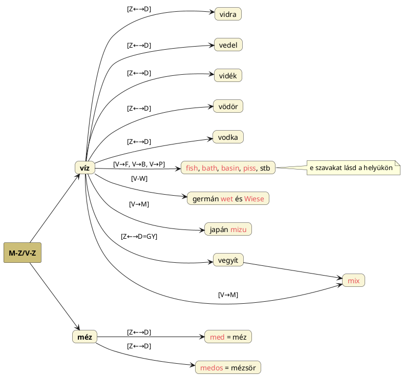

---
{"dg-publish":true,"permalink":"/M/Méz/","title":"Méz","tags":["Englishtexttranslated"],"created":"2024-11-23T05:28","updated":"2025-06-08T01:44"}
---

# Méz

#### Péterfai János írja:

> A hun `Medos` Mézös ital, amiben szintén benne van a Méd/Méz szó. De a szumer Me (és Mé, Mu) Fény, amely szó Da jelzőt kapva alakul ki a Méd – Méz szó.  

[[M/Mead\|Mead]] címnél szerepelt a kelta `medus` és akkád `mizu` = mézsör. A japánban `mizu` = víz jelentésű ugye.  
[[M/Mássalhangzók felcserélődése\|Mássalhangzók felcserélődése]] címnél is írtuk, hogy a magyar nyelv belső működésében is tetten érhető a D-Z változás jelensége, nemcsak a méz szóban, hanem jól mutatja a bűz > bűzös > büdös fejlődés is.  

A médek nevét is ilyen Mé-D formában elemzi Péterfai János. A [[M/Méd\|méd]] címnél előjövő **Medea** pelaszg istennő neve nyilván nem a magyar névből indul ki, hanem a méz méd nevéből. A mézfolyam a Tejút.  

#### Zentai Ákos Méd kulcs őstörténetünk megfejtéséhez...  

...című cikkében írja:  
> A földkerekség nyelveinek tanulmányozása során, rájöhetünk, hogy a méz szó az egyik legősibb a világon. Álljon elő néhány példa erre, a már említett `med` (szláv nyelvek) mellett: `madu` (indonéz, jávai, maláj nyelvek), `madhu` (bengáli), `madha` (maráthi), `maha` (nepáli), `meghr` (örmény), `medus` (lett, litván), `miel` (francia, spanyol), `mel` (latin, portugál), `miele` (olasz), `méli` (görög), `mesi` (észt) és `ezita` (baszk). A méz eredete az a virágos rét, vagy másképpen mező, ahonnan a méhek összegyűjtik a virágport és készítenek belőle mézet. Bizonyítják ezt az angol `mead` és a walesi `maes` mező jelentésű szavak. A megdöbbentő dolgok csak ezután következnek, amikor megnézzük egy sor további nyelv méz jelentésű szavait, nem feledve Attila származását. Ezek a következőképpen hangzanak: `hunaja` (finn), `hunang` (izlandi), `hunning` (fríz), `honing` (holland), `honning` (dán, norvég), `honig` (német), `honung` (svéd), `honey` (angol), `honi` (maori), `naphung` (thai) és `mát ongi` (vietnámi). Ezekből a szavakból a hun nemzet neve olvasható ki. Korábban a vikingekkel kapcsolatosan, már a svéd `konung`, király jelentésű szó értelmezésénél kiderült, hogy ez a szkíta-hun származású uralkodó réteg nevéből alakult ki. A közeli k-h hangzóváltással létrejött szó, közös jelentésre utal, ugyanis a mézet készítő méhek is királyságban működnek (a méhkirálynő tartja össze a családot), ezzel az elnevezéssel a médek és a hunok királyi ragjára lehet következtetni, amelyet Hérodotosz is megírt, hogy egyedül a szkítáknak van a földön királyi népe.
{ #6o25-}

Az [alábbi](https://qr.ae/TWAgvI) Quora oldalon válaszoló Samapriya Basu is szépen felsorolja az összes ismert nyelven a méz és mézsör ([[M/Mead\|mead]]) (általában M-D vázú) neveit és a magyar szót is említi. Szóba kerül (a kommentek között is) a [[M/Medve\|medve]] alakja és neve is, tabu/tisztelet kapcsán is, mely ukrán és más válaszolók szerint méz (lelőhely) ismerőt és/vagy evőt jelent:  
> I am surprised no one mentioned the most widespread (after pronouns and mom/dad words) Indo-European word \*médʰu – a term meaning honey or honey-based alcoholic beverage. Its descendants include: (from West to East, most of the examples are from Wiktionary)  
>
> Celtic: all meaning mead  
> Breton: `mez`; Welsh: `medd`; Scottish Gaelic: `miedh`; Irish: `meá`; Gaulish: `medu`  
> Germanic: all meaning mead  
> English: `mead`; High German: `Met`; Low German: `Mia`; Icelandic: `mjöður`; Swedish: `mjöd`; Danish: `mjød`; Dutch: `mede`; West Frisian: `mea`; Faroese: `mjøður`; Yiddish: `דעמ` (med)  
> Hellenic:  
> Ancient Greek: `µεθυ` (metʰy) – wine; Modern Greek: `µέθη` (métʰē) – drunkenness  
> Slavic: all meaning honey; some mean mead, in addition  
> Old Church Slavonic: `медъ` (medŭ); Russian: `мёд` (mjod); Serbo-Croatian: `мед`, `med`; Slovenian: `med`; Polish: `miód`; Czech: `med`; Lower Sorbian: `mjod`; Upper Sorbian: `měd`; Ukrainian: `мед` (med); Bulgarian: `мед` (med)  
> Baltic:  
> Lithuanian: `medus` – honey, `midus` – mead; Latvian: `mēdus` – honey, mead; Old Prussian: `meddo` – honey  
> Avestan: `maδu` – wine; Kurdish (Kurmancî): `motî` – grape molasses; Kurdish (Soranî) (`mhī`) – honey; Persian `май` (may) – alcoholic beverage; Scythian: `madu` – honey; Ossetian (Iron): `мыд` (myd) – honey; Ossetian (Digoron): `муд` (mud) – honey  
> Indo-Aryan: usually honey, related words may mean alcoholic beverages  
> Sanskrit: `madʰu` – honey, `madirā` – alcoholic drink; Bengali: `mô-mācʰi` – honey-bee, `mad` – alcoholic drink; Assamese: `mô` – honey; Gujarati: `madʰ` - honey; Konkani: `mhov` – honey; Marathi: `madʰ` – honey; Carpathian Romani: `miza` – honey; Nepali: `mah` – honey  
> Kuchean: `mīt` – honey  
> —  
> Meglep, hogy senki sem említette az indoeurópai nyelvek legelterjedtebb szavát (a névmások és az anya/apa szavak után) a \*médʰu szót – egy olyan kifejezést, amely mézet vagy mézalapú alkoholos italt jelent. Utódai a következők: (nyugatról keletre, a példák többsége a Wikiszótárból származik)
> 
> Kelta: mind mézet jelent
> Breton: `mez`; walesi: `medd`; skót gael: `miedh`; ír: `meá`; gall: `medu`
> Germán: mind mézet jelent
> Angol: `mead`; felső német: `Met`; alsó német: `Mia`; izlandi: `mjöður`; svéd: `mjöd`; dán: `mjød`; holland: `mede`; nyugati fríz: `mea`; feröeri: `mjøður`; jiddis: `דעמ` (med)
> Hellén:
> Ógörög: `µεθυ` (metʰy) – bor; újgörög: `µέθη` (métʰē) – részegség
> Szláv: mind mézet jelent; néhány emellett mézsört is jelent
> Óegyházi szláv: `медъ` (medŭ); orosz: `мёд` (mjod); szerbhorvát: `мед`, `med`; szlovén: `med`; lengyel: `miód`; cseh: `med`; alsó-szorb: `mjod`; felső-szorb: `měd`; ukrán: `мед` (med); bolgár: `мед` (med)
> Balti:
> Litván: `medus` – méz, `midus` – mézsör; lett: `mēdus` – méz, mézsör; óporosz: `meddo` – méz
> Aveszta: `maδu` – bor; kurd (kurmandzsi): `motî` – szőlőmelasz; kurd (szoráni) (`mhī`) – méz; perzsa `май` (may) – alkoholos ital; szkíta: `madu` – méz; oszét (iron): `мыд` (myd) – méz; oszét (digoron): `муд` (mud) – méz
> Indoárja: általában méz, a kapcsolódó szavak alkoholos italokat is jelenthetnek
> Szanszkrit: `madʰu` – méz, `madirā` – alkoholos ital; bengáli: `mô-mācʰi` – méh, `mad` – alkoholos ital; asszámi: `mô` – méz; gudzsaráti: `madʰ` – méz; konkani: `mhov` – méz; maráthi: `madʰ` – méz; kárpáti cigány: `miza` – méz; nepáli: `mah` – méz
> Kucsai: `mīt` – méz

A szanszkrit `mādhurī` = édesség nyilván inkább a méz neve nyomán ered, de [[M/Magyar\|magyar]] címhez is bekerült. Női név is Indiában Madhuri.  

A Szinnyei Tájszótárában talált [[G/Geny\|geny]] szavunkkal azonos (ma már más értelmet felvett) [[G/Genyó\|genyó]] (a korona-ákác gyümölcse s ennek a nedve) szó és a [[M/Mézga\|mézga]] szó ébreszt rá, hogy a méz jelentésfogalmai között egyik a nedv, azaz lé (honnan eredhet a [[M/Mix\|mix]] címnél taglalt víz jelentés is akár). Ahogy [[T/Tej\|tej]] is Isteni lé/jó, a Tejútfolyóra értve.  
A méz ezen értelmét még bizonyítja, hogy a nedvességet jelentő met, med, stb. nevek Magyar Adorjánnál is előjöttek. Igen ám, de a méz szó is olyan, amibe több ideát be kellett építeni. A fehérség ([[M/Mész\|mész]], [[M/MISZ\|MISZ]]) mellett a Tejútfa fogalmát ([[M/MES\|MES]]) is.  

Több infót lásd mézzel kapcsolatosan [[H/Honey\|honey]].  
Minden továbbit lásd persze [[M/MISZ\|MISZ]].  

Egy összefoglaló írás Mész – Méz – Méh/Anyaméh szavakról illetve jelképiségükről:  
A lényege az kell legyen, hogy azon túl, hogy közös bennük a ([[M/Mécs\|mécs]]ben is meglévő) [[M/ME\|ME]] = fény, mely fény egyrészt ([[S/Száj\|száj]] címnél írottak alapján) a Tejútanyát (szájon át) megtermékenyíti, majd az [[S/Szeplőtelen fogantatás\|szeplőtelen fogantatás]]a után méhében kihordja a Napot és megszüli, azaz a fényt, forrását, a Napot világra hozza (napi szinten keleten reggel, kis éves szinten december 21-24.-én a [[T/Téli napforduló\|téli napforduló]]kor, [[N/Nagy Év\|Nagy Év]]es szinten pedig a [[G/Galactic centre\|Galactic centre]] címnél írottak szerinti módon), ahol a szülőcsatorna illetve a [[V/Vulva\|vulva]] nem más, mint a vele azonos Tejútfa azon [[O/Odú\|odv]]a, ahol a (Napállat) [[M/Méh\|méh]]ek a [[K/Kaptár\|kaptár]]ban termelik a [[M/Méz\|méz]]et (és ahol a Nap is megszületik, illetve ezzel analóg, az a hely, ahonnan az emberek lelkei származnak).  

#### Bíró Lajos A magyar régmúlt titkai...  

...című könyvében is írja ([[K/Kaptár\|kaptár]] címnél is szerepelt):  
> Az anyaméh és a mag kapcsolata nyilvánvaló. A lélek-méhek tehát a magokhoz hasonlóan jutnak be az anyaméhbe, ami magtárhoz vagy kaptárhoz (méhkas) hasonlítható. Ez a világfa (életfa) illetve a Tejútistennő égi képéhez kapcsolódó hit: a világfa [[O/Odú\|odv]]a (azaz az istennő hüvelye, illetve méhe) az égi méhek lakhelye, ahonnan kirajzanak mézet gyűjteni. A magyar méh-kultusz annyira ősi, hogy a nyelvünk is őrzi. Míg az indoeurópai nyelvekben az összefüggés a méhek és az anyaméh elnevezése között nincs meg.  

A méz így kapcsolódik a Tejútfához és Tejútanyához, kinek tejes jellege állatalakjain (a [[K/Kígyó\|kígyó]]n \[lásd még például [[A/Anaconda\|anaconda]], [[K/Kundalini\|Kundalini]] és [[K/Kígyóistennő\|kígyóistennő]]\] kívüli négylábú (tán nem mellékesen vízszintes gerincű/testtartású) [[L/Ló\|ló]], [[T/Tehén\|tehén]], [[S/Szarvas\|szarvas]], [[K/Kecske\|kecske]], gazella \[lásd [[G/Gazella\|gazella]]\], [[G/Gnu\|gnu]], emse (lásd [[E/Emese\|Emese]]: E-Mesz/E-Messze?), stb., és akár a Tejút-melletti fontos [[H/Hattyú\|hattyú]][^1], [[K/Kutya\|kutya]] és [[F/Farkas\|farkas]]) keresztül kerül igazán megjelenítésre. (Bíró Lajos A magyar régmúlt titkai című könyvének (a PDF) 20. oldalán maga a méh is említtetik, mint Nagy Istennő-alak, nyilván a méh – anyaméh analógia alapján terjedt el a képzet. Írja azt is, hogy az epheszoszi [[A/Artemisz\|Artemisz]]t is méhként ábrázolták.)  
A tej viszont gazdag [[C/Calcium\|calcium]]ban, mely a [[M/Mész\|mész]] alapanyaga, illetve azzal azonos.  
A mész illetve a szaru pedig szintén egymással azonosak (a lovon kívül mindegyik állat [[S/Szarv\|szarv]]at vagy [[A/Agancs\|agancs]]ot is visel), és ezekkel a csontok és a fogak is, mely fogak tejfogak is a gyerek esetében, aki [[F/Fehérlófia\|Fehérlófia]] meséjében is 7x3 = 21 éven át szopja anyja csecsét/tőgyét, mely [[T/Tőgy\|tőgy]] szóról megállapíttatott, hogy a nyári napfordulós életfa [[T/Tölgy\|tölgy]] és a [[T/Tud\|tud]] szavak hangalaki változata.  
A Tejútanya illetve jelképállatainak teje pedig megfelel az életadó Tejútfa [[M/Mézga\|mézgá]]jának, másképp: [[A/Amrita\|amrita]]-jának[^2].  
A mézga és méz nevek tehát azért vehetik fel a tej értelmet, mert közös fogalmi rendszert alkotnak a Tejútanya-Tejútfa azonosság okán, másrészt a méz a méhek tejének is tartható, továbbá a méz is lehet fehéres színű, ahogy a (szent) tej, a mész, az agancs, a (szintén szent) csont és a fogak (mely az angolban is [[T/Tooth\|tooth]] = [[T/Tejút\|Tejút]] vagy [[T/Tud\|tud]]) is. A [[F/Fehér\|fehér]] és a [[S/Sárga\|sárgá]]s/[[A/Arany\|arany]] szín (a [[Z/Zöld\|zöld]] mellett) mindig is a legtisztább, legkifejezőbb színei a fényes, tűző Nappal azonos hímségi-asztrális elvnek.  
**Valahogy így kell látni az összképet**.  
Ami a [[M/MISZ\|MISZ]] címnél felsorolt [[E/Erdő\|erdő]] jelentésű szavakat illeti (beleértve az angol [[M/Miss\|miss]]-el azonos) `mis` = erdei, tündér értelmű vogul-osztják szót is), nyilvánvaló, hogy nem a mező szavunkat vette át. [[M/MES\|MES]]-fán kívül (minthogy a fa és erdő kapcsolata egyértelmű) kívül viszont méz szavunkat is felhozhatnánk eredetéül.  
Annál is inkább, mert ahogy [[J/Jungle\|jungle]], [[J/Juniper\|juniper]] és [[H/Honey\|honey]] címnél is láttuk, az erdőlakó tündérnép nevéről kapta a nevét: a kún-hun nyelvben tehát erdő, erdei és tündér lehet egyszerűen hun (az azték `hun`[^3], csecsen `ẋun` \[hun\] = erdő és a német `hain` = berek, liget szavak alapján is) vagy efféle név, míg a magyarban mes, mis, mez, méz alakú szó. Tulajdonképpen mindkettő fény jelentésű alapszóból indul ki.  
Egyébként istentiszteleteit is erdőben (lásd Sir James Frazer The Golden Bough című könyvének adatait [[N/Nemo-\|nemo-]] és [[M/Missel\|missel]] címnél Rex Nemorensis = Az Erdő Királyáról, [[S/Sylvan\|sylvan]] címnél pedig [[S/Silvanus\|Silvanus]] erdei istenről szintén Frazertől) tartották népeink, különösen, amikor a vaskori rabszolgatartó népektől bujdosniuk kellett.  

Visszatérve a vogul-osztják `mis`[^4] = erdei, tündér szóra, figyeljük meg, a latin is hasonlóan operál, hiszen a [[S/Sylph\|szilf]] tündérek neve egyezik a `silva` = erdőt jelentő szavával, és ezért láttatja Péterfai János a [[F/Fairy\|fairy]] szóban fa szavunkat is (nem tudni, helyesen-e).  

Hogy maga a méz tekintetett valamiféle zsírnak, olajnak, nem tudni, mindenesetre ...

#### Acharia S The Christ Conspiracy...

...című könyvében is írja, hogy a világ más területein is hasonló, "felkent" jelentésű szavak jönnek elő:  
> A more complex etymological similarity can been found in the Mexican name Mexitli or Mesitli, meaning "the Anointed One," obviously related to the Egyptian Messu and the Hebrew [[M/Messiás\|Messiah]].  
> —  
> Egy összetettebb etimológiai hasonlóságot keresnilóság található a mexikói Mexitli vagy Mesitli névben, amely "a Felkent" jelentésű, és nyilvánvalóan kapcsolódik az egyiptomi Messuhoz és a héber [[M/Messiás\|Messiás]]hoz.  
- Hogy valóban felkentet jelent-e az ómexikói szó, kétséges. A szent jelentés átmehet más jelentések felé (asszociálható hozzá szinte bármi[^5]), ez kétségtelen.  

Ipolyi Arnold Magyar mythologia című könyvének 392-393. oldalán említi ilyen-olyan forrásból az aranykori mézes-tejes állapotokat.  
A tejóceán [[K/Köpül\|köpül]]éséről szó van Feuerstein, Kak és Frawley In Search of the Cradle of Civilization – India című könyvük 236. oldalán.  
Talán az ott szereplő adatok alapján is lehet az, hogy (Bíró Lajos adata szerint) a szanszkrit `madhu` nem csak mézet jelent, hanem tejet és nektárt is, stb.  
(Ezen madhu szóval egyébként igen hasonlatos az ind `asvamedha` = lóáldozat kifejezés utótagja is, bár az inkább a [[M/MATA\|MATA]] = halál (áldozat) fogalmával lesz kapcsolatos.)  

## Tej és méz

A két isteni/anyai ital mindenütt együtt említtetik. Ezért is lehet a szanszkrit `madhu` mindkettő és ezért is lehet a méz árja neve M-L vázú, mint a [[M/Milk\|milk]] is.  

#### Falvay Károly Nagyboldogasszony...

...című könyvének 113. oldalán ennyit ír:  
> A tej és a méz, az állat, mint emberi élelem. A tej és a méz az istenek és a haldoklók eledele, mind a kettő kifejezetten női tulajdon. Az anyatej az élet fenntartásának, a létezésnek elsőrendű élelme annak kezdeti időszakában. Az emberi vért tejjé változtatni kizárólag a női test képes. A nő korai istennő szerepkörének ez lehet elsőrendű adottsága és feltétele. Saját testéből egyformán biztosítja az élet- és élelemadást.  

## Tej-, méz- és borfolyók

Falvay Károly Nagyboldogasszony című könyvében néhány oldalon belül két különböző (sémi és árja) kultúra hasonló tejjel, mézzel és borral csörgezedő folyókról ad leírást, így ezek eredete közös magyar lehet. Mivel háromról van szó és nekünk ([[A/Ardvisura Anahita\|Ardvisura Anahita]] és [[A/Apam Napat\|Apam Napat]] címnél írottak szerint) négy kell, lehetne a negyedik víz (bár a borban már az is meglehet). Akár még [[S/Színkódok\|színkódok]] szerint is ki lehetne deríteni az irányait is.  
A két forrás közül az első az arab Paradicsom-képzet:  
> Az arab `dzsanna` ("Paradicsom, kert") részletes leírása megtalálható a Korán különböző szúráiban (47:15; 55:46-78; 56:12-40; 76:12-22). "A szent életűek a "sötétzöld" kertben tartózkodnak, ahol a vízfolyók nem romlanak meg, a tejfolyók íze nem változik, a borfolyók kellemesek azoknak, akik isszák, a mézfolyók tiszták."  
> A másik Homérosz Odüsszeiájának tizedik énekében jön elő (Kirke a varázserejű istennő Odüsszeuszt hazatérési gondjaiban a halott Teiresziászhoz utasítja, akit azonban csak a mély vizű Okeanosz mellett, a kimmerek városa környékén tud megidézni; Kirke elmondja neki, hogyan kell a varázslatra felkészülnie, s ehhez megjelöli a pontos helyet, ahol az áldozatot bemutathatja):  
> *"Ott Acheron árad, s a Pyriphlegetón beleömlik, s Kókytos, mely a Styx folyamából ágazik arrébb, és az a két zúgózajú víz szirtnél szakad egybe; innen menj csak előbbre, te hős, ahogy intelek, ássál árkot, légyen a hossza és szélessége könyöknyi, áldozatul hints körbe italt valamennyi halottnak, tejjel mézet előbb, azután édes boritalt is, a harmadszorra vizet, fölibé a fehérszínű lisztet.*  
> *És az erőtlen elhunytakhoz hosszan esengve, mondd, hogy amint hazaérsz, gyönyörű meddő tehenet vágsz áldozatul számukra s a máglyán kincseket égetsz; s külön áldozatul juhot ígérj Teirésziasznak, éjfeketét, mely egész nyájadból messze a legszebb.*  
> *És ha kiengeszteled a holtak híres népét, akkor egy éjszínű kost áldozz, meg egy éjszínű nőstényt, és fejüket fordítsd Erebos felé, ámde te fordulj visszafelé, s a folyóra tekints: majd jönnek az elhunyt holtak lelkei rengetegen hozzád s a gödörhöz.*  

Tej-, méz- és boráldozatról Falvay Károly Nagyboldogasszony című könyvének 216. oldalán a bolgár Marazov I.: Thrákia és a thrákok c. könyvéből idézve írja ([[S/Szentháromság\|Szentháromság]] címnél is szerepelt):  
> A Nagy Istenanyán nyugodott az egész világ. Ő volt az Ég \[Falvay Károlynál menny\] és Föld, az élet forrása és az emberiség ősanyja. A tudósok szerint ez a mítosz keleti eredetű. \[...\] A háromrészes edénynek is megvan a megfelelője az Iránban, Kis Ázsiában és az Égei-tenger mellékén talált, bronzkorszak végéről származó vázákban, melyek három részből állanak. Ez a hármasság eszme talán megfelel az e körzetekre jellemző mitológiai hármasságnak: anya, leánya, fia-férje. Mindenesetre ezzel az edénnyel mutatták be az ősidők óta ismert tej-, méz-, és boráldozatot. A szófiai körzetből származó urna a korai vaskorszakból való (Kr. e. 1700). Egymásba helyezett agyag, bronz és arany edényekből áll. Nem utal-e ez szintén három személyre – teszi föl a kérdést a bolgár régész: Nagy Istennőre, lányára, és fiára?  

A Jankovics Marcell Jelkép-kalendárium című könyvéből való, Szent Ágotáról szóló passzusa alapján a bor a vérrel, tej és méz a tejjel, ondó és magzatvíz az (eső)vízzel feleltethető meg (amíg nincs jobb ötlet):  
> Ezoterikus tanokban a magzatvíz, a tej, az ondó és a vér a négy életnedv, melyek az emberi lét négy különböző korszakában jutnak főszerephez (a magzati, a gyermek-, a felnőtt- és az öregkorban). Ez a négy életforrás ered a világfa tövéről, és folyik a világ négy tája felé. Színeik: a fehér, a sárga, a vörös és a fekete ősi ég-tájszínek (a primitív kor természetes festékanyagainak színe miatt; inkább lásd [[S/Színkódok\|színkódok]]). Életkor- és égtáj-jelkép voltuk eredményeképpen az évszakokat (a napisten egy esztendős életének [[N/Négy\|négy]] szakaszát) is jelképezték a napisten születésnapjának időpontja szerint. Európában ez a [[T/Téli napforduló\|téli napforduló]] lévén, az ezt követő időszak a csecsemő napisten szoptatásának az ideje, s a tejfehér (hófehér!) ezért lett sokhelyütt az amúgy is havas csillagászati tél jelképes színe.  

## Lábjegyzetek

[^1]: Lábjegyzet:  
Hattyú perzsa-rokon nyelveken `qu`, azaz [[K/KU\|KU]] alakú. Az orosz-burjátban is [[H/Hun\|hun]].  

[^2]: Lábjegyzet:  
Ahogy [[H/Honey\|honey]] és [[L/Lac\|lac]] címnél is szerepelt, a Tejútanya állatalakjaival azonos szarvas/tehén/kecske/ló stb. tejéhez hasonlóan a méh "teje" a méz, a fák teje a [[M/Mézga\|mézga]]. Minden tejszerű amit a természet kitermel így könny, tej, méz(ga) nevekkel lett kifejezve.  
—  
Jankovics Marcell is írja:  
Elterjedt hiedelem, hogy a lelkes fa "vérzik," ha megsebzik. Valóban, sok fafajtának van vérre, nyirokra, tejre, sőt, ondóra is emlékeztető mézgája, festékanyaga, nedve.  
Másutt:  
A [[F/Füge\|füge]]fából is, ha megsértik, tej csordul, ezért a zsidók az Élet Fáját és a nagy istennő növényi mását látták benne.  
Jankovics Marcell A fa mitológiája című könyvének 93-94. oldalán példázza a fügefa-istennőket és a szent tejet adó fügefákat ([[R/Rumen\|Rumen]] címnél is volt róluk némi szó).  
Az indiai asvattha-fa (más néven pipál; *Ficus religiosa*) nemcsak akkor ad tejet, ha megcsapolják, levélcsúcsairól is "élet vize" csepeg (a turgornak vagy ozmotikus nyomásnak nevezett jelenség következtében).  
Az indiai [[A/Amrita\|amrita]] is egyszerre tej és élet vize. Jankovics Marcell könyvének 97. oldalán ír a tej és az élet vizének kölcsönös megfeleltetéséről, magyar mesepéldákat előhozva.  

[^3]: Lábjegyzet:  
[[H/Hun-esil\|Hun-esil]] ("az erdők elmerülése") címnél aztékokról és toltékokról volt szó. Ha a csecsenben lehet `hun` = erdő jelentésű, akkor az aztékban is.  

[^4]: Lábjegyzet:  
Egyezőnek vehető vele a finn `mies` = férfi, hím; férj. Ergo ugyanúgy a férfire vonatkozna a tündér, mint a magyarban? Mindezt az infót a Quora [alábbi](https://qr.ae/TWh5ay) oldaláról vettem. A Wiktionary oldal adja a férj jelentést is. A finn `uros` = hím, férfi; harcos/hős.  

[^5]: Lábjegyzet:  
A legtöbb ősmagyar szó Nap (fény) jelentésű előtagból és földreleképező utótagból áll: a mai jelentéseik alapján persze könnyű a dolgunk. Egyes sumér szókapcsolatok értelmezésénél viszont megáll a tudomány: minden szó [[N/Nap háza\|Nap háza]] és hasonló értelmekkel visszaadott, mely persze nem elégséges.  