---
{"dg-publish":true,"permalink":"/O/Öröm/","title":"Öröm","created":"2023-10-20T07:00","updated":"2024-10-25T23:41"}
---

# Öröm

#### Kállay Ferenc A pogány magyarok vallása...  

...című könyvében más nyelvek azonos, vagy éppen előhang nélküli formáit mutatja be:  
> A sanskrit `ârâma` (= gaudium) persa `ram`, `aram`, magyar öröm szók \[egyek\], s az öröm vagy Aram föld nevéből fejlettek ki (l. öröm) ([Lásd 197. old.](zotero://open-pdf/library/items/DFI47XPY?page=197&annotation=2I2HGFZV))  
> 
> Különös, hogy a Nabathok, egyszersmind arameusok is, Aram vagy öröm, azaz: boldog föld lakói (l. öröm), de ök ármányosok is Quartremére idézettjei szerint, szinte igy a scytháknak legrégibb neve Aram volt. ([Lásd 299. old.](zotero://open-pdf/library/items/DFI47XPY?page=299&annotation=PAZHN6QT))
> 
> A finn `rǒǒm` (öröm), römo sisse ( = örömében), minnö rǒǒm ( = én örömöm), `römoandja` ( = örömadó), `römus` ( = örülő, hilaris Gyarmathi Aff. p. 151, 164) szókkal is egyeznek. ([Lásd 319. old.](zotero://open-pdf/library/items/DFI47XPY?page=319&annotation=8SC6QSRF))  

A folytatásban [[R/Rama\|Rama]] isten nevét is ezen köznevünkből vezeti le:  
> Kezdetben vallásos jelentésű volt a szó, még pedig jó értelemben vétetve jelentette a boldog földet, vagy paradicsomot s annak lakóit, s a boldog életmódot, de kifejlett később az épen ellenkező értelem is, mint az más hason szóknál is nyomozható (l. bal, rosz, rút, ármány). A sanskritban `ârâma` = gaudium, tehát a magyar öröm, ram gyökből (Bopp glossar. sanskritum 26-a Rosen radices sanscritae 1827. Nro 268), innen [[R/Rama\|Rama]], vagy az öröm isten neve, kinek ünnepét Ramayana név alatt még ma is megtartják az indusok, de az ma már régi vallásos bélyegét sokban elveszté s csak a nép mulatságra, tehát még mindig közörömre használtatik, mint a volt calcuttai lord püspök Hebert 1831. tanúsítja. (Wien. Jahrb. LX. p. 122.) Bala-rama képszobráról szólottunk már a bálvány szó alatt, melyet Bál isten őrömének, az örömöt nyújtó Bálnak magyaráztunk, későbben hihetőleg az hatalmas Rama istennek is vétetett, mert bal, pal gyökökben ez értelem is megvan. A persa nyelvben is megvan mind a `ram`, mind az `aram` szó, Hammer szerint `ram` = hilaritas (tehát = öröm), `ramisch` = jubilatio, cantatio, melyekkel az angol `roam`, `roaming` a francz. `ramage` szókat hasonlitá egybe (W. J. B. LI. A. Bl.), a szinte persa `ârâm` szót (pax, quies), a nyelvtudósok viszont a sanskrit `âramâ`-val egynek veszik. ([Lásd 319. old.](zotero://open-pdf/library/items/DFI47XPY?page=319&annotation=F5Y3YL5E))
> 
> Dorn a persa `aram` szót, honnan `aramiden` pehlvi nyelvben `armounatan`, arm, aram gyökből, a görög `eremio`, `erema`, `eremein` szókhoz fűzé, nyugalom, szelídség, boldog állapot értelmében. ([Lásd 320. old.](zotero://open-pdf/library/items/DFI47XPY?page=320&annotation=JZLJJ6YW))
>
> A bukar vagy bölcsek földén is `aramidan` = megelégedten, azaz örömmel élni (Klaproth A P. p. 254), mit a persa `aramiden` s görög `eremein` is kifejeznek. Beregszászi idézi még a persa `charum` szót is = freudige Nachricht vagy öröm (p. 100.), de nem tudta, hogy ez összetett szó, a zend s pehlvi iratokban `huram` vagy `khuram` használtatik, `hu` = jó és `ram` = öröm, örülni, a pehlvi és zend h betű a persában kh lett, mint a pehlvi nyelv fő buvárja, Müller nem régiben kifejté. (J. A. 1839 Nro 38 Febr.) ([Lásd 323. old.](zotero://open-pdf/library/items/DFI47XPY?page=323&annotation=FJRR7KBE))  

Még tőle való:  
> Ellenben az turk-ujgurok közt az Aram név jó jelentésű, kik a hónapok első napját minden kivétel nélkül Aram-nak, az az örömnapnak nevezik, mint Klaproth megjegyzi (J. as. Nro 88. p. 327.). A keleti türk földön ismeretes az Urumtsi vagy örömföld is Tourfan mellett (Klaproth J. as. Nro 65. p. 461. Nro 70. p. 280., Ritter I. 203.), az orosz utazó Hijakinth Urumzi-nek, Oerumzi-nek irja (Über die Mongoley Berlin 1832. p. 100.). ([Lásd 322. old.](zotero://open-pdf/library/items/DFI47XPY?page=322&annotation=ZH2KNAUP))  
> 
> Molnár kanonok zsidó gyök szótárában a német `Ruhm` szóval egyezteté az öröm szót, de alap nélkül, legalább Grimm fejtegetései arról őt nem gyámolitják, inkább használhatta volna az ostrogos arman szót, melyet már Augustinus használt, s Ihre a finn `armo` = gratia, `arnias` benignus, `arnas` carus szókkal magyaráz (in voce barm) egy esthnus szótárban, mely a revali s dorpati dialectusok szerint készült `arm` = Liebe, Gnade, `arnas` = lieb, werth, angenehm, a magyar örömös, második fokban armsam, armsamb = örömösb, armo is annyi mint arm, honnan arnolik = lieb, gütig, arnota lieblos, elend = örömtelen. Végre a görög `khárma` (= öröm) `χαίρω` igéből (= laetor.) a koptus `chaire` v. `khaire` = se rejouir, a georgiai `khareba` (J. as. Nro 83. p. 392.) csak keményített hangkiejtések a lágyhangu öröm szó helyett. ([Lásd 323. old.](zotero://open-pdf/library/items/DFI47XPY?page=323&annotation=XZD287ZZ))

> A görög mythologia a kaspi Aram földet csudákkal teljesnek hirdette, mely Typhonnak ( = Teufel, Diabolus mind a három név csakugyan azonegy szó módosítása) vagy is az ördögnek hazája, hol az aranykincseket griffek őrzik, melyeket az arimoktól nem lehet elvenni, a persa mythologia szinte a rosz diweket (Teufel, Typhon) Mansenderanban laktatja, hol az Arem vagy Irem föld neve ma sem veszett ki, a német mythologia is telve van Irmengard-ról (= Irm kertje, Saxo annalista már 1036. emliti) Irmnun-gottról, Irman-sulról (= Irmin isten szobra) szóló hagyományokkal, s egyik finn nép fajtával Urum-busz ma is a rosz isten vagy daemon neve (Müller ugr. Volksstamm II. 388.). ([Lásd 322. old.](zotero://open-pdf/library/items/DFI47XPY?page=322&annotation=L83FKYQH))  
- [[B/Bál\|Bál]] és [[A/Ahriman\|Ahriman]] címnél is írtuk, hogy a jó mellett a rossz is megjelenik. Az, hogy nép/ország neve is lehet a szitok eredője (pl. a finn Turja), itt is megmutatkozik. Sőt, itt konkrétan az [[O/Örmény\|örmény]]-Ahriman összefüggés esete állhat fenn.

Ha már az Ahriman név szóba került: az [[O/Örmény\|örmény]] névvel valóban összeüt, ugyanakkor Örmény is lehet Öröm-An felbontású. Vagy ha megfordítjuk, öröm szavunk lehet Úr-Men -> \*Ur-(u)M -> öröm fejlődési sorozattal értelmezhető.  

```plantuml-svg
@startuml
left to right direction
skinparam BackGroundColor transparent
skinparam rectangle {
    BackgroundColor #ccbe78
}
skinparam card {
    roundCorner 15
    BackgroundColor #f9f5d7
}
rectangle "<b>Ur/Ar-Men</b>" as w1
card "Öröm" as w2
card "Örmény" as w3

w1 --> w2 : AN-nak (EN-nek) vett\nutórész leválása
w3 <-- w1
@enduml
```

Persze az -öm végződés az [[O/OM\|OM]]-nak (és így [[M/MA\|MA]]-nak) felel meg és az -öm az ör- szótag magánhangzójához illeszkedik. Az Ör pedig alanyi jogon [[U/UR\|Úr]] szavunkkal feleltethető meg. Öröm tehát annyi, mint Úr-Föld, azaz a földi élet örömei közül azon öröm, amely égi (isteni) vonatkozású.  
- Némileg hasonló felbontású [[A/Álom\|álom]] szavunk.

Kállay más adatait lásd [[A/Arám\|arám]].  

A törökök [[R/Rum\|Rum]] nevét Urum névből gondolják eredni, ami Aram és az [[A/Arám\|Arám]] címnél is említett Urmia nevek alapján nem is olyan rossz ötlet, tekintve, hogy a finn nyelvben is r-előhangos és Rama is öröm isten lenne.  
A fentebbi levezetés alapján viszont "öröm isten" pleonasztikus.  

A (más jelentésű) héber `aram` igét lásd még [[A/Arimaszpa\|arimaszpa]].  

Lásd még [[O/Örül és őrül\|örül és őrül]].  