---
{"dg-publish":true,"permalink":"/S/Sail/","title":"Sail","created":"2024-11-23T05:36","updated":"2024-11-23T05:36"}
---

# Sail

Vitorla, hajózik. [[S/Szél\|Szél]] szavunkból. Szél a vitorlába kell.  
Aki azt gondolná, hogy az nem lehet, hogy első indogermán előtti ember, aki vitorlázott, magyar nyelvű volt, vagy azt, hogy a szél szavunkból nem származhat a német `Seele`, lám, azoknak a kettő együtt már elég meggyőző kell legyen, hiszen az azonos alakú szavak közötti kapocs a magyar szó.  

```plantuml-svg
@startuml
left to right direction
skinparam BackGroundColor transparent
skinparam rectangle {
    BackgroundColor #ccbe78
}
skinparam card {
    roundCorner 15
    BackgroundColor #f9f5d7
}

rectangle "<b>Szél</b>" as head
card "Seele" as s1
card "Sail" as s2
head -up-> s1
head --> s2
@enduml
```

Ugyanakkor a [[T/Tail\|tail]] és [[H/Hail\|hail]] szavakhoz hasonlóan itt is megjelenik egy germán g-beékelődés a korábbi szavakban: a mai némettel egyező óangol `segel` (igeként `seglian`), óizlandi `sigla`, stb.  
Hogy valójában egy felkeményedett j-beékelés lehet, mint fehér-fejér esetében, nem tudni. A nyelvészek már nyilván felfigyeltek rá.  
[[S/Seal\|Seal]] címnél is hasonló eset látszik fennállni.  