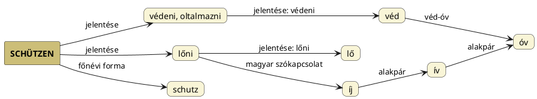

---
{"dg-publish":true,"permalink":"/S/Shoot/","title":"Shoot","tags":["Englishtexttranslated"],"created":"2024-11-05T19:18","updated":"2025-03-21T22:13"}
---

# Shoot

Lő; szökell. Sok más jelentése van, melyek közül a hajtás (növényé) érdekes leginkább.  
Az óangol lőni jelentésű `scēotan` ágense a `scytta`, a lövő, azaz [[S/Szkíta\|szkíta]] nevünk, szavunk, mondhatnánk, de magát szkítának nem nevezte a kún/hun ([[K/Kutya\|kutya]]/[[C/Csuda\|csuda]]).  
Lényegében a `shoot` egészen nyilvánvalóan a nyíllövés, nyilazás (és az azzal kifejezett [[O/Öl\|öl]]és vagy nemzés) szava.  

#### Bíró Lajos A magyar régmúlt titkai...

...című könyvének (a PDF) 44-45. oldalán szó volt az angol szóról is:  
> Nagy Géza is említi alapvető művében (A skythák. Bp., 1909.), hogy a szkíták a nyíl használatában semmilyen európai néptől utol nem ért jártasságra tettek szert, "úgyhogy nevük egyjelentésűvé vált a "nyilas"-sal, a "nyíllövő"-vel, mint például a germán nyelvekben (v.ö. svéd `skjuta`, ónémet `skiutan`, német `schütze`, angol `shoot`)".
{ #v82dg3}

#### Bognár Ferenc A magyarok istene...

...című cikkének [[V/Vadász\|vadász]] címnél álló adatainak folytatásaként szerepeljen, hogy a Biblia Gen 21.20.-nál szereplő "íjas vadász lett" rész különböző nyelvekeni fordításai alapján is arra a következtetésre jutott, mint Bíró Lajos:  
> Nézzük az íjas-vadász megfelelőit!  
> Ez a német `bogen-schütze`, a norvég `bue-skytter`, és dán `bue-skytte`.  
> Ahol a bogen és bue jelenti az íjat, a lövész-vadászt pedig a schütze/skytter/skytte/kütt tagok.  
> Ismét ordít, hogy e lövész kifejezések a [[S/Szkíta\|szkíta]] népnévről erednek! De ha nem, akkor hivatkozunk az itt nem szereplő, de a svéd szótárban fellelhető `skytt` = lövész, vadász, jelentésű szóra, amelynek ott nyelvi testvére a `skyt` = szkíta szó.  
> Tehát, a svéd `skytt` = lövész, vadász és `skyt` = szkíta!  
> A kapcsolat tagadhatatlan, és történelmileg abból fakad, hogy az időszámítás előtti századok Szkítiája, Észak-Európában, a dán, svéd, norvég, és germán népek területére esett. E népek szintén a szkíták kultúrörökösei.  
- Vagy inkább felköltöztek ezen népek és a mitológiát és abból származó szavakat vitték magukkal.

Anne Wright Constellations oldalán több érdekes dolgot oszt meg (lásd például [[D/Dogma\|dogma]] címet arról, hogy a görög `doxa` eredete tulajdonképpen az **Íj és a nyíl ösvénye** lenne). Ami Nagy Géza sorához kiegészítésnek onnan vehető:  
> [[S/Sagittarius\|Sagittarius]] has always been a sign associated with shooting for far off goals. An arrow is shot with a bow. The constellation of Sagittarius was the German Schutze, Schutz, the Anglo-Saxons had Scytta, a manuscript of 1386 calling it the Schoter; Shoot comes from the Indo-European root \*skeud 'To shoot, chase, throw'. Derivatives: shoot, shot, shut, shout, shuttle, scuttle 1 . \[Pokorny 2. (s)keud- 955. Watkins\]  
> The word Scythia originally means "shooter, archer", and it ultimately derived from the Proto-Indo-European root \*skeud- "to shoot, throw". The Scythians or Scyths were a nation of horse-riding nomadic pastoralists.  
> Arrows are made from the off-shoots or cuttings of trees, the shooting of which would have caused some of these shots to have taken root in more distant places other than their usual environment. (Some of these words might belong to Sagitta, the Arrow, because for both arrows and cuttings for planting, the young shoots representing the current season's growth are used. The previous season's growth are favored for making bows).  
> —  
> A [[N/Nyilas\|Nyilas]] mindig is a távoli célok elérésével kapcsolatos jegy volt. A nyilat íjjal lövik ki. A Nyilas csillagkép a német Schütze, Schütz, az angolszászoknál a Scytta volt, egy 1386-os kézirat Schoter-nek nevezi; a `shoot` az indoeurópai \*skeud 'lőni, kergetni, dobni' gyökből származik. Származékai: lőni, lőni, bezárni, kiáltani, sikló, sikló 1 . \[Pokorny 2. (s)keud- 955. Watkins\]  
> A Szkítia \[inkább szkíta\] szó eredetileg "lövő, íjász" jelentésű, és végső soron a proto-indoeurópai \*skeud- "lőni, dobni" gyökből származik. A szkíták lovas nomád pásztornépek voltak.  
> A nyilakat fák hajtásaiból vagy kivágásaiból készítik, amelyek kilövése miatt néhány ilyen lövés a megszokott környezetüktől távolabbi helyeken is gyökeret eresztett volna. (E szavak egy része a `sagitta`, a nyílvessző szóhoz tartozhat, mivel mind a nyilak, mind az ültetésre szánt dugványok esetében az aktuális évszak növekedését jelentő fiatal hajtásokat használják. Az előző szezon növekedését kedvelik az íjak készítéséhez.)  

A Götz László Keleten kél a Nap című könyvének 140. oldalán hozott német `schützen` = óvni (pl. "Gott schütze ihn" – "Isten óvja") és `schutz` = védelem is tulajdonképpen az íjjal lövésre megy vissza.   
- Érdekes, hogy lőni íjjal lehet, és íj = ív = óv egyező alakúak a magyarban is.

Ő mondjuk [[S/Sk-\|sk-]] előtétes változatát veszi olyan szavaknak, melyek ugyanezt jelentik és a bőr (mint védelmet jelentő burok?) jelentésű másutt is említett szó alá sorolja őket.  
  

A [[S/Szíriusz\|Szíriusz]] és [[S/Szít\|szít]] címnél is említett babiloni mul.KAK-SI-DI név Sidi része [[S/Süt\|süt]] szavuk változata lehet.  

Zajti Ferenc Zsidó volt-e Jézus c. könyvének XXI. fejezetében tárgyalja a [[H/Hykszosz\|hykszosz]]okat. Ott írja:  
> A szíriai normád törzsek egyiptomi elnevezése: shous, shasu, királyuké: Hiqsation, görögösen Hlykoussos – Hyksos ez az ő kiejtésükben Shasu, Hiqshasu. A nép így hívta őket: Menation (= a pásztorok), vagy **Sution** (= a nyilasok).  
- Ezek az szóformák más értelmezésekhez vezetnek; úgy mint kb. Égi-Sas, Égi-Süs. A Sution forma nyilván a [[S/Süt\|süt]] igét tartalmazza, viszont hasonló a [[S/Szutek\|Szutek]] címnél taglalt nevekhez is.

A német szóval is egyező [[S/Süt\|süt]] szavunk is kiadhatja, ami (fegyvert) elsüt alakjában egyértelmű:  
Süt az üt szavunkkal is fogalmi és hangtani rokonságban van, hiszen [[U/UT\|UT]] = Nap forró, tüzes nyilait süti, lövelli a Földre (ezért is hasonlították [[S/Sün\|sün]]höz, mely ismét a süt igevariánsa lehet, ahogy [[T/Tesz\|tesz]]-nek [[T/TEN\|ten]]). Hogy a süt egyúttal értékelhető az [[U/Üt\|üt]] s-előtétes variánsaként, elárulja, hogy a japán `ute` is lő jelentésű és üt szavunkkal azonos.  

Ahogy [[S/Sut\|sut]] címnél is szerepelt, `sujt` szavunk is van, de ez már közelharci fegyverre utal. Magyar Adorján is szóba hozza, de az elsülést:  
> Volt már föntebb szó arról, hogy a sündisznót népünk sül-disznónak is nevezi, amely szóalak nem a tűzöni sülni, sütni igéből származik hanem abból hogy a sül, sil, sul szóalak tüske, tövis, valaminek szúrni képes hegye és tű értelmű volt, aminthogy a szerb-horvátban is `silyak` = valaminek tűszerű, szúrni képes hegye. Amely s-l szóalaknak viszont r-es kiejtéssel pontosan megfelel szúr, szúrní, szurkálni igénk. Ide tartozó tehát sulyom szavunk is, amely egy vízinövény tüskés termését jelenti, sülfü pedig egy szúrós fűféle neve, valamint fölhozandó, hogy a finnben `süu` (sziili) = sündisznó. Mindezek alapján aztán következtetnünk kell, hogy nyil szavunk párhuzama ként a nyíl szolim-szarmata neve is szil avagy sil szóalak volt. De következtethető még az is, hogy őseink már a nyíl ellövését is elsülésnek avagy elsüllésnek nevezték (amihez egyébként elszállás szavunk is hasonlít), amely szó eszerint csak utóbb, a mai lőfegyverek korában lett a tüzzel, tüzelő elsüléssei kapcsolatba hozva. Úgyhogy ezek szerint az ll-es elsüll szó értelme elillan, elröppen, elindul is volt.  

Persze mi maradjunk meg annál azt alapvetésnél, hogy mivel elődei szk- előtagúak, [[S/Szkíta\|szkíta]] alakúak, talán mégsem [[S/Süt\|süt]] adja ki közvetlenül. Ugyebár a szkíta fogalmában egyszerre van jelen a Kutya és az Nyíl/[[I/Íj csillagkép\|Íj csillagkép]] fogalma. [[M/Magyar istencsalád\|Magyar istencsalád]] és más címnél arról volt szó, hogy ugyanennek a csillagképnek (körülbelül, hisz nem egyértelmű, mennyire csak Oriont vagy Szíriusszal együtt Oriont jelenítik meg) megfelel Hunter/[[H/Hunor csillagkép\|Hunor csillagkép]].  

[[Y/Yama\|Yama]] címnél is szerepelt az [alábbi](https://en.m.wikipedia.org/wiki/Yumi) oldalon említett japán `kyūdō` = íjászat szó, mely ismét amolyan kutyás, szkítás alakú szó.  
A kutyás alakú észt `kütt` = vadász szót az alnémet `schutte` = vadász szóra viszi vissza a nyelvészet. Ugyanakkor a lövés = szexuális értelemben nemzés = kutyanemzés = ívás = íjazás, azaz itt nem annyira nyelvekre kell visszavinni a fogalmakat, hanem a vallási/mitológiai alapfogalmakat kell feltárni.  

Lásd még [[S/Süt#Süt, shoot, szkíta\|süt, shoot, szkíta]] cím/alcímnél írottakat.  

Érdekes analógia: ahogy a [[S/Süt\|süt]] szavunknak megfelel shoot, úgy [[G/Gyúl\|gyúl]] szavunknak felel meg az ott is említett török `gülle` = lövés. Bár az inkább [[G/Golyó\|golyó]] szavunknak felelne meg [ezen](https://tureng.com/en/turkish-english/g%C3%BClle) oldal alapján.  

Lásd még [[S/Skit\|skit]], [[B/Bow\|bow]] és [[A/Arrow\|arrow]].   