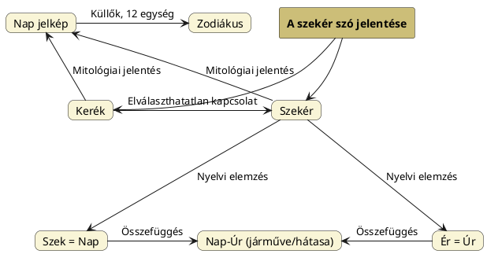

---
{"dg-publish":true,"permalink":"/S/Szekér/","title":"Szekér","tags":["containscallouts"],"created":"2025-02-24T18:12","updated":"2026-08-03T20:51"}
---

<!--section: 1-->
# Szekér

<!--section: 2-->
#### Péterfai János írja:

<!--section: 2.1-->
> Szekér szavunk a Szék (Nap) és Ér (Úr) szóelemekből áll. A Szek-Ér tehát valójában Nap-Úr. A Nap a Szekerén ülve robog át az Ég kék mezején, ezért a szekér egyfajta ülőhely is. A Szekér, mint általában a nagyon régi és mágikus szavak, több jelentésűek. Sze-Kér formában Fény-Kerék, Fény-Kör az értelme. A Sze gyakran Fény, a Kér a Kör társszava. A Szekér kereke kétségtelenül [[N/Napjelkép\|napjelkép]] volt. Középen a [[T/Tengely\|tengely]], amiből a Küllők ágaznak ki, amelyek a Nap sugaraival vethetőek össze. Kívül van a Kör, Ker alakban. Maga a Ker-Ék szó is Kör-Csillag értelmű. Az [[A/Abroncs\|Abroncs]] a külső kör neve, ami Ab-Ron-Cs formában értelmezendő, Háza – a Rohanásnak, a Cs kicsinyítés, utalva arra, hogy nem szabad túl gyorsan rohanni a kerékkel. A magyarokat szekeres népnek is ábrázolták. A Harci szekerek félelmetes támadó eszközök voltak egykor, Kr.e. 4.000 körül találták fel a magyarok.
> A Szekeres névben ma azt látjuk, hogy egy szekéren ülő embert jelöl, a szó -s végződése pedig jelző. Eszünkbe sem jut, hogy az As-Es Házat is jelent, ami miatt a Szeker-Es olyan ember is lehet, akinek szekér a háza. A szekéren lakik, amikor vándorol, és a magyarok is vándoroltak egykoron. A Szeker-Es tehát Szekér-Házi jelentésű elsődlegesen.  

<!--section: 3-->
#### Bakos Attila A Duna Evangéliuma...

<!--section: 3.1-->
...című könyvének 222. oldalán írja:  
> Ur-Makh, Makh-Ur: A Nap, a Napisten. Legfontosabb neve Egyiptomban és Mezopotámiában Nabu, Nebo,. Nap, Nep-Ra, Nipp-Ur, Sum-Er (Szem-Úr), Sek-er[^1] (szekér, a Nap szekere), Ten-Úr (a [[T/Tányér\|tányér]] alakú napkorong) és Nip voltak. Az ősi szum (szem) szavunkat használtuk tum, tüm formában is. Így nevezték a Napistent A-tum-Ra-nak, vagyis Szemúrnak, régiesen Szemeré-nek. Őseink költői megszemélyesítéseiben a paripán, égen száguldó Napistent La-ur, Ner-gel, Ner-gal, az éjszakait Set-Ut-Ra azaz Setét Urnak hívták. A Nappálya közbülső szakaszán időző Napistent Utas-nak nevezték.  
> Az ősi magyar hagyomány szerinti Napisten nevek még a Had-Ur, Har-apa (az lndus-Szaraszvati civilizáció fővárosa), Bar-Ata (Bari, Baran ősi magyar jelentése hím juh, azaz kos. Tehát Kos-Atya, akiről egész lndia a nevét kapta. A legnagyobb indiai eposz neve a Mahábárata, azaz a Baraták, a Kosfiak, a Kusánok, a Barátok testvér-háborúja).  
> A két világító égitest vallási előtérbe kerülése egyrészt tapasztalatokon nyugodott, másrészt velük és általuk egy sor külső tanítás és belső élmény kifejezhetővé vált. A Nap lett tehát a hímelvű teremtő Isten (Ur-Khepe) vallási képviselője, vagyis képe. A férfiember pedig a Nap mása (Khepera azaz Rá-képe). Ezért mondjuk mi magyarok ma is tréfásan, erre a képírási analógiára emlékezve, hogy a fölcseperedő gyermek kiköpött apja, anyja stb. Egyiptomban ettől kezdve vezető szerepet kap a világ szellemi alapú, tehát hím, azaz fény elvű teremtéstörténete. A korabeli leírások szerint mindenütt az Úr üvöltése hallatszott, legalábbis a nyugati tudósok így forditották mindezt. Azonban az Egyiptommal, Mezopotámiával azonos idős és a felsoroltakkal folyamatos kölcsönhatásban lévő Indus-Sarasvati civilizációban fönnmaradt néhány istenség név. Például Szak-Ra (később Ind-Ra lett \[nos [[I/Indra\|Indra]] címnél írottak szerint szanszkrit nyelvben igen, de páli nyelvben az úgy került rögzítésre, mint a David Gordon White által is említett Sakka\]), aki azonos az egyiptomi [Szek-Er](https://en.m.wikipedia.org/wiki/Seker)-rel, illetve egy másik istenség név, méghozzá Rudráé. Rudra később Siva egyik aspektusává minősült, azonban magyar nyelvünk és az egyiptomi előzmények ismeretében a következő fény képírásos ábrázolása az oroszlán magur-makar tréfásan mogorva, a nyári napéjegyenlőség utáni Napisten, az óind szanszkritban Mahar, Meghar (ilyen nevű város is fönnmaradt az Indus-Sarasvati kultúrából), a hinduk szent mantrája, a világmindenség teremtő kozmikus hangja, a szent [[O/OM\|om]] (kiejtése az oroszlán üvöltéséhez hasonlatos a-u-m) is Mag-Ur Napistenre utal.  
> Ide idézhető még Go-mor-ra azaz Ko-mor-Rá a bibliai magyar város neve, ősi magyarul Gö-mö-re, Gömör, Gyömrő, de az oroszlán félelmetes képére, a Nap szigorú atyai minőségére, hatalmára utalva komor-morog.  
- Bakos is felismeri a szótagrészekkel való játék lehetőségét (Baráth T. nyomán).

<!--section: 4-->
#### Bakos Attila A Duna Evangéliuma...

<!--section: 4.1-->
...című könyvének 421-422. oldalán a [[V/Vrâtya\|Vrâtyá]]król írott passzusában ide utalt rész jöjjön. [[S/Szakrális geometria\|Szakrális geometria]] címnél is szerepelt az első része:  
> Más bizonyítékok is arra a tényre mutatnak, hogy a Vratyák szent, hun katonai eredetű, testvériségbe szerveződtek. Egyszerű, ló vagy öszvér vontatta szekereken utaztak; vallásos szertartásaik alkalmával a szekerek (Szekér-Úr, a Napisten már ismertetett neve) áldozati oltárként szolgáltak. A szekér a szüntelenül mozgó, dinamikus változásban lévő világmindenség szimbóluma. Négyszögletes rakterülete a Föld, a feléje boruló ponyvaernyője az égbolt, támasztéka a világtrón. A kerekek a Napisten haladása a világtengely mentén. Indiában ma is élő szent hagyomány a ratha-yatra szekérfesztivál, s az egykori turáni népek szakralitásának középponti kultusza volt.  
> Ennek az ős szakralitásnak csodálatos kidomborítója az a harci szekér melyet Srí Krisna hajtott a kuruksétrai csatában. Arjuna az életútján végighaladó Ént személyesíti meg, a szekereket az érzékek vontatják, hajtójuk az elme stb. A szintén szkíta-hun eredetű buddhizmusban ezért tűnik fel az ősi szekér rítus immár nagyszekér (mahayána) és kisszekér (hinayána), valamint gyémántszekér (vajrayána) formájában.  
> Minden csoporthoz egy mágadhának vagy szutának azaz kocsihajtónak nevezett képzett regös társult, aki lehetett nő is, ez esetben pumshacalinak ("férfi-mozdítónak azaz férfi csalogatónak") hívták. Az igric és a szent mágusnő szexuális, őstantrikus szertartást mutattak be a nagy napéjegyenlőségi szertartás, az úgynevezett mahá-vráta ("nagy testvéri eskü") alkalmával, mely évődést, humoros gyalázkodást és intim párbeszédeket is tartalmazott. A regös és a mágusnő az Isten és az Istennő teremtési játékát adta elő.  

<!--section: 5-->
#### Soproni Svetlik Ottó A magyar nyelv szkíta szókincsében...

<!--section: 5.1-->
...megadja a magyar szó vélt eredetét, az asszír-babiloni `sekēru` = elzár, akadályoz igét és az alábbiakkal szolgál (a szekér eredeti napistenre vonatkozó fogalmát nem ismeri):  
> Szekér szavunk bizonyíték a magyarok és a szkítát szoros kapcsolatára, csak mi magyarok ejtjük hasonlóan az akk.-assz. szóhoz! A `sekēru` (szekér) szó akk.-assz. eredetű, Európa egyetlen más nyelvében sem található meg, csak a szkítákon keresztül kerülhetett a magyar nyelvbe, vagyis a szekér szkíta és egyben magyar szó is. A szekér szó jelentésváltozáson ment keresztül a szkítáknál, elvesztette eredeti jelentését, a szkíták nem foglalkoztak mezőgazdasággal, öntözéssel, nem építettek gátakat, a szekeret csak hadi célokra használták, mint szekérvár. A szekér valószínűleg kerekeken guruló mesterséges torlasz volt eredetileg, gátaknál, csatornáknál használták, melyet lovak vagy ökrök húztak a helyszínre, később kezdték a hadászatban is alkalmazni, majd békés célokra használva is megtartotta eredeti nevét. Ezt az állítást megerősíti az akk.-assz. katonai címet, rangot jelentő `sakrumaš` szó is, ez egy összetett szó (sum. `LÚ.KIR₄.DAB`), magyar jelentése 'szekér hajtó, szekér vezető' vagyis, a szekeret "hajtották" már az asszírok idejében is hadászati eszközként.
> TESZ: A szekér bizonytalan eredetű. Talán honfoglalás előtti iráni jövevényszó, vö. középiráni \*sukar 'szekér'. A középiráni \*sukar nem lehetett a magyar szekér szó átadója! A proto-finnugor szekér: \*säkVrV, a szekér szó a Khanty (Ostyak): `liker` (V), `ikǝr` (Vj.), `jikǝr` (VK), német 'Schlitten; Narte', magy. 'szánkó, csúszik'. A proto-finnugor \*säkVrV (szekér) szó a magyar `szekér` és a khanty `liker`, `jikǝr` szavakból lett "rekonstruálva" helytelenül, a szekér akk.-assz. szó, amelyik a szkítákon keresztül terjedt el. A szekér szó finnugor származtatása téves.  
- [Ezen](https://uesz.nytud.hu/index.html?displaymode=web&searchmode=exact&searchstr=szek%C3%A9r&hom=) helyen a ÚESzWeb adatát találjuk; tulajdonképpen ugyanerről szólnak.

Folytatja:  
> Az akk.-assz. `sekēru` változatai: `sakāru`, `sakkiru`, `sēkiru`, `sēkirūtu`, `sekkiru`, `sekretu`, `sekru` B, `sikkūru`, `sikru`, `sukurtu`, `se-ke-rum`. A szekérről ír Czeglédi Katalin is:  
> "A szekér-nek pedig olyan 'kerék' jelentésű szó szolgált alapul, amely az elnevezéskor a szekér volt, pontosabban a szekér névadáskori ejtése. Ez a szó összefügg a [[T/Teker\|teker]], [[C/Csavar\|csavar]] stb. szavakkal. A magyar népnév valamint a `možara` ~ `mažara` szekérnév egyaránt egy ponthoz, maghoz tartozót jelent."  
> Az emberiség kultúrájának az egyik kiinduló helye Mezopotámia volt, itt találták fel a kocsit, a harci szekeret, ezt nem lehet figyelmen kívül hagyni. Czeglédi Katalin a kerékkel hozza összefüggésbe a szekér szót. (Lásd C. K. A szekér szavunk és szócsaládja)  

Kerék és szekér jelentésű akkád `magarru`, `mugirru` szavakat lásd [[M/Magyar\|magyar]]. Könnyen lehet, hogy nem a magyar feltalálókra utal, hanem ugyanolyan kifejezés, mint a szekér vagy [[K/Kerék\|kerék]]: [[N/Napjelkép\|Napjelkép]], illetve a napisten nevére, Magar/Magor/Magur-ra megy vissza.  
Igen érdekes az akkád `naggār magarri` = kerék- és kocsikészítő ([[B/Bognár\|bognár]], honnan [[W/Wagon\|wagon]]er), hiszen mindkét szó magar eredetre megy vissza. ([[N/Nagar\|Naggar]] címhez is betéve.)  

Az [alábbi](https://youtu.be/DqMogRPokq8) Turul és Szarvas IV. rész című ÁKA előadás első felét a [[L/Luca\|Luca]] napnak és a lucázásnak szenteli.  

|  |  |
| -------------------------------------------------- | ----------------------------------------------------------------- |

A mellékelt rajzon az Amerikába és Japánba is meghívott, mondhatni világhírű képíró-asszony, a galgamácsai Vankóné Dudás Juli néni alkotása található, mely megörökíti, mit csináltak Luca napján az emberek (mely tréfákról a fonóban és másutt hosszú ideig beszéltek): az hogy a ház vagy a fa ([[V/Világfa\|világfa]], életfa: Tejút) tetejére vitték a szekér darabjait és ott – nagy nehézségek árán – összeszerelték, nálam azt jelenti, hogy a Szék-Úrt, a napot analógiás mágiával akarták magasabbra emelni (a delelő magasság nő is december 24. után). A Luca-szék kifejezésben is a [[S/SZÉK\|Szék]] = Nap, mely ugye [[N/Négy\|négy]] lábú is (bár Kubínyi Tamás 27:40-nél azt mondja és képeket is hoz, hogy ez nem az eredeti: háromlábú széket is bemutat, mondván, tán ez lenne az eredeti).  

> [!check] &nbsp;
> A sematikus ábrán a nyári napfordulós állás bemutatására törekvő megoldás szerepel; a népszokásban nyilván az áll a szekér magasra vitele mögött, hogy innentől (téli napforduló) megindul a Nap felfelé.

> [!lasdmeg] &nbsp;
> > [!Lásdmég] Lásd még &nbsp;
> > Hogy a szekér nem csak a Nap lehet, erről [[S/Szekeres csillagkép\|Szekeres csillagkép]] címnél is volt szó.

<!--section: 6-->
#### Szántai Lajos írja:  

<!--section: 6.1-->
> A Tejútközpont a Nyilasban van, és van ennek egy nagyon szép elnevezése: Koldusszekér. Szekérnek is nevezik.  

<!--section: 7-->
## Chakra - szekér kapcsolat

<!--section: 7.1-->
[[C/Chakra#^mcl1sp\|Chakra]] helyen elhangzott, hogy a japán `kuruma` = kerék; kocsi, autó *jelentés-együttesével rámutat*, hogy a szanszkrit kereket jelentő szó eredhet `szekér` szavunkból, hiszen a jelentések összetartoznak, csak ezt nem fogják a nyelvészek lekövetni, még ha egyértelmű is.  
A [[K/Kerék\|kerék]] Napkerék (ahol a küllők megfelelő számával akár az állatöv 12-es bontását is eszközölni lehet). [[S/Surya\|Surya]] napisten is szekérrel utazik, [[B/Bárka\|bárka]] helyen pedig a Nap olyan járművéről volt szó, amely az ég tengerén halad.  
Ismerni kell a régi népek gondolatát, vallásuk alapjait. Erre jó a magyar nyelv.  

<!--section: 8-->
## Szekér feltalálói és ábrázolásai

<!--section: 8.1-->
Az [[I/Indogermán nyelvészet\|indogermán nyelvészet]] képviselői által hangoztatott felsőbbrendűség kapcsán ...

<!--section: 9-->
#### Götz László Keleten kél a Nap...

<!--section: 9.1-->
...című könyvében megjegyzi (milyen könnyű cáfolni állításaikat):  
> G. Neckel még 1935-ben is határozottan állítja, hogy a küllős harci szekér indogermán találmány. (Die Frage nach der Urheimat der Indogermanen, 1935.) Annak ellenére, hogy a küllős szekér ábrázolása már a Kr.e.-i 6-5. évezredbe tartozó Tell Halaf-kerámia egyik darabján előfordul. (M. v. Oppenheim: Der Tell Halaf, 1931.)  

<!--section: 10-->
#### Asko Parpola Formation of the Indo-European and Uralic (Finno-Ugric) language families...  

<!--section: 10.1-->
...című anyagában szereplő nyelvészeti adatok [David W. Anthony könyvének](https://en.wikipedia.org/wiki/The_Horse,_the_Wheel,_and_Language) (*The Horse, the Wheel, and Language*) adataira építenek:  

> [!attention] &nbsp;
> Igazán tanulságos az eljárás: a régészeti leletekből válaszd ki a Kr.e.-i 6-5. évezred utániakat és az eredetükre nézve soha nem tisztázott, akár magyar nyelvjárásokból származó szavakat alkotó pidzsin nyelvekből tegyél melléjük hipotetikus gyököket. Kész.

Bárczy Zoltán Töprengések a hazáról I. című az Ősi Gyökér 2008/2. sz. megjelent cikkében írja, hogy a szekér modellek lelőhelyei: Budakalász, Szamosújvár, Novaj, Gyulavarsánd és Herpály. Megjelenési idejük i.e. 2000-1600 között.  

[[G/Gigász\|Gigász]] címnél volt szó kétkerekű kocsikról.  

<!--section: 11-->
## Szekérvár

<!--section: 12-->
#### Wikipédia adata:  

<!--section: 12.1-->
> A szekérvár egy olyan (elsősorban) védekező jellegű hadi taktika, amikor a sereg szekereit a tábor körül védelmi pozíciókba rendezik. A taktikát már az ókorban is használták. A kalandozó magyarok kör alakú szekérvárakban töltötték az éjszakákat.

<!--section: 13-->
#### Kiss István és Kiss Álmos Péter Atilla palotája...

<!--section: 13.1-->
...című az Ősi Gyökér 2010/4. sz. megjelent cikkükben írják:  
> A hun hadsereg menetközben könnyen felállítható és lebontható nemezsátrakban töltötte az éjszakát és váratlan ellenséges rajtaütésre számítva szekérvárral vették körül a tábort. Ez a táborverés és szekérvár védelem sokkal észszerűbb volt, mint a római táborverési mód. A gyalogos légióknak ugyanis nap, mint nap, a kötelező, kimerítő gyalogmenet után nehéz földmunkával készített, földfeltöltéssel, valamint karósánccal védett tábort/castrumot kellett építeniük. A római légiósoknak derékszögű négyszögű úthálózattal felosztott táborterületen kellett kötélzettel kikötött, bőrsátraikat felállítani, és továbbinduláskor lebontani.  

<!--section: 14-->
## Lábjegyzetek

[^1]: Lábjegyzet:  
Az egyiptomi sólyomfejű [Seker](https://en.m.wikipedia.org/wiki/Seker) Isten is valóban lehet Szekér olvasatú.  