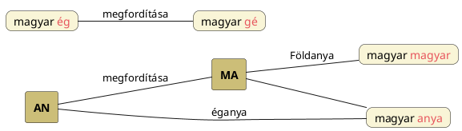

---
{"dg-publish":true,"permalink":"/S/Szómegfordítás/","title":"Szómegfordítás","tags":["containstransclusions","titleandheadingonedontmatch"],"created":"2026-02-09T17:32","updated":"2026-02-09T17:33"}
---

# Szómegfordítás és szótagmegfordítás

## Szómegfordítás

### Van-e létjogosultsága?

Magyar Adorján Ősműveltség című könyvében sokszor szóba kerül. Práczki István mindenhol gyanakszik, nem olvasható-e valami fordítva. Vasváry-Tóth Tibor szintén él vele (lásd [[Y/Yggdrasil\|Yggdrasil]], [[R/Ragnarök\|Ragnarök]] és [[R/Romulus és Remus\|Romulus és Remus]] neveket, melyek közül utóbbiakról Péterfai János is szólt, minthogy fordítva is értelmes).  

Robert Brown Jr. Primitive Constellations of the Greeks, Phoenicians and Babylonians című könyvének 221. oldalán szól a témáról, de nála persze a sémi-föníciai szöveg/szavak görög nyelvbe való átkerüléséről van szó.  
- Először is, a föníciai nyelv később sémisedett el. Másodrészt, a magyar rovásírás is jobbról-balra irányú volt, mely írás irányultsága (jobbról-balra) pedig abból fakad, hogy könnyebb volt a botot bal kézzel tartani, és jobb kézzel balra haladva írni.

Fáy Elek A magyarok őshona című könyvének 272. oldalán írja a [[K/Keta\|ketá]]k hieroglif-írásáról, hogy valószínűleg busztrofedon \["ahogy az ökör szánt"\] volt, azaz felváltva jobbról-balra majd balról-jobbra olvasandó. Ezen csigavonalas írás hasonló a korongokon talált köríráshoz.  
Ennek az írásformának azért is lehet jelentősége, mert egyes idegen nyelvű szavak épp lehet, hogy fordítva olvasandók/értelmezendők. Ahogy említettem, Práczki István nagy híve ennek a gyakorlatnak, túlzásba is viszi, de Vasváry-Tóth Tibor és Egy kis etimológia című dolgozatában De Pluer Mariann is él vele.  

[[B/Bal és jobb\|Bal és jobb]] címnél bővebben taglaljuk az írások és olvasásuk irányát.  

> [!check] &nbsp;
> Ahol a szómegfordításnak bármilyen létjogosultsága lehet, az a [[B/Bal és jobb\|bal és jobb]] és [[F/Fehér és fekete\|fehér és fekete]] címnél is említett [[T/Tükörképes világkép\|tükörképes világkép]] fogalma.  

A [[R/Rák csillagkép\|Rák csillagkép]] azaz a [[N/Nyári napforduló\|nyári napforduló]] kapcsán a rák mozgása (és a [[S/Scarabeus\|scarabeus]] mozgása) kapcsán volt szó arról, hogy azon téridőbeli helyen látszik megfordulni a Nap: elkezd alacsonyabban delelni és a nappalok hossza csökken.  

### Példák

A kul-oba-i kurgán [[H/Hunor és Magor\|Hunor és Magor]]t ábrázoló "[[A/Arkadash\|arkadash]]"-os lelet alakjai segítenek megérteni miről van szó. Az egymás tükörképeinek megfelelő, ellentétes irányban nyilazó szkíta alakok hátának ívei kapcsán született gondolatok [[H/Hunor és Magor\|Hunor és Magor]] címnél oda vezettek, hogy kijelenthessük, hogy nyelvi szinten is megjelenik a felfogás:  
Még itt a nyelvi szórészek tükörképes és szótagmegfordításos jellegzetességei kapcsán említsük meg, hogy minden a [[T/Tükörképes világkép\|tükörképes világkép]]re épül és elsősorban a világos és sötét félévet elválasztó téridőbeli helyen lévő [[I/Ikrek csillagkép\|Ikrek csillagkép]]nek megfelelő és az Ikrek alatti Íjazók/Nyilazók) tükörképes, egymásnak háttal állását, a hátuk (a [[L/Lemniszkáta\|lemniszkáta]] két köríve) görbületeinek tükörképét – ahogy a kul-oba-i kurgán [[H/Hunor és Magor\|Hunor és Magor]]t ábrázoló "[[A/Arkadash\|arkadash]]"-os leletén tökéletesen látjuk –, kell itt észrevenni. Erre a képre épülnek az [[E/Ellentétes értelmek\|ellentétes értelmek]], [[D/Dialektikus ellentét\|dialektikus ellentét]], [[H/Hunor és Magor\|Hunor és Magor]] és [[F/Fény és sötétség\|fény és sötétség]] címnél taglalt témák is.  

Néhány hiteles szómegfordított forma azért szerepeljen itt: [[M/MAG\|mag]] megfordítva gam/kam/kám (hun), melyről lesz szó lejjebb. Ha már hun, a [[H/Huny\|huny]] megfordítása lehet [[N/Nyug\|nyug]]-szik.  
A hunnál maradva, [[H/Hunter\|hunter]] párja [[P/Panther\|panther]]. Ennek eleme, [[P/Pán\|Pán]] viszont a [[N/Nap\|Nap]] megfordítása. [[N/Nap#Nap és Orion\|Nap és Orion]] cím/alcímnél és itt lejjebb volt szó arról, hogy a fordított irányú olvasat azt jelenti, hogy az [[E/Életkör\|életkör]]ben a halál irányába haladunk (a nyári napforduló után a Nap delelő magassága csökken). Lásd erről még lentebb (két ízben is).  

Péterfai János írja, hogy [[S/Széth\|Széth]] [[S/SZET\|SZET]] neve a [[T/Tesz\|tesz]] megfordítása. Ezen az alapon [[T/Tűz\|tűz]] megfordítása [[S/Sötét\|sötét]] [[S/Söt\|söt]] gyöke, melyről főleg lásd [[S/Süt\|süt]].  

Ahogy [[L/L#L-alak\|L-alak]] címnél, [[L/LÁB\|láb]] és [[B/Bál\|Bál]] címnél is szó volt róla, Bál megfordítása láb szavunk.  
De [[B/Bal és jobb#Bal/Bál oldal és Láb (Löv/LOB kontra Lop) oldal\|Bal/Bál oldal és Láb (Löv/LOB kontra Lop) oldal]] cím/alcímnél még ennél is többről volt szó.  

### Metatézis magyarázat

A Götz László Keleten kél a Nap című könyvének 154-155. oldalán taglalt [[H/Hangátvetés\|metatézis]] kétféle, valódi és nem valódi fajtáját taglalja. Valódi metatézisek, ahogy véli/írja, csak egy szótagú tőszavak megfordítása útján keletkeznek.  
Magyar példái: [[K/KAP\|kap]] – [[F/FOG\|fog]], [[M/MAG\|mag]] – [[G/Gumó\|gumó]], [[B/BOG\|bog]] – [[G/Göb\|göb]].  
Amit a latin és német állatnevek kapcsán ír, nem fogadható el. Azok (is) tulajdonképpen az alább bővebben taglalt [[H/Hunor és Magor\|Hunor és Magor]] ([[J/Jön és megy\|jön és megy]]) rendszerre épülnek.  
Szumér szavakat is hoz.  
Amit a kapcsán ír, hogy a metatézisek elsősorban szemantikai jellegűek: részben szinonimák, részben pedig új, néha hasonló, néha azonban éppen [[E/Ellentétes jelentések\|ellentétes jelentésű szavak]] képzésére szolgálnak, megint csak az [[E/Életkör\|életkör]]-alapú rendszer alapján értendőek meg.  

Götz megjegyzi:  
> A nyelvek kialakulásának, fejlődésének jobb megértése szempontjából különösen a legutóbb említett esetek fontosak, amikor a szó megfordulásával annak jelentése is az ellentétesbe csap át. Arra vallanak ugyanis, hogy az ember már a legősibb időkben is tudatosan és észszerű módon alakította ki, formálta nyelvét.  
- Még ha Götz sejtette volna, miféle módon tette azt a magyar.

Ezen a mezsgyén haladva nagyon is elképzelhető, hogy a [[G/Gabona\|gabona]] kapcsán is említett [[G/Give\|give]] eredete [[K/KAP\|kap]].  

### Hunor-Magor rendszer

[[H/Hunor és Magor\|Hunor és Magor]] címnél bőven volt szó arról, hogy mit kell érteni alatta és milyen alapszavak alkotják a neveket.  
[[H/Hunor és Magor#Hunor és Magor nevek alkotóinak változatai\|Hunor és Magor nevek alkotóinak változatai]] cím/alcím viszont utóbb került be, ahol említésre kerültek olyan szavak, melyeket vagy azokhoz hasonlókat Magyar Adorján Ősműveltségében gyakran említett szómegfordítás kapcsán, pl. [[G/Gap\|gap]] címnél.  

A mag-hun pároshoz képest eltérő szóalakok megjelenését azzal magyarázhatjuk, hogy amíg az északi magyaroknál a Csodaszarvast üldözték, délre költözött népeinknél már csak a kecske jöhetett szóba jelképállatként; menet közben a [[S/Szarvas csillagkép\|Szarvas csillagkép]]ből is [[B/Bak csillagkép\|Bak csillagkép]] (Kecskebakhal: [[S/Suhurmasku\|Suhurmasku]]) lett.  
- De annak ellenére, hogy itt egy menet közbeni módosítás történt a jelképállat és az állatöv terén, mégis úgy tűnik, hogy a használatban lévő szavak kiindulói ősszavak: [[F/Flexió#^p3kgqp\|flexió]] címnél is az [[I/Ív\|ív]] szóra mutattunk, de az pedig egyetlen [[I/I#I mint mozgást kifejező, életkörre utaló szócska\|i]] hangra vihető vissza.
Amely `ív` szó kapcsán pedig több helyen szóltunk úgy, hogy az `ég` szóval rokon.  

### Ég és Föld jelentésű kétbetűs szavak megfordítása

Amikor legutóbb [[K/Kör#Két kör\|két kör]] cím/alcímnél Borbola János A Nílus-völgyi hitvilág című Ősi Gyökér 2005/4. sz. megjelent cikkének adatai kapcsán arról volt szó, hogy a [[H/Hungár\|hungár]] név utótagjába a Kör szavunkat látja bele, akkor gondoltam, hogy ezzel lehet kezdeni valamit.  
Így Ma-Kar \[Föld köre?\] lenne az egyik kör, An/Hun-Kar \[Ég köre?\] lenne a másik.  
Utána ötlött fel, hogy a `MA` (lásd [[M/MA\|MA]]) = Föld(anya) az `AN` (lásd [[A/AN, ÁN\|AN, ÁN]]) = Ég olyan megfordítása, mint amilyet Péterfai János [[E/Ég\|Ég]] > [[G/GE\|Gé]] (Ég>Föld) fejlődése kapcsán nagyon helyesen feltételezett. Elmélet szintjén nagyon is jó, így megtartjuk.  

[[A/Anya#Ég(anya) és föld(anya)\|Ég(anya) és föld(anya)]] cím/alcímnél is szó volt a dologról:  

Azt tegyük hozzá, hogy én valójában a MA szót tartom eredetinek, így ennek inverze, AN lett volna utólag létrehozva, és majd utána ebből Ana is. MA ugyanis gyermekbeszéd.  

### -Ra és -Ar/-Er/-Or szóvégi megfordítás

Láttunk több olyan esetet, amikor nálunk -Ra vagy -Ér végződés szerepel, más nyelvekben pedig a fordítottja: a Szek-Ér és Szak-Ra formák is cserélt utórésszel állnak, míg a [[L/Létra\|létra]] szavunk az angolban [[L/Ladder\|ladder]]. A Vizi Lény jelentéssel megadott Vid-Ra lehet így Vid-Úr értelmű.  
Érdekesebb a [[M/Mithra\|Mithra]] és [[M/Mger\|Mger]] (és [[M/Magor\|Magor]]) címnél taglalt eset. Ugyebár mindhárom a téli napfordulón megszülető Napisten, melyek közül a leghamarabbi a magyar Magor alak. Nyilván az örmény Mger/Mher/Mihr Magorra vihető vissza, de hivatalosan annak a Mithrának a folyománya, melyet mi Magor nevétől függetlenül, Mith-Ra, Misz-Ra, Fiatal Nap bontásban és jelentéssel fejtettünk meg. Nem elképzelhetetlen, hogy az indo-iráni (zoroasztriánus) név valójában a Magor rontása illetve átírása (akár örmény átadással).
{ #49w48l}

  

Szó volt arról is, hogy [[R/RÁ\|RÁ]] Napnevünk megfordítottan [[A/AR, ÁR\|AR, ÁR]]. Ez a kiindulópont. Az örményeknél is adatolt Ar (vegetációs) nap(isten)(név).  

#### Baráth Tibor Magyar istennevek a régi Egyiptomban...

...című cikkében nagyon jól fogalmazza meg, miről is van szó:  
> A régi Egyiptomban az istenség megjelölésére szolgáló közszavak között főhely illeti meg a gyakran használt Ur szavunkat. UR: Úr, amely általában istent, nagyurat jelent. Hieroglif írásjele az "R" hang, ez a száj körvonalait ismétlő ovális jel. Hangzósítva s átírva a mi írásjeleinkre **Ur, Ár, Er, vagy Ra alakot vesz fel, aszerint, milyen magánhangzót kíván az illeszkedés szabálya**. Az R hangot azonban más írásjelekkel is ki lehet fejezni, amilyen például a kör és középpontja, valamint egy álló ember, jobb kezében hosszú botot tartva. Az emberalak ábrázolása ülő helyzetben is történhetett, bot nélkül, hosszú hegyes szakállt viselve. Más szavakkal összetéve ilyen szavak keletkeznek: Ősúr, Kisúr, Nagyúr.  
> Pálfi Károly A magyar nemzet ősvallása című könyvében felismerte a magyar és egyiptomi Ur szó azonosságát és rámutatott, hogy a hajdan nagy létszámú magyarul beszélő nép egyik ága Egyiptomban élt több ezer évig és ott ragyogó kultúrát alkotott.  

A szkíta-szláv Szikora név hallatán ötlött fel, hogy az -Or > -Ora > Ra változási folyamat helyes (kiesik az o hang; ahogy az u szokott a japán nyelvben).  

## Szótagmegfordítás

Korábban külön jegyzetben szerepelt, de immáron ezen jegyzet külön alcíméhez került.  

Kezdeném azzal, ami [[B/Bosom\|bosom]] címnél került szóba legutóbb öböl szavunk `öb` gyöke kapcsán, miszerint nem más mint a `bő` szavunk megfordítása, de a kéthangos szótagoknál nem kell megfordításról beszélni, csak arról, hogy a mássalhangzó elé vagy után ejtjük a magánhangzót.  
Erről a [[S/Székely-magyar rovásírás\|székely-magyar rovásírás]] egyes magánhangzóinak helyes (?) kiejtése kapcsán is volt szó.  

#### Götz László Keleten kél a Nap...  

...című könyvének 156. oldalán szereplő idevágó sorai:  
> Végül röviden meg kell említenünk egy írástörténeti körülményt, amely nagy valószínűséggel szintén szerepet játszott bizonyos, metatézisekhez hasonló jelenségek létrejöttében. Ismeretes, hogy a szumér és az akkád ékírás balról jobbra haladt, a Kr.e.-i 2. évezredben kialakult nyugati-szemita betűírások pedig jobbról balra, illetve pontosabban mondva kezdetben soronként váltakozó irányban, "ökörszántásszerűen"' (bustrophaedon). Ékírásos szövegek másolásánál, átírásánál ennek következtében gyakran előfordulhattak szótagsorrendbeli tévedések, elírások; annál inkább, mert ismeretes, hogy a szumér szövegekben is gyakran találkozunk ilyen szótagcserékkel. A `LU₂-GAL` (király) szót például igen sokszor GAL-LU₂ sorrendben írták.  

Olyan eset is létezik, amikor nem az egész szót fordítja meg, hanem a szótagok sorrendjét cseréli fel a nyelv. Tulajdonképpen ilyen módon jönnek létre az utódnyelvek jelzett szó hátulra kerülős (melléknév a jelzett szó után; magyarban is a [[K/Kacskaringó\|kacskaringó]] címnél is említett `hegymagas`, de ilyen még például [[L/Lugal\|Lugal]]) és alternatív birtokos szerkezetei is (hiszen mindegy, hogy ha azt mondom, hogy Nap Háza, vagy Háza a Napnak (csak a szavakban ugye a ragokat nem írták ki; lásd erről Péterfai János írását [[Z/Zero\|zero]])).  
Vegyük észre, hogy az [[A/Angle\|angle]] és [[K/KUL\|KUL]] címnél taglalt Kul-Án és Án-Kul ugyanaz a szó; a két elem megfordítása nem okoz változást. A [[K/Kapu\|kapu]] szavunknak megfelelő szó a hawaii `puka` = űr, lyuk, kapu szó is.  
[[A/Anzu\|Anzu]] címnél szerepelt, hogy An-Zu mellett Zu-An formája is létezett és talán épp [[Z/Zuhan\|zuhan]] szavunk mutat rá, hogy ez így is volt.  
A [[P/Paszuly\|paszuly]] szóelemeinek megfordítása, Szül-Pa/Szül-P adja a [[C/Cölöp\|cölöp]] szót (mind paszuly, és cölöp életfa).  
Ahogy Magyar Adorján is írta Ősműveltségében [[N/Numitor\|Numitor]] címnél, az utórészben meglévő T-R vázú ([[T/Tír\|tír]] címnél írottak szerint nyíl, lövő jelentésekkel is ezért álló) névalak a Nimrud ill. Ménrót névben meglévő R-T/R-D vázú alak megfordítása.  
Péterfai János szerint [[E/Enki\|Enki]], azaz En-Ki megfordítva Ki-En, annyi mint [[K/Káin\|Káin]].  
Péterfai János [[K/Kőris\|kőris]] címnél álló adata szerint Is-Kur ([[I/Iskur\|Iskur]]) isten neve is hasonló a Kőrishez.  
[[U/Urgula\|Urgula]] és [[M/Maghā\|Maghā]] címnél szerepelt, hogy az Oroszlán csillagképnek Ur-Mah (megfordítva Mag-Ur) volt a korábbi sumér neve.  
De ha már [[O/Oroszlán\|oroszlán]], legutóbb ott írottak szerint lehet ez is egy olyan kifejezés, mint amilyen a fentebb említett hegymagas: Orca-Lán(g), Láng-Arcú is értelmes lehet.  
[[A/Arab\|Arab]] Ar-Ab tagjainak cseréjével Abar, [[A/Avar\|avar]] jönne ki. Ugyanakkor [[A/Avar\|avar]] könnyen úr eredetű lehet.  
Elképzelhető, hogy a Bognár Ferenc által [[E/Etióp\|etióp]] címnél taglalt jász-filiszteus falasa/falassa szótagcserélt változata a magyarok legősibb nevének mondott, [[S/Szabir\|szabir]] címnél taglalt ʺsabartoi asphaloi" összetétel második nevének: Asz-Falo/Falu – Falu-Asz. A fallosz is hasonló név, mely megint Nimródra utalhatna.  
Bakos Attila A Duna Evangéliuma című könyvének 229. oldalán azt írja, hogy az Egyiptomban is meglévő Isten szavunk ([[A/Astennu\|Astennu]]-ra gondolt?) fáraó sírokban szótagmegfordítva is megvolt Nat-Us, Net-Is-ként (de Nagy Ős-nek fenti meg).  
[[B/BAR\|BAR]] címnél említettük, hogy a héber `barak` = ragyogó (Bar-Ak felbontásban Ragyogó Fenn) szó szóelem-cseréjével az arab `akbar` = magas(ságos), hatalmas szóformát is megkapjuk.  
[[H/Horvát\|Horvát]] címnél írtuk legutóbb, hogy a Hor-Bat tűnik az eredeti névnek, és ezen név fordítottan Egyiptomban is megjelenik [[H/Hathor\|Hathor]] nevében. Mindkét név Hor, azaz a [[N/Nap háza\|Nap háza]] értelmű.  
[[K/Karma\|Karma]] is lehet afféle kódnév, hiszen Kar-Ma szótag-megfordítva Ma-Kar.  
De ha már a Ma-Kar szóba került, [[D/Deer\|deer]] és [[M/Madár\|madár]] címnél legutóbb arról is szóltunk, hogy mi lenne, ha a Fórika Éva által adatolt sumér Dar-Mah = szarvas jelentésű szó[^1] szótagelemeit felcserélnénk, ugyanis így Mah-Dar, azaz [[M/Madár\|madár]] vagy [[M/Magyar\|magyar]] alakot kapnánk. Márpedig [[M/Magor\|Magor]] és [[M/Makara\|Makara]] címnél szintén előjött a szarvas. [[T/Turul#Tur/Turul mint szarvasfiú\|Tur/Turul mint szarvasfiú]] és [[T/Turul#Turul és Csudaszarvas\|Turul és Csudaszarvas]] cím/alcímnél is volt erről szó (vigyázat: itt akkor a madár már csak a rárepülő hím lehetne (de ez sem jó gondolat)). [[M/Mrigashira\|Mrigashira]] címnél pedig előjött, hogy a madár és szarvas fogalmai keveredhettek. De a [[D/Deer\|deer]] és [[D/Daru\|daru]] szavak azonossága is erről ad bizonyítékot (sőt, akkor ott van még a Tejútfa-életfa-tölgy ilyen alakú neve is).  
A [[K/Karma\|karma]] viszont előjött [[S/Szarvas\|szarvas]] címnél is. Tehát ha Kar-Ma a Ma-Kar megfordítása lenne, akkor Ma-Kar ugye a [[M/Magor\|Magor]] Napra utalna, mely körben mozog [[M/Magyar\|magyar]] nevű anyjában, a [[C/Csudaszarvas\|Csudaszarvas]] állatalak vezetése által.  
Ez egy igen nagyszerű felismerés, hiszen a [[S/Szarvas\|szarvas]] címnél taglalt Szar-Mas/sárma/[[S/Sarama\|Sarama]] mind a szatemes változatai is lehetnek a karma szónak. Sőt, ha nagyon akarjuk, újabb szótagmegfordítással élve mondhatjuk azt is, hogy a szarvas/szarmas a magyar/masszar megfordítása.  
A Bobula Ida és Badiny Jós Ferenc által említett **sumér darmah/daramah = szarvas sem más, mint Mah-Dar = Magyar szarvas istenanya**. Azaz nem a sumér Dar-Mah "Szarvas Nagy" értelmet kell keresni, hanem a szótagokat kell helyre tenni (ahogy az oroszlán Ur-Mah ⇐ Mag-Ur nevében is).  
> [!check] &nbsp;
> Ez a hármas összefüggés-rendszer magyar, madár és szarvas között hihetetlen érdekes. Be is került [[T/Turul#Turul és Csudaszarvas\|Turul és Csudaszarvas]] cím/alcímhez és [[M/Magyar\|magyar]] címhez is az elképzelés.  

De [[M/Magyar\|magyar]] címhez az is bekerült, hogy a hármas összefüggés-rendszer kiegészül egy negyedikkel, a [[S/Szamár\|szamár]]ral. Igaz, itt csak az első szótag kerül megfordításra: Maszar > Szamár. Persze arról már [[K/Khamor\|Khamor]] címnél is volt szó, hogy valójában a szamár a [[H/Hunor\|Hunor]] > [[K/Khamor\|Khamor]] > Szamor > Szamár vonalon is érthető. Hiszen már Fáy Elek A magyarok őshona című könyvében is jól mutatta be, hogy a Mag megfordítása a Kam/Hun. Erről [[J/Jön és megy\|jön és megy]] címnél is volt szó, valamint [[G/Gomer\|Gomer]] és [[G/Gyomor\|gyomor]] címnél is legutóbb szóba került.  
A [[K/Khamor\|Khamor]] címnél taglalt iráni Khamor tűzpapok neve szótagmegfordításos párja a Péterfai Jánosnál előjövő Makhor szumer királyi-papi nemzetség nevének (itt jegyezzük meg, hogy [[H/Hargita Csaba Ferenc\|Hargita Csaba Ferenc]]nél a csillagászatban jártas sumér **magir** papságról volt szó): ez bizonyíték lehet a [[F/Fehér és fekete\|fehér és fekete]] címnél, külön alcímnél taglalt papságok névalkotása mögötti felfogásunk helyességét igazolóan.  
(A [[K/Khamor#Khamor – Makor íjazók\|Khamor – Makor íjazók]] cím/alcímnél hosszasan kidolgozott, a két, Magor és Hunor nevekre is építő téma végére azt írtuk, hogy [[L/Lemniszkáta\|lemniszkáta]] domború bal oldala Magor/Bukor/Bog-Úr, jobb oldala [[K/Khamor\|Khamor]], homorú. Az igaz, hogy a domború és homorú szavak nem mutatnak megfordításos lehetőséget, de a Napminőségnevek igen.)  
Már csak annak az összefüggésnek a feltárása marad, hogy a négy név kapcsolható-e az [[A/Apocalypse\|apocalypse]] és [[S/Sphinx\|Sphinx]] címnél is taglalt [[V/Világ négy oszlopa\|Világ négy oszlopá]]hoz. Nyilván így nem. Mindenesetre két napfordulót kipipálhatunk: a [[S/Szarvas\|szarvas]] a téli napfordulóra, a [[S/Szamár\|szamár]] a nyári napfordulóra utal. A madarakat illetően ugyanígy a [[T/Turul\|Turul]] a téli, a [[H/Holló\|holló]] ([[U/Ullu\|Ullu]]) a nyári napfordulóra utal.  
Figyeljük meg, hogy a sötét/fekete madár Hunor oldalához, a [[T/Turul\|Turul]] [[M/Magor\|Magor]]hoz tartozik.  
Lásd még [[H/Hunor és Magor\|Hunor és Magor]] újonnan írt bevezetőjét, Khamorról és Magorról is, mint egymás változatairól.  
(De ha már Khamor, [[K/KUS\|KUS]] és [[S/SZAN\|SZAN]] címnél legutóbb írtuk, hogy a kínai és japán hegyet, urat és hármat jelentő szó és képjel Orionra, övcsillagaira utal. Lám, ha nem is szótagmegfordítással, de hangugratással az Orionnal azonos [[K/Khamor\|Khamor]] Hám-Or olvasata is kiadná [[H/Három\|három]] szavunkat.)  

Itt közbevetőleg jegyezzük meg, hogy [[K/Kör#Kör – két kör\|kör – két kör]] cím/alcímnél volt szó arról, hogy a Magyar is lehet Ma-Kar (Kör) értelmű és [[H/Hungár\|hungár]]ban is benne lehet a Kör. Az [[I/Iker\|iker]] szavunk ilyen alakja is bizonyíték lehet arra, hogy ez az olvasat helytálló. Persze azt is hozzátettük ott, hogy a két kör valójában egy: a két félkör adja az egyet. Akár mondhatjuk, hogy a [[F/Feleség\|feleség]] szavunk is égi vonatkozású név lehet (és mindenképpen Orion neje, Szíriusz lenne).  

(Fentebb kellett volna taglalni, de okkal teszem ide.) Elképzelhető, hogy a [[K/Kutya\|Kutya]]/Kut/Kucs/[[K/Kuss\|Kuss]] formák megfordítása lehet [[C/Csuk\|Csuk]]:  
A [[K/Kuss\|kuss]] megfordítása, [[C/Csuk\|csuk]] tehát szintén csillagászati szó lehet, tehát (csuk mögött, Péterfai János ajánlására) nemcsak a (napi időkörben vizsgált) Napisten szemeinek lecsukását kell mögötte keresni. [[C/Cataclysm\|Cataclysm]] címnél erre szeretnénk választ kapni.  
Ugyanez ötlött fel [[B/Bűn\|bűn]] címnél a maja `kuch` szó kapcsán: mi lenne, ha a [[C/Csuk\|csuk]] a kis éves időkör sötét [[F/Félév\|félév]]ére utalna, azaz a Kutya Kucs nevének szómegfordításáról lenne szó.  

Magyar vonalon nem szabad elfeledni a Péterfai János (és előtte mások) által is észrevételezett Ör-Dög, Dög-Őr és [[G/Gödör\|gödör]] nevek kapcsolatát. Legutóbb [[E/Észak\|észak]] és [[U/UR\|UR]] címnél, a gond eredetű észak jelentésű Dög-Úr olvasatú `deoguhr` kapcsán is volt erről szó: a szótagok megfordításával [[O/Ördög\|ördög]] nevet kapunk.  

[[D/Dög\|Dög]] tehát egyúttal a Tejútanya [[G/Göd\|Göd]] megfordítása is. Robert Graves, Jankovics Marcell és Falvay Károly adatai alapján tudjuk, hogy az Istenanya az Élet és Halál felett uralkodik és ezért van jó/segítő és gonosz aspektusa is. Ha a Dög = Halált jelent, akkor Göd, God, Guta, Kuta, Kuda és változatai életet, lelket, lelkiséget, melyet (Tejút)Isten(nő)től kapunk.  

Dög érdekesmód (főleg) nőkre is használtatik, melyben a Tejútanya [[S/Szajha\|szajha]]ságát és kutyával hálását is kellhet látni.  
A fordított irányú olvasat tehát utalhat arra is, hogy a visszásság isten- és élet-ellenes: halál vonatkozású.  

Ha már `deoguhr`, ezen szót is szóba hozva szóltunk szótagmegfordításos lehetőségről [[G/Gyökér\|gyökér]] címnél. Gyök-Ér így Csuk-Úr is lehetne, hiszen ott záródik el véglegesen a fény.  

A ma Év-Kör-nek nevezett fogalom régen Kör-Év is lehetett, körülbelül úgy, ahogy a magas hegy `hegymagas`. A [[G/Giraffe\|giraffe]] címnél felsorolt szavak mind ilyen Kör-Év vagy Kör-Eb (Ebcsillag Köre) szóösszetételre hasonlítanak. [[E/EB\|EB]] címnél is volt erről szó.  

Az előbbiekhez nagyon hasonló alaptémájú az imént [[C/Cancer\|Cancer]] címnél taglalt szótagmegfordításos helyzet. A [[C/Cynosure\|Cynosure]] név ugyanis úgy tűnik, nem más, mint a szótagokkal való megfordítása a Sár-Kány névnek: Sure-Cyno. Cancer tehát ugyanúgy lehet Szer-Kan, ha megfordítjuk. A magyar ősnyelvi betűsorrend- és szótag-megfordítás eredeti célja is az lehetett, hogy mutassák vele a forgási irány (illetve a sötét és világos térfél(en lét)) megváltozását. [[J/Jön és megy\|Jön és megy]] címnél is volt arról szó, hogy [[M/Magor\|Magor]] nevében a [[M/Megy\|megy]] és [[H/Hunor\|Hunor]]/[[K/Khamor\|Khamor]] nevében a [[J/Jön\|jön]] fogalma van meg. [[P/Pán\|Pán]] címnél pedig arról, hogy Pánhoz ([[M/Mul.Pan\|Mul.Ban]]-hoz, Hunter-Panther-hoz) érve a fény onnan csökken. (Lásd még erről lentebb.)  
A Szer-Kan és ezzel a Sár-Kány is lényegében azt jelenti, hogy az [[E/Életkör\|életkör]]ben a Fény és Sötétség korszakos változásait – [[S/Szer\|szer]]encsekerékhez hasonlítható módon – a Kutyacsillag helyzete határozza meg. Ezért is történhetett meg, hogy a [[S/Sárkány\|sárkány]] nevet a Szíriusszal is kapcsolatba hoztuk, Szár-Kan, Fényes Kanként.  
De lényegében a fentebbi példák is mind ugyanerről az alapgondolkodási sémáról árulkodnak.  

A Tomory Zsuzsa Szerves magyar nyelvtudomány című az Ősi Gyökér 2004/3. számában megjelenő cikkében taglalt, [[S/Savanyú\|savanyú]] címnél szerepeltetett téma összefoglalásában maga is írja:  
> Fontos az aminosavak optikai tevékenységével kapcsolatos azon megállapítás, hogy bármely összetett aminosav csak két alakban jelenhet meg, s ezek egymás tükörképei. Ez a természettani jelenség fejeződik ki szómegfordítási törvényünkben, mely egyrészt egy azonos folyamat más-más oldalát világítja meg a teremtés elemi szintjén, vagy pedig az erőny és anyag egymásba alakíthatóságát fejezi ki.  

[[H/Hunor#Hunor = Orion\|Hunor = Orion]] cím/alcímnél és [[O/Orion#Orion = Hunor\|Orion = Hunor]] cím/alcímnél volt szó arról legutóbb, hogy nemcsak téridőbeli helyük alapján, hanem a nevek elemzése alapján is azonosak egymással.  
Hunort Égi Úrnak fordítja/mondja Péterfai János, mely az [[O/Orion\|Orion]] (Uru-An-Na) névnek megfelelő jelentés:  
Az égi úr, Hunor csillagait több helyen is kifaragták, vagy megépítették őseink. Egyiptomon kívül a Pilisben, Boszniában, Mayaföldön, Kínában, és bizonyára más helyeken is felfedezhetjük Hunort.  

Végeredményben Uru-Ana/An-Na szótagjainak megfordításával (H)Un-Or-t kapunk.  
Azt hozzá kell tenni itt, hogy Hunor és Orion nevek nem ellentétes értelműek (nem látni mögöttük irányultságot sem, hogy honnan hová tart a Nap).  

Igen érdekes még a Péterfai János által ([[L/Ló\|ló]], [[F/Foal\|foal]], [[L/Love\|love]] és [[F/Fehérlófia\|Fehérlófia]] címnél) taglalt/adatolt Lúfi, Lúfia alaknak Bíró Lajos által közölt megfordított Fi-Ló[^2] formája, hiszen ez meg a görög szeret jelentésű szót (lásd taglalva -[[P/Philia\|philia]]) adja ki.  

Érdekes lehet még magyar vonalon a [[M/Marha\|marha]] és [[H/Hamar\|hamar]]: a Mar-Ha, mint Ifjúság Háza és megfordítva Ha-Mar, ugyanezt jelentheti, tekintve hogy az ifjúk meggondolatlanok és hamariak. Már amennyiben hamar eredete ez és nem [[K/Khamor\|Khamor]] (Kám-Úr, Hunor).  

#### Oláh Imre A Nimrud hagyomány...

...című tanulmányából, [[H/Humavarka\|humavarka]] címnél szereplő adathoz kapcsolt véleményem, hogy a régi nyelvben a jelzős szerkezetek így is, úgy is szerepelhettek:  
> Mármost, ebből a Humavarka szóból kiindulva – miután a több nép-név végén is szereplő "ka" végződést elhagyjuk, bárki könnyen észreveheti, hogy e név két külön részre osztódik: a Huma- és a -varra. Továbbá az M és N hangzók szokásos módosulásait is figyelembe véve: a jólismert Hunavár szóhoz jutunk. Minden bizonnyal ebből a népnévből alakult idővel azután a "várhun" név.  
- Az már más kérdés, hogy Humavarka lehet [[K/Khamor\|Khamor]] előrészű is eredetileg.

#### Bakos Attila A Duna Evangéliuma...

...című könyvének 201. oldalán nagyon jól ráérez, hogy a megfordítások mögött tükrözés, a Földre való letükrözés áll (égi eredetről, földi másodlagosságról szól). A 229. oldalon is írja:  
> De a mezopotámiai nyelvi leleményre utal az az ismétlődő kísérlet, hogy a nyelv elölről és hátulról egyaránt elolvasva legyőzze a polaritást, a világunkra jellemző kettősségeket.  

Másutt, több helyen a hím istenség Bot-Úr (mint például [[J/Jupiter\|Jupiter]] és [[F/Father\|father]]/[[P/Pater\|pater]] jellegű neveknél) és ennek megfordításaként álló Úr-Bot ([[A/Árpád\|Árpád]] nevét fejti meg így) összetételeket hozza, mely elképzelése 2003-ban írva nem is rossz, és akár Péterfai János is elleshette tőle ezt és más gyakorlatot.  
> [!example] &nbsp;
> Ami közben esett le, hogy a Baráth Tibor féle és más forrásokból vissza-visszatérő Erpat formája az [[A/Árpád\|Árpád]] névnek azért nagyon érdekes, mert nem más ezen Er-Pat összetétel, mint a [[F/Father\|father]] és még főleg [[P/Patron\|patron]] címnél taglalt, indo-európainak minősített, de magyar logikára visszavezethető, magyar/hun-szkíta eredetű [[P/Pater\|pater]] (Pat-Er) elemek megfordítása. Éppen az Erpat forma mutat rá, hogy inkább helyes a Pat-Er forma, mint a Pa-Ter, de a magyar nyelv szervessége ezt a megoldást is bírja úgy magában, hogy a jelentés stimmeljen.  
Ezen Pa-Ter viszont megint lehetne akár még [[P/Panther\|Panther]] orrhang nélküli változata is akár (egy Quorás görög ajánlására).  
De ha már Panther-re visszatértünk, [[T/Tulipán\|tulipán]] címnél (hiszen Túli-Pán nevében is megvan Pán) is arról szóltunk legutóbb, hogy a téli napfordulón születő [[N/Nap\|Nap]]ból a nyári napfordulón [[P/Pán\|Pán]] lesz. Nemcsak a [[P/Panther\|Panther]] nevét magyarázza meg így, hanem [[P/Pán\|Pán]] Szíriusszal való megfeleltetése, annak helyessége is igazolt. Tehát adott egyszer [[M/MAG\|MAG]] és megfordítása, Kam (Hun), valamint Nap és Pán, mely Pán (inkább talán Bálból, Bál-Orionból kiindulva?) Pál is lehet, hogy aztán Naposz és Pálosz ikrek jöjjenek elő másutt [[H/Hunor és Magor\|Hunor és Magor]] helyett (lásd ezen címnél róluk).  

[[P/Pater\|Pater]] és [[K/Kazár\|kazár]] címnél is írtuk, hogy a [[S/Sacchar-\|sacchar-]] címnél megtaláluk a P-B-V és K- (és CS-) előhangos nevek megfordított változatait és mind Orionra, a sötét félév kezdőpontjára utaló nevek ezek.  
De ugyanígy [[C/Csavar\|csavar]] első szótagjának megfordításával adódik `facsar`.  

A [[M/MAG#Mag – huny rendszer a jang-jin szimbólumban\|mag – huny rendszer a jang-jin szimbólumban]] cím/alcímnél legutóbb taglalt témát kellett volna legelőre venni, mert mindennek a mag az alapja.  

Ahogy [[B/Buta#Buta és os-tuba\|buta és os-tuba]] cím/alcímnél írtuk, a [[D/DUB\|DUB]] címnél és a [[T/Thuban\|Thuban]] és [[T/Typhon\|Typhon]] címnél taglalt, északra és [[S/Széth\|Széth]]re vonatkozó fogalmakkal, szavakkal (mely Széth névben – egyrészt – a setét fogalma újfent megtalálható) egyetemben az arab és kelta sötétséget jelentő és arra utaló szavak eredete lehet a Bu-Ta elemeinek megcserélése vagy az [[O/Ostoba\|ostoba]] Tuba része.  

### Magyar vagy Magor/Makar neveinket érintő esetek

Csak még egyszer, felsorolásként a sumér és ind nyelvekből:  
Dar-Mah Szarvas = Magyar.  
Dharma = Magyar  
Karma = Makar/Magyar  
Ur-Mah = Magor  
Makara – Kumaru esetet (Blavatsky által is említve) lásd még [[H/Hunor és Magor\|Hunor és Magor]].  

---

Nem tudom kitől (vegyük úgy, a magyar nyelvből) származnak hasonló szótagmegfordításos esetekre az alábbi példák: szerszám – számszer, özönvíz – vízözön, árvíz – vízár, színhely – helyszín, sültmalac – malacsült, régi súlyegyen – egyensúly, Fejenagy – Nagyfejű.  
Hasonló Péterfai Jánostól (de már ellentétes jelentéssel): [[K/Koldus\|koldus]] – dúskál[^3].  
Amikor csak ez egyik tagot fordítjuk meg: csavar – facsar.  
[[N/Nőstény\|Nőstény]] címnél szerepelt, hogy lehet Nő-Isten (= Istennő).  
A `bazi` szavunkból képződött volna a `zabi` szó is, hallottam/olvastam valahol.  

## Lábjegyzetek

[^1]: Lábjegyzet:  
Az internetről letöltésre elérhető The Origin of the Legend of the Stag című cikkben Fred Hámori cikkíró Bobula Ida The Great Stag, a Sumerian Divinity c. írására hivatkozva **Dara-mah** néven említi.  

[^2]: Lábjegyzet:  
V. Ivanov kimutatta, hogy egyes indoeurópai nyelvek (ógörög, latin és gót) az ugor nyelvekből (magyar, manysi, chanti) vették át a csikót jelentö szót. Görög `polosz` = csikó, latin `pullus`, gót `fula`, v.ö.: magyar és manysi ló-fi, régi összetételben fi-ló. \[Bíró Lajos; mivel a csikó `chico`, `chica` formában a spanyol nyelvben fiú, lány jelentéssel jelen vannak, kimondható, hogy a latin `pullus` = állatkölyök (honnan tovább: pulla = csirke, puer = gyerek) szó is a Tejútanya állatalakjának Napszülésére utalnak és ezen szavak a földre vetítve már emberek gyerekeinek nevére lettek használva.\]  

[^3]: Lábjegyzet:  
Egy másik hasonló Práczki István Szittya Biblia című könyvéből:  
A magyar erkölcsöt a nyerészkedés fonák olvasata fejezi ki. Nyerész -FO= szerény. Ez a két fogalom együtttesen szinte elképzelhetetlen. Aki ma nyerészkedik az nem lehet szerény. Aki viszont szerény, az nem uzsorás.  