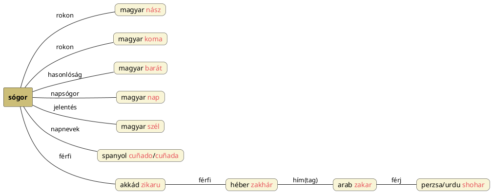

---
{"dg-publish":true,"permalink":"/S/Sógor/","title":"Sógor","created":"2024-11-08T15:26","updated":"2024-11-23T05:37"}
---

# Sógor

[[S/Social\|Social]] szónál is előjött. CzF elemzését (a német `schwager` = sógor szót nem említik) ignorálva Szag-Úr, Nap Úr értelme lehet. A Nap alatt mindenki egy és úr. A [[N/Nász\|nász]] által szerzett rokon (mint a [[K/Koma\|koma]]) még inkább kedves (volt).  
Sógor lehet napsógor, mint Ipolyi Arnold Magyar mythologia című könyvének 187. oldalán. (Sőt, [[B/Barát\|barát]] szavunkhoz hasonlóan valóban a Napra utalhat; bár akkor melyik csillag testvére lenne?)  

#### Kandra Kabos Magyar Mythologia...  

...című könyvében (a PDF 67. oldalán) talált info alapján viszont Sug-Úr = Szél Úr lehetne a jelentése:  
> Előbb láttuk, hogy az átmeneti magyar imádság a szép, ragyogó Napot "testvér"-nek tiszteli, a Holdat "asszonynénénk"-nek, a Csillagokat "hugaink"-nak, a Szelet "süvünk"-nek, sógornak, a Vizet "ángyikánk"-nak, a Tüzet "urunkbátyánk-nak, a Földet "nagyasszonyunk"-nak.  

Vesd össze a [[K/Koma\|koma]] és [[K/KUN\|KUN]] címnél szereplő spanyol `cuñado`/`cuñada` = sógor(nő) szavakkal; ott is Napnevek állnak.  

[[S/Sacchar-\|Sacchar-]] és [[S/Sugar\|sugar]] címnél hasonló sémi és közel-keleti szavakról volt szó: az akkád `zikaru` = férfi, héber `zakhár` = hím, férfi, az arab `zakar` (zekernek ejtik) = hím; hímtag értelműnek (vö. arab `ḏakar` = hímtag) megadott. A perzsa és urdu `shohar` = férj ugyanezen sémi szóforma kell legyen.  

