---
{"dg-publish":true,"permalink":"/S/Süt/","title":"Süt","created":"2024-11-05T19:17","updated":"2025-07-03T01:17"}
---

# Süt

A Nap süt. A pék (lásd [[B/Bake\|bake]]) kenyeret süt. Süt a [[T/Tűz\|tűz]] megfordítása. Süt párja a [[S/Szít\|szít]]. Ellenpárja a [[S/Satnya\|satnya]] [[S/SAT\|SAT]] eleme, [[S/Sátán\|Sátán]] sát-ja, [[S/Sötét\|sötét]] [[S/Söt\|söt]] gyöke és [[S/Sut\|sut]]. Számtalan helyen leírtam már, hogy a magyar szavakról tudjuk, hogy a negatív szavak pozitív szavak alaki változatai. A legalapvetőbb példák közül: süt <> söt(ét). A szóváz ugyanaz, mert egy rendszer: ugyanannak a rendszernek két oldaláról van szó. [[B/Black\|Black]] és [[B/Bleach\|bleach]] címnél ugyanezt látjuk a germán nyelvben.  
Alant, külön alcím alatt tovább boncolgatjuk a dolgot.  

Amennyiben levezetését nem a [[T/Tűz\|tűz]] megfordítására alapozzuk, nyilván Su-Tu olyan alkotás, amire Péterfai János is gondolna. A Tu végződést [[D/DO#Do 2)\|do]] címnél láttuk ilyen minőségben, [[S/SU\|SU]] pedig ismert, mint ami `süvít` szóban is szerepel.  

Több szónál előjön utódnyelveinkben, például szláv szvet ([[S/Szvjet\|szvjet]]), angol [[S/Sweet\|sweet]]. A svájciak országának Suisse neve (de az angol átírásban Switzerland is) felismerhetően süt/süss szavunkra üt (ahogy az édeset jelentő germán szavak is). Lásd még [[S/Sweden\|Sweden]].  
[[S/Shoot\|Shoot]] szónál is szerepelt:  
Süt az [[U/Üt\|üt]] szavunkkal is fogalmi és hangtani rokonságban van, hiszen [[U/UT\|UT]] = Nap forró, tüzes nyilait süti, lövelli a Földre (ezért is hasonlították sünhöz, mely ismét a süt igevariánsa lehet, ahogy [[T/Tesz\|tesz]]nek [[T/TEN\|TEN]]). Hogy a süt az üt s-előtétes variánsa, elárulja, hogy a japán `ute` is lő jelentésű és üt szavunkkal azonos.  

Egyébiránt Varga Zsigmond Az ősmagyar mitológia c. könyvének 320. oldalán álló adata szerint a sumérben is volt egy `shad`, `shud` tő, amely fényesnek lenni, fényessé tenni, felragyogni, fény, ragyogás, tisztaság jelentéssel bírt. Lásd [[K/KAT\|KAT]].  

Egy némileg hosszabb lélegzetű, [[S/Season\|season]] szónál elővezetett Magyar Adorján féle passzus ihlette írást lásd [[B/Búza\|búza]] címnél, a Nap érlelő, sütő tevékenységéről. A [[B/Búza#Búza és krumpli közös neve – Quora válasz sok minden mással\|búza és krumpli közös neve – Quora válasz sok minden mással]] alcímnél szereplő angol nyelvű írásban közölt egyiptomi `sut` = búza is azonos süt szavunkkal, minek után [[S/Seed\|seed]] eredete is ugyanígy értendő.  

A [[R/Rod\|Rod]] címnél előjövő szláv [[S/Sud\|Sud]] istenség neve talán nem süt, hanem inkább Szűz nevünkhöz köthető.  
[[S/Sőt\|Sőt]] szavunk is süt ("összesütő") értelmű.  
Idevehetők [[B/Buddha\|Buddha]] és atyja neve is: Siddhartha herceg és Suddhodana király. ([[S/Szít\|Szít]] és süt.)  
Az Ipolyi Arnold Magyar mythologia című könyvének 336. oldalán lábjegyzetben előjövő (S-T váltással finn és észt [[T/TÁT\|TÁT]] címnél taglalt szavakhoz is hasonlító) vogul `sauht` = csillag nyilván süt szavunkkal azonos.  

A francia `chaud` = forró is innen ered, nem a latin `calidus` szótól.  
  

A mellékelt táblázat aveszta SZU-DAR alakjai érdekesek, minthogy a férj elnevezése ezek szerint onnan származik, hogy rendelkezik megtermékenyítő folyadékkal. De lehet hogy itt inkább a Süt-Rá értelmezést kell helyesnek vélni. ([[S/Sutra\|Sutra]] pedig szintén létező szó.)

A török, kazah, kirgiz, baluchi, ujgur `süt`, azeri `süd` = tej, mely [[T/Táp\|táp]]lálék értelmére, vagy talán [[S/Sweet\|sweet]] = édességére mutat rá (egyes iráni nyelveken a "szolim-szarmata" `shir`, azaz [[Z/Zsír\|zsír]] a tej, míg [[D/Dugh\|dugh]] = lefölözött tej).  
Ugyanakkor az örmény (kún-hun K-T vázú) `kat`, baskír `höt` (mely [[H/Hot\|hot]] szóval is rokonítható) és tagalog `gatas` = tej szavak mutatnak rá, hogy valóban sütő, azaz a meleg táplálék értelmet kell keresni benne (vesd össze germán-szláv tejet jelentő szavak (mint például angol [[M/Milk\|milk]]) meleg alapértelmével és a sémi Moloch napisten nevével).  
(A roma nyelv `thud` = tej szava tőgy vagy inkább tud szavunkkal egyezik: a tölgyfapap táltos tápláléka is a tej, de [[M/Mohammed\|Mohammed]] is a három felajánlott ital, a bor, víz és a tej közül – helyesen – utóbbit választotta.)  

## Süt, shoot, szkíta

```plantuml-svg
@startuml
left to right direction
skinparam BackGroundColor transparent
skinparam card {
    roundCorner 15
    BackgroundColor #f9f5d7
}
card "Süt" as w1
card "Shoot" as w2
card "Skytha" as w3

w1 -- w2
w2 -- w3 : IE ~*(s)kewd-
@enduml
```

Amikor a görög (által lejegyzett) [[S/Szkíta\|skytha]] név indogermán jelentése nyomán eljutunk – akár a sima s-sel ejtett angol [[S/Shoot\|shoot]] igével hasonlítva – süt igénkhez, ne gondoljuk, hogy a süt nyomán keletkezett volna a szkíta név, vagy hogy a szkíta nyomán keletkezett volna süt. Éppen arról van szó, hogy a süt szónak olyan magyar-hun flexiós vagy poszt-magyar-hun torzult változatát kell keresni, mely a skytha név lejegyzését egyáltalán lehetővé tehette. Ne lineáris levezetésekben gondolkodjunk és ne csak 2-3 alakot vizsgálva alkossunk véleményt.  
- Az indogermán jelentés alatt azt értjük, hogy az indoeurópai \*(s)kewd- = lő gyök egyezik a szkíta névvel, mely névvel kapcsolatban egyik — tellurikus – [[S/Shoot#^v82dg3\|megközelítése]] szerint azt mondhatjuk, hogy a szkíta = íjfeszítő (nép) jelentésű; tellurikus alatt pedig azt, hogy a történészek nem számolnak – egy másik megközelítéssel: csillagképekkel.

### Kentum kut és szatem süt alakok skut alakba való összevonása

Érdekes, hogy az imént említett IE gyökben az s-elővetés zárójelesen, opcionális hangként van jelölve. Azaz ahogy pl. [[H/Hieroglyph\|hieroglyph]] címnél üt, vág jelentésű azonos alakú különböző nyelvű szavakat láttunk, a [[C/Cut\|cut]] és [[C/Concussion\|concussion]] címnél taglalt vágás, ütés, valamint dobás fogalmai is hasonló szóalakokkal kerültek kifejezésre. A dob már az (íj)lövés fogalmával társítható, de még a görög `βάλλω` = dob igének is van üt, csap értelme, míg a `bélosz` = nyíl jelentésű.
{ #ixo2pk}

Az alcím magyarázatot kíván. [[S/Szatem#Kentum-szatem szétválás helyett összevonás\|Kentum-szatem szétválás helyett összevonás]] cím/alcímnél már volt szó azon esetről, amikor a szóeleji s(z) és k összevonva jelenik meg IE szavak elején. Ez a helyzet a lő ige (északi) germán írásmódjával is (kiejtésében helyenként viszont már nem követi).  

Az (elő)germánok pedig hunok, vallásuk/"foglalkozásuk" szerint szkíták. Az átmeneti időszakban romlottak ezen alakok.  
Mi alapján:  
- Hasonló jelentésű igék: [[K/Kasz\|kasz]]/[[K/KAT\|kat]] ([[C/Cut\|cut]]), mely az [[U/Üt\|üt]] előhangos változata, de süt is lehet üt előhangos változata, ahogy [[C/Concussion#^apmcg1\|itt]] szóltunk róla.
- Csillagmitológiai képek/nevek: vadász (a lő ige ágense) űzi a [[C/Csuda\|csuda]]szarvast, [[K/Kutya\|kutyá]]ja is van, stb. (A lövés = szexuális értelemben nemzés = kutyanemzés = ívás = íjazás, azaz itt a vallási/mitológiai alapfogalmak feltárása az elsődleges cél.)

#### Szkíta már rontott szkíta nyelvű alak?

Mit jelenthet mindez a szkíta név eredetére nézve?  
Nyilván a ma germánnak minősített, azok mai nyelve régebbi formáját beszélő népesség (köznép) szóalakjai nem valami Hérodotosz nevű illető leírását követték, és ha más esetekben is találunk torzult szk- formát, akkor adódik a lehetőség, hogy Hérodotosz mégsem rosszul rögzítette a nevet, a görög betűk hiányossága miatt, hanem mert tényleg egy rontott – szkytha – formát közöltek vele.  
A másik eshetőség, hogy Hérodotosz ezt a nevet már látta leírva is, és azt másolta tovább, de 1) a kiejtés nem szkytha volt, 2) Hérodotosz abc-je egyébként sem adott volna módot másképpen való rögzítésére.  

#### Nem kentum-szatem formákról van szó – nincs szk összevonás

Azaz feltehetjük, hogy a Hérodotosz által rögzített név már a megváltozott hun(utód) nyelv szava, ugyanakkor nem lehet kizárni azt az eshetőséget sem, hogy valójában nem sk- előtétről van szó, hanem [[K/Kutya\|kutya]] sz-előtétes formájáról.  
Nem tudjuk megállapítani, melyik az erősebb elem: a kentum-szatem bizonytalanság, a mitológiai nevekhez való formai ragaszkodás, vagy ezek utólagos lerontása előbbi okok miatt. Tipikus konflációs eset lényegében.

## Süt, szít, sut, söt(ét)  

Gyakorlatilag a SZET, SZÉT, SZÍT, SZAT, SÜT, SÖT, SUT, SAT szavak alapján ugyanolyan életkör-diagram alkotható, mint amilyen [[D/Deer\|deer]], [[K/Kut\|kut]] (mely Kut-nak szatemes párja lenne ezen Szat/Szet) és [[M/MISZ\|MISZ]] címnél szerepelt.  

[[S/SAD#Sad 2)\|Sad]] címnél írtuk legutóbb:  
A [[S/SAD#Sad 2)\|sad]] fogalmában az ül ([[S/Sit\|sit]]) fogalma is meglehet. Ahogy a [[K/Kutya\|kutya]] szónak megvan a [[K/Kushad\|kushad]] kapcsolata, itt is ezt kell keresni. Egyébiránt az ainu és mundari nyelvben `seta` = kutya. Kapcsolatai: [[S/Szít\|szít]]; Szíriusz; kánikula, honnan utána jön a sötét térfél. Lényegében ez a megoldás is: a [[S/SAD#Sad 2)\|sad]] szót a sötét szóval kell párhuzamba állítani.  
Így lehet megérteni a fentebbi, idővel kapcsolatos szavakat is: idő = téridő = élet/állatkör, melyben a váltó/felezőpont a Kutyacsillag Szíriusz.  
Persze a Süt/Szít/Sat/Sát/Sut/Söt/Set tulajdonképpen a [[S/Szatem\|szatem]]es változata [[K/Kut\|Kut]]-nak és társainak. Ott ([[S/Szatem\|szatem]] címnél) szóba került még a [[C/Csuda\|csuda]] címnél is kifejtett téma: hogy a magyar nyelv magában hordozza a lehetőséget arra, hogy egyes kemény hangzói (mint a K) meglehessen s, sz, cs formában is, némi jelentésmódosulattal is. Így a Magyar Adorján által taglalt régi csod vagy csud = süt, fény keményebb, eredetibb párja lehet [[K/Kut\|kut]], csudának pedig [[K/Kutya\|kutya]], de eredeti a [[S/Süt\|süt]] is (hisz ez [[T/Tűz\|tűz]] szavunk megfordítva), valamint [[H/HUD\|HUD]], [[G/GUD\|GUD]] formák is léteznek ilyen fény jelentéssel.  
[[K/Kutya\|Kutya]] cím (újra)bevezetőjében is volt arról szó, miért is alakulhatott ki a hajlandóság arra, hogy a kemény hangzókat lecseréljék.  
[[D/Dialektikus ellentét\|Dialektikus ellentét]] és [[H/Hunor és Magor\|Hunor és Magor]] címnél is szerepeltek az alábbiak:  
Az ellentétes értelmek kialakulásának eredete ugyanoda vihető vissza, mint amiről [[H/Hunor és Magor\|Hunor és Magor]] címnél az ellentmondásokat taglaló résznél már szóltunk. A nyári napfordulós pont az, ami a süt és [[S/Sötét\|sötét]] fogalmai azonosságát adja: ott süt a legmagasabban a Nap, de onnantól kezdve kezd sötétülni, hunyni/kumni/sunyni is.  
Legutóbb a [[H/Hódol\|hódol]] és [[H/Hódít\|hódít]] szavak passzív és aktív értelmeinek vizsgálata kapcsán szóba hoztuk az [[I/Íj és a nyíl\|íj és a nyíl]] cím bevezetőrészében említett témát: miszerint egyaránt megtaláljuk a nőiségi és hímségi ideákat ott, egy helyen, a nyári napfordulós téridőbeli helyen. Ez az oka az ellentétes értelmeket adó azonos alakú vagy gyökű szavaknak. A sötét félév váltása a fényesről ott történik (de a nemzés is ott történik, ellenben a téli napfordulón már nincs hím, csak a napgyermek, aki megszületik).  
([[S/Szutek\|Szutek]] címnél, külön alcímnél pedig hasonló témában volt szó arról, hogy a Jupiter és Szaturnusz nevek illetve mögöttes fogalmai szintén hasonló elven alakulnak ki.)  
Még itt a nyelvi szórészek tükörképes és [[S/Szómegfordítás#Szótagmegfordítás\|szótagmegfordítás]]os jellegzetességei kapcsán említsük meg, hogy minden a [[T/Tükörképes világkép\|tükörképes világkép]]re épül és elsősorban a világos és sötét félévet elválasztó téridőbeli helyen lévő [[I/Ikrek csillagkép\|Ikrek csillagkép]]nek megfelelő és az Ikrek alatti Íjazók/Nyilazók) tükörképes, egymásnak háttal állását, a hátuk (a [[L/Lemniszkáta\|lemniszkáta]] két köríve) görbületeinek tükörképét – ahogy a kul-oba-i kurgán [[H/Hunor és Magor\|Hunor és Magor]]t ábrázoló "[[A/Arkadash\|arkadash]]"-os leletén tökéletesen látjuk –, kell itt észrevenni. Erre a képre épülnek az [[E/Ellentétes értelmek\|ellentétes értelmek]], [[D/Dialektikus ellentét\|dialektikus ellentét]], [[H/Hunor és Magor\|Hunor és Magor]] és [[F/Fény és sötétség\|fény és sötétség]] címnél taglalt témák is.  