---
{"dg-publish":true,"permalink":"/T/Tosz/","title":"Tosz","created":"2023-10-25T05:23","updated":"2024-12-17T15:43"}
---

# Tosz

Toszni annyit is jelent mint, [[D/DUG\|dug]]ni, [[B/Basz\|basz]]ni. A mai kor embere nem is sejti, hogy ezek szent, asztrális/szakrális értelmű elnevezések, ahogy [[N/Nimrud\|Nimrud]] (Nim-Rud = Nemző Rúd) nevében is hasonlót fedezhetni fel.  
Tosz a [[T/Tűz\|tűz]] szó alaki párjaként szintén a [[T/TU\|TU]] = Nap nevéből ered, ahogy [[T/Tusa\|tusa]] és [[T/Tüske\|tüske]] is. Az ind `surya` = Nap is a [[S/Szúr\|szúr]] szótól való.  
[[K/Kutyanemzés\|Kutyanemzés]] címnél sorra vettük a hímségi-asztrális szavakat, melyek mind szakrális-szent beojtásról (ojt = [[O/Olt\|olt]]), megtermékenyítésről szólnak.  
Tosz vagy [[T/Tűz\|tűz]] szavunkkal egyeztethetőnek tűnik így a lengyel, Gdansk környékén (mintegy 200 ezer ember által) beszélt kasub nyelvű `tósz` = kutya.  
[[T/Töcsköl\|Töcsköl]] szó törzsöke is egyezik vele.  

```plantuml-svg
@startuml
top to bottom direction
skinparam BackGroundColor transparent
skinparam rectangle {
    BackgroundColor #ccbe78
}
skinparam card {
    roundCorner 15
    BackgroundColor #f9f5d7
}

rectangle "<b>TOSZ</b>" as head
card "magyar <color:#e7545c>dug</color>" as dug
card "magyar <color:#e7545c>basz</color>" as basz
card "magyar <color:#e7545c>tűz</color>" as tuz
card "magyar <color:#e7545c>tusa</color>" as tusa
card "magyar <color:#e7545c>tüske</color>" as tuske
card "ind <color:#e7545c>surya</color> jelentése: Nap" as surya
card "magyar <color:#e7545c>szúr</color>" as szur
card "kasub <color:#e7545c>tósz</color> jelentése: kutya" as tosz_kasub
card "magyar <color:#e7545c>töcsköl</color>" as tocskol
card "magyar <color:#e7545c>olt</color>" as olt
card "magyar <color:#e7545c>TU</color> jelentése: Nap" as tu

head -- dug : "jelentése: dugni"
head -- basz : "jelentése: baszni"
head -- tuz : "alaki párja"
head -- tusa : "eredete: TU"
head -- tuske : "eredete: TU"
head -- surya : "eredete: szúr"
head -- szur
head -- tosz_kasub : "jelentése: kutya"
head -- tocskol : "törzsöke egyezik"
head -- olt : "jelentése: beojtás"
head -- tu
@enduml
```

