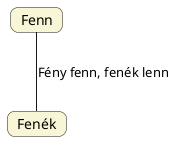

---
{"dg-publish":true,"permalink":"/T/Tükörképes világkép/","title":"Tükörképes világkép","created":"2026-04-01T14:14","updated":"2026-04-01T19:04"}
---

# Tükörképes világkép

[[E/Ég és föld\|Ég és föld]] és más címnél is volt róla már szó.  

#### Falvay Károly Nagyboldogasszony...  

...című könyvében írja:  
> Bodor György László Gyulára hivatkozik, mily fontos szerepe volt a török népek életében a "megfordítás" törvényének: "A túlvilágot például az élet [[T/Tükör\|tükör]]képének tekintették, **ami tehát az életben jobboldal volt, a túlvilágon baloldal lett és megfordítva**. E törvénynek azonban nemcsak az élet és a túlvilág viszonylatában, hanem a jelenvaló világ dolgaiban is nagy szerepe volt: **A jobb és a balszárnyra tagozódás és egyes néprészek "fehér" és "fekete" elnevezései is mind e törvény különbözű formájú alkalmazásai**."  

#### Magyar Adorján...

...alábbi passzusa [[A/Anyag\|anyag]] és [[E/Erőny\|erőny]] címnél (bővebben) szerepelt:  
> Korábban említettem, s most ismét felhozom azt, hogy őseink ismerték az anyag-erőny egymásba alakíthatóságát a természet világában, s e tényt és tudást nyelvükbe is beépítették. Műveltségük minden ága, így nyelvük is ezen tükörképes világot hangsúlyozta. Néhány magyar példát hozva: a `bak` hímségi, a `köböl`, `kebel` nőiségi szavak, s egymás tükörképei. Ugyan ez áll a `pálca` – `lap` szóra, s folytatható a sor még tovább.  

A sor pedig leginkább a [[H/Hunor és Magor\|Hunor és Magor]] nevek alapszavainak egymásba megfordíthatóságával kezdhető, ahogy [[S/Szómegfordítás#Szótagmegfordítás\|szótagmegfordítás]] címnél is taglaltuk.  

Amikor tehát...

#### Pintye Mihály Avarok egy kitalált nép...  

...című Ősi Gyökér 2004/4. sz. megjelent cikkében László Gyulának egy korábbi cikkére hivatkozva látszólag ellent akár mondani, nem látja be, hogy ugyanarról a fényes-árnyékos (ellentétes oldalas) leosztásról van szó:  
> Más munkámban elvégeztem a szakrális kettős királyság tematikus feldolgozását. Bemutattam, csak a magyarnál van kozmikus vonatkozása, ezért magyar eredetű intézmény. A Tarján a Naptól származtatta magát, ezért néprészével együtt a kelő-nyugvó Nap irányába tájolták sírjaikat. A Gyula a Holdtól származtatta magát, néprészével a "rossz oldal" sötétség kultikus Ny-K irányba tájoltak. Elvileg ennek felel meg az É-D is. Bizonyítottnak tekinthető, hogy a kettős királyságból eredő kétféle temetkezés különbözősége várhun-székely és Árpád népe (besenyő) között nem etnikai másságot jelent. László Gyula észrevette Árpádék temetkezésében, hogy a tárgyak ellenkező oldalon, tükörképszerűen lettek elhelyezve, mint életükben használták. Magyarázata szerint azért, mert az alvilágot (halál) a fenti világ (élet) fordítottjának tartották. Magyarázata nem kielégítő. Szerintem a Holdat (Gyula) a Nap (Tarján) tükörképének (ikrek) tartották, ezért a két király és népe egymáshoz képest tükörképszerűen temetkezett. A részleges ló\[vas temetkezés Árpád népét tekintve\] K-Ny tükörképe egész ló Ny-K.  
- Pintye ezen adatai [[E/Észak és dél\|észak és dél]] és más adataival [[F/Fehér és fekete\|fehér és fekete]] címnél is szerepeltek. 

[[J/Janus\|Janus]] címnél is szóba került a téma, szintén Tomory Zsuzsa mondanivalójával is.   

#### Jankovics Marcell Ahol a madár se jár...  

...című könyvében írja:  
> Az uráli népek északi lakhelyüknél fogva, ahol a Sarkcsillag a zenithez közel ragyog, az ekliptika pedig alig válik el a horizonttól, az eget alulnézetben ábrázolták. Dobjaik olyan egyszerűsített égtérképként írhatók le, melyek az északi égboltot a látvány, a délit az ellentétpárokra épülő gondolkodásmódnak megfelelően annak tükörképeként jelenítik meg. (Ezzel szemben, a tőlük délebbre lakó altaji népek az eget oldalnézetben ábrázolták.)  

Ipolyi Arnold könyvének 158. oldalán szól a Délibábbal kapcsolatos békési regéről, ahol biz. Csörsz (megszemélyesítve mint avar király) neve jön elő. Ahogy [[C/CSÁR\|CSÁR]] címnél is írtuk, amit Ipolyi Arnold nem vett észre, hogy Csörsz (Csűrsz, Csavarsz) név a [[K/Keresztre feszített Nap\|keresztre feszített Nap]]ot hordozó Tejútra, annak forgására utalhat. A délibábbal való kapcsolatbahozatalát úgy lehet értelmezni, hogy ahogy a Tejút két egymással ellentétes [[F/Félév\|félév]]re bontja a Nagy és Kis Évet, úgy a délibáb, egyfajta tükörképként fejjel lefelé állítja a valóságot.  

[[A/Arkadash\|Arkadash]] és [[S/Szómegfordítás\|szómegfordítás]] címnél a [[B/Bal és jobb\|bal és jobb]] és [[F/Fehér és fekete\|fehér és fekete]] címnél is taglalt [[T/Tükörképes világkép\|tükörképes világkép]] fogalmáról és annak nyelvben formákban megmutatkozó "hatásairól" volt szó. Mindenképpen érdemes elolvasni, hiszen erre a [[L/Lemniszkáta\|lemniszkáta]] címnél is taglalt képre épülnek az [[E/Ellentétes értelmek\|ellentétes értelmek]], [[D/Dialektikus ellentét\|dialektikus ellentét]], [[H/Hunor és Magor\|Hunor és Magor]] és [[F/Fény és sötétség\|fény és sötétség]] címnél taglalt témák is.  

## Fent-lent és bal-jobb (világos-sötét)

(A jobb oldal a világos oldal, de [[B/Bal és jobb\|bal és jobb]] és más címnél is úgy mutattunk ábrázolásokat szembenézetből, hogy számunkra a bal oldalnak látszik megfelelni a világos oldal.)  

Már a szavak szintjén is látjuk a kettősséget:  

Nemcsak a Hermész Triszmegisztosz/Thotnak tulajdonított "Ahogy fenn, úgy lenn" axióma kapcsán volt erről szó, hanem pl. a [[G/Gundestrup üst#Üst mint égjelkép\|gundestrupi üst alsó fenéklemeze]] kapcsán is elhangzott, hogy a fent megfelelhet a lentnek.  

### Felezés irányai

Ugye alapvetően arról van szó, hogy van egy **primordiális, teremtéssel kapcsolatos**, fent-lent elválasztásából adódó felezés, majd már a forgó rendszerben érvényesülő, Hunor-Magor/jin-jang rendszerrel magyarázható bal-jobb osztású felezés, ahol a felső pont a [[P/Poláris-szoláris átállás\|poláris-szoláris váltás]]sal létrejött szoláris időszakában az a Kutya, amely K-T váza helyet, felső pontot is jelent.  
- Azt kéne tudni, hogy a [[V/Világhegy\|Világhegy]] erre utal-e inkább, vagy már utal a kozmogóniai teremtéssel létrejött Világhegyre.{ #s69777}

> [!example] &nbsp;
> Ugye alapvetően arról van szó, hogy van egy **primordiális, teremtéssel kapcsolatos**, fent-lent elválasztásából adódó felezés, majd már a forgó rendszerben érvényesülő, Hunor-Magor/jin-jang rendszerrel magyarázható bal-jobb osztású felezés, ahol a felső pont a [[P/Poláris-szoláris átállás\|poláris-szoláris váltás]]sal létrejött szoláris időszakában az a Kutya, amely K-T váza helyet, felső pontot is jelent.{ #n1lwne}

<a class="markdown-embed-link" href="/I/Indogermán őshaza/#68yltc" aria-label="Open link"><svg xmlns="http://www.w3.org/2000/svg" width="24" height="24" viewBox="0 0 24 24" fill="none" stroke="currentColor" stroke-width="2" stroke-linecap="round" stroke-linejoin="round" class="svg-icon lucide-link"><path d="M10 13a5 5 0 0 0 7.54.54l3-3a5 5 0 0 0-7.07-7.07l-1.72 1.71"></path><path d="M14 11a5 5 0 0 0-7.54-.54l-3 3a5 5 0 0 0 7.07 7.07l1.71-1.71"></path></svg></a>

> Nem maradhat ki természetesen a szovjet szerzők által rekonstruált ősindoeurópai alapnyelvi szókincsből a kocsit, szekeret jelentő szó sem, a szekéralkatrészekre vonatkozó egyéb megnevezésekkel együtt (kerék, tengely, iga, igásállat, szerszám, kocsirúd). Mivel ezeket a szavakat a "hangtörvényes" ősnyelvi rekonstrukciós módszerrel – amelyről fentebb láthattuk, hogy elvi-módszertani okok következtében teljesen megbízhatatlan eljárás – az ősindogermán nyelv idejére kikövetkeztették, egyenesen arról beszélnek, hogy e szavak ősnyelvi megléte döntő bizonyítékot szolgáltat az indogermán őshaza lokalizálására. Mivel pedig O. Vdzsaparidze, A. Mnacakjan és más szovjet régészek feltárásai alapján – folytatja ismertetését [[I/Istvánovits Márton\|Istvánovits]] – az angol S. Piggot arra a következtetésre jutott, hogy a kocsit a Kr. e. 4. évezredben egy feltűnően szűkre behatárolható területen találták fel, mégpedig a Transzkaukázia, valamint a Van- és az [[U/Urmia-tó\|Urmia-tó]] között elterülő régióban, ezért a két szovjet szerző szerint napnál világosabb, hogy az indogermán őshazának is ott kellett lennie.  
> Lám, ilyen egyszerű az egész, már százötven éve elkeseredetten vitatott indogermán őshazakérdés megoldása: nem kell egyebet tenni, csupán eleve feltételezni az indogermanisztikának azt a 19. századi elképzelését, amely szerint a lovaglást, a ló szekérbe fogását az "ősindogermánok" találták fel, s azután **az indogermán őshazát oda helyezni, ahová a régészeti kutatások eredményei a szekér feltalálását lokalizálják**.  

