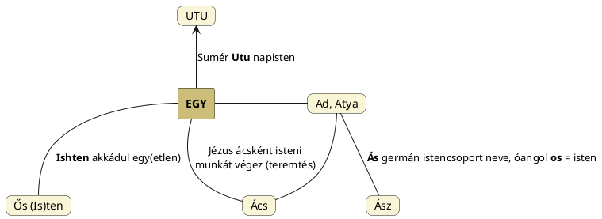

---
{"dg-publish":true,"permalink":"/U/UTU/","title":"UTU","tags":["containstransclusions"],"created":"2024-11-23T05:02","updated":"2025-08-31T01:56"}
---

# UTU

Több helyről utaltunk ide, mint egyfajta kiindulószóra. Nos, a sumér Nap(isten) Utu neve származhat egyszerűen [[O/Öt\|öt]] ujjunk napsugarakat formáló volta nyomán.  

A kiinduló valójában [[E/Egy\|Egy]] nevünk, ami eredetileg Istenre vonatkozik, de a [[S/SZÁM#Számosság\|magányosság]] a Napra is utal.  

#### Péterfai János írja:

> Utu zöngés változata Udu. Igen sok alakja él ma is. A japán `Do` Út, mindkét név a régi magyar nyelvből származik. [[O/Odú\|Odu]] szavunk Meleg jelentéstartalma Udutól származik. Üdül igénk Udul, vagyis Napozik jelentésű, hasonló hozzá az Üde. Mind e magyar szavak átmennek az Ata, Ada, az Et és Ed, meg az It és Id szócsoportokra. Rengeteg e nevek száma, amelyek a magyar nyelvből erednek, nem a szumer nyelvből. A német Ottó is napnév, a magyar Ott formából származik. Utu és Udu neveink származékai számosak.  
>
> Az [[A/Auto\|Auto]] nem más, mint az A-Utó, az Isteni-Nap. Utó magyar isten az Utu névcsoporthoz tartozik.  

Ezen etimont Virág Kálmán sok szó alapját képező üt szavának lehet megfeleltetni. Az üt-tel hasonlatos ver szavunk pedig a [[B/BAR\|BAR]]/[[P/PAR\|PAR]]/[[P/PER\|PER]]/stb. etimonokkal vethető össze.  

  
[[T/TU\|TU]] és [[U/UT\|UT]] címnél volt arról szó, hogy a nevek összefüggnek, azon kívül, hogy mindketten Napnevek és egymás megfordításai. Olyannyira összefügghetnek, hogy nemcsak a két kezünk két tenyerét lehet a Napokhoz, sugaraihoz hasonlítani, de analógiát lehet felfedezni a Nap és a Nagy Kutya csillagkép Szíriusz A (B) csillaga(i) között.  
  
Ergo az a megállapítás, hogy az emberiség két tőről (TU) származik, indokolttá válik.  
A kettő és öt számok matematikai összefüggései is fontosak. Egyrészt a kétszer öt kiadja az isteni tizet ([[T/TEN#Ten 2)\|ten]]), másrészt más kapcsolódásokat is észrevehetünk (lásd első ábra jobb és második ábra baloldalát): a kettes szám szorzótáblájának eredményei és az ötös szám osztatainak eredményei, ha a számjegyekek összegét tekintjük, harmonikusak. Ugyanez fordítva a másik ábrán. A két szám tehát egymás reciprokai, ahogy az egy, a nyolc és a kilenc önmaguknak.  
Ezek és egy másik táblázat is szerepel [[K/Kilences számrendszer\|kilences számrendszer]] címnél.  

Robert Brown Jr. Primitive Constellations of the Greeks, Phoenicians and Babylonians című könyvének (első kötetének) 345. oldalán említi a nevet. Az előző oldalon még általa Holddal kapcsolatban említett név a sumér-akkád `Idu`/`Itu` ("hónap"), mely [[I/Idő\|idő]] szavunkkal azonosnak látszik. (Merthogy nemcsak a Nap méri ki az időt.)  

Ugyanakkor a [[K/Kereszt\|kereszt]] és [[T/Templom\|templom]] címnél is taglalt [[T/Téridő\|téridő]] viszonylatában csak a Nap és Föld relációja értelmezhető és a kapcsolat nyelvi szinten is megmutatkozik. [[U/UT\|Út]] szavunk a Nap látszólagos útja a Földről nézve, [[I/Idő\|idő]] szavunk üdő formája is a Nap Utu nevéhez köthető és nyilvánvalóan szoláris időre vonatkozik.  

Robert Brown Jr. Primitive Constellations of the Greeks, Phoenicians and Babylonians című könyvének (első kötetének) 361. oldalán szereplő adata szerint az általunk igen könnyen [[N/Nap háza\|Nap háza]] értelműnek meghatározható akkád `Kas Utu` az ekliptika elnevezése (a másik amit itt említ ugyanilyen értelemmel a sémi Kharrán Samsi).  

Utu előjönni látszik az óegyiptomi nyelvben is. A Hamlet malma című könyv 28. függelékében áll:  
> A dolog különösen nyilvánvalóvá válik Egyiptomban, ahol H. Keestől (Der Götterglaube im Alten Ägypten (1956), p.193, n.3) megtudjuk: "wtw jelentése 'sakál' és 'a legidősebb'", és történetesen akkor tette e megjegyzést, amikor egy klasszikus csalási esetet vizsgált: amikor [[G/Geb\|Geb]]/Kronosz Hóruszt nyilvánította a legidősebbnek[^1], ezzel teljesen kirekesztve Széth-Tüphónt, amint a shabakai feliratban olvassuk. Valójában Geb azt állítja, hogy Hórusz = [[W/Wepwawet\|Upuaut]], az Út Megnyitója, a felső-egyiptomi sakál vagy farkas. A "Kutya-Iker" problematika azonban olyan méretű és súlyú, hogy itt nem tárgyalható.  

A japán `uta` = dal is nyilván a Nap fényének megfelelő szellem kiáradása. [[N/Nóta\|Nóta]] szavunk sem áll messze.  
Ugyanígy a japán `odoru` = táncolni fogalmát is meg lehet magyarázni Odo/Udu = Nap névből. Azonos fogalomkörbe tartoznak, ahogy a zene és tánc szavaink is Ten nevéből erednek.  

Lásd még extra infókat [[U/UDU\|UDU]] és [[U/Udunita\|Udunita]].  

[[U/U\|U]] címnél (több is) szerepelt (Radics Géza tollából), hogy `út` szavunk régies illetve nyelvjárási alakja `utu` volt:  
> Az utu meg utu \[volt\]. A szóvégi u azóta lekopott. Úgy mutatkozik tehát, hogy nyelvünknek valójában volt egy u-zó nyelvjárása, de az nem lehetett olyan erős, mint az a nyelvemlékekből kitetszik.  

## Lábjegyzetek

[^1]: Lábjegyzet:  
Valójában az ősiség jogáról lehet szó. Hórusz nem lehet semmiképpen idősebb Széthnél. Falvay Károly Nagyboldogasszony című könyvének 279. oldalán írja tulajdonképpen ugyanerről a témáról:  
Széth, a mitikus dimenzió családias vitájában Hórusz születési törvénytelenségének vádjával állt elő. Megváltozott közöttük a leszármazás rendje! (Szent István-Koppány párhuzam!) A trónvitában Széth volt az örökös. Korábban az anyai leszármazási rend volt a törvényes rend. Ezzel a korábbi rend most megfordult. A papok tanácsa új szabályozást, új törvényt alkotott, az apai származás vált törvényes renddé. Ezzel Hórusz lett az igazi örökös, Hóruszt koronázták meg, mint az új királyt.  