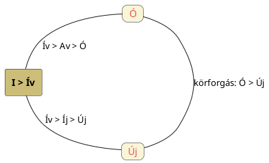

---
{"dg-publish":true,"permalink":"/U/Új/","title":"Új","tags":["containstransclusions"],"created":"2024-05-03T12:38","updated":"2026-02-24T01:09"}
---

# Új

Új és [[U/Ujj\|ujj]] szavaink lehetnek a Nap [[U/UT\|UT]] (ut> uty> ugy > uj) nevéhez köthetők, vagy inkább csak [[U/U\|U]] szavunk jejes változatai.  

#### Péterfai János...  

...ezt így nem mondja ki:  
> Tenyér szavunk megfelelője a közfelnémetben `Tener`, Tenyér jelentéssel. A német szó kétségtelenül magyar eredetű. A Tenyér két elemből áll, a Teny és az Ér szóból. A Teny természetesen Ten nevével és fogalmával azonos, az Ér a magas hangrendű Úr. Megjegyezhető, hogy rengeteg magyar névben az Úr helyett az Ér szerepel. A Teny-Ér jelentése tehát Ten-Úr. Nézzünk rá a tenyerünkre. Középső része nagyjából kör alakú, rajta vonalakat látunk. Isteni titkok rejlenek rajta, amiből a jósok mindenfélét jósolnak. Még az élet hosszát is megjósolják az életvonalakból. A kör alakú részből, ami a Napistent jelképezi, ujjak ágaznak ki. Az ujjak a mindig megújuló napsugarakat jelképezik. Ezért van kapcsolatban egymással az Új és az Ujj szó. Az ujjak bőrlécrendszere speciális, mindenkire egyénileg jellemző.  

[[U/U\|U]] Péterfai János adata szerint hosszú jelentésű, de új szavunk is vélhetően ú ill. úi lehetett a lágyítás előtt.  
  
Az új szavunk megfordításaként is értelmezhető a [[J/Juh\|juh]] szó eredete, nemcsak [[J/Jó\|jó]] szavunkkal lehet párba állítani. Asztrális-naptári megfeleltetése, hogy a juhok a tél utóján, februárban ellenek. Igaz, a juh a Kos jegynek felel meg.  

Az `újra` szóban a Nap újbóli felkeléséről lehet szó, de az [[U/Újhold\|újhold]] kifejezésben is megvan új. Az ujjak egyértelműen Napsugár-jelképek.  

Közben [[I/I#I mint mozgást kifejező, életkörre utaló szócska\|i]] címnél volt szó az i (kör)mozgásra, ívre/ívásra vonatkozó jelentéséről. (Részint szerepelt ott is ezen [[K/Kezdet és vég\|kezdet és vég]] címnél is említett téma.)  
Fáy Elek A magyarok őshona című könyvének 236. oldalán szépen szól a kör ívéről úgy, hogy az ív szavunkban a nemzést is látja, hiszen a kör(jelkép)nek **íve önmagát nemzve, íva újítja magát** meg. Ezek alapján akár új szavunk is lehet az ív/ívás (az ívás = újítás, nemzés) változata. Vegyük észre, az árja nyelvek új értelmű szavát is a [[N/Nap\|Nap]] újbóli felíveléséből, napi (vagy akár kis éves) szintű nemzettségéből illetve *növ*ekedéséből viszonyítva alkotják ki (lásd pl. [[N/New\|new]] és [[N/Nowruz\|Nowruz]]). Hasonló témáról [[H/Hajnal\|hajnal]] címnél is volt szó ([[I/Íj\|íj]], [[A/AJ\|AJ]], új: mind egy fogalmi rendszerből való).  
Ugyanakkor könnyen lehet (legutóbb [[S/Szűz csillagkép\|Szűz csillagkép]]nél szereplő gondolat alapján is), hogy az [[U/Újhold\|újhold]]hoz lehet köze a szónak (ott is volt szó újévről mondjuk).  

Legtisztább mégis az Új fogalmát az Újjászületéshez kapcsolni.  

Lásd még [[O/Ó#Alternatív elemzése\|új és ó]] témát, diagrammal:  

<a class="markdown-embed-link" href="/O/Ó/#cykil0" aria-label="Open link"><svg xmlns="http://www.w3.org/2000/svg" width="24" height="24" viewBox="0 0 24 24" fill="none" stroke="currentColor" stroke-width="2" stroke-linecap="round" stroke-linejoin="round" class="svg-icon lucide-link"><path d="M10 13a5 5 0 0 0 7.54.54l3-3a5 5 0 0 0-7.07-7.07l-1.72 1.71"></path><path d="M14 11a5 5 0 0 0-7.54-.54l-3 3a5 5 0 0 0 7.07 7.07l1.71-1.71"></path></svg></a>

