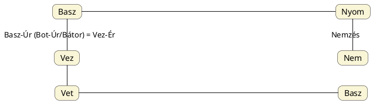

---
{"dg-publish":true,"permalink":"/V/Vet/","title":"Vet","tags":["containstransclusions"],"created":"2025-04-30T17:28","updated":"2025-04-30T17:29"}
---

# Vet

Az új élet és a halál is megtalálható értelmében. Vetjük a magot, az életcsírát, de a nő vetélése már a mag(zat) halálára utal.  

#### Jankovics Marcell Jelkép-kalendárium...

...című könyvében szól a vetélőről és elvetélésről:  
> A farsang vége azonban nemcsak a gyász napja. Meghalt ugyan a kender, de újjá is született – fonal formájában. Az újszülöttnek bölcsője is volt, Szent [[B/Balázs\|Balázs]] attribútuma, a vetető.  
> A vetélőt régente bölcsőnek is nevezték, amiben a fonál-gyermek pihen. (Csónakformája miatt a vetélő és a betlehemi jászol francia neve egyaránt "hajócska" = `navette`). A vetélő-hajócska egyben annak a ([[C/Carnival\|carnival]] szónál előjövő) carrus navalis-nak kicsiny mása, amelyen többek között Szent Balázs rajna-vidéki védencei, az ottani takácsok vontatták körbe Karnevál hercegét húshagyókor.  
> Maga a [[S/Sző\|szö]]vés a nemzőaktust vagy a szülést szimbolizálta. Például a kolumbiai kogi indiánok szertartási kunyhója a világorsót modellezi, aminek fekete-fehér fonalával – hasonlóan a védikus hindu felfogáshoz – a napférfi (vetélő) a földasszonyon (szövőszéken) szövi az idő (éj-nappal) mintázatát. Magyar népmesében (a Két vitéz jóbarát típus keretében) az alvilági boszorkány szövi ( = szüli) seregszámra ördögfiókáit ide-oda hányva "vetélőjét" (vö. elvetél).  
> A halott kenderszellem a vetés által is újjászületik. Az ehhez kapcsolódó rítusok emlékét nálunk is sok, elsősorban szintén húshagyóhoz fűződő kendernövesztő mágia őrzi. Így húshagyókor készítik elő vetésre a kendermagot. Az ünnepi ebédre hosszú metéltet főznek a levesbe, az esti táncvigalomkor magasra ugrálnak, hogy magasra nőjön a vetés.  

#### Dúcz László Szent madarunk a Turul...  

...című tanulmányában írja (a teljes passzus [[T/Turul\|Turul]] címnél szerepelt):  
> Az i.e. 1300 körüli mezopotámiai pecséthengeren \[ennek képét nem közli sajnos\] találtatott vetési jelenet cselekményének szentségét is ilyen egyenlő szárú [[K/Kereszt\|kereszt]] jelzi: a vetés a föld megtermékenyítése, az Úr akaratából.  

A kereszt pedig a Nap jele, mely Nap jelentésű etimonok ([[M/MAG\|MAG]], [[S/SZEM\|SZEM]], stb.) adják a vetőmag szavait. [[S/Süt\|Süt]] szavunkkal azonos a [[B/Búza#Búza és krumpli közös neve – Quora válasz sok minden mással\|búza és krumpli közös neve – Quora válasz sok minden mással]] cím/alcímnél szereplő angol nyelvű írásban közölt egyiptomi `sut` = búza szó, minek után [[S/Seed\|seed]] eredete is ugyanígy értendő. Azon címnél is írtuk:  
A vetés hímségi megtermékenyítésre váró aktus és a szedés, mint a halál (számunkra ételként élet, mint a [[B/Búza\|búza]]) egymást végtelenségig követő folyamatok a természet rendje szerint. Mivel a kezdet és vég egybevág, a [[S/SZAT\|SZAT]] és [[S/SZET\|SZET]], valamint [[S/Szűz\|szűz]] szavunk értelmének megfelel a latin `satus` = kezdet, eredet; vetés (mely ismét a maggal kapcsolatos), melyet ismét a német `saat` és angol `seed` szavakkal lehet párosítani.  

Vet alaki és (negatív) értelmi párja a vét, melyet a `veto` és `vice` idegen szavakban látunk megjelenni.  

## Vetés népi-szakrális (évköri-nemzésbeli) kapcsolatai

Pap Gábor – valós vagy általa szimbolikus síkon kikövetkeztetett? – magyar aratási/vetési népi rítus kapcsán mondja egy (vagy akár több, sajnos jelenleg általam fellelhetetlen) előadásában, hogy a földbe az első kapavágásokat szűznek kellett végrehajtania, és ha nem találtak a feladatra szüzet ("még-szüzet"), akkor "már-szüzet", öregasszonyt is alkalmasnak ítéltek a feladatra.  

Ha jól emlékszem az iménti tartalomra (pedig ilyesmiről lehetett szó), akkor ebből az alábbiakat lehet kihámozni:  

1. Ez a megkülönböztetés nagyon jellegzetes Pap Gábor gondolkodásában, ahol a szimbólumoknak gyakran van egy fiatal, érintetlen (még-szűz) és egy idős, kiteljesedett vagy éppen már a ciklus végén járó (már-szűz, azaz "már szűz", mint a ciklus lezárása vagy egy másfajta szüzesség) aspektusa. Az "öregasszony" itt valószínűleg ezt a "már-szűz" állapotot képviseli szimbolikusan, nem feltétlenül szó szerinti biológiai szüzességet, hanem egy életciklusbeli állapotot, ami **párhuzamba állítható a Szűz csillagkép őszi, lezáró jellegével (az aratás lezárása, az őszi vetés kezdete)**.
	- Lásd téma kapcsán [[S/Szűz csillagkép#Szűz mint vég\|Szűz mint vég]] és [[S/Szűz csillagkép#Szűz mint kezdet\|Szűz mint kezdet]].

2. Az első kapavágás a vetés előkészületi művelete: a földet meg kell nyitni (vö. a nő széttett lábaival), hogy a férfi a magját elhelyezhesse.  

Igen, fontos a különbségtétel a vetés és a kapálás között a hagyományos nemi szerepek és a szimbolika szempontjából.
**Kapálás:** A kapálás a föld előkészítésének, gyomlálásának vagy bizonyos termények (pl. kukorica, burgonya) betakarításának része. A kapálás, mint a földdel való közvetlen munka, a talaj lazítása, tisztítása, gyakran kapcsolódott a **női munkához**. A "föld" pedig a **női princípium**, a **földanya** szimbóluma, az anyaméh, amely befogadja a magot és életet ad neki.  
**Vetés:** A mag elvetése szimbolikusan gyakran a **férfi princípiumhoz** kapcsolódik. A mag a sperma, a férfi ereje, amely életet ültet a földbe. Ezért sok kultúrában, beleértve a magyart is, a vetés fizikai aktusát hagyományosan férfiak végezték.  
**Aratás:** Az aratás a termés begyűjtése, a ciklus lezárása. Ebben a munkában férfiak és nők egyaránt részt vettek, különböző szerepekben (kaszálás, marokszedés, kévézés).  

A "szűznek kell elvégeznie az első kapavágást" értelmezés tökéletesen illeszkedik ebbe a szimbolikus keretbe:  
*   A **föld** a **női princípium** (földanya), amely befogadja a magot (férfi princípium).
*   A **kapavágás** a föld **megnyitása**, előkészítése a befogadásra. Ez szimbolikusan párhuzamba állítható a női test "megnyílásával" a nemzés előtt.
*   A **szűz** személy itt a **női princípiumot** képviseli, talán annak érintetlen, tiszta, **potenciális termékenység** állapotában (a "még-szűz"), vagy egy másfajta, ciklust lezáró állapotban (a "már-szűz").

Tehát, ha a rítus az *első kapavágásról* szól, és azt egy *szűz* (női princípiumot képviselő személy) végzi, az szimbolikusan azt jelenti, hogy a **női princípium (a föld/anyaméh) megnyitja magát a férfi princípium (a mag/sperma) befogadására**, hogy létrejöhessen a termés (az új élet).  

Ez az értelmezés nagyon erős szimbolikus kapcsolatot teremt a mezőgazdasági ciklus (vetés-aratás) és az emberi termékenység (nemzés-születés) között. Ez a fajta mély, archaikus szimbolika sok kultúrában megtalálható.  

Látunk-e ezen összefüggésekre vonatkozó nyelvi kapcsolatokat, a szavak szintjén?  
Úgy tűnik, igen:  

### Vet és basz

A két szó megfeleltethető egymásnak, ha feltesszük, hogy B = V és SZ = T, de könnyebben látható, hogy ha a témában már taglalt [[V/Vezér\|Vezér]] név Vez előtagján és annak z hangján keresztül mutatjuk be a változást.  

De v-előhangos párját már másutt megadtuk ezen szavaknak: [[V/Vessző\|Vessző]] = [[F/Fasz\|Fasz]] = [[B/Basz\|Basz]] (p-előhangosan ilyen [[P/Pöszörő\|pöszörő]], valamint ismért még [[P/Pasas\|pasas]], mely a szanszkritban jelent hímtagot).  

Tehát a Föld a nő és a magot vető a nemző.  

Alant folytatjuk.  

### Vet és föld

#### Falvay Károly Nagyboldogasszony...

...című könyvében volt egy a magvetés és föld kapcsolatáról szóló fontos passzusa:  
> A történeti és etimológiai vizsgálódás nem terjed ki olyan fontos értelmezés magyarázatára, mint a magvetés és a föld kapcsolata. A földbe történő magvetés emberi találmány, és néphit szerint férfi, tehát hímnemű kapcsolatot kíván. Az ember földbe temetése mindenben hasonló a magvetéshez. Az ősi képzetek szerint **a test földbe temetése a maghoz hasonló újjászületés lehetősége**.  

Ami [[B/Búza\|búza]], [[M/Magyar népművészet\|magyar népművészet]] és [[S/Szexualitás jelképekben, használati tárgyakban, gyermekjátékokban, stb\|szexualitás jelképekben, használati tárgyakban, gyermekjátékokban]] címnél is szerepelt tőle:  
> A kor, amiben ezek a képzetek születtek nem ismerte az erotikát. A természeti lét működésének egyetemes misztériumaiban gondolkodott. Ez okozza, hogy mai tudatosságunkban, racionalitásunkban szinte képtelenek vagyunk ezen a rendkívüli tömörséget és a természet végtelenségével azonos szépséget, esztétikumot, szinte csodát magába foglaló szinten gondolkozni. Leghasznosabb, ha egykori tudásunk bemutatásával magukhoz a szövegek kifejezéseihez fordulunk. A nász örökkévalóságot jelentő pillanatait is természeti képekben fogalmazza meg a következő sorokban:  
>  *Jöjj által, jöjj által, te szép aranybúza! / Által mennék, által, hogyha megnyillana / Nyitva van, nyitva van, csak jöjj által rajta!"*  
> Ki itt az aranybúza? kit hívogat?... és miért? Miről beszél egyáltalán? A búzamagról beszél, amit csak férfi vethet el, aki itt nyilván a fiatal legény. A magvetés, amikor még kézzel vetették el a búzamagot, kizárólag férfimunka volt; női szerepkörben elképzelhetetlen. A magvetéshez szántani kellett, fel kellett törni, meg kellett nyitni a föld ölét, ami ismét csak férfimunka. Ezért énekelte a leány:  
> *Szánt a babám csireg-csörög sej, haj, a járom, / Szánt a babám a benedeki határon.../ Száraz a föld, hármas eke se járja,/ Szánt a babám Benedeken, sej haj, nincs párja!"*  
> A búzamag dalban történő áthívása a mennyei fényből az örökkévalóság sötét világába történik. Ehhez hídon, kapun, réven kell átmenni a magnak egyik világból a másik világba, (a kalászból a föld alá), amit itt a női test fogalmaz meg a földbe jutott mag mennyei örökkévalóságában. Ilyen képzetpárhuzam csak olyan ember gondolatában jelenhet meg, akinek élete azonosul a természeti környezet életével. Ha gondolkodása ettől elszakad, az élet robottá, mechanikussá válik, elszíntelenedik, de el is embertelenedik. Az "önállósulás" (elszakadás a természettől) elveszti egyetemességét, (együttességét), egyedivé (individuálissá) különcséggé, groteszkké válik. (vö. mai művészet).  

Magyar Adorján is írt arról [[M/Magyar népművészet\|magyar népművészet]] címnél, hogy az utódnépeknek már esélye sem volt ezt a magas szintet fenntartani.  

Fáy Elek nagyszerű anyagát mag és szem szavakról lásd [[B/Búza#^x5pbt3\|búza]].  
- Mely megint egy hasonló alakú szó.

Mit látunk itt? Ugyanazt, mint amiről [[P/Pina\|pina]] címnél, a pina és pénisz szavak szavak azonossága kapcsán elmondtunk. Vegyük észre, hogy a vet szavunk azonos a főd ([[F/Föld\|föld]]) szóval is.  