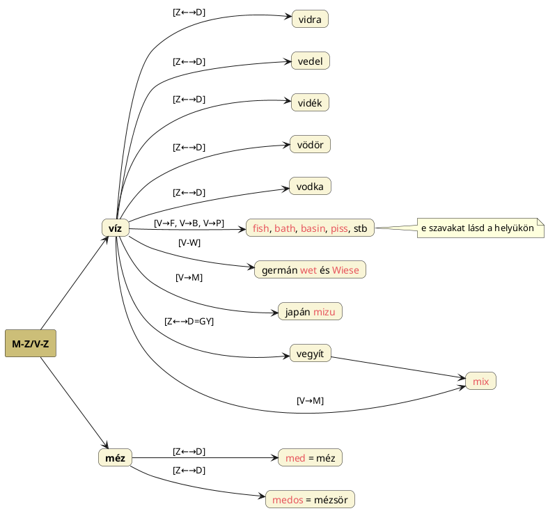

---
{"dg-publish":true,"permalink":"/V/Víz/","title":"Víz","created":"2024-11-23T05:38","updated":"2025-07-03T01:19"}
---

# Víz

#### Péterfai János írja:  

> Ha a Víz szó végén volt egy magánhangzó, esetleg az U, akkor a Ví-Zu szót kapjuk, ami a Ví Tudása értelmet tartalmazza. A Zu, és "Z" az egyik magyar igeképző. A Ví és Vi a vívás, csillogás egyik szava. A vizek az égen és a földön terjedtek el, ezért a Ví ige tényleg lehet a Víz alapszava, ami a Zu – Tudás, vagy Z igeképzővel kiegészülve, alkothatta a Víz szót.  
> Finnségi rokon szavak a manysi `Wit`, a mari `Wüt`, a finn `Vete`, mind Víz jelentéssel. Más finnségi nyelvekben is jelen vannak a megfelelő szavak.  
> [[V/Véd\|Véd]] igénkben a Víz úgy jelenik meg, hogy őseink nagy folyók mellé települtek, kifejezetten folyóközök területére, persze nem mindig. Sok folyóközben a folyók adták a védvonalat, a Véd így kapcsolódik a Vid és Víz szóalakokhoz.  
- [[V/Vidék\|Vidék]] gyöke is ugyanilyen elven lehet víz.  
[[V/Vicinity\|Vicinity]] címnél is szóltunk (a viskó ellen) a víz szóból való levezethetőségről.

Víz nélkül nincs élet, ahogy anya nélkül sincs (erről szóltunk számtalan helyen, mint például [[M/Mocsár-mitológia\|mocsár-mitológia]], [[C/Csallóköz\|Csallóköz]] és [[N/Navel\|navel]] címnél).  
Itt egy fontos ponthoz érkeztünk, hisz annak a bizonyítása következhetne, hogy [[I/Íz\|Íz]] = Tűzből V előtéttel lett víz, onnan pedig [[F/Föld\|Föld]]i anyag, illetve [[I/ID\|ID]] = Isten, isteni fény V-előhangosan lesz [[V/VID\|VID]], földi megnyilvánulásaként.  
A víz legfontosabb funkciója a megtisztítás, viszont a tisztaság a fehérséggel, fénnyel is összefügg, így ha fényminőséget kell keresni, [[V/VID\|VID]] illetve [[V/VASZ\|VASZ]] adja meg víz párját.  

Jankovics Marcell A Nap könyve c. könyvének 98-99. oldalán írja, hogy mielőtt a mai tavaszpontot kijelölő Kos tüzes jeggyé vált volna, vizes jegy volt, de a tüzes Oroszlán vizességére is kitér.  
- Persze ez csak a [[P/Precesszió\|precesszió]] okozta változásokkal magyarázható, nincs köze a tűz = víz kapcsolathoz.

Tudjuk, hogy az ősök számára a víz és a folyó milyen jelentőséggel bírt. Ezek után nem meglepő, hogy a svéd **Visby** nevű város etimológiáját a Wiki az alábbiak szerint vizsgálja:  
> Visby neve az ónorvég `vis`, azaz **pogány áldozati hely** szóból ered, míg a `by` utótag a falu jelentéssel bír. A 14. században keletkezett Gutasagában a **vis jelentése szent hely, istentisztelet helye** jelentésű. Visbyt időnként a Rózsák városa néven is emlegetik, valamint a Romok városa elnevezés is jellemző e városra.  
- A Wiktionary [ezen](https://en.wiktionary.org/wiki/by#Norwegian_Nynorsk) oldalán foglalkoznak az utótaggal.

[[F/Föld\|Föld]] címnél/[[E/Elementál\|elementál]]nál is arra jutottunk, hogy a föld (\*főd, \*föd, \*fud) első megjelenése a hang-evolúciós törvényeket is tekintve/követve is lehet víz.  
Azt viszont le kell szögezni, hogy Magyar Adorján [[I/Ice\|ice]] címnél is álló adata szerint Isz = Víz értelmű is (így [[I/Iszonya\|Iszonya]] = Víz-Anya értelmével szintén a [[T/Tejútanya\|Tejútanya]] neve kell legyen):  
> Víz szavunknak pedig szintén volt egymássalhangzós Isz kiejtése is, amit nem csak isz, iszik igénk, hanem igen nagyszámú folyó Isz kezdetű neve is bizonyít. Egyébként pedig a folyó víz hangja is isz, amiért is több nyelvben a víz és a jég nevében is az isz avagy iz szótag benne.  

Ergo a víz v-s előtételezése nélkül víz és tűz értelmű is lehet ISZ, IZ.  
De a sumér [[I/ID\|ID]] = víz szintén (honnan – vagy az [[U/Ügy\|ügy]] illetve [[H/Húgy\|húgy]] szavunkból – akkád `hid` = folyó), mely v-sített formája Vid > Víz lenne, de nekünk nem célunk a sumért kiindulónak venni. Több szóváltozat állhat ugyanolyan vagy hasonló jelentéssel a magyar nyelvben. Így lesz vedel is vízre vonatkozó és vádol is. A sumér szóhoz Bíró Lajos a magyar [[U/Ügy\|ügy]] szót rokonítja.  

A sumérnél maradva, Götz László adata szerint `biz` = "tropfen" (csöpög).  

Hónapokkal később is arra jutottam, hogy Esz/Isz – mindkettővel energiát viszünk be. Az Isz vonatkozik a folyadékra és lám a Víz alkotója is.  

Ergo a víz [[V/VID\|VID]]-ből való eredeztetése kétszeresen igazolt.  
A [[V/Víz útja a természetben\|víz útja a természetben]] címnél szereplő adatok is azt támasztják alá, hogy a víz útja kétirányú. Azaz, ha fentről, esőként jön, mint a fény, hímségiként kezelendő és a Földanyát e módon termékenyíti meg. Nem véletlen, hogy a több mitológiában (kivált a déli országokéban) a teremtő istenek (mint a zsidó [[J/Jahve\|Jahve]]) egyben viharistenek is. (És az sem, hogy [[K/Kút\|kút]] ([[K/Kut\|kut]]) lehet égi és földi, valamit [[R/Rain\|rain]] is lehet hímségi-égi és vízként alsó világi; lásd még [[H/Humour\|humour]], [[P/Periplus\|periplus]], stb.)  

[[V/Vital\|Vital]] címnél, a latin `vita` = élet eredetének (végső) vizsgálatánál előjött:  
Nehéz másra gondolni, minthogy a szó eredete a víz. A víz az, ami nélkül nincs élet, és ami az élet alapfeltétele. Az, hogy a víz a [[V/VIT\|VIT]], [[V/VID\|VID]] etimonból ered, azt is jelenti, hogy a fény nélkül sincs élet, de míg a fény csakis hímségi, és a víz lehet nőiség mellett hímségi is, azt eredményezi, hogy a vízben önnemzés jöhet létre. Ezért lehetnek kétneműek a vízi állatok és képi szinten ezért androgünök a (Nap)Istenek és Teremtő Istenek is.  
Hasonlóan írja Péterfai János:  
> Is-Ten, Aki a Fényt Tenni Képes, az Izzást, az Ízt Tenni tudja. A fény hasonló a vízhez. Megtermékenyíti Földanyát, aki fény nélkül megfagyna, meghalna.  

#### Győriné Luca Ágnes Az őskutatás értelme és célja...

...című Ősi Gyökér 2006/3. sz. megjelent cikkében írja (tekinthető [[V/VID\|VID]] címnél álló sorai folytatásának):  
> Tudjuk, hogy víz nélkül nincs élet, tehát a fény-információ-energia a víz által tud megnyilvánulni.  
> Leonardo da Vinci jól tudta, hogy: "A víz a természet fuvarosa".  
> Emoto Masaru japán kutató vízkristály fényképei egyértelműen megerősítik azt a tényt, hogy a víz információfelvevő képessége a legnagyobb, és halmazállapotváltozásai miatt információtovábbító képessége is a legnagyobb. Ha energiaszintje alacsony, a víz megfagy, "meghal", ha energiaszintje emelkedik, megolvad, ha energiaszintje a legmagasabb, légneművé válik, és mindenhová elér. Mivel testünk többsége víz, mi is a vízhez hasonlatosan viselkedünk, vagyis alacsony energiaszint esetén lehangoltak, levertek, lesújtottak vagyunk, lehúz a föld bennünket, amint azonban energiánk megnő, "megtáltosodunk", könnyűnek érezzük magunkat, "szárnyalni" vagyunk képesek.  
> A Föld java része víz, az élőlények testét is nagyrészt víz alkotja, az emberi agy közel 80%-a, vérünk csaknem 90%-a víz. A NASA amerikai Űrkutatási Központ szakemberei naponta megfigyelnek pár ezer, a Kozmoszból a Föld felé érkező 10-12 méter átmérőjű hógolyót, ezek a légkörbe érve felhővé válnak. Leonardo da Vinci tudhatta ezt, amikor megállapította, hogy "...A folyók vize nem a tengerből jön, hanem a felhőkből... Az Özönvizet az esővíz okozta \[nem\], ha pedig így van, minden víz a tengerbe fut..." Tudta azt is, hogy "...Kőzet csak ott található, ahol korábban tenger vagy tó volt..." A víz tehát a Kozmoszból a Földre szállítja a fényt energiacsomagok formájában. A kvantumelmélet nem is annyira új keletű felfedezés?!  

Győriné Luca Ágnes végül a sokaktól már hallott víz értelmezést adja meg (de ezoterikus lévén újat is közöl):  
> Megvizsgálva VÍZ szavunkat, mond nekünk valami nagyon lényegeset: VÍZ=VISZ=SZÍV, a víz viszi az információt, és hozza, szívja, ahogyan a szív pumpálja a vért, kilöki és magába szívja a szervezet kétharmadát alkotó vizét, mint ahogyan az Univerzum kitágul és összehúzódik, születik és elmúlik a FÉNY-ből, a GYÚJTÓPONT-ból IDŐvel megnyilvánul, majd a GYŰJTŐPONT-ba IDŐvel visszahúzódik a FÉNY-be.  

Jankovics Marcell Ahol a madár se jár című könyvének 57. oldalától ír a víz elemről.  

A [[T/Tűz\|tűz]] – ahogy alkímiai jele is mutatja – a felfelé való mozgást, a víz a lefelé való mozgás irányát jelzi (mondja Pap Gábor). (Minden továbbit, tőle is, lásd [[E/Elementál\|elementál]] címnél.)  

Arról, hogy a víznek emlékezete van, a fentebb említett Emoto Masaru japán kutató írt könyvet (letöltve). De Kandra Kabos Magyar Mythologia című könyvében is érdekes adat áll:  
> A gyógyító fürdésre a mutatkozó nyomok szerint még több szertartása volt az ó-vallásnak. A víznek "szólatlan víznek" kellett lenni sok esetben, vagyis hozatala közben valakihez szólani tilalmas volt.  

Az [alábbi](https://youtu.be/5qLoX6R_IGk) Grandpierre Atilla előadásban 16:50-nél ugyanazt mondja, amit tájépítés és vízszabályozás kapcsán én is pedzegettem: a vízzel sokkal könnyebb bánni: a napfényt nem lehet irányítani és a földet is sokkal macerásabb mozgatni.  

## Álló- és mozgásban levő víz (folyó, eső, örökítőanyag)

[[K/KAN#KAN folyadéknemű, örökítő anyag jelentése\|Kan folyadéknemű, örökítő anyag jelentése]] cím/alcímnél már volt szó hasonló témáról.  

#### Czeglédi Katalin...

...egy írásában már kitért a témára. Itt A keleti magyar sezserék nyelvi tanulságai című az Ősi Gyökér 2007/4. sz. megjelent cikkében írja:  
> Az emberi nyelv kialakulása, teremtése idején az ember úgy gondolkodott, – s ez a gondolkodásmód kihatott a nyelv további alakulására – hogy teremtménynek fogta fel a forrást, folyót, tavat (azaz a vizet), a növényt, az állatot és az embert. Közös vonásuk, ha mozognak, akkor élők, s mindegyik utódokat hoz létre. Az első elnevezést a víz kaphatta, majd hasonlóság alapján a megnevezés átment, rátapadt a növényre, állatra, emberre. Az elnevezések egybeesésének ez lehet az első oka. Az ilyen embernevek rendszerint 'teremtmény' jelentésűek, monyhoz, tojáshoz, szíkhez, maghoz, ághoz tartozóak. Ezek voltak az első embernevek. Az ősnek az utódai már tartalmaz(hat)ták ezt az embernevet, de gyakran ellátták a 'fi(ú), fej, ember, oldal' jelentésű szavakkal.  

Czeglédi K. eljárása azért hibás, mert (nagyon tellurikusan gondolkodik) nem ismeri a magyar nyelv csillagászati/évköri összefüggéseit. A Víz a [[T/Tejút\|Tejút]] is, ahonnan származtatták magukat.  

Arról [[T/TON\|TON]] szó kapcsán volt szó, hogy furcsamód állóvizet (tó) és folyót ([[D/DON\|Don]]) is jelenthet.  

[[O/Orion\|Orion]] és [[M/Mocsár-mitológia\|mocsár-mitológia]] címnél volt arról szó, hogy a víz (mint megtermékenyítő anyag, akár mint [[K/KAN\|KAN]], [[G/Geny\|geny]], azaz ondó) hímségi is lehet (a mítoszok esője, párája, [[H/Harmat\|harmat]]a[^1] dettó). Kimondottan a folyó, azaz mozgásban levő (eső, spriccelő, stb.) víz, folyadék lehet hímségi. Falvay Károly Nagyboldogasszony című könyvében jól írja:  
> Víz vonatkozásában fontos szerepet kap az ősvíz (magzatvíz), amiből az élet megszületett. Álló és mozgó vizet különböztetünk meg, Az állóvíz női; a mozgó, folyó víz férfiszimbólum.  

Viszont a [[F/Folyó\|folyó]] címnél taglalt Tejút-folyó kivétel, hiszen az nem folyik. Az bizony nőiségi.  

[[E/Enki\|Enki]] és [[T/Tigris\|Tigris]] címnél is szerepelt azon adat, hogy a tigris csak folyóvízből, állóvízből nem iszik.  
Amiről nem volt szó, az a víz mozgásának függőleges és vízszintes iránya. Már több helyen volt szó arról, hogy a függőleges az élet, a vízszintes a halál vonala. Lám, az életet adó eső is ilyen függőlegesen, a földre merőlegesen érkezik, míg minden állóvíz vízszintesen szétterül. Maga a vízszintes kifejezés is innen jön.  
Másutt is írtam ([[H/HAL\|HAL]] címnél), hogy a nőiségi víz vízszintes, a hímségi (esőként) függőleges irányultságú.  

#### Czeglédi Katalin A földrajzi nevek és a magyar őstörténet az Iszter folyó kapcsán...

...című az Ősi Gyökér 2016/3. sz. megjelent cikkében a több helyen szereplő nézetet osztja meg az orosz `stroj` 'felépítés, forma, rendszer szer, sor' szó nyomán:  
> A [[F/Folyó\|folyó]] nem más, mint egy felépítmény, rendszer, sor, a görög forrásokból is tudjuk, hogy a folyó a víz hengeredésével épül, tehát a folyó nem más, mint vízhengerek sora.  

## Lábjegyzetek

[^1]: Lábjegyzet:  
Lásd latin `ros` = harmat szót [[R/Rusz\|rusz]] címnél.  